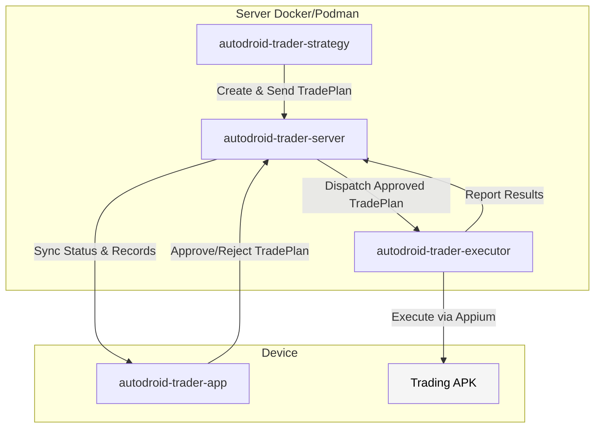

# Cross-Platform Android App Automation Container Solution for Trading

A comprehensive container-based solution for automating third-party Android trading applications across multiple platforms.

## Project Background

With the growth of algorithmic trading and mobile trading needs, there is a demand for an automated trading solution that can be deployed cross-platform, support multi-device concurrency, and is easy to manage. Traditional solutions have problems such as complex environment configuration, poor platform compatibility, and high maintenance costs.

## Solution

Develop a cross-platform Android trading automation framework based on container technology, implementing standard UI automation through **Appium**, combined with a tradeplan system, to provide stable and reliable automated trading capabilities for third-party trading APKs.

## Architecture

The system consists of four core modules:

- **autodroid-trader-app**: Mobile client application for server discovery, device registration, and tradeplan approval/rejection management
- **autodroid-trader-server**: Centralized server for device management, work script execution, and test scheduling
- **autodroid-trader-strategy**: Trading strategy component that creates trade plans based on market data
- **autodroid-trader-executor**: Trading execution component that executes trade plans using Appium automation

### Module Data Flow

### Module Interactions

1. **Strategy → Server**: Strategy analyzes market data and creates trade plans, sending them to the server
2. **App → Server**: Users discover servers, register devices, and approve/reject trade plans
3. **Server → App**: Trade records and status updates are available in the mobile app
4. **Server → Executor**: Server dispatches approved trade plans to executors for execution
5. **Executor → Server**: Execution results are reported back to the server
6. **Executor → Trading APK**: Executor uses Appium to perform automated trading operations on target APK

## Core Values

- 🐳 **Containerized Deployment**: Supports Docker and Podman, eliminating environment dependencies
- 🖥️ **Full Platform Support**: macOS, Windows, WSL/Linux
- 📱 **Non-intrusive**: No modification to target APKs, based on UI hierarchy analysis
- 🔧 **Tradeplan System**: Supports scheduled tasks and event-driven trading
- 📊 **Centralized Management**: Unified configuration management and result monitoring
- ⚡ **Appium Automation**: Industry-standard mobile automation framework
- 🔧 **Flexible Architecture**: Appium server provides robust device control
