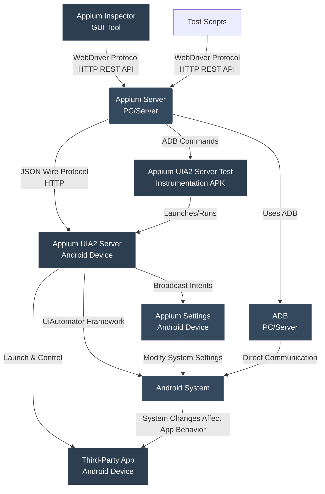
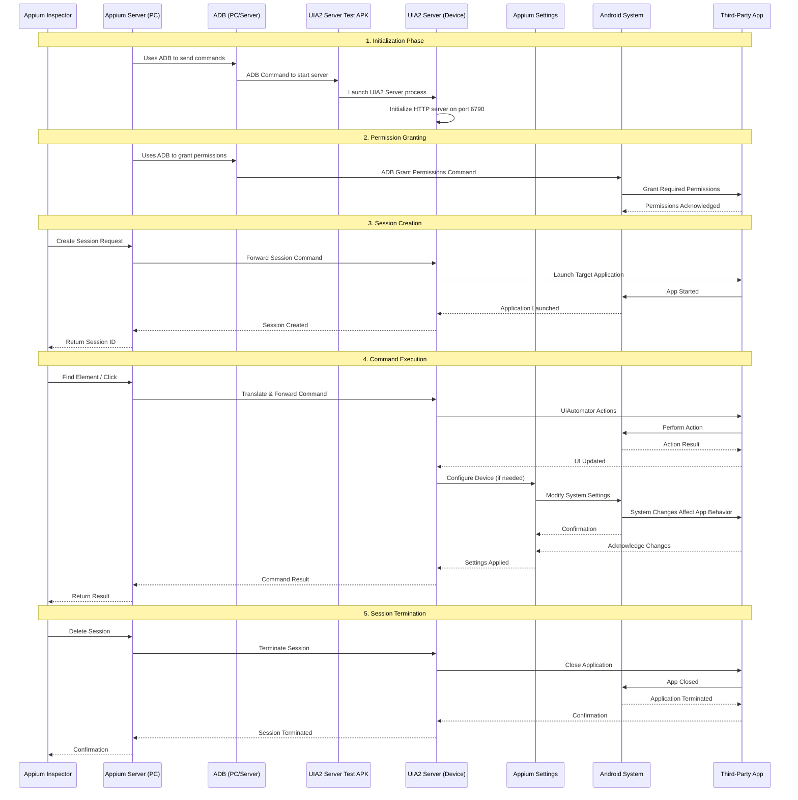

# Appium Components: Relationships and Data Flow

## Component Overview

### 1. Appium Server (PC/Server)
- The main Appium server that runs on a computer
- Acts as the central command processor and coordinator
- Translates WebDriver protocol commands into device-specific commands
- Communicates with clients (test scripts, Appium Inspector) via HTTP REST API

### 2. Appium UIA2 Server App (Device)
- The core automation engine installed on the Android device
- Listens on port 6790 for HTTP commands
- Implements the actual device interaction using Android's UiAutomator framework
- Processes commands sent by the PC Appium Server
- Interacts directly with the third-party app under test

### 3. Appium Settings App (Device)
- Helper application that provides extended device control capabilities
- Manages device settings like location, network, clipboard, etc.
- Works in conjunction with UIA2 Server to provide advanced automation features
- Can be controlled via broadcast intents from UIA2 Server
- Modifies system settings that directly affect the behavior of the third-party app being tested

### 4. Appium UIA2 Server Test App (Device)
- Instrumentation test package required to launch the UIA2 Server
- Contains the entry point to start the UIA2 Server as an Android instrumentation test
- Used during the server initialization process

### 5. Appium Inspector (Desktop)
- GUI tool for inspecting mobile app UI elements
- Sends commands to Appium Server to interact with devices
- Visualizes the element hierarchy and properties
- Helps in creating and debugging test scenarios

### 6. Third-Party App (Device)
- The target application being tested
- Launched and controlled by the UIA2 Server through Android's UiAutomator framework
- UIA2 Server interacts with this app to perform automated testing actions
- Its behavior is directly affected by system settings modified by Appium Settings

### 7. ADB (Android Debug Bridge) (PC/Server ↔ Device)
- A command-line tool that runs on the PC/server
- Communicates directly with the Android device over USB or network
- Completely independent of Appium
- Used by Appium Server to perform device-level operations
- Executes commands directly on the Android device

## Data Flow and Relationships



## Detailed Data Flow Process



## ADB Command Flow in Appium

ADB (Android Debug Bridge) is completely separate from Appium but is used by the Appium Server to perform device-level operations. Here's how it works:

1. **ADB is independent**: ADB is a command-line tool that runs on the PC/server and communicates directly with Android devices over USB or network connections. It is not part of Appium.

2. **Appium uses ADB**: The Appium Server uses ADB as a tool to perform certain device-level operations that cannot be done through the UIA2 Server's HTTP interface.

3. **ADB command execution**: When Appium needs to perform device-level operations, it constructs ADB commands and executes them through the ADB daemon.

4. **Specific use cases for ADB commands**:
   - **Permission granting**: `adb shell pm grant <package> <permission>`
   - **Server initialization**: `adb shell am instrument` to start the UIA2 Server
   - **Installing/uninstalling apps**: `adb install` or `adb uninstall`
   - **Device administration**: `adb shell` commands for device settings

Example ADB command flows:
```
PC Appium Server --> Uses ADB Tool --> ADB Daemon --> Android Device
                     adb shell pm grant com.example.app android.permission.READ_EXTERNAL_STORAGE

PC Appium Server --> Uses ADB Tool --> ADB Daemon --> Android Device
                     adb shell am instrument -w io.appium.uiautomator2.server.test/androidx.test.runner.AndroidJUnitRunner
```

It's important to understand that:
- ADB is a separate tool used by Appium, not part of Appium itself
- ADB communicates directly with the Android device, bypassing the UIA2 Server
- The actual automation commands (like finding elements, clicking, etc.) are sent via HTTP to the UIA2 Server
- ADB is primarily used for initial setup, permission granting, and device-level operations

## Component Interactions Summary

1. **Appium Server** acts as the orchestrator, translating high-level commands from clients into device-specific commands, using ADB (as a separate tool) for device-level operations and HTTP for automation commands
2. **UIA2 Server** is the actual executor on the device, implementing the WebDriver protocol and interacting with Android's UiAutomator to control the third-party app through HTTP commands
3. **Appium Settings** extends the capabilities of UIA2 Server by providing access to device settings and system functions, and modifies system settings that directly affect the behavior of the third-party app being tested
4. **UIA2 Server Test APK** is the bootstrap mechanism that launches and runs the UIA2 Server process on the device via ADB commands
5. **Appium Inspector** provides a user-friendly interface for inspecting elements and creating test scenarios
6. **Third-Party App** is the target application being tested, which is launched and controlled by the UIA2 Server, and whose behavior is directly affected by system settings modified by Appium Settings
7. **ADB** is a separate command-line tool used by Appium Server to perform device-level operations directly on the Android device

The data flow involves both ADB and HTTP communications:
- ADB is used by Appium Server for initial setup, permission granting, and device-level operations (as a separate tool)
- HTTP is used for the actual automation commands between Appium Server and UIA2 Server
- The UIA2 Server then interacts with the third-party app through Android's UiAutomator framework