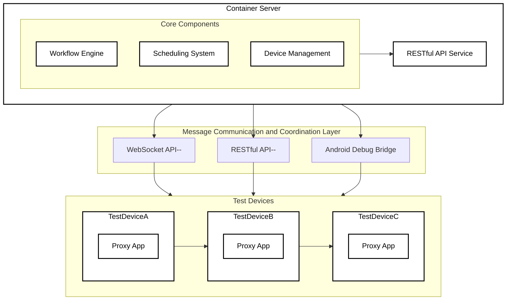

# System Architecture

## 1. Overall Architecture



### Architecture Components

1. **Container Server**
   - Hosts the core automation components
   - Manages containerized services
   - Provides RESTful API for external communication

2. **Core Components**
   - **Workflow Engine**: Executes automation workflows defined in YAML
   - **Scheduling System**: Manages scheduled and event-driven tasks
   - **Device Management**: Handles device discovery, connection, and monitoring

3. **Communication Layer**
   - Uses WebSocket/HTTP for real-time communication
   - Connects the container server with test devices

4. **Test Devices**
   - Android devices running target applications
   - Equipped with proxy app for enhanced communication
   - Supports both USB and network ADB connections

## 2. Container Service Architecture

```yaml
# docker-compose.yml
version: '3.8'

services:
  appium-server:
    image: appium/appium:latest
    ports: ["4723:4723"]
    privileged: true
    environment:
      - RELAXED_SECURITY=true
      - ALLOW_INSECURE=adb_shell

  automation-core:
    image: autodroid/core:latest
    depends_on: [appium-server]
    environment:
      - APPIUM_URL=http://appium-server:4723
      - MAX_CONCURRENT_TASKS=5
    volumes:
      - ./workflows:/app/workflows
      - ./reports:/app/reports

  device-manager:
    image: autodroid/device-manager:latest
    privileged: true
    devices:
      - /dev/bus/usb:/dev/bus/usb
    volumes:
      - /var/run/usbmuxd:/var/run/usbmuxd
```

### Container Services

1. **appium-server**
   - Provides Appium automation capabilities
   - Exposes port 4723 for API access
   - Runs in privileged mode for device access

2. **automation-core**
   - Core automation engine
   - Processes workflow definitions
   - Generates reports
   - Mounts volumes for workflows and reports

3. **device-manager**
   - Manages device connections
   - Provides USB and network ADB support
   - Monitors device status

### Service Interactions

- The `automation-core` service communicates with `appium-server` to execute UI automation commands
- The `device-manager` service handles device discovery and management
- All services work together to provide a complete automation solution
- Volumes are used to persist workflows and reports outside containers