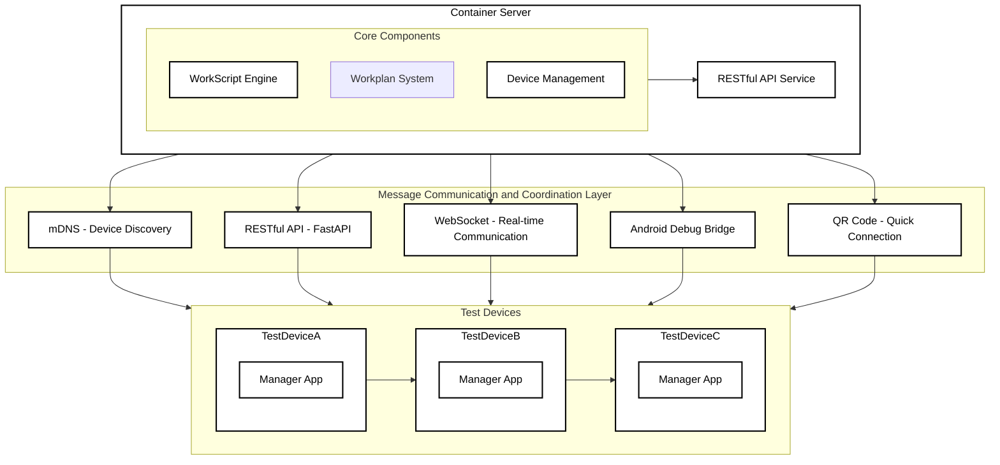
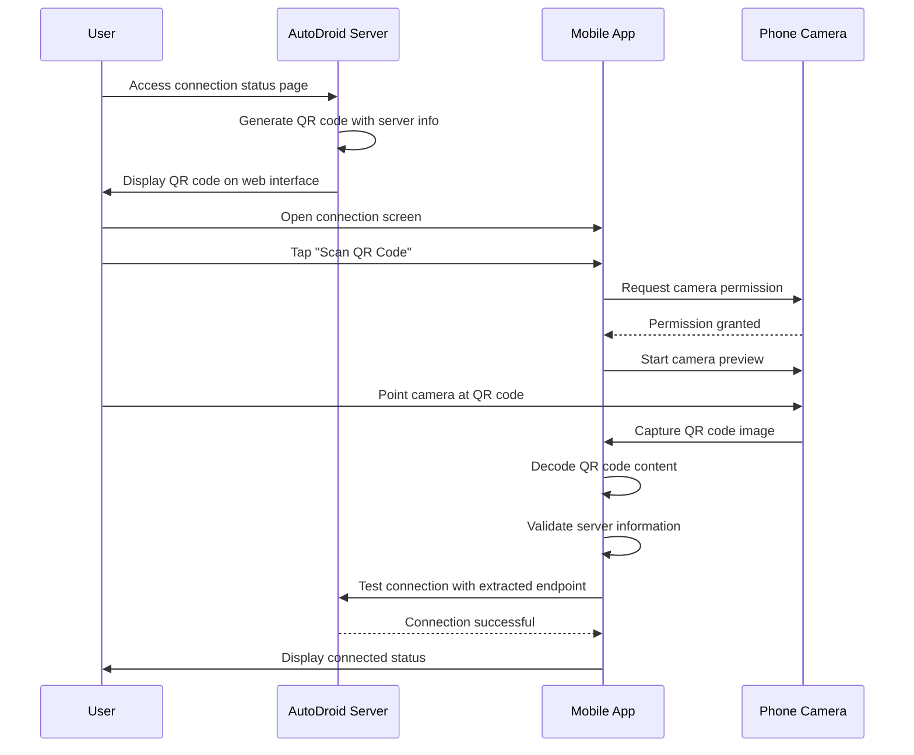

# System Architecture

## 1. Overall Architecture



### Architecture Components

1. **Container Server**
   - Hosts the core automation components
   - Manages containerized services
   - Provides RESTful API for external communication

2. **Core Components**
   - **WorkScript Engine**: Executes automation workflows defined in YAML
   - **Workplan System**: Manages scheduled and event-driven tasks
   - **Device Management**: Handles device discovery, connection, and monitoring

3. **Communication Layer**
   - Uses mDNS for lightweight device auto-discovery in local network
   - Uses FastAPI for RESTful API communication
   - Uses WebSocket for real-time messaging between server and devices
   - Uses QR codes for quick and easy server connection setup
   - Connects the container server with test devices
   - Enables automatic device discovery in local network

4. **Test Devices**
   - Android devices running target applications
   - Equipped with manager app for enhanced communication
   - Supports both USB and network ADB connections

## 2. Container Service Architecture

```yaml
# docker-compose.yml
version: '3.8'

services:
  appium-server:
    image: appium/appium:latest
    ports: ["4723:4723"]
    privileged: true
    environment:
      - RELAXED_SECURITY=true
      - ALLOW_INSECURE=adb_shell

  automation-core:
    image: autodroid/core:latest
    depends_on: [appium-server]
    environment:
      - APPIUM_URL=http://appium-server:4723
      - MAX_CONCURRENT_TASKS=5
    volumes:
      - ./workflows:/app/workflows
      - ./reports:/app/reports

  device-manager:
    image: autodroid/device-manager:latest
    privileged: true
    devices:
      - /dev/bus/usb:/dev/bus/usb
    volumes:
      - /var/run/usbmuxd:/var/run/usbmuxd
```

### Container Services

1. **appium-server**
   - Provides Appium automation capabilities
   - Exposes port 4723 for API access
   - Runs in privileged mode for device access

2. **automation-core**
   - Core automation engine
   - Processes workflow definitions
   - Generates reports
   - Mounts volumes for workflows and reports

3. **device-manager**
   - Manages device connections
   - Provides USB and network ADB support
   - Monitors device status

### Service Interactions

- The `automation-core` service communicates with `appium-server` to execute UI automation commands
- The `device-manager` service handles device discovery and management using mDNS
- All services work together to provide a complete automation solution
- Volumes are used to persist workflows and reports outside containers

## 3. QR Code Connection Architecture

### 3.1 Overview

The QR code connection feature provides a user-friendly way for mobile devices to quickly connect to the AutoDroid server by scanning a QR code displayed on the server's connection status page. This eliminates the need for manual IP address entry and provides a seamless setup experience.

### 3.2 QR Code Connection Flow



### 3.3 QR Code Content Structure

The QR code contains a JSON object with the following information:

```json
{
  "server_name": "AutoDroid Server",
  "api_endpoint": "http://192.168.1.59:8003/api",
  "version": "1.0.0",
  "timestamp": "2023-11-15T10:30:00Z"
}
```

### 3.4 Security Considerations

1. **QR Code Expiration**: QR codes include timestamps and are considered valid for 24 hours
2. **HTTPS Support**: The system supports HTTPS endpoints for secure connections
3. **Authentication**: After QR code scanning, normal authentication flow is still required
4. **Validation**: The mobile app validates the QR code format before using the connection information

### 3.5 Fallback Mechanisms

If QR code scanning fails or is not available, users can:
1. Manually enter the server IP address and port
2. Use mDNS discovery (if enabled)
3. Select from previously connected servers

### 3.6 Implementation Components

#### Server-side Components:
- QR Code Generation Service (Python/qrcode)
- Connection Status API Endpoint
- Frontend QR Code Display Component

#### Mobile App Components:
- QR Code Scanner Fragment (Android/ZXing)
- Server Connection Info Data Model
- Connection Validation Logic
- Camera Permission Handling