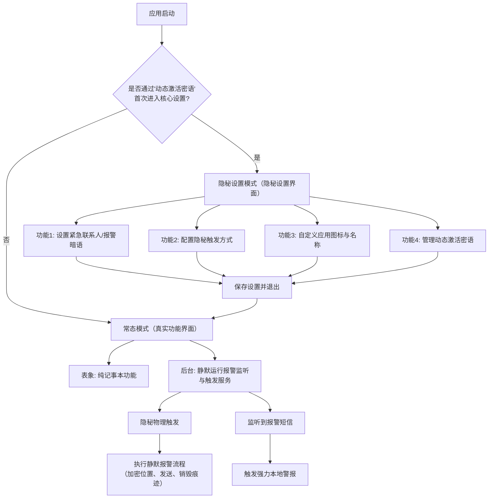
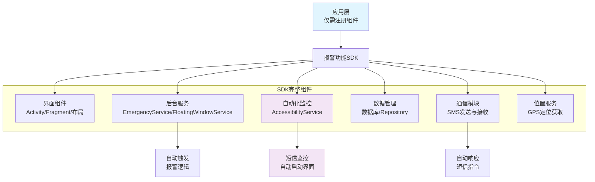
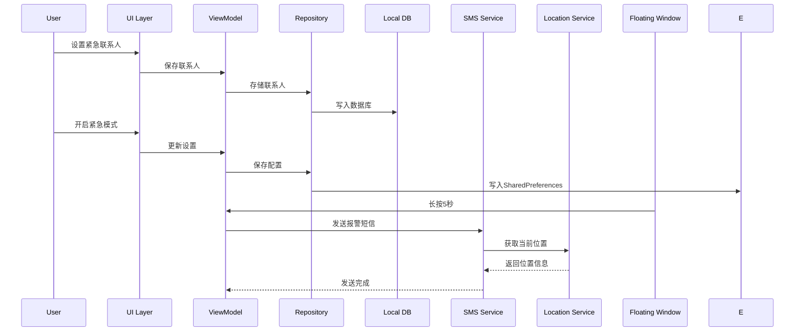

# **“记事本守卫” App 需求与设计文档

## 1. 产品概述

### 1.1 产品定位
**“记事本守卫”是一款**具备完整记事本功能的真实应用**，同时集成了一套隐秘的报警系统。用户可正常使用记事本功能，在紧急情况下可通过隐秘方式触发报警。核心目标是：**即使手机被他人临时检查，从任何角度都无法察觉其真实用途**。

### 1.2 核心价值
- **绝对隐蔽性**：具备真实记事本功能，不易被发现
- **自动报警**：无需手动操作即可触发报警
- **多重触发机制**：适应不同危险场景
- **纯本地化**：保护用户隐私，无服务器依赖
- **离线可用**：没有网络也能正常工作

### 1.3 目标用户
- 独居人士
- 经常夜班或独自出行的人群
- 家暴受害者
- 处于潜在危险环境的人
- 需要被家长监控的未成年人

## 2. 系统总览与状态机

应用包含两个完全隔离的模式，通过“动态激活密语”安全切换：



## 3. 核心功能需求

### 3.1 动态激活与入口隐藏
- **唯一入口**：应用安装后，桌面图标点击**仅能进入“记事本”真实功能界面**。无任何设置选项。
- **激活密语**：
  - 预置一个初始密语（如“重启手机”）。
  - **用户必须在首次进入核心设置后立即修改**，改为自己独有的句子（如“周三下午开会”）。
  - 修改后，旧密语立即失效。**仅当前密语有效**。
- **激活流程**：
  1. 从**另一部手机**或自己向本机发送内容为 **【当前有效密语】** 的普通短信。
  2. 本应用后台服务（通过`AccessibilityService`）监听到短信通知，进行内容比对。
  3. **完全匹配时**，应用从当前的记事本界面，**无缝跳转至核心设置界面**。此过程无弹窗提示。

### 3.2 紧急联系人管理
- **功能描述**：用户可以添加、编辑、删除紧急联系人
- **字段要求**：姓名、电话号码、关系
- **数量限制**：最多支持5个紧急联系人
- **优先级设置**：可设置联系人优先级，紧急情况下按顺序发送

### 3.3 紧急模式设置
- **多种触发机制**：
  - 自动报警：设置时间阈值（默认3小时），超过时间未打开APP自动发送报警短信
  - 长按浮动窗口：浮动窗口长按5秒触发特定报警信息，长按10秒触发紧急报警短信
  - 快速摇晃：快速摇晃手机触发特定报警信息
  - 长按音量键：后台全局监听，长按（如5秒）音量键触发报警
- **多种报警信息配置**：每种触发机制可配置不同的报警短信内容
  - 长按浮动窗口5秒：默认发送"我肚子疼"相关信息
  - 长按浮动窗口10秒：默认发送"救救我"相关信息
  - 长按音量键5秒：后台全局监听，长按（如5秒）音量键发送"我肚子疼"相关信息
  - 长按音量键10秒：后台全局监听，长按（如10秒）音量键发送"救救我"相关信息
  - 快速摇晃：默认发送"我需要帮助"相关信息
- **位置信息**：自动获取GPS位置，以坐标和地图链接两种形式发送
- **短信安全机制**：
  - **位置密码本加密**：通过本地密码本将GPS坐标转换为中文密文
  - **短信格式**：[固定消息头] + [加密位置密文] + [报警暗语]
  - **自动删除**：发送后自动删除发送记录
  - **定时发送**：可设置延迟发送时间
- **位置密码本系统**：
  - **动态密码本**：每个数字（0-9）、小数点、分隔符对应用户自定义汉字
  - **示例编码**：1->苹果，.->了，,->和，31.2304,121.4737 -> 苹果三幺了苹果两三洞四和苹果两幺了点拐三拐
  - **安全同步**：通过二维码在孩子端与家长端APP之间同步密码本
  - **本地存储**：密码本本地加密存储，永不通过网络传输

### 3.4 发送后安全处理与家长端响应
- **发送后安全处理**：
  - **发送记录删除**：发送报警短信后，立即尝试删除本机发送记录
  - **Android版本适配**：Android 9及以下自动删除，Android 10及以上引导用户手动删除
  - **界面切换**：触发后，APP界面立即跳转至预设的"真实功能界面"
- **家长端响应机制**：
  - **后台监听**：依赖无障碍服务，持续监听系统通知栏的新短信
  - **识别与解码**：发现含固定消息头的短信后，使用本地密码本将中文密文反向解密为坐标
  - **报警翻译**：根据报警暗语翻译具体报警类型

### 3.6 应用与SDK整合方案

#### 3.6.1 应用整合流程

**1. 依赖配置**
在应用的 `build.gradle.kts` 中添加SDK依赖：
```kotlin
dependencies {
    implementation(project(":guardian-sdk"))
    // 其他依赖...
}
```

**2. 权限声明**
在 `AndroidManifest.xml` 中添加必要的权限：
```xml
<uses-permission android:name="android.permission.SEND_SMS" />
<uses-permission android:name="android.permission.RECEIVE_SMS" />
<uses-permission android:name="android.permission.ACCESS_FINE_LOCATION" />
<!-- 其他权限... -->
```

**3. 组件注册**
注册SDK提供的组件：
```xml
<!-- 隐秘设置界面 -->
<activity android:name="com.autodroid.guardiansdk.ui.SettingActivity" />
<!-- 后台服务 -->
<service android:name="com.autodroid.guardiansdk.service.EmergencyService" />
```

**4. SDK初始化**
在Application类中初始化SDK：
```kotlin
class MyApplication : Application() {
    override fun onCreate() {
        super.onCreate()
        GuardianSdk.initialize(this)
    }
}
```

**5. 功能集成**
- **自动启动**：SDK自动在后台启动报警服务
- **隐秘激活**：通过短信密语自动激活设置界面
- **零代码集成**：应用无需编写报警相关代码

#### 3.6.2 应用架构设计
- **报警功能SDK**：将核心报警功能封装为独立Library/SDK
- **SDK功能模块**：
  - 后台服务管理（AccessibilityService）
  - 物理键监听与触发
  - SMS加密发送与接收
  - 位置信息获取
  - 数据加密存储
  - 紧急擦除功能
  - **服务协调器**：SDK内部自动管理多应用冲突
- **智能冲突管理**：
  - **自动服务注册**：应用启动时自动向SDK注册
  - **共享服务实例**：多个应用共享同一个后台服务
  - **动态主从选举**：SDK内部自动决定服务启动者
  - **透明协调**：开发者无需关心冲突问题
- **应用开发模式**：
  - **记事本应用** + **报警SDK** = 记事本守卫
  - **计算器应用** + **报警SDK** = 计算器守卫
  - **日历应用** + **报警SDK** = 日历守卫
  - **天气应用** + **报警SDK** = 天气守卫
- **无限制安装**：用户可以安装任意多个"守卫"应用，SDK自动协调

### 3.7 浮动窗口
- **极小透明窗口**：10x10像素，10%透明度
- **可自定义位置**：支持拖拽到屏幕任意位置
- **静默触发机制**：长按5秒自动发送求救信息，无任何视觉反馈
- **隐藏/显示切换**：可手动隐藏或显示浮动窗口

### 3.8 家长监控模式
- **短信指令系统**：预设家长号码可发送短信指令
- **指令格式**：
  - `LOCATION`：获取当前位置
  - `STATUS`：检查APP运行状态
  - `EMERGENCY`：远程触发紧急模式
- **自动响应**：收到指令后自动回复对应信息
- **安全验证**：仅响应预设家长手机号的指令，无需额外密码

### 3.9 测试模式（教学与练习）
- **全局模式开关**：在设置界面提供明确的模式切换开关
  - **练习模式**：所有操作在本地模拟，100%无风险、无费用
  - **实战模式**：所有操作真实执行，仅在紧急情况下使用
- **测试模式核心功能**：
  - **绝对安全**：不发送真实短信，不联系紧急联系人
  - **高度仿真**：操作体验与真实模式完全一致
  - **结果反馈卡**：触发后显示详细的操作解释和对应紧急情况
  - **分步教学**：引导用户掌握所有触发方式
- **技术实现要点**：
  - **状态管理**：使用全局变量`isTestMode`控制所有行为分支
  - **统一入口**：所有触发操作汇集到统一处理函数
  - **视觉区分**：测试模式有明显视觉标识（橙色边框、"测试中"水印）

### 3.10 智能自动化功能

#### 3.10.1 零代码集成模式
- **应用只需注册**：在AndroidManifest.xml中注册SDK提供的组件
- **无需业务逻辑**：应用无需编写任何报警相关的代码
- **自动功能触发**：所有功能由SDK自动管理和触发

#### 3.10.2 自动化监控机制
- **AccessibilityService自动启动**：监控特定短信关键词，自动启动设置界面
- **短信自动响应**：收到报警短信自动触发紧急模式
- **服务自动协调**：所有后台服务自动启动和协同工作

#### 3.10.3 用户操作流程
```
用户收到特定短信（如"紧急设置"）
    ↓
AccessibilityService自动检测并匹配关键词
    ↓
自动启动SettingActivity设置界面
    ↓
用户进行设置操作，无需手动启动应用
```

### 3.11 安全与自毁
- **数据隔离**：记事本数据与报警系统配置、密码本、日志分开存储，采用不同加密密钥
- **紧急擦除**：提供多种触发方式的立即擦除功能，无确认对话框，完全静默执行
  - **本地触发**：长按隐秘设置界面中的"紧急擦除"按钮3秒
  - **远程触发**：家长发送`WIPE`短信指令
  - **物理触发**：在记事本界面连续按电源键10次
  - **执行效果**：立即删除所有报警数据，应用还原为纯记事本

## 2. 技术设计

### 2.1 架构设计

#### 2.1.1 SDK架构设计（智能自动化）


#### 2.1.2 核心组件关系


### 2.2 数据模型设计

### 2.2 数据模型设计（修订版）

#### 2.2.1 被监护人表（Ward）
| 字段名 | 数据类型 | 约束 | 描述 |
|--------|----------|------|------|
| phoneNumber | TEXT | PRIMARY KEY | 手机号（唯一标识） |
| name | TEXT | NOT NULL | 被监护人姓名 |
| relationship | TEXT | | 关系（如：社区居民、学生等） |
| passwordBook | TEXT | NOT NULL | 密码本（Base64编码） |
| lastAlarmTime | INTEGER | DEFAULT 0 | 最后报警时间 |
| alarmCount | INTEGER | DEFAULT 0 | 报警次数 |
| isActive | BOOLEAN | DEFAULT true | 是否活跃 |
| createdAt | INTEGER | NOT NULL | 创建时间戳 |
| updatedAt | INTEGER | NOT NULL | 更新时间戳 |

#### 2.2.2 紧急联系人表（EmergencyContact）
| 字段名 | 数据类型 | 约束 | 描述 |
|--------|----------|------|------|
| phoneNumber | TEXT | PRIMARY KEY | 联系人手机号（唯一标识） |
| wardPhoneNumber | TEXT | NOT NULL | 所属被监护人手机号 |
| name | TEXT | NOT NULL | 联系人姓名 |
| relationship | TEXT | | 关系（如：爸爸、妈妈、朋友等） |
| isPrimary | BOOLEAN | DEFAULT false | 是否主要联系人 |
| orderIndex | INTEGER | DEFAULT 0 | 显示顺序 |
| createdAt | INTEGER | NOT NULL | 创建时间戳 |

**设计说明**：
- **手机号作为主键**：纯短信方案中，手机号是唯一可靠的身份标识
- **关系建立**：通过手机号关联被监护人和紧急联系人
- **数量限制**：每个被监护人最多5个紧急联系人（应用层限制）

#### 2.2.2 应用设置表（Setting）
| 字段名 | 数据类型 | 约束 | 描述 |
|--------|----------|------|------|
| key | TEXT | PRIMARY KEY | 设置项键名 |
| value | TEXT | NOT NULL | 设置项值（字符串形式） |
| type | TEXT | NOT NULL | 设置项类型（STRING/INT/LONG/FLOAT/BOOLEAN/JSON） |
| description | TEXT | | 设置项描述 |
| category | TEXT | DEFAULT 'general' | 设置项分类 |
| isEncrypted | BOOLEAN | DEFAULT false | 是否加密存储 |
| createdAt | INTEGER | NOT NULL | 创建时间戳 |
| updatedAt | INTEGER | NOT NULL | 更新时间戳 |

**设计说明**：
- **替代SharedPreferences**：提供类型安全的设置项管理
- **扩展性强**：支持多种数据类型和分类管理
- **自动初始化**：SDK自动创建默认设置项
- **统一管理**：所有设置项在数据库中统一管理

### 2.3 权限需求

| 权限名称 | 用途 | 类型 |
|----------|------|------|
| SEND_SMS | 发送报警短信 | 危险权限 |
| RECEIVE_SMS | 接收家长指令 | 危险权限 |
| READ_SMS | 读取短信内容 | 危险权限 |
| ACCESS_FINE_LOCATION | 获取GPS位置 | 危险权限 |
| ACCESS_COARSE_LOCATION | 获取网络位置 | 危险权限 |
| SYSTEM_ALERT_WINDOW | 显示浮动窗口 | 特殊权限 |
| RECEIVE_BOOT_COMPLETED | 开机自启动 | 普通权限 |
| FOREGROUND_SERVICE | 后台运行 | 普通权限 |
| BIND_ACCESSIBILITY_SERVICE | 无障碍服务 | 特殊权限 |

## 3. UI设计

### 3.1 设计原则
- **简洁明了**：避免复杂操作，易于理解
- **真实功能**：具备完整的记事本功能，用户可正常使用
- **隐秘报警**：在真实功能基础上集成隐秘报警系统
- **易用性**：关键功能一键操作
- **安全性**：重要操作需要密码验证

### 3.2 主要界面设计

#### 3.2.1 应用启动界面
- **记事本守卫**：具备完整记事本功能的真实应用
- **计算器守卫**：具备完整计算器功能的真实应用
- **日历守卫**：具备完整日历功能的真实应用
- **天气守卫**：具备完整天气查询功能的真实应用
- **笔记守卫**：具备完整笔记功能的真实应用

#### 3.2.2 真实设置界面（通过激活密语进入）

**主设置界面**
```
+-----------------------------+
| 🔒 AutoDroid Guardian        |
+-----------------------------+
|                             |
| [📞 紧急联系人管理]         |
| [⚠️ 紧急模式设置]           |
| [⚙️ 隐秘应用设置]           |
| [🌐 浮动窗口设置]           |
| [👨👩👧 家长监控设置]       |
| [✅ 安全确认设置]           |
| [🗑️ 紧急擦除]             |
|                             |
| 开发者微信二维码            |
| [扫码添加]                  |
|                             |
| 上次安全确认：2026-01-14    |
+-----------------------------+
```

**交互说明**：
- 点击各项进入对应设置界面
- 底部显示上次安全确认时间
- 支持下拉刷新状态

**紧急联系人管理界面**
```
+-----------------------------+
| 📞 紧急联系人管理           |
+-----------------------------+
| + 添加联系人               |
|                             |
| 📱 张三 (父亲)              |
|    13800138000              |
|    优先级：1                |
|    [编辑] [删除]            |
|                             |
| 📱 李四 (母亲)              |
|    13900139000              |
|    优先级：2                |
|    [编辑] [删除]            |
+-----------------------------+
```

**紧急模式设置界面**
```
+-----------------------------+
| ⚠️ 紧急模式设置             |
+-----------------------------+
| □ 启用自动报警             |
| 触发时间：3 ▼ 小时         |
|                             |
| □ 启用长按触发             |
| 长按时间：5 ▼ 秒           |
|                             |
| □ 启用连敲触发             |
| 连敲次数：5 ▼ 次           |
|                             |
| □ 启用摇晃触发             |
| 摇晃强度：中 ▼             |
|                             |
| [保存触发设置]             |
+-----------------------------+
```

**报警信息配置**：
```
+-----------------------------+
| 📝 报警信息配置             |
+-----------------------------+
| [自动报警信息]             |
| [长按5秒报警信息]           |
| [连敲5次报警信息]           |
| [摇晃触发报警信息]           |
|                             |
| □ 包含位置地图链接         |
| □ 包含GPS坐标             |
|                             |
| [保存信息配置]             |
+-----------------------------+
```

**隐秘应用设置界面**
```
+-----------------------------+
| ⚙️ 隐秘应用设置             |
+-----------------------------+
| 当前应用：记事本守卫        |
| 当前版本：v1.0.0            |
| 报警状态：正常              |
|                             |
| 应用图标设置：              |
| [从相册选择图标]            |
| [拍摄照片作为图标]          |
| [使用默认图标]              |
|                             |
| 当前图标预览：[图片预览]    |
|                             |
| 应用名称：□□□□□□           |
|                             |
| 测试模式：○ 开启 ○ 关闭     |
|                             |
| [保存设置]                 |
+-----------------------------+
```

**测试模式切换确认**
```
+-----------------------------+
| ⚠️ 模式切换确认             |
+-----------------------------+
| 警告：即将进入实战模式      |
|                             |
| 在此模式下，所有报警操作    |
| 将真实发送短信并触发高声    |
| 警报，可能引起他人注意并    |
| 产生通信费用。              |
|                             |
| 请仅在紧急情况下使用。      |
|                             |
| [取消] [我已知晓风险，确定切换]
+-----------------------------+
```

**浮动窗口设置界面**
```
+-----------------------------+
| 🌐 浮动窗口设置             |
+-----------------------------+
| □ 启用浮动窗口             |
|                             |
| 位置：任意位置             |
| 透明度：10% ▼              |
| 尺寸：10x10 ▼              |
|                             |
| □ 自动隐藏                 |
| 隐藏时间：3 ▼ 秒           |
|                             |
| [预览] [重置]              |
| [保存设置]                 |
+-----------------------------+
```

**家长监控设置界面**
```
+-----------------------------+
| 👨👩👧 家长监控设置         |
+-----------------------------+
| □ 启用家长监控             |
|                             |
| 家长号码：13800138000      |
| [添加] [删除]              |
|                             |
| 可用指令：                  |
| - LOCATION                 |
| - STATUS                   |
| - EMERGENCY                |
|                             |
| [保存设置]                 |
+-----------------------------+
```

**紧急擦除机制（立即执行）**
```kotlin
// 紧急擦除功能实现 - 点击即执行，无确认
fun emergencyWipe() {
    // 立即删除所有报警相关数据
    deleteEmergencyContacts()
    deletePasswordBook()
    deleteAlarmLogs()
    deleteAllConfigs()
    
    // 删除已发送的报警短信记录
    deleteSentSmsRecords()
    
    // 立即切换到纯记事本界面
    switchToPureNotepadMode()
    
    // 无任何提示，完全静默执行
}
```

**触发方式**：
- **隐秘设置界面**：长按"紧急擦除"按钮3秒（防止误触）
- **短信指令**：家长发送`WIPE`指令远程触发
- **物理按键**：在记事本界面连续按电源键10次

### 3.3 浮动窗口设计

**极小透明窗口**
- 尺寸：10x10像素
- 形状：圆形
- 透明度：10%
- 颜色：灰色
- 默认位置：任意位置

**长按交互**
- 长按5秒后，无任何视觉反馈
- 触发后自动发送求救信息
- 发送完成后，无任何提示

## 4. 安全性设计

### 4.1 数据安全
- **本地存储加密**：紧急联系人信息使用AES加密存储
- **密码加密**：设置密码使用SHA-256加密
- **防卸载保护**：可设置卸载密码，防止被恶意卸载
- **数据隔离**：记事本数据与报警系统配置、密码本、日志分开存储

### 4.2 隐蔽性设计
- **后台运行**：APP在后台静默运行，无明显通知
- **通知显示**：如需要推送通知，显示为普通应用通知
- **短信记录自动删除**：发送的报警短信和收到的指令自动从短信记录中删除
- **动态激活密语**：唯一的设置入口，确保只有授权用户能访问

### 4.3 权限保护
- **权限最小化**：只请求必要的权限
- **权限动态申请**：在需要时才请求权限
- **权限说明**：明确告知用户权限用途
- **合理的权限引导**：以合理理由引导用户开启必要权限

## 5. 应用集成示例

### 5.1 零代码集成示例

**应用只需要在AndroidManifest.xml中注册SDK组件：**

```xml
<!-- SDK提供的隐秘设置界面 -->
<activity
    android:name="com.autodroid.guardiansdk.ui.SettingActivity"
    android:exported="false"
    android:theme="@style/Theme.AutoDroidGuardian.Dialog" />

<!-- SDK提供的辅助服务 - 监控短信自动启动设置界面 -->
<service
    android:name="com.autodroid.guardiansdk.service.GuardianAccessibilityService"
    android:permission="android.permission.BIND_ACCESSIBILITY_SERVICE"
    android:exported="true">
    <intent-filter>
        <action android:name="android.accessibilityservice.AccessibilityService" />
    </intent-filter>
    <meta-data
        android:name="android.accessibilityservice"
        android:resource="@xml/accessibility_service_config" />
</service>

<!-- SDK提供的紧急模式服务 -->
<service
    android:name="com.autodroid.guardiansdk.service.EmergencyService"
    android:exported="false"
    android:foregroundServiceType="location" />

<!-- SDK提供的浮动窗口服务 -->
<service
    android:name="com.autodroid.guardiansdk.service.FloatingWindowService"
    android:exported="false" />

<!-- SDK提供的短信监听服务 -->
<receiver
    android:name="com.autodroid.guardiansdk.receiver.SmsReceiver"
    android:exported="true"
    android:permission="android.permission.BROADCAST_SMS">
    <intent-filter android:priority="1000">
        <action android:name="android.provider.Telephony.SMS_RECEIVED" />
    </intent-filter>
</receiver>
```

**应用无需任何Java/Kotlin代码调用，所有功能自动运行。**

### 5.2 智能自动化流程

1. **用户收到短信**："紧急设置"
2. **AccessibilityService自动检测**：匹配关键词，启动设置界面
3. **用户进行设置**：无需手动启动应用
4. **功能自动运行**：所有报警服务自动启动和协调

## 6. 测试计划

### 6.1 功能测试
- 紧急联系人增删改查
- 自动报警触发
- 浮动窗口长按触发
- 短信指令响应
- 功能界面切换
- 紧急擦除功能

### 6.2 兼容性测试
- 不同Android版本（Android 8.0+）
- 不同厂商机型
- 不同屏幕尺寸

### 6.3 安全性测试
- 数据加密测试
- 功能隐蔽性测试
- 抗卸载测试
- 紧急擦除功能测试

### 6.4 性能测试
- 后台运行耗电量测试
- 位置获取准确性测试
- 短信发送速度测试

## 6. 发布计划

### 6.1 版本规划
- **v1.0.0**：核心功能实现（紧急联系人、自动报警、浮动窗口）
- **v1.1.0**：真实功能界面、家长监控模式
- **v1.2.0**：安全确认机制、防卸载保护

### 6.2 发布渠道
- Google Play Store
- 国内应用商店（华为、小米、OPPO、vivo）
- 官方网站下载

## 7. 风险评估

### 7.1 技术风险
- Android后台限制：可能导致APP被系统杀死
- 短信权限限制：Android 10+对短信权限有严格限制
- 浮动窗口权限：不同厂商对悬浮窗权限处理不同
- 无障碍服务权限：用户需要手动开启

### 7.2 法律风险
- 隐私政策：需要明确告知用户数据使用情况
- 合规性：需要符合各地区隐私保护法规

### 7.3 运营风险
- 用户误操作：可能导致误报警
- 功能滥用：可能被用于非法用途
- 用户体验：过于隐秘可能导致用户难以使用

## 8. 总结

AutoDroid Guardian是一款功能全面、设计精良的个人安全报警应用，通过多重触发机制和高度隐蔽的设计，为用户提供可靠的安全保障。纯本地化的架构设计保护了用户隐私，离线可用的特性确保了在紧急情况下的可靠性。

该应用的开发将遵循严格的安全标准和隐私保护原则，确保用户数据安全和功能可靠性。其真实功能界面的设计，即使在手机被他人检查的情况下，也无法察觉其真实用途，为用户提供了最高级别的安全保障。