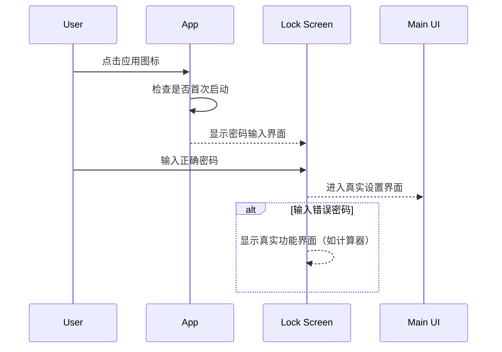
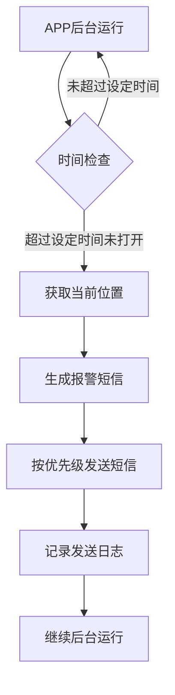
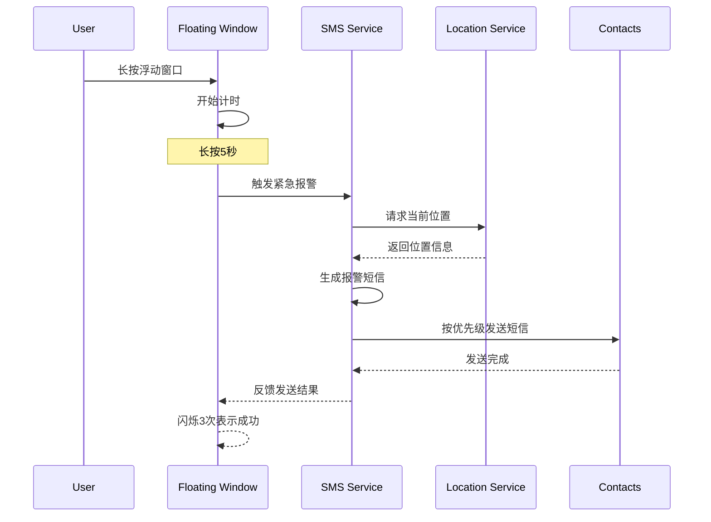
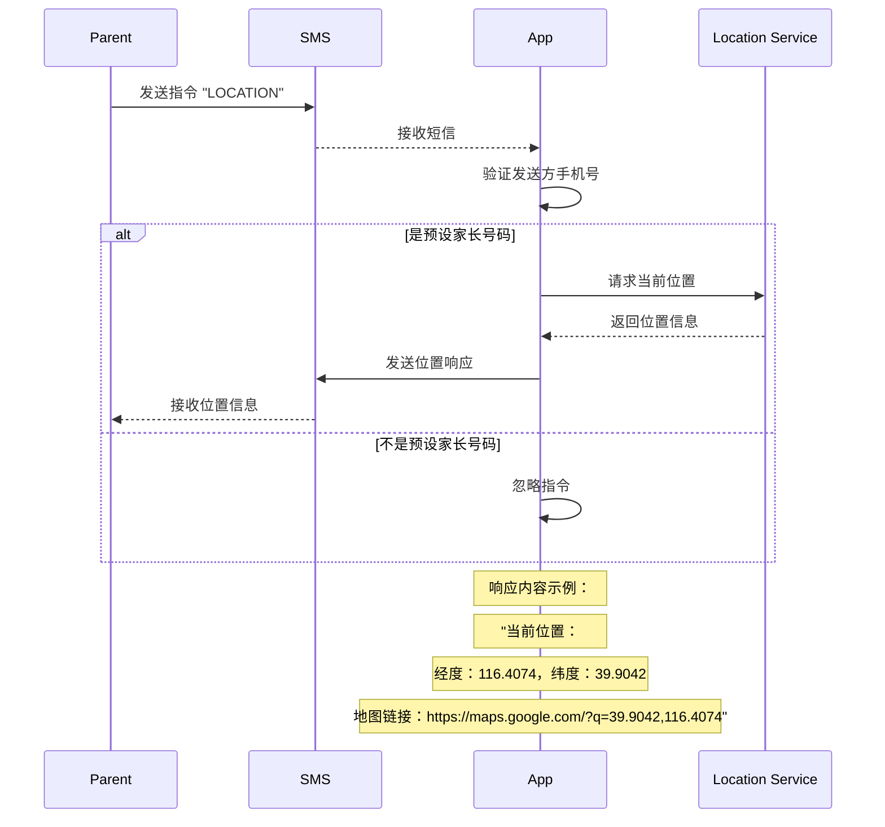
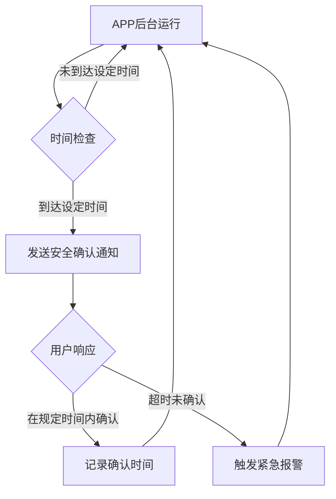

# AutoDroid Guardian App UI 设计文档

## 1. 应用图标设计

### 1.1 真实图标

```
+-----------------------------+
| 🔒 Guardian                 |
|                             |
| 安全守护者                  |
+-----------------------------+
```

### 1.2 应用图标选项

| 应用类型 | 图标 | 描述 |
|---------|------|------|
| 计算器 | 🧮 | 普通计算器图标 |
| 日历 | 📅 | 日历应用图标 |
| 天气 | ☁️ | 天气应用图标 |
| 笔记 | 📝 | 笔记应用图标 |
| 时钟 | ⏰ | 时钟应用图标 |
| 购物 | 🛍️ | 购物应用图标 |
| 浏览器 | 🌐 | 浏览器应用图标 |
| 新闻 | 📰 | 新闻应用图标 |
| 音乐 | 🎵 | 音乐应用图标 |
| 视频 | 📹 | 视频应用图标 |

## 2. 主要界面流程

### 2.1 启动流程



### 2.2 紧急联系人管理流程

```mermaid
flowchart TD
    A[真实设置界面] --> B[点击"紧急联系人管理"]
    B --> C[联系人列表]
    C --> D{操作类型}
    D -->|添加联系人| E[添加联系人表单]
    D -->|编辑联系人| F[编辑联系人表单]
    D -->|删除联系人| G[确认删除对话框]
    E --> H[保存联系人]
    F --> H
    G --> I[执行删除]
    H --> C
    I --> C
```

## 3. 详细UI界面设计

### 3.1 解锁界面（真实入口）

**指纹解锁界面**：
```
+-----------------------------+
|                             |
|       [应用图标]        |
|                             |
|       请验证指纹             |
|                             |
|          🖐️                |
|                             |
|    [使用图案解锁]           |
+-----------------------------+
```

**图案解锁界面**：
```
+-----------------------------+
|                             |
|       [应用图标]        |
|                             |
|       请绘制解锁图案         |
|                             |
|       •   •   •             |
|       •   •   •             |
|       •   •   •             |
|                             |
|    [使用指纹解锁]           |
+-----------------------------+
```

**交互说明**：
- 默认优先使用指纹解锁
- 指纹解锁失败或不可用时，可切换到图案解锁
- 解锁成功进入真实设置界面
- 解锁失败显示真实功能界面
- 支持在设置中修改解锁方式

### 3.2 真实功能界面示例 - 计算器

```
+-----------------------------+
|          🧮 计算器          |
+-----------------------------+
|  0                          |
+-----------------------------+
|  AC  ±  %  ÷                |
|  7   8   9   ×              |
|  4   5   6   -              |
|  1   2   3   +              |
|  0   .   =                  |
+-----------------------------+
```

**交互说明**：
- 正常使用计算器功能
- 连续按AC键5次可返回密码输入界面

### 3.3 真实设置主界面（绝对隐秘）

**默认显示界面**：
```
+-----------------------------+
| 📱 [应用名称]          |
+-----------------------------+
|                             |
| 这是一个普通的[真实应用]   |
|                             |
| [普通功能1]                 |
| [普通功能2]                 |
| [普通功能3]                 |
|                             |
| 版本：1.0.0                 |
+-----------------------------+
```

**隐秘解锁后显示**：
```
+-----------------------------+
| 🔒 AutoDroid Guardian        |
+-----------------------------+
|                             |
| [📞 紧急联系人管理]         |
| [⚠️ 紧急模式设置]           |
| [⚙️ 功能设置]           |
| [🌐 浮动窗口设置]           |
| [👨👩👧 家长监控设置]       |
| [✅ 安全确认设置]           |
| [🔒 短信安全设置]           |
|                             |
| 开发者微信二维码            |
| [扫码添加]                  |
|                             |
| 上次安全确认：2026-01-14    |
+-----------------------------+
```

**交互说明**：
- 默认显示真实功能界面，隐藏报警设置选项
- 需要通过特定方式解锁才能显示真实设置
- 设置界面采用RecyclerView实现，支持滚动
- 底部包含开发者微信二维码
- 点击各项进入对应设置界面
- 底部显示上次安全确认时间

### 3.4 隐秘解锁方式

**1. 指纹解锁**：
- 在真实功能界面长按特定区域（如版本号）
- 弹出指纹验证界面
- 验证成功后显示真实设置

**2. 图案解锁**：
- 在真实功能界面连续点击特定序列
- 切换到图案解锁界面
- 绘制正确图案后显示真实设置

**3. 家长短信指令**（绝对隐秘）：
- 家长发送特定短信指令：`UNLOCK_SETTINGS`
- APP在后台接收并验证指令
- 自动显示真实设置界面（无需用户操作）

**4. 特定触发序列**：
- 在真实功能界面执行特定操作序列
- 如：连续点击5次版本号，然后摇晃手机
- 触发后显示真实设置界面

**5. 浮动窗口快捷方式**：
- 长按浮动窗口5秒
- 验证身份后显示真实设置界面

### 3.4 紧急联系人管理界面

```
+-----------------------------+
| 📞 紧急联系人管理           |
+-----------------------------+
| + 添加联系人               |
|                             |
| 📱 张三 (父亲)              |
|    13800138000              |
|    优先级：1                |
|    [编辑] [删除]            |
|                             |
| 📱 李四 (母亲)              |
|    13900139000              |
|    优先级：2                |
|    [编辑] [删除]            |
|                             |
| 📱 王五 (朋友)              |
|    13700137000              |
|    优先级：3                |
|    [编辑] [删除]            |
+-----------------------------+
```

**交互说明**：
- 点击"+"添加新联系人
- 点击"编辑"修改联系人信息
- 点击"删除"删除联系人
- 长按联系人可调整优先级

### 3.5 添加/编辑联系人界面

```
+-----------------------------+
| 📝 联系人信息               |
+-----------------------------+
| 姓名：□□□□□□               |
|                             |
| 电话：□□□□□□□□□□□          |
|                             |
| 关系：□□□□□□               |
|                             |
| 优先级：[1] ▼               |
|                             |
| [保存] [取消]               |
+-----------------------------+
```

**交互说明**：
- 支持姓名、电话、关系输入
- 优先级可通过下拉选择
- 保存后返回联系人列表

### 3.6 紧急模式设置界面

**触发机制设置**：
```
+-----------------------------+
| ⚠️ 紧急模式设置             |
+-----------------------------+
| □ 启用自动报警             |
| 触发时间：3 ▼ 小时         |
|                             |
| □ 启用长按触发             |
| 长按时间：5 ▼ 秒           |
|                             |
| □ 启用连敲触发             |
| 连敲次数：5 ▼ 次           |
|                             |
| □ 启用摇晃触发             |
| 摇晃强度：中 ▼             |
|                             |
| [保存触发设置]             |
+-----------------------------+
```

**报警信息配置**：
```
+-----------------------------+
| 📝 报警信息配置             |
+-----------------------------+
| [自动报警信息]             |
| [长按5秒报警信息]           |
| [连敲5次报警信息]           |
| [摇晃触发报警信息]           |
|                             |
| □ 包含位置地图链接         |
| □ 包含GPS坐标             |
|                             |
| [保存信息配置]             |
+-----------------------------+
```

**报警信息编辑界面**：
```
+-----------------------------+
| ✏️ 编辑报警信息             |
+-----------------------------+
| 触发方式：长按5秒           |
|                             |
| 短信内容：                  |
| "救救我，我处于危险中！"    |
|                             |
| [添加位置] [恢复默认]      |
|                             |
| □ 启用短信加密             |
| □ 发送后自动删除           |
| □ 使用普通短信内容         |
| □ 延迟发送：0 ▼ 秒         |
|                             |
| [保存] [取消]               |
+-----------------------------+
```

**短信安全机制设置**：
```
+-----------------------------+
| 🔒 短信安全设置             |
+-----------------------------+
| □ 默认启用短信加密         |
| □ 默认自动删除短信         |
| □ 默认使用普通内容         |
|                             |
| 加密方式：AES-256 ▼         |
|                             |
| 普通短信模板：              |
| "今天天气不错，有空吗？"    |
|                             |
| [保存默认设置]             |
+-----------------------------+
```

**交互说明**：
- 可单独开关每种触发机制
- 可调整触发参数（时间、次数、强度）
- 每种触发机制对应独立的报警信息
- 支持自定义每种报警信息的内容
- 可选择是否包含位置信息
- 支持短信加密、自动删除、普通内容等安全机制
- 可设置默认安全机制，应用到所有报警信息
- 支持一键恢复默认信息

### 3.7 功能设置界面

```
+-----------------------------+
| ⚙️ 功能设置             |
+-----------------------------+
| 当前图标：计算器            |
|                             |
| 可用图标：                  |
| ○ 计算器                    |
| ○ 日历                      |
| ○ 天气                      |
| ○ 笔记                      |
| ○ 时钟                      |
|                             |
| 密码：□□□□□□               |
| 确认密码：□□□□□□           |
|                             |
| [保存设置]                 |
+-----------------------------+
```

**交互说明**：
- 可选择不同的应用图标
- 支持修改进入真实界面的密码
- 密码修改需要确认

### 3.8 浮动窗口设置界面

```
+-----------------------------+
| 🌐 浮动窗口设置             |
+-----------------------------+
| □ 启用浮动窗口             |
|                             |
| 位置：任意位置             |
| 透明度：10% ▼              |
| 尺寸：10x10 ▼              |
|                             |
| □ 自动隐藏                 |
| 隐藏时间：3 ▼ 秒           |
|                             |
| [预览] [重置]              |
| [保存设置]                 |
+-----------------------------+
```

**交互说明**：
- 可开关浮动窗口功能
- 支持拖拽调整到屏幕任意位置
- 可调整透明度和尺寸
- 预览功能可实时查看效果
- 支持重置到默认设置
- 长按触发功能在紧急模式设置中独立配置

### 3.9 家长监控设置界面

```
+-----------------------------+
| 👨👩👧 家长监控设置         |
+-----------------------------+
| □ 启用家长监控             |
|                             |
| 家长号码：13800138000      |
| [添加] [删除]              |
|                             |
| 可用指令：                  |
| - LOCATION                 |
| - STATUS                   |
| - EMERGENCY                |
|                             |
| [保存设置]                 |
+-----------------------------+
```

**交互说明**：
- 可开关家长监控功能
- 支持添加多个家长号码
- 仅响应预设家长手机号的指令
- 显示可用的指令格式

## 4. 浮动窗口交互设计

### 4.1 浮动窗口状态

**正常状态**：
```
+--+
| ・|
+--+
```
- 10x10像素，10%透明度
- 灰色圆点，位于屏幕角落

**长按状态**：
```
+--+
| ・|
+--+
```
- 长按过程中无任何视觉变化
- 不显示警告图标
- 不闪烁
- 可选轻微振动反馈（默认关闭）
- 长按5秒后静默触发紧急报警

### 4.2 浮动窗口位置

```
+-----------------------------+
| 🔴                          |
|                             |
|           🔴                |
|                             |
|                          🔴|
+-----------------------------+
```
- 支持屏幕任意位置
- 可自由拖拽调整
- 无自动吸附（避免被发现）
- 拖拽过程中保持极小透明状态

## 5. 紧急报警流程

### 5.1 自动报警流程



### 5.2 浮动窗口长按报警流程



## 6. 家长监控交互流程

### 6.1 短信指令流程



## 7. 安全确认流程

### 7.1 定期安全确认



## 8. 设计原则

1. **隐蔽性优先**：所有设计都以隐蔽性为首要考虑
2. **简单易用**：操作流程简单，避免复杂操作
3. **直观清晰**：界面设计清晰，易于理解
4. **安全性高**：重要操作需要密码验证
5. **响应迅速**：紧急情况下能快速触发报警

## 9. 用户体验优化

1. **首次使用引导**：提供详细的使用教程
2. **操作反馈**：所有操作都有明确的反馈
3. **错误处理**：友好的错误提示
4. **性能优化**：后台运行不影响手机性能
5. **兼容性**：适配不同屏幕尺寸和Android版本

# 总结

AutoDroid Guardian App的UI设计遵循了隐蔽性、易用性和安全性的原则，通过真实功能界面和简单直观的操作界面，为用户提供了可靠的安全保障。应用支持多种紧急触发机制，包括自动报警、浮动窗口长按和家长短信指令，能够适应不同的危险场景。

界面设计简洁明了，操作流程简单，用户可以轻松设置和使用各项功能。同时，应用注重隐私保护，所有数据都存储在本地，不上传到任何服务器，确保用户隐私安全。