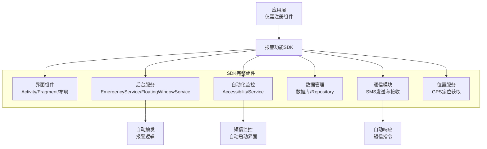
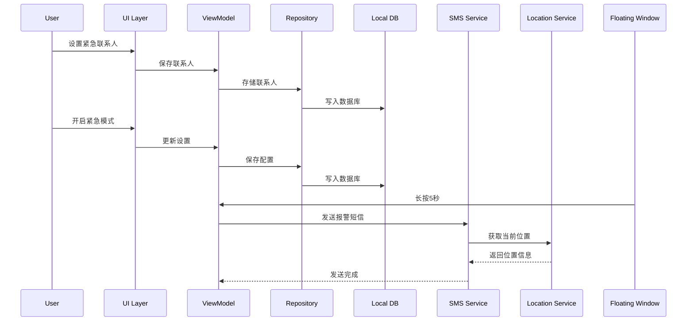
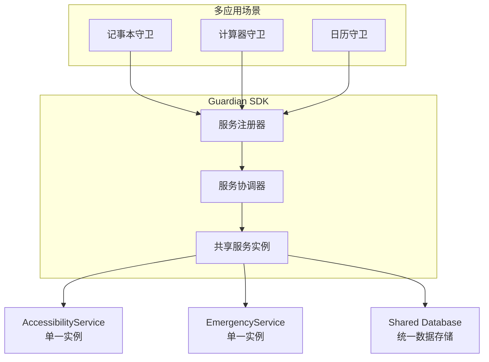

# AutoDroid Guardian SDK 设计文档

## 1. SDK概述

### 1.1 SDK定位
AutoDroid Guardian SDK 是一套完整的个人安全报警功能SDK，可集成到任意Android应用中，为应用提供隐秘的紧急报警功能。

### 1.2 核心特性
- **零代码集成**：应用只需注册SDK组件，无需编写报警相关代码
- **智能自动化**：所有报警功能自动管理和触发
- **多应用协调**：自动处理多个应用同时使用SDK的冲突
- **高度隐蔽**：后台静默运行，无任何视觉提示
- **纯本地化**：所有数据本地存储，无服务器依赖

### 1.3 适用场景
- 记事本应用 + Guardian SDK = 记事本守卫
- 计算器应用 + Guardian SDK = 计算器守卫
- 日历应用 + Guardian SDK = 日历守卫
- 天气应用 + Guardian SDK = 天气守卫
- 任意应用 + Guardian SDK = XX守卫

## 2. 架构设计

### 2.1 SDK架构图


### 2.2 核心组件关系


### 2.3 多应用协调架构


## 3. 数据模型设计

### 3.1 联系人表（Contact）
| 字段名 | 数据类型 | 约束 | 描述 |
|--------|----------|------|------|
| phoneNumber | TEXT | PRIMARY KEY | 手机号（唯一标识） |
| name | TEXT | NOT NULL | 联系人姓名 |
| type | TEXT | NOT NULL | 联系人类型（WARD/ GUARDIAN） |
| relationship | TEXT | | 关系（如：社区居民、学生、爸爸、妈妈等） |
| passwordBook | TEXT | | 密码本（Base64编码） |
| lastMessageTime | INTEGER | DEFAULT 0 | 最后消息时间戳 |
| alarmCount | INTEGER | DEFAULT 0 | 报警次数（仅WARD类型有效） |
| isActive | BOOLEAN | DEFAULT true | 是否活跃 |
| createdAt | INTEGER | NOT NULL | 创建时间戳 |
| updatedAt | INTEGER | NOT NULL | 更新时间戳 |

**设计说明**：
- **统一联系人模型**：将原来分开的被监护人（Ward）和紧急联系人（Guardian）合并为统一的Contact表
- **类型区分**：通过type字段区分被监护人（WARD）和紧急联系人（GUARDIAN）
- **手机号作为主键**：纯短信方案中，手机号是唯一可靠的身份标识
- **灵活关系**：支持多种关系类型，适用于不同类型的联系人

### 3.2 联系人类型枚举（ContactType）
```kotlin
enum class ContactType {
    WARD,       // 被监护人
    GUARDIAN    // 紧急联系人
}
```

### 3.3 应用设置表（Setting）
| 字段名 | 数据类型 | 约束 | 描述 |
|--------|----------|------|------|
| key | TEXT | PRIMARY KEY | 设置项键名 |
| value | TEXT | NOT NULL | 设置项值（字符串形式） |
| type | TEXT | NOT NULL | 设置项类型（STRING/INT/LONG/FLOAT/BOOLEAN/JSON） |
| description | TEXT | | 设置项描述 |
| category | TEXT | DEFAULT 'general' | 设置项分类 |
| isEncrypted | BOOLEAN | DEFAULT false | 是否加密存储 |
| createdAt | INTEGER | NOT NULL | 创建时间戳 |
| updatedAt | INTEGER | NOT NULL | 更新时间戳 |

**设计说明**：
- **替代SharedPreferences**：提供类型安全的设置项管理
- **扩展性强**：支持多种数据类型和分类管理
- **自动初始化**：SDK自动创建默认设置项
- **统一管理**：所有设置项在数据库中统一管理

### 3.4 数据库初始化机制

#### 3.4.1 数据库版本管理
- **版本号**：当前数据库版本为6
- **升级策略**：使用 `fallbackToDestructiveMigration()` 确保版本升级时数据重置
- **回调机制**：双保险机制确保测试数据正确插入
  - `onCreate` 回调：首次创建数据库时插入测试数据
  - `onOpen` 回调：数据库打开时检查并确保测试数据存在

#### 3.4.2 测试数据初始化
```kotlin
// 测试数据示例
val testGuardians = listOf(
    Contact(
        phoneNumber = "13800138001",
        name = "张三",
        type = ContactType.GUARDIAN,
        relationship = "爸爸"
    ),
    Contact(
        phoneNumber = "13800138002", 
        name = "李四",
        type = ContactType.GUARDIAN,
        relationship = "妈妈"
    )
)

val testWards = listOf(
    Contact(
        phoneNumber = "13800138003",
        name = "王五",
        type = ContactType.WARD,
        relationship = "社区居民",
        alarmCount = 3
    )
)
```

### 3.4 报警记录表（AlarmRecord）
| 字段名 | 数据类型 | 约束 | 描述 |
|--------|----------|------|------|
| id | INTEGER | PRIMARY KEY AUTOINCREMENT | 报警记录ID |
| wardPhoneNumber | TEXT | NOT NULL | 被监护人手机号 |
| triggerType | TEXT | NOT NULL | 触发类型（AUTO/LONG_PRESS/SHAKE/KEY_PRESS） |
| locationLatitude | REAL | | 纬度 |
| locationLongitude | REAL | | 经度 |
| encryptedLocation | TEXT | NOT NULL | 加密后的位置信息 |
| message | TEXT | NOT NULL | 报警暗语 |
| sentTime | INTEGER | NOT NULL | 发送时间戳 |
| isSuccess | BOOLEAN | | 是否发送成功 |
| receivedBy | TEXT | | 接收人手机号列表 |

### 3.5 查询记录表（QueryRecord）
| 字段名 | 数据类型 | 约束 | 描述 |
|--------|----------|------|------|
| id | INTEGER | PRIMARY KEY AUTOINCREMENT | 查询记录ID |
| wardPhoneNumber | TEXT | NOT NULL | 被监护人手机号 |
| guardianPhone | TEXT | NOT NULL | 监护人手机号 |
| queryType | TEXT | NOT NULL | 查询类型（LOCATION/STATUS） |
| queryMessage | TEXT | | 查询内容 |
| replyMessage | TEXT | | 回复内容 |
| queryTime | INTEGER | NOT NULL | 查询时间戳 |
| replyTime | INTEGER | | 回复时间戳 |

### 3.6 系统日志表（SystemLog）
| 字段名 | 数据类型 | 约束 | 描述 |
|--------|----------|------|------|
| id | INTEGER | PRIMARY KEY AUTOINCREMENT | 日志ID |
| logType | TEXT | NOT NULL | 日志类型（ALARM/QUERY/ERROR/INFO） |
| content | TEXT | NOT NULL | 日志内容 |
| timestamp | INTEGER | NOT NULL | 时间戳 |
| phoneNumber | TEXT | | 关联手机号（可选） |

**设计说明**：
- **统一日志管理**：将报警记录和查询记录统一为系统日志
- **快速检索**：支持按类型、时间、手机号快速检索
- **时间倒序展示**：前端直接按时间倒序查询展示

## 4. SDK组件设计

### 4.1 界面组件

#### 4.1.1 GuardianActivity
**功能**：SDK主界面
**启动方式**：通过应用启动
**导航设计**：底部三Tab导航（Material Design风格）
- Tab 1：联系人列表（ContactFragment，包括监护人和被监护人）
- Tab 2：WHY页面（WhyFragment）
- Tab 3：我的设置（SettingFragment）

**交互说明**：
- 默认进入联系人Tab
- 支持点击底部导航栏切换Tab
- 底部导航栏固定显示
- 支持接收系统分享的文本数据（用于导入被监护人信息）

**接收分享数据功能**：
- **触发方式**：通过系统分享SDK接收ACTION_SEND意图
- **数据类型**：text/plain
- **处理流程**：
  1. 接收到base64加密文本
  2. 保存为临时数据（ward_shared_data_temp）
  3. 显示提示："已接收到被监护人信息，请在WHY页面确认导入"
  4. 用户在WHY页面确认后，解密并保存到contacts表

#### 4.1.2 联系人界面（ContactFragment）
**功能**：统一显示所有联系人（被监护人和紧急联系人）
**数据展示**：RecyclerView 异构布局，支持大卡片和列表视图
**展示内容**：
- 联系人基本信息（姓名、手机号）
- 联系人类型标签（被监护人/紧急联系人）
- 上次联系时间
- 最新位置信息
- 最新报警信息（仅被监护人显示）

**布局策略**：
- **显示顺序**：紧急联系人显示在被监护人之前
- **视觉区分**：
  - **紧急联系人**：蓝色主题，显示"紧急联系人"标签
  - **被监护人**：绿色主题，显示"被监护人"标签
- **大卡片视图**：
  - 头像（大尺寸，带颜色区分）
  - 姓名（带颜色区分）
  - 类型标签（带背景色区分）
  - 上次联系时间
  - 最新位置信息
  - 最新报警信息
- **列表视图**：
  - 头像（小尺寸，带颜色区分）
  - 姓名（带颜色区分）
  - 最新位置信息
  - 时间
  - 最新报警信息（单行摘要）

**适配器逻辑**：
- `ContactAdapter` 根据联系人类型动态选择对应布局
- 紧急联系人使用蓝色主题布局文件
- 被监护人使用绿色主题布局文件
- 点击任意联系人进入详情页面

#### 4.1.3 我的设置界面
**功能**：管理个人报警设置和监护人配置
**数据展示**：RecyclerView 异构布局
**系统默认设置项**：
1. 监护人1
2. 监护人2
3. 监护人3
4. 监护人4
5. 监护人5
6. 报警触发模式1-音量键
7. 报警触发模式2-浮动窗口
8. 报警触发模式3-摇动手机
9. 报警触发模式4-长时间未使用手机
10. 报警信息密码
11. 录音模式
    - **触发时机**：报警时自动启动录音，无需人工干预
    - **录音时长**：默认5分钟，可配置（1-30分钟）
    - **分段录音**：每2分钟自动生成一段录音文件，避免大文件风险
    - **文件格式**：AAC编码（64kbps），单声道，MP4容器，每段约1MB
    - **存储位置**：应用私有目录，AES加密存储
    - **邮件发送**：每录完一段自动加密并通过邮件发送到配置的邮箱
    - **证据保护**：即使手机被损坏，已发送的录音文件安全保存在邮箱
    - **隐秘性**：无界面提示，后台静默录音
    - **权限管理**：录音权限和网络权限自动申请和检查
    - **邮箱安全**：邮箱凭据使用AES加密存储在本地数据库
12. 邮件配置（邮箱配置设置）
    - **邮箱地址**：发送录音附件的发件人邮箱
    - **邮箱密码**：加密存储在本地，发送时自动解密
    - **SMTP服务器**：配置SMTP主机和端口（如 smtp.gmail.com:587）
    - **TLS加密**：支持TLS加密传输
    - **自动发送**：每段录音完成后自动发送
    - **网络状态**：检测网络可用性，网络不可用时本地保存
13. Ping响应设置
    - **启用开关**：控制是否启用Ping响应功能
    - **检查间隔**：设置检查Ping请求的时间间隔（1-120分钟，默认30分钟）
    - **邮件重试次数**：设置邮件发送失败后的重试次数（1-10次，默认3次）
    - **邮件超时时间**：设置邮件发送的超时时间（1-180分钟，默认60分钟）
    - **短信备用**：控制邮件失败后是否使用短信发送（默认启用）
    - **工作原理**：
      - 系统定期检查监护人发送的Ping请求（通过邮件或短信）
      - 收到Ping请求后，自动回复位置信息等安全防卫信息
      - 优先使用邮件，失败后自动切换到短信
      - 建议检查间隔设置为30-60分钟以平衡实时性和耗电量
    - **技术方案**：使用对称加密（AES），适合近距离分享（蓝牙/WiFi）
14. 隐秘界面设置
    - **隐秘界面开关**：控制是否开启隐秘界面
    - **短信开门密语**：通过短信发送给自己手机来打开隐秘界面
    - **自动关闭界面**：可配置是否在操作后自动关闭主界面
    - **密语验证**：只有自己的手机发给自己的短信才会触发
15. 测试模式

**隐秘界面详细说明**：
- 通过短信发送给自己手机
- Guardian Accessibility 监控到短信开门密语后自动打开主界面
- 可自定义短信开门密语
- 可配置是否关闭主界面
- 如果关闭主界面，后续需要继续发送短信密语才能再次打开
- 只有自己的手机发给自己的短信，accessibility 才会判断密语并打开主界面

#### 4.1.4 WHY页面（WhyFragment）
**功能**：展示SDK功能说明和监护人信息分享/导入功能
**展示内容**：
- SDK功能介绍卡片
- 使用说明卡片
- 安全特性说明卡片
- "分享信息给监护人"卡片
- "导入被监护人信息"卡片

**分享信息给监护人功能**：
- **触发方式**：点击"分享信息给监护人"卡片
- **分享内容**：被监护人的手机号码、报警信息密码、邮箱账号、邮箱密码
- **加密方式**：使用SDK内置的对称密钥（AES）加密数据
- **数据格式**：加密后转换为base64文本
- **分享方式**：通过系统分享SDK，支持蓝牙、WiFi Direct、短信等方式
- **适用场景**：适合近距离面对面分享，确保接收方身份可靠
- **数据格式**：
  ```
  phone_number=13800138001&alarm_password=123456&email_address=test@gmail.com&email_password=encrypted_password
  ```
- **加密流程**：
  1. 收集被监护人配置信息
  2. 使用AES加密数据
  3. 转换为base64文本
  4. 调用系统分享SDK弹出分享菜单

**导入被监护人信息功能**：
- **触发方式**：点击"导入被监护人信息"卡片
- **接收方式**：通过系统分享SDK接收监护人分享的base64文本
- **显示方式**：对话框显示加密的base64文本，不显示解密后的具体内容（保护隐私）
- **确认导入**：用户确认后，内部解密数据并保存到contacts表
- **使用时机**：需要使用时再从数据库中解密获取
- **安全特性**：
  - 接收到的数据以base64加密格式存储
  - 对话框只显示加密文本，不显示手机号码、邮箱密码等敏感信息
  - 确认导入后才解密并保存到数据库
  - 使用时才解密，确保数据安全

**技术方案**：
- **加密算法**：AES对称加密
- **密钥管理**：SDK内置对称密钥
- **数据传输**：系统分享SDK（蓝牙/WiFi Direct/短信）
- **存储方式**：base64文本临时存储，确认后解密到contacts表
- **安全性**：适合近距离分享，接收方身份可靠

#### 4.1.5 联系人详情界面（ContactDetailFragment）
**功能**：显示单个联系人的详细信息
**展示内容**：
- 联系人基本信息（姓名、手机号、关系、类型）
- 历史消息记录
- 报警记录（仅被监护人）
- 位置历史记录（仅被监护人）
- 操作按钮（发送消息、查看详情等）

### 4.1.5 报警/查询记录界面
**功能**：展示报警和监护人查询记录
**展示方式**：时间倒序列表
**记录格式**：
- 报警记录：`HH:mm [触发方式]报警，报警信息：[报警内容]，位置[经度]，[纬度]`
- 查询记录：`HH:mm 监护人[关系]查询，查询信息：[查询内容]，回复信息：[回复内容]`

**示例**：
```
12:34 长按音量键报警，报警信息：有人打我，位置31.2304,121.4737
11:22 监护人爸爸查询，查询信息：在哪里，回复信息：我的位置31.2304,121.4737
```

#### 4.1.5 SettingActivity
**功能**：隐秘设置界面（传统模式）
**启动方式**：通过短信密语自动触发
**主要功能**：
- 紧急联系人管理
- 紧急模式设置
- 隐秘应用设置
- 浮动窗口设置
- 家长监控设置
- 安全确认设置

#### 4.1.6 Fragment组件
- `ContactFragment`：统一联系人列表（大卡片/列表视图，支持监护人和被监护人）
- `ContactDetailFragment`：联系人详情页面
- `WhyFragment`：WHY页面，展示SDK功能说明和监护人信息分享/导入功能
- `SettingFragment`：我的设置列表
- `RecordListFragment`：报警/查询记录列表
- `EmergencyModeFragment`：紧急模式设置
- `AppSettingsFragment`：隐秘应用设置
- `FloatingWindowFragment`：浮动窗口设置
- `ParentMonitorFragment`：家长监控设置
- `SecurityFragment`：安全确认设置
- `TestModeFragment`：测试模式配置
- `PasswordBookFragment`：位置密码本管理
- `DoorCodeFragment`：开门密语配置

### 4.2 后台服务组件

#### 4.2.1 GuardianAccessibilityService
**功能**：无障碍服务，监听系统通知
**主要职责**：
- 监听短信通知，匹配激活密语
- 监听家长指令短信
- 自动触发设置界面
- 自动响应家长指令

**配置示例**：
```xml
<?xml version="1.0" encoding="utf-8"?>
<accessibility-service xmlns:android="http://schemas.android.com/apk/res/android"
    android:accessibilityEventTypes="typeNotificationStateChanged"
    android:accessibilityFeedbackType="feedbackGeneric"
    android:accessibilityFlags="flagRequestTouchExplorationMode"
    android:canRetrieveWindowContent="true"
    android:description="@string/accessibility_service_description" />
```

#### 4.2.2 EmergencyService
**功能**：紧急模式核心服务
**主要职责**：
- 监听各种触发方式（长按、摇晃、按键等）
- 获取GPS位置信息
- 加密位置数据
- 发送报警短信
- 管理报警状态

**启动类型**：前台服务
**前台类型**：location

#### 4.2.3 FloatingWindowService
**功能**：浮动窗口服务
**主要职责**：
- 显示极小透明浮动窗口
- 监听长按事件
- 触发紧急报警

#### 4.2.4 AudioRecordingService
**功能**：隐秘录音服务
**主要职责**：
- 后台静默录音（无界面提示）
- 分段录音：每2分钟生成一段录音文件
- 自动加密：每段录音完成后使用AES加密
- 邮件发送：通过EmailSender将加密录音发送到配置的邮箱
- 音频配置：64kbps比特率，单声道，确保每段约1MB
- 文件管理：自动管理录音文件的生命周期

**录音流程**：
1. 报警触发时启动录音服务
2. 每段录音2分钟，文件命名格式：`audio_[触发类型]_seg[段号]_[时间戳].mp4`
3. 录音完成后自动加密，生成 `encrypted_` 前缀文件
4. 通过EmailSender发送加密文件到邮箱
5. 自动开始下一段录音，直到达到总时长
6. 即使手机被损坏，已发送的文件安全保存在邮箱

**启动类型**：前台服务
**技术特点**：
- 使用MediaRecorder进行音频录制
- AAC编码，MP4容器格式
- 文件大小优化：64kbps + 单声道，每段约1MB
- AES加密保护录音文件
- 邮箱凭据加密存储（EmailConfigManager）

#### 4.2.5 EmailSender
**功能**：邮件发送服务
**主要职责**：
- 发送带附件的报警邮件
- 邮箱凭据解密和管理
- 支持TLS加密传输
- 网络状态检测
- 发送失败处理

**邮件内容**：
- **主题**：Guardian 紧急报警 - 现场录音
- **正文**：包含报警时间、录音时长、文件名称等信息
- **附件**：加密的录音文件（每段一个邮件）

**邮箱配置**（EmailConfigManager）：
- 邮箱地址：发件人邮箱
- 邮箱密码：AES加密存储，发送时自动解密
- SMTP服务器：如 smtp.gmail.com:587
- TLS加密：支持TLS加密传输

**安全特性**：
- 邮箱凭据使用AES加密存储在SharedPreferences
- 录音文件在发送前已AES加密
- 支持自定义SMTP服务器配置
- 后台线程发送，不阻塞录音流程

#### 4.2.6 EmailConfigManager
**功能**：邮箱配置管理器
**主要职责**：
- 邮箱配置的加密存储
- 邮箱配置的读取和解密
- 邮件发送功能的启用/禁用管理

**配置项**：
- `email_enabled`：是否启用邮件发送功能
- `email_address`：邮箱地址（明文存储）
- `email_password`：邮箱密码（AES加密存储）
- `smtp_host`：SMTP服务器地址
- `smtp_port`：SMTP服务器端口
- `smtp_tls`：是否使用TLS加密

**安全机制**：
- 密码使用EncryptionUtils.encryptString()加密
- 读取时使用EncryptionUtils.decryptString()解密
- 配置存储在私有SharedPreferences中
- 支持清除所有邮箱配置

#### 4.2.7 ServiceCoordinator
**功能**：服务协调器
**主要职责**：
- 管理多个应用的服务实例
- 自动选举主服务
- 协调服务启动和停止
- 处理服务冲突

### 4.3 通信模块

#### 4.3.1 SmsManager
**功能**：短信发送管理器
**主要职责**：
- 发送报警短信
- 自动删除发送记录
- 处理发送失败重试

#### 4.3.2 SmsReceiver
**功能**：短信接收器
**主要职责**：
- 接收家长指令
- 解析指令内容
- 触发对应操作

#### 4.3.3 EmailSender
**功能**：邮件发送管理器
**主要职责**：
- 发送带录音附件的报警邮件
- 邮箱凭据管理（通过EmailConfigManager解密）
- SMTP协议通信
- TLS加密传输
- 网络状态检测
- 后台线程发送，不阻塞录音流程

**邮件发送流程**：
1. 从EmailConfigManager获取邮箱配置（自动解密密码）
2. 创建JavaMail Session，配置SMTP参数
3. 构建MimeMessage，包含正文和录音附件
4. 在后台线程中发送邮件
5. 记录发送日志（成功/失败）

**技术实现**：
- 使用JavaMail API（android-mail + android-activation）
- 支持自定义SMTP服务器配置
- 支持TLS加密传输
- 支持大文件附件（录音文件约1MB）
- 自动处理网络异常

#### 4.3.4 LocationEncryptor
**功能**：位置信息加密器
**主要职责**：
- 使用密码本加密GPS坐标
- 将坐标转换为中文密文
- 解密接收到的密文

### 4.4 数据管理模块

#### 4.4.1 DatabaseHelper
**功能**：数据库帮助类
**主要职责**：
- 创建和管理SQLite数据库
- 数据库版本升级
- 提供数据访问接口

#### 4.4.2 Repository
**功能**：数据仓库
**主要职责**：
- 统一数据访问接口
- 缓存管理
- 数据转换和验证

#### 4.4.3 EmailConfigManager
**功能**：邮箱配置管理器
**主要职责**：
- 邮箱配置的加密存储和读取
- 邮件发送功能的启用/禁用管理
- 邮箱凭据安全管理

**配置存储**：
- 存储位置：SharedPreferences（私有）
- 加密方式：AES加密密码字段
- 配置项：
  - `email_enabled`：是否启用邮件发送功能
  - `email_address`：邮箱地址（明文）
  - `email_password`：邮箱密码（AES加密）
  - `smtp_host`：SMTP服务器地址
  - `smtp_port`：SMTP服务器端口
  - `smtp_tls`：是否使用TLS加密

**安全机制**：
- 密码使用EncryptionUtils加密存储
- 读取时自动解密
- 支持清除所有邮箱配置
- 配置检查：发送邮件前验证配置完整性

### 4.5 位置服务

#### 4.5.1 LocationManager
**功能**：位置管理器
**主要职责**：
- 获取GPS位置
- 获取网络位置
- 位置信息格式化

## 5. 权限需求

### 5.1 权限清单
| 权限名称 | 用途 | 类型 |
|----------|------|------|
| SEND_SMS | 发送报警短信 | 危险权限 |
| RECEIVE_SMS | 接收家长指令 | 危险权限 |
| READ_SMS | 读取短信内容 | 危险权限 |
| ACCESS_FINE_LOCATION | 获取GPS位置 | 危险权限 |
| ACCESS_COARSE_LOCATION | 获取网络位置 | 危险权限 |
| SYSTEM_ALERT_WINDOW | 显示浮动窗口 | 特殊权限 |
| RECEIVE_BOOT_COMPLETED | 开机自启动 | 普通权限 |
| FOREGROUND_SERVICE | 后台运行 | 普通权限 |
| BIND_ACCESSIBILITY_SERVICE | 无障碍服务 | 特殊权限 |
| INTERNET | 发送邮件（SMTP） | 普通权限 |
| ACCESS_NETWORK_STATE | 检测网络状态 | 普通权限 |
| RECORD_AUDIO | 隐秘录音 | 危险权限 |

### 5.2 权限声明
在SDK的AndroidManifest.xml中声明所有权限：
```xml
<uses-permission android:name="android.permission.SEND_SMS" />
<uses-permission android:name="android.permission.RECEIVE_SMS" />
<uses-permission android:name="android.permission.READ_SMS" />
<uses-permission android:name="android.permission.ACCESS_FINE_LOCATION" />
<uses-permission android:name="android.permission.ACCESS_COARSE_LOCATION" />
<uses-permission android:name="android.permission.SYSTEM_ALERT_WINDOW" />
<uses-permission android:name="android.permission.RECEIVE_BOOT_COMPLETED" />
<uses-permission android:name="android.permission.FOREGROUND_SERVICE" />
<uses-permission android:name="android.permission.INTERNET" />
<uses-permission android:name="android.permission.ACCESS_NETWORK_STATE" />
<uses-permission android:name="android.permission.RECORD_AUDIO" />
```

## 6. SDK集成指南

### 6.1 依赖配置
在应用的 `build.gradle.kts` 中添加SDK依赖：
```kotlin
dependencies {
    implementation(project(":guardian-sdk"))
    // 其他依赖...
}
```

**注意**：SDK内部已包含以下依赖，应用无需额外添加：
- JavaMail API (android-mail:1.6.7)
- JavaMail Activation (android-activation:1.6.7)

如果需要使用邮件发送录音功能，需要确保网络连接和SMTP服务器配置。

### 6.2 组件注册
在 `AndroidManifest.xml` 中注册SDK提供的组件：

```xml
<!-- SDK提供的隐秘设置界面 -->
<activity
    android:name="com.autodroid.guardiansdk.ui.SettingActivity"
    android:exported="false"
    android:theme="@style/Theme.AutoDroidGuardian.Dialog" />

<!-- SDK提供的辅助服务 - 监控短信自动启动设置界面 -->
<service
    android:name="com.autodroid.guardiansdk.service.GuardianAccessibilityService"
    android:permission="android.permission.BIND_ACCESSIBILITY_SERVICE"
    android:exported="true">
    <intent-filter>
        <action android:name="android.accessibilityservice.AccessibilityService" />
    </intent-filter>
    <meta-data
        android:name="android.accessibilityservice"
        android:resource="@xml/accessibility_service_config" />
</service>

<!-- SDK提供的紧急模式服务 -->
<service
    android:name="com.autodroid.guardiansdk.service.EmergencyService"
    android:exported="false"
    android:foregroundServiceType="location" />

<!-- SDK提供的浮动窗口服务 -->
<service
    android:name="com.autodroid.guardiansdk.service.FloatingWindowService"
    android:exported="false" />

<!-- SDK提供的音频录音服务 -->
<service
    android:name="com.autodroid.guardiansdk.service.AudioRecordingService"
    android:exported="false"
    android:enabled="true" />

<!-- SDK提供的短信监听服务 -->
<receiver
    android:name="com.autodroid.guardiansdk.receiver.SmsReceiver"
    android:exported="true"
    android:permission="android.permission.BROADCAST_SMS">
    <intent-filter android:priority="1000">
        <action android:name="android.provider.Telephony.SMS_RECEIVED" />
    </intent-filter>
</receiver>
```

### 6.3 SDK初始化
在Application类中初始化SDK：
```kotlin
class MyApplication : Application() {
    override fun onCreate() {
        super.onCreate()
        GuardianSdk.initialize(this)
    }
}
```

### 6.4 零代码集成
- **自动启动**：SDK自动在后台启动报警服务
- **隐秘激活**：通过短信密语自动激活设置界面
- **零代码集成**：应用无需编写报警相关代码

## 7. 智能自动化功能

### 7.1 自动化监控机制
- **AccessibilityService自动启动**：监控特定短信关键词，自动启动设置界面
- **短信自动响应**：收到报警短信自动触发紧急模式
- **服务自动协调**：所有后台服务自动启动和协同工作

### 7.2 用户操作流程
```
用户收到特定短信（如"紧急设置"）
    ↓
AccessibilityService自动检测并匹配关键词
    ↓
自动启动SettingActivity设置界面
    ↓
用户进行设置操作，无需手动启动应用
```

### 7.3 多应用协调机制
- **自动服务注册**：应用启动时自动向SDK注册
- **共享服务实例**：多个应用共享同一个后台服务
- **动态主从选举**：SDK内部自动决定服务启动者
- **透明协调**：开发者无需关心冲突问题

## 8. 安全性设计

### 8.1 数据安全
- **本地存储加密**：紧急联系人信息使用AES加密存储
- **密码加密**：设置密码使用SHA-256加密
- **邮箱凭据加密**：邮箱密码使用AES加密存储在SharedPreferences中
- **录音文件加密**：每段录音完成后使用AES加密，确保本地存储安全
- **数据隔离**：应用数据与报警系统配置、密码本、日志分开存储
- **加密算法**：使用Android Keystore存储加密密钥

### 8.2 隐蔽性设计
- **后台运行**：SDK在后台静默运行，无明显通知
- **通知显示**：如需要推送通知，显示为普通应用通知
- **短信记录自动删除**：发送的报警短信和收到的指令自动从短信记录中删除
- **动态激活密语**：唯一的设置入口，确保只有授权用户能访问
- **静默录音**：录音过程无任何界面提示或声音反馈
- **静默邮件**：邮件发送在后台线程中执行，无用户感知

### 8.3 密码本系统
- **动态密码本**：每个数字（0-9）、小数点、分隔符对应用户自定义汉字
- **示例编码**：
  - 1->苹果
  - .->了
  - ,->和
  - 31.2304,121.4737 -> 苹果三幺了苹果两三洞四和苹果两幺了点拐三拐
- **安全同步**：通过二维码在孩子端与家长端APP之间同步密码本
- **本地存储**：密码本本地加密存储，永不通过网络传输

## 10. 测试模式支持

### 10.1 模式说明
- **练习模式**：所有操作在本地模拟，100%无风险、无费用
- **实战模式**：所有操作真实执行，仅在紧急情况下使用

### 10.2 测试模式功能
**通知栏模拟反馈**：
- 触发报警操作后，在手机通知栏显示模拟报警信息
- 不发送真实短信，不产生通信费用
- 录音和邮件功能同样在测试模式下模拟执行
- 展示内容格式：
  - `[测试模式] 已模拟发送报警短信`
  - `[测试模式] 报警信息：[报警内容]`
  - `[测试模式] 位置：[经度]，[纬度]`
  - `[测试模式] 已模拟录音X分钟`
  - `[测试模式] 已模拟发送邮件到[邮箱地址]`

**示例通知**：
```
[测试模式] 长按音量键报警 - 已模拟发送报警短信
报警信息：有人打我
位置：31.2304,121.4737
[测试模式] 已模拟录音5分钟
[测试模式] 已模拟发送邮件到user@example.com
```

### 10.3 技术实现
- **状态管理**：使用全局变量`isTestMode`控制所有行为分支
- **统一入口**：所有触发操作汇集到统一处理函数
- **视觉区分**：测试模式有明显视觉标识（橙色边框、"测试中"水印）
- **通知模拟**：测试模式下使用本地通知而非真实短信发送

## 11. API接口设计

### 11.1 公开API
```kotlin
object GuardianSdk {
    /**
     * 初始化SDK
     */
    fun initialize(context: Context)
    
    /**
     * 获取SDK版本
     */
    fun getVersion(): String
    
    /**
     * 切换测试/实战模式
     */
    fun setTestMode(isTestMode: Boolean)
    
    /**
     * 手动触发紧急报警
     */
    fun triggerEmergency()
    
    /**
     * 获取紧急联系人列表
     */
    fun getEmergencyContacts(): List<EmergencyContact>
    
    /**
     * 添加紧急联系人
     */
    fun addEmergencyContact(contact: EmergencyContact)
    
    /**
     * 删除紧急联系人
     */
    fun removeEmergencyContact(phoneNumber: String)
}
```

### 11.2 回调接口
```kotlin
interface EmergencyCallback {
    /**
     * 报警发送成功回调
     */
    fun onEmergencySent(alarmRecord: AlarmRecord)
    
    /**
     * 报警发送失败回调
     */
    fun onEmergencyFailed(error: Throwable)
    
    /**
     * 接收到家长指令回调
     */
    fun onParentCommandReceived(command: String)
}
```

## 12. 版本规划

### 12.1 当前版本
- **v1.0.0**：核心功能实现
  - 紧急联系人管理
  - 自动报警触发
  - 浮动窗口支持
  - 短信发送与接收
  - 位置信息获取
  - 多应用协调

### 12.2 未来版本
- **v1.1.0**：功能增强
  - 更多触发方式
  - 家长监控模式
  - 位置历史记录

- **v1.2.0**：安全增强
  - 安全确认机制
  - 防卸载保护
  - 数据备份与恢复

- **v2.0.0**：架构升级
  - 支持更多通信方式（邮件、网络）
  - 云端配置同步
  - 人工智能触发识别
