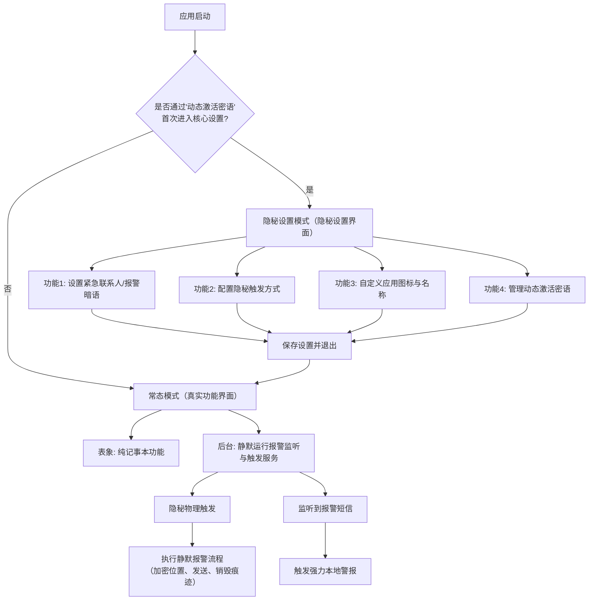

# 记事本守卫 App 设计文档

## 1. 产品概述

### 1.1 产品定位
**"记事本守卫"是一款**具备完整记事本功能的真实应用**，同时集成了一套隐秘的报警系统。用户可正常使用记事本功能，在紧急情况下可通过隐秘方式触发报警。核心目标是：**即使手机被他人临时检查，从任何角度都无法察觉其真实用途**。

### 1.2 核心价值
- **绝对隐蔽性**：具备真实记事本功能，不易被发现
- **自动报警**：无需手动操作即可触发报警
- **多重触发机制**：适应不同危险场景
- **纯本地化**：保护用户隐私，无服务器依赖
- **离线可用**：没有网络也能正常工作

### 1.3 目标用户
- 独居人士
- 经常夜班或独自出行的人群
- 家暴受害者
- 处于潜在危险环境的人
- 需要被家长监控的未成年人

## 2. 系统总览与状态机

应用包含两个完全隔离的模式，通过"动态激活密语"安全切换：



## 3. 核心功能需求

### 3.1 记事本功能

#### 3.1.1 笔记管理
- **创建笔记**：支持创建新的文本笔记
- **编辑笔记**：支持编辑已有笔记内容
- **删除笔记**：支持删除笔记，带确认提示
- **笔记列表**：按时间倒序显示所有笔记
- **笔记搜索**：支持按关键词搜索笔记内容

#### 3.1.2 笔记内容
- **标题**：笔记标题（必填）
- **内容**：笔记正文（支持多行文本）
- **创建时间**：自动记录笔记创建时间
- **修改时间**：自动记录笔记最后修改时间
- **分类**：支持笔记分类管理
- **标签**：支持给笔记添加标签

#### 3.1.3 数据存储
- **本地存储**：所有笔记数据本地存储
- **自动保存**：编辑时自动保存，防止数据丢失
- **数据隔离**：记事本数据与报警系统完全隔离

### 3.2 动态激活与入口隐藏
- **唯一入口**：应用安装后，桌面图标点击**仅能进入"记事本"真实功能界面**。无任何设置选项。
- **激活密语**：
  - 预置一个初始密语（如"重启手机"）。
  - **用户必须在首次进入核心设置后立即修改**，改为自己独有的句子（如"周三下午开会"）。
  - 修改后，旧密语立即失效。**仅当前密语有效**。
- **激活流程**：
  1. 从**另一部手机**或自己向本机发送内容为 **【当前有效密语】** 的普通短信。
  2. 本应用后台服务（通过`AccessibilityService`）监听到短信通知，进行内容比对。
  3. **完全匹配时**，应用从当前的记事本界面，**无缝跳转至核心设置界面**。此过程无弹窗提示。

### 3.3 紧急联系人管理
- **功能描述**：用户可以添加、编辑、删除紧急联系人
- **字段要求**：姓名、电话号码、关系
- **数量限制**：最多支持5个紧急联系人
- **优先级设置**：可设置联系人优先级，紧急情况下按顺序发送

### 3.4 紧急模式设置
- **多种触发机制**：
  - 自动报警：设置时间阈值（默认3小时），超过时间未打开APP自动发送报警短信
  - 长按浮动窗口：浮动窗口长按5秒触发特定报警信息，长按10秒触发紧急报警短信
  - 快速摇晃：快速摇晃手机触发特定报警信息
  - 长按音量键：后台全局监听，长按（如5秒）音量键触发报警
- **多种报警信息配置**：每种触发机制可配置不同的报警短信内容
  - 长按浮动窗口5秒：默认发送"我肚子疼"相关信息
  - 长按浮动窗口10秒：默认发送"救救我"相关信息
  - 长按音量键5秒：后台全局监听，长按（如5秒）音量键发送"我肚子疼"相关信息
  - 长按音量键10秒：后台全局监听，长按（如10秒）音量键发送"救救我"相关信息
  - 快速摇晃：默认发送"我需要帮助"相关信息
- **位置信息**：自动获取GPS位置，以坐标和地图链接两种形式发送
- **短信安全机制**：
  - **位置密码本加密**：通过本地密码本将GPS坐标转换为中文密文
  - **短信格式**：[固定消息头] + [加密位置密文] + [报警暗语]
  - **自动删除**：发送后自动删除发送记录
  - **定时发送**：可设置延迟发送时间

### 3.5 发送后安全处理
- **发送后安全处理**：
  - **发送记录删除**：发送报警短信后，立即尝试删除本机发送记录
  - **Android版本适配**：Android 9及以下自动删除，Android 10及以上引导用户手动删除
  - **界面切换**：触发后，APP界面立即跳转至记事本界面
- **家长端响应机制**：
  - **后台监听**：依赖无障碍服务，持续监听系统通知栏的新短信
  - **识别与解码**：发现含固定消息头的短信后，使用本地密码本将中文密文反向解密为坐标
  - **报警翻译**：根据报警暗语翻译具体报警类型

### 3.6 浮动窗口
- **极小透明窗口**：10x10像素，10%透明度
- **可自定义位置**：支持拖拽到屏幕任意位置
- **静默触发机制**：长按5秒自动发送求救信息，无任何视觉反馈
- **隐藏/显示切换**：可手动隐藏或显示浮动窗口

### 3.7 家长监控模式
- **短信指令系统**：预设家长号码可发送短信指令
- **指令格式**：
  - `LOCATION`：获取当前位置
  - `STATUS`：检查APP运行状态
  - `EMERGENCY`：远程触发紧急模式
- **自动响应**：收到指令后自动回复对应信息
- **安全验证**：仅响应预设家长手机号的指令，无需额外密码

### 3.8 测试模式（教学与练习）
- **全局模式开关**：在设置界面提供明确的模式切换开关
  - **练习模式**：所有操作在本地模拟，100%无风险、无费用
  - **实战模式**：所有操作真实执行，仅在紧急情况下使用
- **测试模式核心功能**：
  - **绝对安全**：不发送真实短信，不联系紧急联系人
  - **高度仿真**：操作体验与真实模式完全一致
  - **结果反馈卡**：触发后显示详细的操作解释和对应紧急情况
  - **分步教学**：引导用户掌握所有触发方式

### 3.9 安全与自毁
- **数据隔离**：记事本数据与报警系统配置、密码本、日志分开存储，采用不同加密密钥
- **紧急擦除**：提供多种触发方式的立即擦除功能，无确认对话框，完全静默执行
  - **本地触发**：长按隐秘设置界面中的"紧急擦除"按钮3秒
  - **远程触发**：家长发送`WIPE`短信指令
  - **物理触发**：在记事本界面连续按电源键10次
  - **执行效果**：立即删除所有报警数据，应用还原为纯记事本

## 4. UI设计

### 4.1 设计原则
- **简洁明了**：避免复杂操作，易于理解
- **真实功能**：具备完整的记事本功能，用户可正常使用
- **隐秘报警**：在真实功能基础上集成隐秘报警系统
- **易用性**：关键功能一键操作
- **安全性**：重要操作需要密码验证

### 4.2 主要界面设计

#### 4.2.1 记事本主界面
```
+-----------------------------+
| 📝 我的笔记                 |
+-----------------------------+
| + 新建笔记                  |
|                             |
| 📄 会议记录                 |
|    2026-01-15 09:30         |
|    [预览] [编辑] [删除]      |
|                             |
| 📄 购物清单                 |
|    2026-01-14 18:20         |
|    [预览] [编辑] [删除]      |
|                             |
| 📄 读书笔记                 |
|    2026-01-13 21:15         |
|    [预览] [编辑] [删除]      |
|                             |
+-----------------------------+
| 搜索框                      |
+-----------------------------+
```

#### 4.2.2 笔记编辑界面
```
+-----------------------------+
| ✎ 编辑笔记                  |
+-----------------------------+
|                             |
| 标题：_____________         |
|                             |
| 分类：[工作] ▼              |
| 标签：[#笔记] [#重要]       |
|                             |
| +------------------------+ |
| |                        | |
| | 笔记内容编辑区...      | |
| |                        | |
| +------------------------+ |
|                             |
| [取消]  [保存]              |
+-----------------------------+
```

#### 4.2.3 隐秘设置界面（通过激活密语进入）

**主设置界面**
```
+-----------------------------+
| 🔒 AutoDroid Guardian        |
+-----------------------------+
|                             |
| [📞 紧急联系人管理]         |
| [⚠️ 紧急模式设置]           |
| [⚙️ 隐秘应用设置]           |
| [🌐 浮动窗口设置]           |
| [👨👩👧 家长监控设置]       |
| [✅ 安全确认设置]           |
| [🗑️ 紧急擦除]             |
|                             |
| 开发者微信二维码            |
| [扫码添加]                  |
|                             |
| 上次安全确认：2026-01-14    |
+-----------------------------+
```

**交互说明**：
- 点击各项进入对应设置界面
- 底部显示上次安全确认时间
- 支持下拉刷新状态

**紧急联系人管理界面**
```
+-----------------------------+
| 📞 紧急联系人管理           |
+-----------------------------+
| + 添加联系人               |
|                             |
| 📱 张三 (父亲)              |
|    13800138000              |
|    优先级：1                |
|    [编辑] [删除]            |
|                             |
| 📱 李四 (母亲)              |
|    13900139000              |
|    优先级：2                |
|    [编辑] [删除]            |
+-----------------------------+
```

**紧急模式设置界面**
```
+-----------------------------+
| ⚠️ 紧急模式设置             |
+-----------------------------+
| □ 启用自动报警             |
| 触发时间：3 ▼ 小时         |
|                             |
| □ 启用长按触发             |
| 长按时间：5 ▼ 秒           |
|                             |
| □ 启用连敲触发             |
| 连敲次数：5 ▼ 次           |
|                             |
| □ 启用摇晃触发             |
| 摇晃强度：中 ▼             |
|                             |
| [保存触发设置]             |
+-----------------------------+
```

**报警信息配置**：
```
+-----------------------------+
| 📝 报警信息配置             |
+-----------------------------+
| [自动报警信息]             |
| [长按5秒报警信息]           |
| [连敲5次报警信息]           |
| [摇晃触发报警信息]           |
|                             |
| □ 包含位置地图链接         |
| □ 包含GPS坐标             |
|                             |
| [保存信息配置]             |
+-----------------------------+
```

**隐秘应用设置界面**
```
+-----------------------------+
| ⚙️ 隐秘应用设置             |
+-----------------------------+
| 当前应用：记事本守卫        |
| 当前版本：v1.0.0            |
| 报警状态：正常              |
|                             |
| 应用图标设置：              |
| [从相册选择图标]            |
| [拍摄照片作为图标]          |
| [使用默认图标]              |
|                             |
| 当前图标预览：[图片预览]    |
|                             |
| 应用名称：□□□□□□           |
|                             |
| 测试模式：○ 开启 ○ 关闭     |
|                             |
| [保存设置]                 |
+-----------------------------+
```

**测试模式切换确认**
```
+-----------------------------+
| ⚠️ 模式切换确认             |
+-----------------------------+
| 警告：即将进入实战模式      |
|                             |
| 在此模式下，所有报警操作    |
| 将真实发送短信并触发高声    |
| 警报，可能引起他人注意并    |
| 产生通信费用。              |
|                             |
| 请仅在紧急情况下使用。      |
|                             |
| [取消] [我已知晓风险，确定切换]
+-----------------------------+
```

**浮动窗口设置界面**
```
+-----------------------------+
| 🌐 浮动窗口设置             |
+-----------------------------+
| □ 启用浮动窗口             |
|                             |
| 位置：任意位置             |
| 透明度：10% ▼              |
| 尺寸：10x10 ▼              |
|                             |
| □ 自动隐藏                 |
| 隐藏时间：3 ▼ 秒           |
|                             |
| [预览] [重置]              |
| [保存设置]                 |
+-----------------------------+
```

**家长监控设置界面**
```
+-----------------------------+
| 👨👩👧 家长监控设置         |
+-----------------------------+
| □ 启用家长监控             |
|                             |
| 家长号码：13800138000      |
| [添加] [删除]              |
|                             |
| 可用指令：                  |
| - LOCATION                 |
| - STATUS                   |
| - EMERGENCY                |
|                             |
| [保存设置]                 |
+-----------------------------+
```

**紧急擦除机制（立即执行）**
```kotlin
// 紧急擦除功能实现 - 点击即执行，无确认
fun emergencyWipe() {
    // 立即删除所有报警相关数据
    deleteEmergencyContacts()
    deletePasswordBook()
    deleteAlarmLogs()
    deleteAllConfigs()
    
    // 删除已发送的报警短信记录
    deleteSentSmsRecords()
    
    // 立即切换到纯记事本界面
    switchToPureNotepadMode()
    
    // 无任何提示，完全静默执行
}
```

**触发方式**：
- **隐秘设置界面**：长按"紧急擦除"按钮3秒（防止误触）
- **短信指令**：家长发送`WIPE`指令远程触发
- **物理按键**：在记事本界面连续按电源键10次

### 4.3 浮动窗口设计

**极小透明窗口**
- 尺寸：10x10像素
- 形状：圆形
- 透明度：10%
- 颜色：灰色
- 默认位置：任意位置

**长按交互**
- 长按5秒后，无任何视觉反馈
- 触发后自动发送求救信息
- 发送完成后，无任何提示

## 5. 应用集成

### 5.1 与SDK集成
记事本守卫应用通过集成 Guardian SDK 来实现所有报警功能。

#### 5.1.1 依赖配置
在应用的 `build.gradle.kts` 中添加SDK依赖：
```kotlin
dependencies {
    implementation(project(":guardian-sdk"))
    // 其他依赖...
}
```

#### 5.1.2 组件注册
在 `AndroidManifest.xml` 中注册SDK提供的组件（见SDK文档）

#### 5.1.3 SDK初始化
在Application类中初始化SDK：
```kotlin
class NotepadApplication : Application() {
    override fun onCreate() {
        super.onCreate()
        GuardianSdk.initialize(this)
    }
}
```

### 5.2 零代码集成
- **自动启动**：SDK自动在后台启动报警服务
- **隐秘激活**：通过短信密语自动激活设置界面
- **零代码集成**：应用无需编写报警相关代码

### 5.3 智能自动化流程
1. **用户收到短信**："紧急设置"
2. **AccessibilityService自动检测**：匹配关键词，启动设置界面
3. **用户进行设置**：无需手动启动应用
4. **功能自动运行**：所有报警服务自动启动和协调

## 6. 安全性设计

### 6.1 数据安全
- **本地存储加密**：紧急联系人信息使用AES加密存储
- **密码加密**：设置密码使用SHA-256加密
- **防卸载保护**：可设置卸载密码，防止被恶意卸载
- **数据隔离**：记事本数据与报警系统配置、密码本、日志分开存储

### 6.2 隐蔽性设计
- **后台运行**：APP在后台静默运行，无明显通知
- **通知显示**：如需要推送通知，显示为普通应用通知
- **短信记录自动删除**：发送的报警短信和收到的指令自动从短信记录中删除
- **动态激活密语**：唯一的设置入口，确保只有授权用户能访问

### 6.3 权限保护
- **权限最小化**：只请求必要的权限
- **权限动态申请**：在需要时才请求权限
- **权限说明**：明确告知用户权限用途
- **合理的权限引导**：以合理理由引导用户开启必要权限

## 7. 测试计划

### 7.1 功能测试
- 记事本功能测试
  - 笔记增删改查
  - 笔记搜索
  - 笔记分类管理
- 紧急联系人增删改查
- 自动报警触发
- 浮动窗口长按触发
- 短信指令响应
- 功能界面切换
- 紧急擦除功能

### 7.2 兼容性测试
- 不同Android版本（Android 8.0+）
- 不同厂商机型
- 不同屏幕尺寸

### 7.3 安全性测试
- 数据加密测试
- 功能隐蔽性测试
- 抗卸载测试
- 紧急擦除功能测试

### 7.4 性能测试
- 后台运行耗电量测试
- 位置获取准确性测试
- 短信发送速度测试
- 记事本性能测试

## 8. 发布计划

### 8.1 版本规划
- **v1.0.0**：核心功能实现
  - 完整记事本功能
  - 集成SDK报警功能
  - 紧急联系人管理
  - 自动报警触发
  - 浮动窗口支持

- **v1.1.0**：功能增强
  - 笔记同步功能
  - 家长监控模式
  - 更多触发方式

- **v1.2.0**：安全增强
  - 安全确认机制
  - 防卸载保护
  - 数据备份与恢复

### 8.2 发布渠道
- Google Play Store
- 国内应用商店（华为、小米、OPPO、vivo）
- 官方网站下载

## 9. 风险评估

### 9.1 技术风险
- Android后台限制：可能导致APP被系统杀死
- 短信权限限制：Android 10+对短信权限有严格限制
- 浮动窗口权限：不同厂商对悬浮窗权限处理不同
- 无障碍服务权限：用户需要手动开启

### 9.2 法律风险
- 隐私政策：需要明确告知用户数据使用情况
- 合规性：需要符合各地区隐私保护法规

### 9.3 运营风险
- 用户误操作：可能导致误报警
- 功能滥用：可能被用于非法用途
- 用户体验：过于隐秘可能导致用户难以使用

## 10. 总结

记事本守卫是一款功能全面的个人安全报警应用，在提供完整记事本功能的同时，通过集成 Guardian SDK 实现了隐秘的紧急报警功能。通过多重触发机制和高度隐蔽的设计，为用户提供可靠的安全保障。

该应用的开发将遵循严格的安全标准和隐私保护原则，确保用户数据安全和功能可靠性。其真实功能界面的设计，即使在手机被他人检查的情况下，也无法察觉其真实用途，为用户提供了最高级别的安全保障。
