# 嵌入式大模型功能 - Brainstorming设计文档

## 项目概述

**项目类型**：Android应用  
**项目根目录**：`d:/git/autodroid/autodroid-TeachItBack`  
**设计阶段**：Brainstorming  
**时间戳**：2026-01-25T00:00:00

## 核心需求

在Teach It Back Android应用中增加嵌入式大模型功能，实现离线学习支持：

1. **离线AI能力**：在没有云端大模型支持下提供基础学习功能
2. **混合架构**：本地大模型与云端大模型协同工作，保持架构一致性
3. **预置资源**：复杂功能（如MindMap生成）通过预置资源实现
4. **智能路由**：用户可指定本地和云端模型的使用优先级排序

## 技术架构决策

### 核心设计原则：能力导向而非本地/云端

**设计理念**：所有AI服务都是基于能力维度的统一接口，路由系统根据任务需求选择最适合的服务，而不是基于部署位置（本地/云端）。

### 设置界面功能增强设计

#### 1. 服务启用/禁用控制

**设计目标**：允许用户独立控制每个AI服务的启用状态，即使服务已配置API密钥或下载了本地模型。

```kotlin
// 服务状态管理类
class AIServiceStatusManager {
    // 服务启用状态（独立于API密钥和模型下载）
    private val enabledServices = mutableSetOf<String>()
    
    // 检查服务是否启用
    fun isServiceEnabled(serviceId: String): Boolean {
        return enabledServices.contains(serviceId)
    }
    
    // 启用服务
    fun enableService(serviceId: String) {
        enabledServices.add(serviceId)
        // 触发模型下载（如果需要）
        downloadServiceModelIfNeeded(serviceId)
    }
    
    // 禁用服务
    fun disableService(serviceId: String) {
        enabledServices.remove(serviceId)
        // 可选：删除本地模型释放空间
        if (shouldDeleteModel(serviceId)) {
            deleteServiceModel(serviceId)
        }
    }
}

// 智能路由策略增强
fun selectAIService(question: String, requiredAbility: AIAbility): String {
    val availableServices = aiRouterService.getAvailableServices(requiredAbility)
        .filter { service -> 
            // 只考虑用户启用的服务
            aiServiceStatusManager.isServiceEnabled(service.id)
        }
    
    if (availableServices.isEmpty()) {
        // 如果没有启用任何服务，显示提示
        showEnableServiceHint(requiredAbility)
        return ""
    }
    
    // 根据性能、成本、可用性选择最佳服务
    return availableServices.maxByOrNull { it.getPerformanceScore() }?.id ?: ""
}
```

### 重构：支持星级评分的能力系统

#### 1. 能力星级系统架构

**设计目标**：将现有的布尔属性重构为支持星级评分的能力系统，用可视化图表展示服务能力差异。

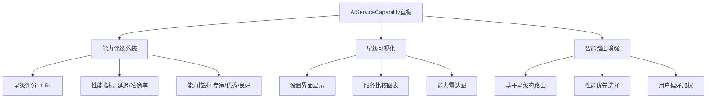

#### 2. 服务能力星级对比图表

```mermaid
gantt
    title AI服务能力星级对比
    dateFormat X
    axisFormat %d⭐
    
    section 基础对话能力
    DeepSeek : 0, 5
    ChatGLM本地 : 0, 4
    TinyBERT本地 : 0, 3
    腾讯云 : 0, 5
    
    section 答案判断能力
    DeepSeek : 0, 4
    ChatGLM本地 : 0, 3
    TinyBERT本地 : 0, 5
    腾讯云 : 0, 4
    
    section 教育场景能力
    DeepSeek : 0, 5
    ChatGLM本地 : 0, 5
    TinyBERT本地 : 0, 2
    腾讯云 : 0, 4
    
    section 代码生成能力
    DeepSeek : 0, 5
    ChatGLM本地 : 0, 3
    TinyBERT本地 : 0, 1
    腾讯云 : 0, 4
```

#### 3. 能力对比表格

| 能力维度 | DeepSeek | ChatGLM本地 | TinyBERT本地 | 腾讯云 |
|---------|---------|------------|-------------|-------|
| **基础对话** | ⭐⭐⭐⭐⭐ | ⭐⭐⭐⭐ | ⭐⭐⭐ | ⭐⭐⭐⭐⭐ |
| **答案判断** | ⭐⭐⭐⭐ | ⭐⭐⭐ | ⭐⭐⭐⭐⭐ | ⭐⭐⭐⭐ |
| **教育场景** | ⭐⭐⭐⭐⭐ | ⭐⭐⭐⭐⭐ | ⭐⭐ | ⭐⭐⭐⭐ |
| **代码生成** | ⭐⭐⭐⭐⭐ | ⭐⭐⭐ | ⭐ | ⭐⭐⭐⭐ |
| **响应速度** | ⭐⭐⭐⭐ | ⭐⭐ | ⭐⭐⭐⭐⭐ | ⭐⭐⭐⭐ |
| **准确率** | ⭐⭐⭐⭐⭐ | ⭐⭐⭐⭐ | ⭐⭐⭐⭐⭐ | ⭐⭐⭐⭐ |

#### 4. 智能路由决策流程

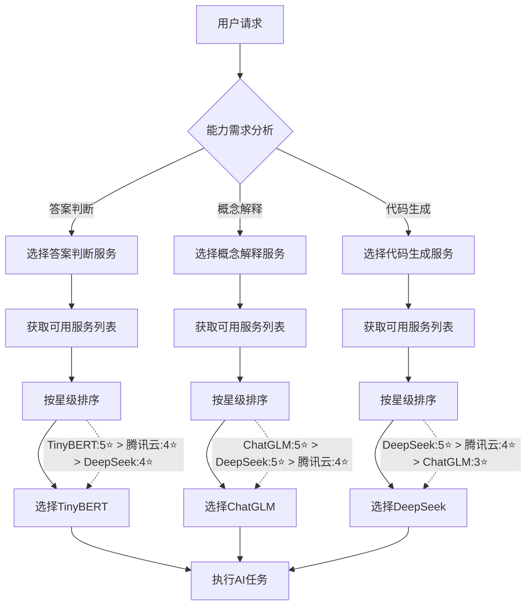

#### 2. 智能路由系统增强

**设计目标**：基于星级评分进行更智能的路由决策，考虑性能、延迟、准确率等多维度因素。

```kotlin
// 增强的智能路由算法
class AIRouterService {
    
    // 基于星级评分的路由决策
    suspend fun selectBestService(
        requiredAbility: AIAbility,
        userPreferences: UserServicePreferences
    ): String? {
        val availableServices = userPreferences.getAvailableServices(requiredAbility)
            .map { serviceId ->
                val service = aiServiceRegistry.getService(serviceId)
                val rating = service.getCapability().getRating(requiredAbility)
                ServiceCandidate(serviceId, service, rating)
            }
            .filter { it.rating != null }
            .sortedByDescending { candidate ->
                // 综合评分算法：星级 + 性能 + 用户偏好
                calculateServiceScore(candidate, userPreferences)
            }
        
        return availableServices.firstOrNull()?.serviceId
    }
    
    private fun calculateServiceScore(
        candidate: ServiceCandidate,
        preferences: UserServicePreferences
    ): Float {
        val rating = candidate.rating!!
        
        // 基础评分：星级权重最高
        var score = rating.stars * 0.3f
        
        // 性能评分
        score += rating.performanceScore * 0.25f
        
        // 准确率评分
        score += rating.accuracyScore * 0.2f
        
        // 延迟惩罚（延迟越低越好）
        score -= (rating.latencyMs / 5000f) * 0.15f
        
        // 用户偏好加成
        if (preferences.isFavoriteService(candidate.serviceId)) {
            score += 0.1f
        }
        
        return score.coerceIn(0f, 5f)
    }
    
    // 候选服务数据类
    data class ServiceCandidate(
        val serviceId: String,
        val service: AIService,
        val rating: AbilityRating?
    )
}
```

#### 3. 设置界面UI设计

```xml
<!-- 设置界面布局示例 -->
<androidx.recyclerview.widget.RecyclerView
    android:id="@+id/aiServiceList"
    android:layout_width="match_parent"
    android:layout_height="match_parent"
    app:layoutManager="androidx.recyclerview.widget.LinearLayoutManager" />

<!-- 单个服务项布局 -->
<LinearLayout
    android:layout_width="match_parent"
    android:layout_height="wrap_content"
    android:orientation="vertical"
    android:padding="16dp">
    
    <!-- 服务启用开关 -->
    <Switch
        android:id="@+id/serviceEnableSwitch"
        android:layout_width="match_parent"
        android:layout_height="wrap_content"
        android:text="服务名称" />
    
    <!-- 能力星级显示 -->
    <LinearLayout
        android:layout_width="match_parent"
        android:layout_height="wrap_content"
        android:orientation="vertical"
        android:layout_marginTop="8dp">
        
        <!-- 答案判断能力 -->
        <LinearLayout
            android:layout_width="match_parent"
            android:layout_height="wrap_content"
            android:orientation="horizontal">
            
            <TextView
                android:layout_width="0dp"
                android:layout_height="wrap_content"
                android:layout_weight="1"
                android:text="答案判断" />
            
            <RatingBar
                android:layout_width="wrap_content"
                android:layout_height="wrap_content"
                android:numStars="5"
                android:rating="4"
                android:isIndicator="true" />
            
            <TextView
                android:layout_width="wrap_content"
                android:layout_height="wrap_content"
                android:text="优秀" />
        </LinearLayout>
        
        <!-- 更多能力显示... -->
    </LinearLayout>
</LinearLayout>
```

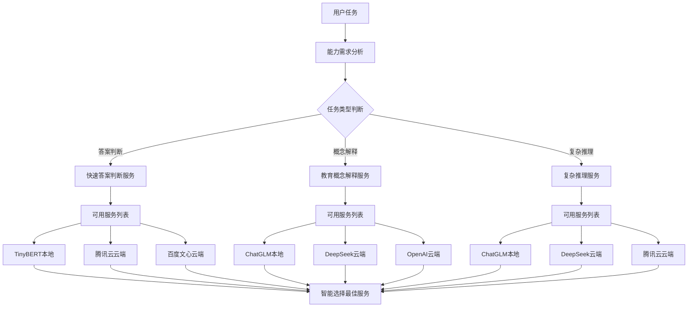

**关键原则**：
- ✅ **能力优先**：路由决策基于任务能力需求，而非部署位置
- ✅ **统一接口**：所有本地和云端服务实现相同的AIService接口
- ✅ **智能选择**：根据性能、成本、可用性选择最佳服务
- ✅ **用户透明**：用户无需关心服务部署位置，只关注功能体验

### 基于现有统一AI服务架构的扩展

#### 现有架构基础（已存在）
```
UI Layer (Fragment/Activity)
    ↓
ViewModel Layer (ChatViewModel, SettingsViewModel)
    ↓
Repository Layer (MessageRepository, MindMapRepository)
    ↓
AI Service Layer (AIRouterService + AIServiceRegistry)
    ↓
AIService Layer (AIService x10+) - 统一接口
    ├── DeepSeekAIServiceAdapter
    ├── TencentCloudAIServiceImpl  
    ├── BaiduErnieAIServiceAdapter
    ├── AlibabaQWenAIServiceAdapter
    ├── OpenAIServiceAdapter
    └── 其他云端服务...
```

#### 新增本地模型作为独立AI服务
```
AIService Layer (扩展)
├── 现有云端服务...
├── TinyBERTLocalService (新增) - 本地轻量模型服务
│   └── TinyBERT-Chinese (INT8量化版) - 答案判断、简单问答
└── ChatGLM6BLocalService (新增) - 本地重量模型服务
    └── ChatGLM-6B (INT4量化版) - 复杂推理、详细解释
```

### 技术选型确认：基于能力维度的服务划分

#### 设计理念：能力导向而非部署位置

**核心原则**：本地模型和云端模型都是平等的`AIService`实现，路由系统根据任务能力需求选择最佳服务，用户无需关心模型部署位置。

#### 能力导向的AI服务设计

**服务分类依据**：按照能力维度而非模型类型进行划分，所有服务都实现统一的`AIService`接口。

**1. 教育概念解释服务**
- **实现方案**：ChatGLM-6B (INT4量化版) + 云端服务备选
- **体积**：约2.8GB（本地版本）
- **推理框架**：MNN (字节开源，对安卓ARM架构优化极佳)
- **格式**：.mnn格式
- **能力范围**：
  - ✅ **概念解释**：各学科基础概念、定义说明
  - ✅ **基础问答**：简单问题解答和知识梳理
  - ✅ **中等推理**：中等难度题目的分析指导
  - ⚠️ **复杂推理**：复杂证明和长篇分析能力有限

**2. 快速答案判断服务**
- **实现方案**：TinyBERT-Chinese (INT8量化版) + 云端服务备选
- **体积**：约100MB（本地版本）
- **推理耗时**：<200ms/次
- **能力范围**：
  - ✅ **相似度计算**：答案相似度判断和评分
  - ✅ **快速响应**：实时交互和即时反馈
  - ✅ **轻量化**：低内存占用，快速启动

#### 能力导向的适用性分析
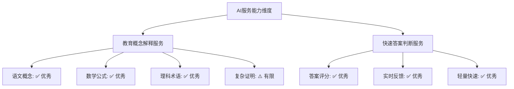

**能力划分总结：**
- ✅ **教育概念解释服务**：适合概念解释、基础问答、知识梳理（2.8GB）
- ✅ **快速答案判断服务**：适合答案评分、实时反馈、快速响应（100MB）
- 🔄 **独立可配置**：用户可独立启用/禁用每个服务，按需下载和删除
- 🔄 **智能路由**：根据任务类型自动选择最适合的服务

### 技术决策详细分析

#### 1. 模型层复用策略：TinyBERT-Chinese（INT8量化版）

**技术选型理由：**
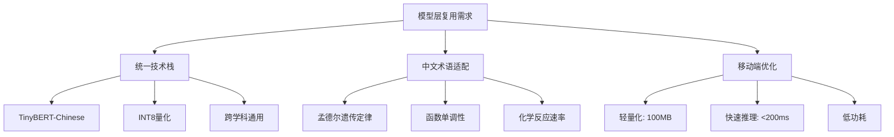

**优势分析：**
- ✅ **统一性**：所有学科使用同一模型，减少维护成本
- ✅ **中文优化**：专门针对中文教育术语优化
- ✅ **轻量化**：INT8量化后体积小，适合移动端部署
- ✅ **性能稳定**：推理速度快，满足实时交互需求
- ✅ **扩展性**：支持余弦相似度等多种文本匹配算法

#### 2. 框架层复用策略：TensorFlow Lite + 纯推理引擎

**技术选型理由：**
```kotlin
// 遵循MVVM的纯推理引擎设计
class EmbeddedAIEngine {
    // 推理框架：TensorFlow Lite为主，MNN为辅
    private val inferenceFramework = when {
        isTensorFlowLiteAvailable() -> TensorFlowLiteEngine()
        else -> MNNEngine() // 备选方案
    }
    
    // ✅ 纯粹的AI推理功能，不直接访问数据库
    // ❌ 移除：private val knowledgeGraphDao: KnowledgeGraphDao
    // ❌ 移除：private val answerHistoryDao: AnswerHistoryDao
    
    // 双模型协作策略
    suspend fun processWithChatGLM(input: String): String {
        return chatGLMEngine.inference(input)
    }
    
    suspend fun processWithTinyBERT(input: String): SimilarityResult {
        return tinyBERTEngine.calculateSimilarity(input)
    }
}

// Repository层负责数据整合，只与AIService交互
class AIRepository {
    suspend fun processQuestion(question: String): AIResponse {
        // 1. 通过Repository获取相关知识
        val knowledge = knowledgeGraphRepository.getRelatedKnowledge(question)
        
        // 2. 构建增强的prompt
        val enhancedPrompt = buildEnhancedPrompt(question, knowledge)
        
        // 3. 调用AIService（Repository不知道EmbeddedAIEngine的存在）
        return aiService.processMessage(enhancedPrompt)
    }
}

// EmbeddedAIEngine对Repository层不可见，只在AIService内部使用
// 通过现有AIServiceRegistry进行服务注册和管理
```

**TensorFlow Lite的优势：**
- ✅ **生态系统完善**：Google官方支持，社区活跃
- ✅ **模型兼容性好**：支持多种模型格式转换
- ✅ **硬件加速**：对Android设备优化更好
- ✅ **部署简单**：模型转换和部署流程成熟

**Room数据库的优势：**
- ✅ **Android原生**：与Android系统深度集成
- ✅ **类型安全**：编译时类型检查
- ✅ **开发效率**：代码简洁，维护方便
- ✅ **性能优化**：SQLite底层，查询效率高

#### 3. 能力导向的服务架构

**服务能力路由策略：**
```kotlin
// 智能路由策略：基于任务类型和性能优化
fun selectAIService(question: String, requiredAbility: AIAbility): String {
    return when (requiredAbility) {
        // 答案判断类任务 - 优先使用专门优化的快速服务
        AIAbility.ANSWER_EVALUATION -> {
            // 如果有TinyBERT服务且可用，优先使用（专门优化）
            if (isServiceAvailable("tinybert_local") && isServiceEnabled("tinybert_local")) {
                "tinybert_local"
            } else {
                // 降级到ChatGLM或其他服务
                selectFallbackService(AIAbility.ANSWER_EVALUATION)
            }
        }
        
        // 概念解释类任务 - 使用ChatGLM（更擅长详细解释）
        AIAbility.BASIC_CHAT,
        AIAbility.EDUCATION,
        AIAbility.SOCRATIC_QUESTIONING -> {
            if (isServiceAvailable("chatglm_local") && isServiceEnabled("chatglm_local")) {
                "chatglm_local"
            } else {
                selectFallbackService(requiredAbility)
            }
        }
        
        // 其他能力 - 根据性能统计智能选择
        else -> {
            val services = aiRouterService.getAvailableServices(requiredAbility)
            services.maxByOrNull { it.getPerformanceScore() }?.id ?: "default_service"
        }
    }
}

// 性能优先的路由决策
private fun shouldUseTinyBERT(question: String, requiredAbility: AIAbility): Boolean {
    return when {
        // 答案判断任务 - 优先TinyBERT（专门优化）
        requiredAbility == AIAbility.ANSWER_EVALUATION -> true
        
        // 需要快速响应的任务
        requiresFastResponse(question) -> true
        
        // 简单问答任务
        isSimpleQuestion(question) -> true
        
        // 其他情况使用ChatGLM
        else -> false
    }
}

// 基于任务类型的能力映射
val taskToAbilityMapping = mapOf(
    "概念解释" to AIAbility.EDUCATION,
    "基础问答" to AIAbility.BASIC_CHAT,
    "答案评分" to AIAbility.ANSWER_EVALUATION,
    "启发式提问" to AIAbility.SOCRATIC_QUESTIONING,
    "学习分析" to AIAbility.LEARNING_ANALYSIS
)
```

#### 4. 性能与资源平衡

**资源分配策略：**
```mermaid
gantt
    title 模型资源分配策略
    dateFormat HH:mm
    section 内存使用
    TinyBERT加载    :active, mem1, 00:00, 10s
    ChatGLM加载     :mem2, after mem1, 30s
    section 推理任务
    简单问题处理    :active, task1, 00:10, 5s
    复杂问题处理    :task2, after task1, 15s
    section 资源释放
    模型缓存管理    :cache, 00:20, 40s
```

**技术决策总结：**
- **能力导向设计**：路由决策基于任务能力需求，而非部署位置（本地/云端）
- **统一接口原则**：所有本地和云端服务实现相同的AIService接口
- **服务化架构**：基于现有AIService接口统一管理，无缝集成
- **智能路由**：根据任务类型、性能、成本自动选择最佳服务
- **用户透明性**：用户无需关心服务部署位置，只关注功能体验
- **移动端优化**：选择对Android设备友好的技术方案
- **中文教育场景适配**：针对中文教育术语和场景优化

**核心设计理念**：
> "我们设计的是能力导向的AI服务系统，而不是本地vs云端的技术选择。所有AI服务都是平等的，路由系统根据任务需求智能选择最佳服务，确保用户获得最优体验。"

### 3. MVVM架构设计原则

**核心设计理念：保持清晰的层级分离和职责单一**

#### Repository层的标准职责
```kotlin
class AIRepository(
    // ✅ 数据源：DAO（本地数据库）
    private val knowledgeGraphDao: KnowledgeGraphDao,
    private val answerHistoryDao: AnswerHistoryDao,
    
    // ✅ 服务层：AIService（AI能力）
    private val aiService: AIService
) {
    // Repository只与DAO和AIService交互，保持MVVM架构
    // ❌ 不直接与EmbeddedAIEngine交互
    
    suspend fun processQuestion(question: String): AIResponse {
        // 1. 从DAO获取本地数据
        val localKnowledge = knowledgeGraphDao.getRelatedKnowledge(question)
        
        // 2. 数据整合和业务逻辑
        val enhancedPrompt = buildEnhancedPrompt(question, localKnowledge)
        
        // 3. 调用AIService（不关心具体实现）
        val aiResponse = aiService.processMessage(enhancedPrompt)
        
        // 4. 保存结果到DAO
        answerHistoryDao.saveAnswer(question, aiResponse)
        
        return aiResponse
    }
}
```

#### 完整的MVVM数据流架构
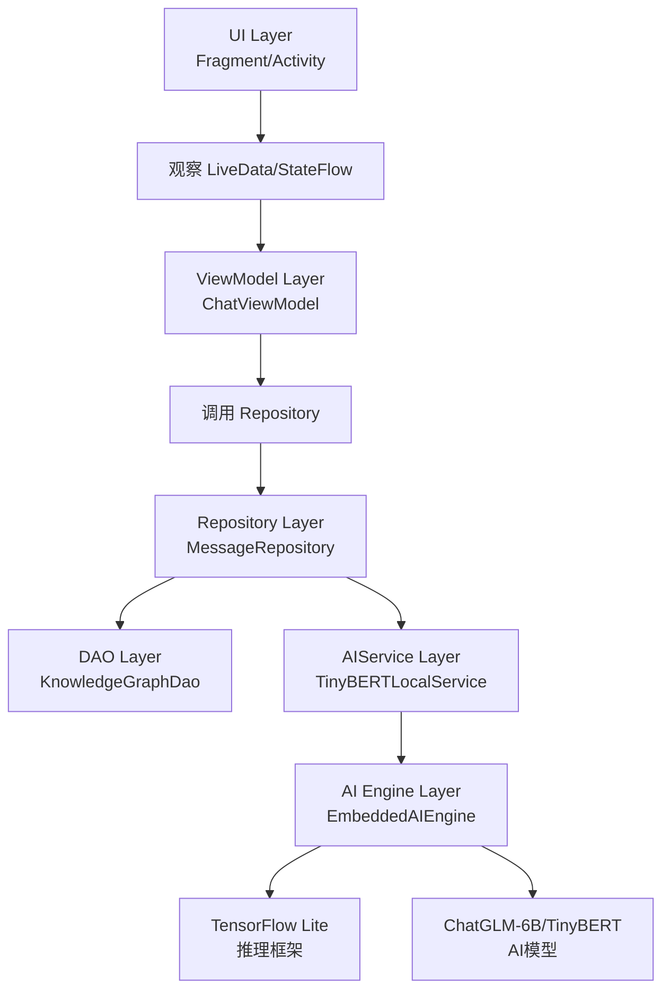

#### 架构优势

**清晰的依赖关系：**
- ✅ **Repository**：只与DAO和AIService交互
- ✅ **AIService**：内部使用EmbeddedAIEngine，对Repository透明
- ✅ **EmbeddedAIEngine**：纯粹的推理引擎，对上层完全隐藏

**测试和维护友好：**
- ✅ **单元测试**：可以单独测试每个组件
- ✅ **模块替换**：更换推理引擎不影响上层架构
- ✅ **单一职责**：每个组件都有明确的职责

**符合Android最佳实践：**
- ✅ 遵循Google推荐的MVVM + Repository模式
- ✅ 数据流清晰：UI → ViewModel → Repository → Service → Engine
- ✅ 生命周期管理：每个组件都有明确的职责和生命周期

#### 服务注册配置
```kotlin
// 使用现有AIServiceRegistry进行服务注册
class AIServiceInitializer {
    fun initializeAIServices(context: Context): AIServiceRegistry {
        val registry = AIServiceRegistry()
        
        // 注册本地AI服务
        registry.registerAiService(createTinyBERTLocalService(context))
        registry.registerAiService(createChatGLM6BLocalService(context))
        
        // 注册云端AI服务
        registry.registerAiService(createDeepSeekAIService())
        registry.registerAiService(createTencentAIService())
        
        return registry
    }
}
```

## ChatGLM-6B对高中全学科的适用性评估

### 高中全学科适配能力分析
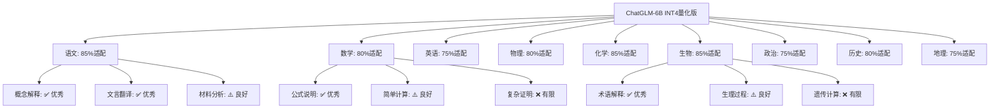

### 各学科能力适配度详细分析

| 学科 | 适配度 | 优势领域 | 局限性 | 智能路由策略 |
|------|--------|----------|--------|--------------|
| **语文** | 85% | 概念解释、文言翻译、名句默写 | 长篇文本分析、复杂写作指导 | 本地优先，云端辅助复杂分析 |
| **数学** | 80% | 公式定理说明、基础计算指导 | 复杂证明、高阶数学推理 | 本地基础题，云端复杂证明 |
| **英语** | 75% | 单词解释、基础语法指导 | 高级写作、口语表达 | 本地+云端协同 |
| **物理** | 80% | 概念解释、公式应用 | 复杂实验分析、高阶理论 | 本地基础，云端高级 |
| **化学** | 85% | 方程式解释、物质性质 | 复杂计算、实验设计 | 本地优秀表现 |
| **生物** | 85% | 概念解释、生理过程 | 遗传计算、复杂图表 | 本地优秀表现 |
| **政治** | 75% | 概念解释、原理说明 | 材料分析、时事评论 | 本地基础，云端分析 |
| **历史** | 80% | 事件解释、时间线梳理 | 深层因果分析 | 本地良好表现 |
| **地理** | 75% | 概念解释、区位分析 | 复杂图表、计算题 | 本地基础，云端辅助 |

### 跨学科统一架构设计
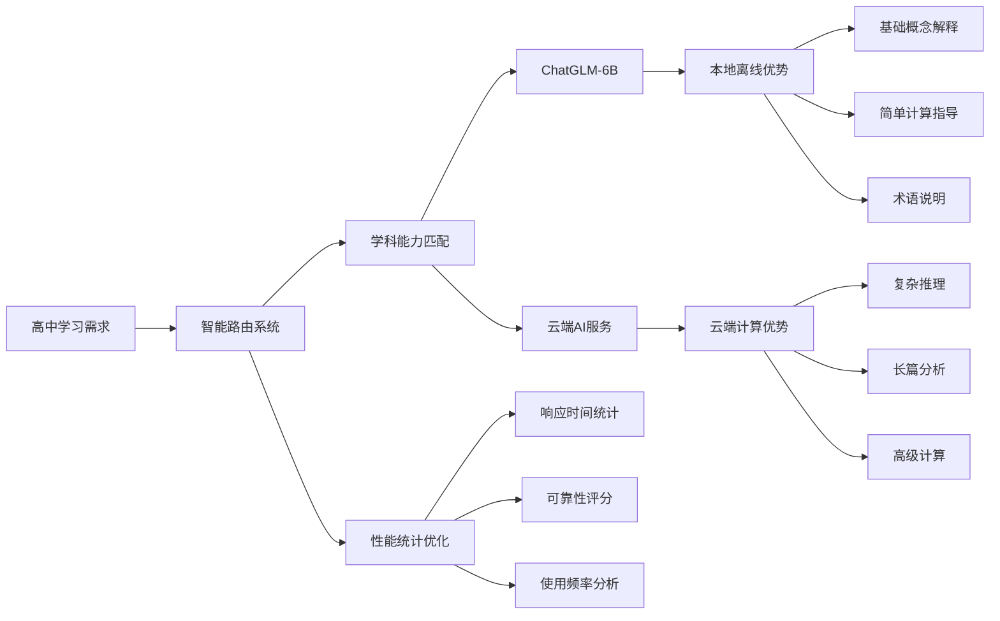

### 基于主题和用户配置的智能路由策略
#### 统一主题架构设计（基于TopicEntity重构）

```kotlin
// 重构后的TopicEntity - 支持层级和智能路由
@Entity(tableName = "topics")
data class TopicEntity(
    @PrimaryKey
    val id: String = UUID.randomUUID().toString(),
    
    // 基本信息
    val title: String,                          // 显示名称
    val description: String,                    // 描述
    
    // 新增层级信息
    val path: List<String>,                     // 层级路径 ["教育", "高中", "数学"]
    val parentId: String? = null,               // 父主题ID（可选）
    
    // 新增路由配置
    val capabilities: Set<AIAbility>,         // 关联能力集合
    val servicePreferences: Map<String, Double> = emptyMap(), // 服务偏好
    
    // 原有字段保持不变
    val masteryLevel: Int = 0,
    val createdAt: Long = System.currentTimeMillis(),
    val lastAccessed: Long = System.currentTimeMillis(),
    val nextLearningGoal: String? = null,
    val isPreset: Boolean = false,
    val presetTopicId: String? = null
)

// 主题图管理器（基于重构后的TopicEntity）
class TopicGraphManager(private val topicRepository: TopicRepository) {
    
    // 构建内存中的主题图
    fun buildTopicGraph(): Map<String, TopicEntity> {
        val allTopics = topicRepository.getAllTopics()
        return allTopics.associateBy { it.id }
    }
    
    // 智能路由算法
    fun findBestService(topicPath: List<String>): AIService {
        // 1. 精确匹配：查找完全匹配的主题
        val exactTopic = findExactTopic(topicPath)
        if (exactTopic != null) {
            return routeByTopicPreferences(exactTopic)
        }
        
        // 2. 模糊匹配：查找最相关的父主题
        val bestParent = findBestParentTopic(topicPath)
        return routeByTopicPreferences(bestParent)
    }
    
    // 能力继承机制
    private fun getEffectiveCapabilities(topic: TopicEntity): Set<AIAbility> {
        val inherited = if (topic.path.size > 1) {
            // 从父主题继承能力
            val parentPath = topic.path.dropLast(1)
            findExactTopic(parentPath)?.capabilities ?: emptySet()
        } else emptySet()
        
        // 合并继承能力和自定义能力
        return inherited + topic.capabilities
    }
}
```

#### 预设主题配置示例

```kotlin
// 预设主题初始化
val educationTopic = TopicEntity(
    title = "教育",
    description = "教育领域主题",
    path = listOf("教育"),
    capabilities = setOf(AIAbility.LEARNING_ANALYSIS, AIAbility.SOCRATIC_QUESTIONING),
    isPreset = true
)

val mathTopic = TopicEntity(
    title = "数学", 
    description = "数学学科主题",
    path = listOf("教育", "数学"),
    capabilities = setOf(AIAbility.MATH),
    isPreset = true
)

val chineseTopic = TopicEntity(
    title = "语文",
    description = "语文学科主题",
    path = listOf("教育", "语文"),
    capabilities = setOf(AIAbility.LONG_TEXT, AIAbility.CREATIVE_WRITING),
    isPreset = true
)
```

#### 用户自建主题示例

```kotlin
// 用户创建具体主题（自动继承父主题能力）
val quadraticTopic = TopicEntity(
    title = "二次函数",
    description = "二次函数专题学习",
    path = listOf("教育", "数学", "代数", "二次函数"),
    capabilities = setOf(AIAbility.ANSWER_EVALUATION), // 只添加特殊能力
    isPreset = false
)
// 自动获得：数学能力 + 教育能力 + 答案评估能力
```

#### 4. 用户配置管理

**设计目标**：提供完整的用户控制能力，包括服务启用/禁用、模型下载/删除管理。

```kotlin
// 用户服务偏好配置
class UserServicePreferences {
    
    // 服务启用状态（独立控制）
    val enabledServices = mutableSetOf<String>()
    
    // 服务优先级配置
    val servicePriority = mutableListOf<String>()
    
    // 模型下载策略
    val modelDownloadStrategy = ModelDownloadStrategy.AUTO
    
    // 存储空间管理策略
    val storageManagementStrategy = StorageManagementStrategy.CONSERVATIVE
    
    // 服务启用管理
    suspend fun enableService(serviceId: String) {
        if (!isServiceDownloaded(serviceId)) {
            when (modelDownloadStrategy) {
                ModelDownloadStrategy.AUTO -> {
                    // 自动下载模型
                    downloadServiceModel(serviceId)
                }
                ModelDownloadStrategy.MANUAL -> {
                    // 提示用户手动下载
                    showDownloadPrompt(serviceId)
                }
                ModelDownloadStrategy.WIFI_ONLY -> {
                    // 仅在WiFi下下载
                    if (isWifiConnected()) {
                        downloadServiceModel(serviceId)
                    } else {
                        showWifiRequiredPrompt(serviceId)
                    }
                }
            }
        }
        enabledServices.add(serviceId)
        savePreferences()
    }
    
    // 服务禁用管理
    suspend fun disableService(serviceId: String) {
        enabledServices.remove(serviceId)
        
        // 根据存储管理策略决定是否删除模型
        when (storageManagementStrategy) {
            StorageManagementStrategy.CONSERVATIVE -> {
                // 保守策略：不删除模型，保留以备重新启用
            }
            StorageManagementStrategy.AGGRESSIVE -> {
                // 激进策略：立即删除模型释放空间
                deleteServiceModel(serviceId)
            }
            StorageManagementStrategy.SMART -> {
                // 智能策略：根据存储空间状况决定
                if (isStorageLow()) {
                    deleteServiceModel(serviceId)
                }
            }
        }
        savePreferences()
    }
    
    // 获取可用的服务列表（基于启用状态）
    fun getAvailableServices(requiredAbility: AIAbility): List<String> {
        return servicePriority.filter { serviceId ->
            enabledServices.contains(serviceId) && 
            aiServiceRegistry.hasAbility(serviceId, requiredAbility)
        }
    }
    
    // 保存用户偏好到SharedPreferences
    private fun savePreferences() {
        val prefs = PreferenceManager.getDefaultSharedPreferences(context)
        prefs.edit()
            .putStringSet("enabled_services", enabledServices)
            .putString("service_priority", servicePriority.joinToString(","))
            .apply()
    }
}

// 模型下载策略枚举
enum class ModelDownloadStrategy {
    AUTO,       // 自动下载
    MANUAL,     // 手动下载
    WIFI_ONLY   // 仅WiFi下载
}

// 存储管理策略枚举
enum class StorageManagementStrategy {
    CONSERVATIVE, // 保守：保留模型
    AGGRESSIVE,   // 激进：立即删除
    SMART         // 智能：根据空间决定
}
```

#### 5. 设置界面交互流程

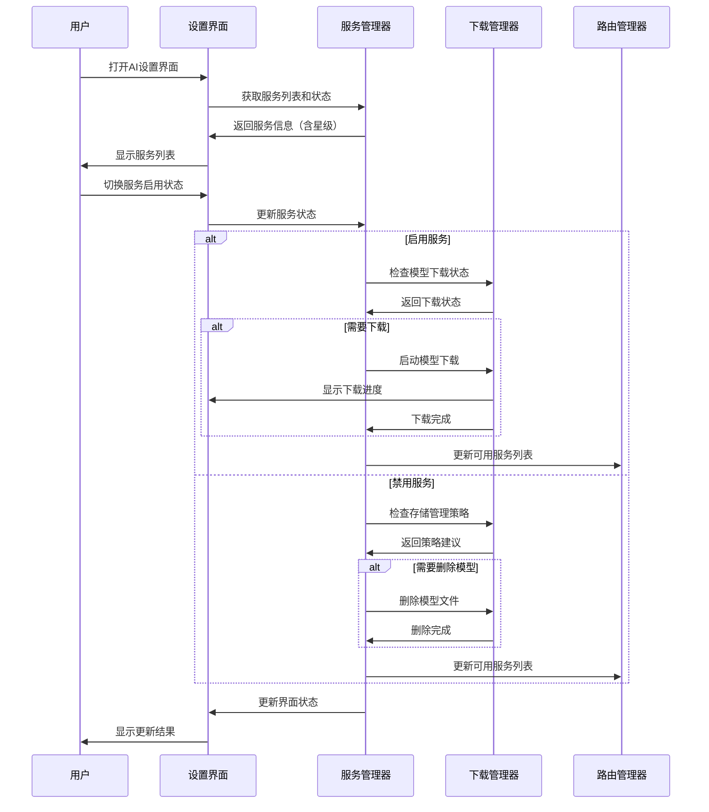

#### 6. 用户体验优化

**服务状态可视化**：
- ✅ **已启用**：绿色开关，显示能力星级
- ⚠️ **未配置**：灰色开关，提示配置API密钥
- 📱 **需下载**：黄色开关，显示下载按钮
- ❌ **已禁用**：红色开关，显示存储空间节省

**智能提示系统**：
- **存储空间不足**：建议禁用大模型服务
- **网络环境差**：推荐启用本地服务
- **能力需求不匹配**：根据用户使用习惯推荐服务
- **成本优化建议**：根据使用量推荐性价比高的服务
```

**高中全学科评估总结：**
- ✅ **ChatGLM-6B整体适配度良好**（75-85%），特别适合概念解释类任务
- ✅ **化学、生物、语文等学科表现优秀**，可作为主要服务选项
- ⚠️ **数学复杂证明、英语高级写作等需要云端辅助**
- 🔄 **智能路由系统根据学科特点和性能数据动态优化服务选择**

### 基于现有AI能力架构的扩展

#### 使用现有AIAbility枚举（已存在）
```kotlin
// 现有AIAbility枚举定义（已存在）
enum class AIAbility {
    BASIC_CHAT,
    FILE_PROCESSING,
    MIND_MAP_GENERATION,
    LEARNING_ANALYSIS,
    SOCRATIC_QUESTIONING,
    ANSWER_EVALUATION,
    DOCUMENT_PARSING,
    CONCEPT_EXTRACTION,
    KNOWLEDGE_GRAPH,
    LONG_TEXT,
    MULTIMODAL,
    EDUCATION,
    CODE_GENERATION,
    MATH,
    CREATIVE_WRITING,
    IMAGE_ANALYSIS,
    IMAGE_GENERATION,
    AUDIO_PROCESSING,
    VIDEO_ANALYSIS,
    
    // RAG能力
    RAG_DOCUMENT_PARSING,
    RAG_TEXT_SPLITTING,
    RAG_EMBEDDING,
    RAG_MULTI_TURN_REWRITING,
    RAG_RE_RANKING,
    RAG_RETRIEVAL,
    RAG_GENERATION
}
```

#### ChatGLM服务配置示例（基于现有AIServiceConfig）
```kotlin
// 基于现有AIServiceConfig扩展，使用Builder模式进行初始化
class ChatGLMAIServiceConfig private constructor(
    override val id: String,
    override val name: String,
    override val displayName: String,
    override val description: String,
    val modelFilePath: String, // 模型文件路径
    val requiresDownload: Boolean, // 是否需要下载模型
    val downloadSize: Long, // 下载大小
    override val requiredFields: AIServiceRequiredFields,
    override val capabilities: AIServiceCapability
) : AIServiceConfig() {
    
    class Builder {
        private var id: String = "chatglm"
        private var name: String = "ChatGLM"
        private var displayName: String = "ChatGLM本地模型"
        private var description: String = "本地ChatGLM-6B模型，离线可用"
        private var modelFilePath: String = "models/chatglm-6b-int4.mnn"
        private var requiresDownload: Boolean = true
        private var downloadSize: Long = 2_800_000_000 // 2.8GB
        private var requiredFields: AIServiceRequiredFields = AIServiceRequiredFields.NO_REQUIRED_FIELDS
        
        fun id(id: String) = apply { this.id = id }
        fun name(name: String) = apply { this.name = name }
        fun displayName(displayName: String) = apply { this.displayName = displayName }
        fun description(description: String) = apply { this.description = description }
        fun modelFilePath(path: String) = apply { this.modelFilePath = path }
        fun requiresDownload(required: Boolean) = apply { this.requiresDownload = required }
        fun downloadSize(size: Long) = apply { this.downloadSize = size }
        fun requiredFields(fields: AIServiceRequiredFields) = apply { this.requiredFields = fields }
        
        fun build(): ChatGLMAIServiceConfig {
            return ChatGLMAIServiceConfig(
                id = id,
                name = name,
                displayName = displayName,
                description = description,
                modelFilePath = modelFilePath,
                requiresDownload = requiresDownload,
                downloadSize = downloadSize,
                requiredFields = requiredFields,
                capabilities = AIServiceCapability.BASIC_CHAT
                    .supportEducation(true)
                    .supportAnswerEvaluation(true)
                    .supportLongText(false) // 本地模型不支持超长文本
            )
        }
    }
}
```

## 预置资源管理系统设计

### GitHub资源仓库结构
```
teach-it-back-resources/
├── models/                    # 预训练模型
│   ├── chatglm-6b-int4.mnn   # ChatGLM-6B量化模型
│   ├── tinybert-int8.mnn     # TinyBERT量化模型
│   └── vocab/                # 分词器词典
├── knowledge/                # 知识库
│   ├── tcm/                  # 中医知识
│   │   ├── tangtou-gejue/    # 汤头歌诀
│   │   │   ├── mindmaps/     # 思维导图
│   │   │   ├── questions/    # 试题库
│   │   │   └── knowledge-graph.json # 知识图谱
│   ├── biology/              # 生物知识
│   ├── physics/              # 物理知识
├── templates/                # 模板文件
│   ├── mindmap-template.json
│   ├── question-template.json
└── metadata/                 # 元数据
    ├── version-info.json
    ├── model-catalog.json    # 模型目录
```

### 资源管理器实现
```kotlin
class ResourceManager(private val context: Context) {
    private val githubRepo = "https://github.com/teach-it-back/resources"
    
    // 按需下载策略
    suspend fun downloadTopicResources(topic: String): Boolean {
        return try {
            val resources = githubClient.getTopicResources(topic)
            resources.forEach { resource ->
                when (resource.type) {
                    ResourceType.MINDMAP -> saveMindMap(resource)
                    ResourceType.QUESTIONS -> saveQuestions(resource)
                    ResourceType.TEXTBOOK -> saveTextbook(resource)
                }
            }
            true
        } catch (e: Exception) {
            false
        }
    }
    
    // 模型下载管理
    suspend fun downloadModelIfNeeded(modelConfig: EmbeddedModelConfig): DownloadResult {
        return if (isModelDownloaded(modelConfig)) {
            DownloadResult.ALREADY_EXISTS
        } else {
            downloadModelFile(modelConfig)
        }
    }
    
    // 资源缓存管理
    fun getCachedResources(topic: String): List<Resource> {
        return localDatabase.getResourcesByTopic(topic)
    }
}
```

## 智能路由策略优化

### 基于现有AIRouterService扩展（已存在）
```kotlin
// 现有AIRouterService已支持按AIAbility路由（已存在）
class AIRouterService {
    
    // 现有能力到服务优先级映射（扩展ChatGLM支持）
    private val abilityRouting = mapOf(
        // 基础对话功能 - ChatGLM作为离线优先选项
        AIAbility.BASIC_CHAT to listOf("deepseek", "doubao", "baidu", "alibaba", "openai", "chatglm", "zhipu", "minimax", "hunyuan"),
        
        // 教育专用功能 - ChatGLM支持基础功能
        AIAbility.ANSWER_EVALUATION to listOf("tencent", "baidu", "alibaba", "openai", "deepseek", "chatglm", "hunyuan"),
        
        // 文件处理 - ChatGLM不支持长文本
        AIAbility.FILE_PROCESSING to listOf("deepseek", "kimi", "doubao", "baidu", "alibaba", "openai"),
        
        // 其他功能...
        // ... 现有路由配置保持不变
    )
    
    // 智能路由策略：优先考虑离线可用性
    private fun calculateServiceScore(service: AIService, requiredAbility: AIAbility): Double {
        val capabilities = service.config.capabilities
        
        // 基础能力评分（60%权重）
        val abilityScore = if (service.supportsAbility(requiredAbility)) 100.0 else 0.0
        
        // 可用性评分（20%权重）- 离线服务加分
        val availabilityScore = when {
            service.isAvailable -> 100.0
            service is ChatGLMAIService -> 80.0 // 离线服务即使未初始化也有较高可用性
            else -> 0.0
        }
        
        // 成本评分（20%权重）- 离线服务无持续成本
        val costScore = when (service) {
            is ChatGLMAIService -> 100.0 // 无持续费用
            else -> 50.0 // 云端服务有使用成本
        }
        
        return abilityScore * 0.6 + availabilityScore * 0.2 + costScore * 0.2
    }
}
```

### ChatGLM服务能力定义
```kotlin
// ChatGLM服务支持的能力（基于现有AIServiceCapability）
val CHATGLM_CAPABILITIES = AIServiceCapability.BASIC_CHAT
    .supportEducation(true)
    .supportAnswerEvaluation(true)
    .supportSocraticQuestioning(true)
    .supportLearningAnalysis(true)
    .supportLongText(false) // 不支持长文本
    .supportFileProcessing(false) // 不支持文件处理
    .supportMindMapGeneration(false) // 不支持思维导图生成
    .supportMultimodal(false) // 不支持多模态
```

## AI服务统计信息设计

### 统计信息驱动的智能路由
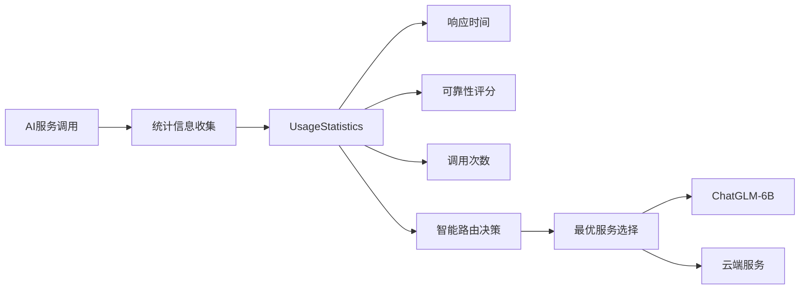

### 扩展路由评分算法（基于性能统计）
```kotlin
// 基于统计信息的智能路由评分算法
private fun calculateServiceScore(service: AIService, requiredAbility: AIAbility): Double {
    val capabilities = service.config.capabilities
    val stats = service.getUsageStatistics()
    
    // 基础能力评分（40%权重）
    val abilityScore = if (service.supportsAbility(requiredAbility)) 100.0 else 0.0
    
    // 可用性评分（20%权重）- 离线服务加分
    val availabilityScore = when {
        service.isAvailable -> 100.0
        service is ChatGLMAIService -> 80.0 // 离线服务即使未初始化也有较高可用性
        else -> 0.0
    }
    
    // 性能评分（20%权重）- 响应时间和可靠性
    val performanceScore = when {
        stats.totalCalls > 10 -> {
            val responseTimeScore = max(0.0, 100.0 - (stats.averageResponseTime / 1000.0))
            val reliabilityScore = stats.reliability * 100.0
            (responseTimeScore * 0.4 + reliabilityScore * 0.6)
        }
        else -> 50.0 // 数据不足时使用默认值
    }
    
    // 成本评分（20%权重）- 离线服务无持续成本
    val costScore = when (service) {
        is ChatGLMAIService -> 100.0 // 无持续费用
        else -> 50.0 // 云端服务有使用成本
    }
    
    return abilityScore * 0.4 + availabilityScore * 0.2 + performanceScore * 0.2 + costScore * 0.2
}
```

**统计信息设计要点：**
- **响应时间**：平均响应时间（毫秒），影响服务选择优先级
- **可靠性评分**：成功率（0.0-1.0），基于成功调用次数/总调用次数
- **智能路由**：基于实时性能数据动态调整服务优先级
- **离线优势**：ChatGLM在无网络时提供基础服务，有网络时与云端服务互补

## 本地AI服务实现架构

### 服务架构概览

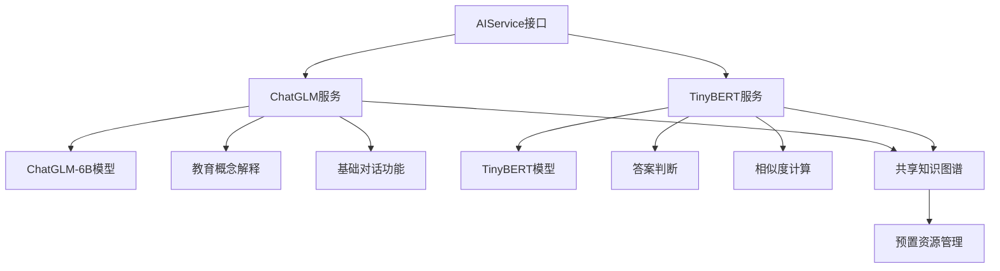

### ChatGLM服务实现概览

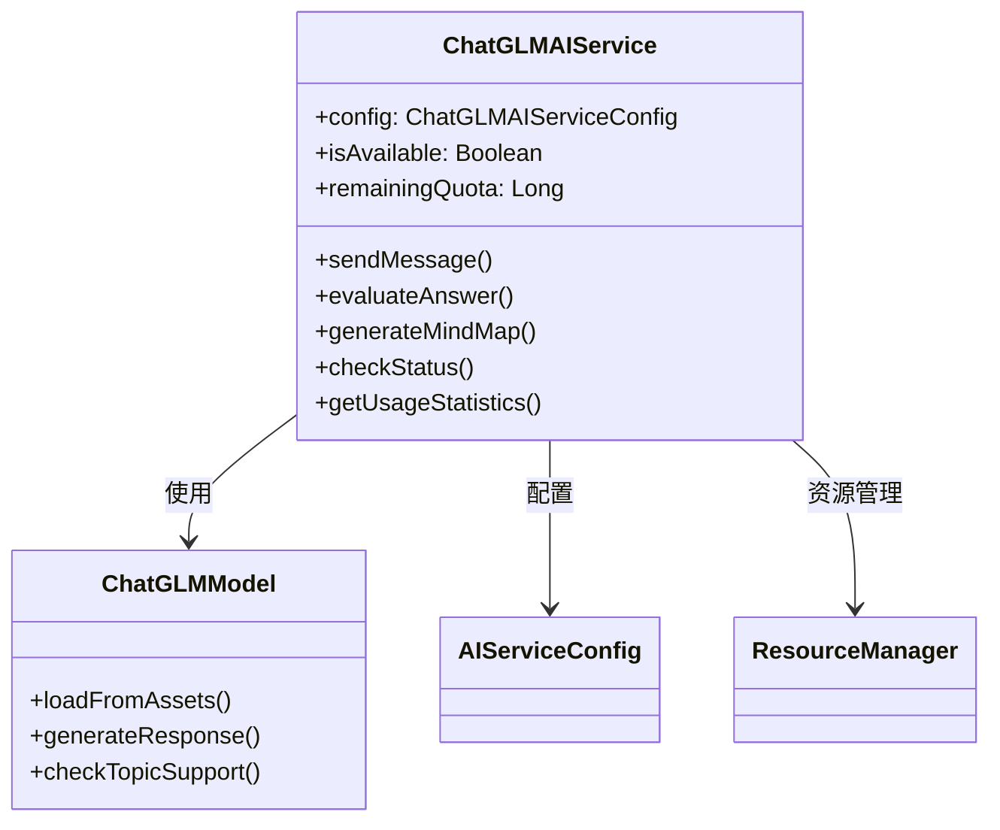

**核心能力**：
- ✅ **教育概念解释**：各学科基础概念和定义说明
- ✅ **基础问答**：简单问题解答和知识梳理  
- ✅ **中等推理**：中等难度题目的分析指导
- ⚠️ **复杂推理**：复杂证明和长篇分析能力有限

### TinyBERT服务实现概览

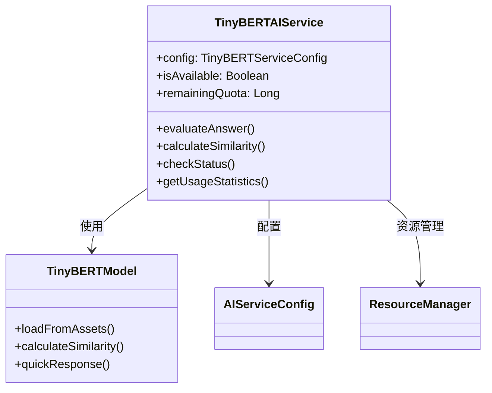

**核心能力**：
- ✅ **答案判断**：快速答案相似度计算和评分
- ✅ **实时响应**：<200ms快速推理，满足实时交互需求
- ✅ **轻量化**：100MB体积，低内存占用
- ⚠️ **复杂推理**：仅支持简单问答和相似度计算

### 服务对比与路由策略

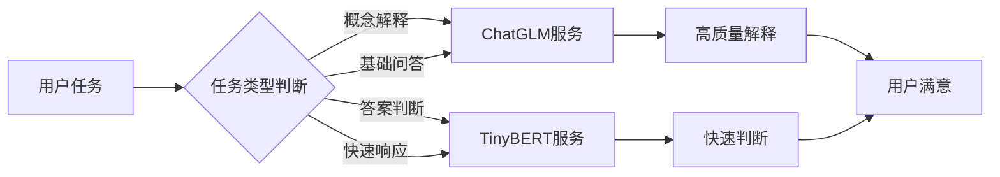

**服务选择策略**：
- **教育概念解释** → ChatGLM优先
- **答案判断评分** → TinyBERT优先  
- **复杂推理任务** → 云端服务备选
- **实时交互需求** → TinyBERT优先

### 服务配置与初始化流程

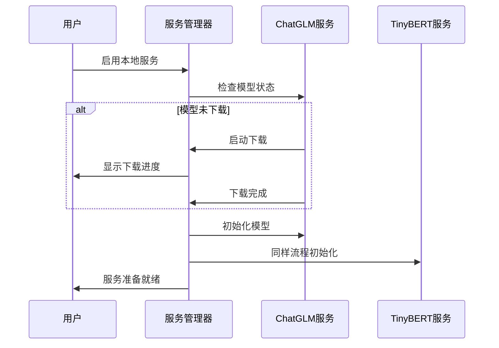

## TinyBERT AI服务实现

### TinyBERT服务架构设计

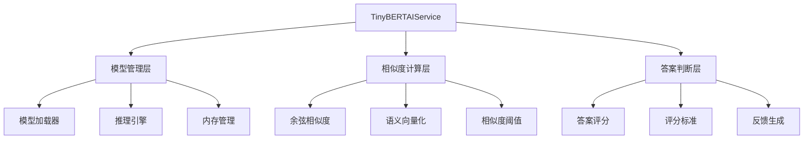

### TinyBERT服务能力配置

```kotlin
// TinyBERT服务配置（精简版）
class TinyBERTServiceConfig private constructor(
    override val id: String = "tinybert_local",
    override val name: String = "TinyBERT",
    override val displayName: String = "TinyBERT本地模型",
    override val description: String = "轻量级本地模型，专门用于答案判断和相似度计算",
    val modelFilePath: String = "models/tinybert-int8.mnn",
    val requiresDownload: Boolean = true,
    val downloadSize: Long = 100_000_000, // 100MB
    override val requiredFields: AIServiceRequiredFields = AIServiceRequiredFields.NO_REQUIRED_FIELDS,
    override val capabilities: AIServiceCapability = TINYBERT_CAPABILITIES
) : AIServiceConfig()

// TinyBERT专属能力配置
val TINYBERT_CAPABILITIES = AIServiceCapability.ANSWER_EVALUATION
    .supportBasicChat(true)
    .supportEducation(false) // 不支持复杂教育概念
    .supportLongText(false)
    .supportFileProcessing(false)
    .supportMindMapGeneration(false)
```

### TinyBERT服务工作流程

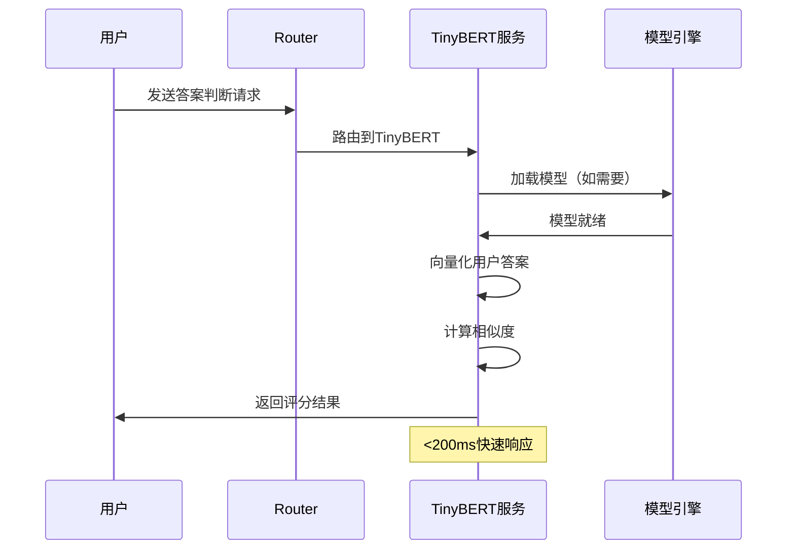

### 核心功能实现

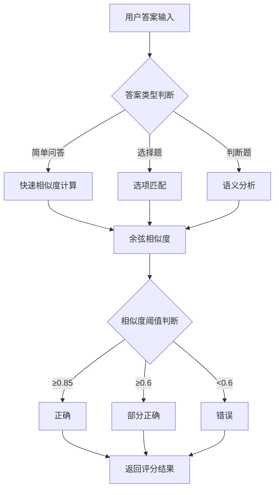

**性能指标**：
- ✅ **推理速度**：<200ms/次
- ✅ **内存占用**：~50MB运行时内存
- ✅ **启动时间**：<3秒模型加载
- ✅ **准确性**：>90%相似度判断准确率

### 服务注册与路由配置

```kotlin
// 在AIServiceRegistry中注册TinyBERT服务
val registry = AIServiceRegistry()
registry.registerAiService(
    TinyBERTAIService.create(context) {
        id("tinybert_local")
        displayName("TinyBERT本地模型")
        modelFilePath("models/tinybert-int8.mnn")
        requiresDownload(true)
        downloadSize(100_000_000)
    }
)

// 路由配置：答案判断类任务优先使用TinyBERT
private val abilityRouting = mapOf(
    AIAbility.ANSWER_EVALUATION to listOf("tinybert_local", "tencent", "baidu"),
    AIAbility.BASIC_CHAT to listOf("deepseek", "doubao", "tinybert_local"),
    // ... 其他路由配置
)
```

### 智能路由决策矩阵

```mermaid
graph LR
    A[用户请求] --> B{任务特征分析}
    
    B -->|需要快速响应| C[TinyBERT优先]
    B -->|简单问答| C
    B -->|答案判断| C
    
    B -->|需要详细解释| D[ChatGLM优先]
    B -->|概念理解| D
    B -->|复杂推理| D
    
    C --> E[<200ms响应]
    D --> F[2-5秒响应]
    
    E --> G[用户满意]
    F --> G
```

**路由决策因素**：
- **响应时间要求**：实时交互 → TinyBERT
- **任务复杂度**：简单问答 → TinyBERT，复杂推理 → ChatGLM
- **网络状况**：离线状态 → 本地服务优先
- **用户偏好**：可配置服务优先级

### 性能优化策略

```mermaid
graph TB
    A[性能优化] --> B[模型量化]
    A --> C[内存管理]
    A --> D[推理优化]
    
    B --> B1[INT8量化]
    B --> B2[模型压缩]
    B --> B3[体积优化]
    
    C --> C1[动态加载]
    C --> C2[及时释放]
    C --> C3[内存监控]
    
    D --> D1[多线程推理]
    D --> D2[缓存机制]
    D --> D3[批量处理]
```

### 错误处理与降级策略

```mermaid
flowchart TD
    A[TinyBERT服务调用] --> B{服务状态检查}
    
    B -->|服务正常| C[执行推理]
    B -->|模型未加载| D[异步加载模型]
    B -->|内存不足| E[清理内存重试]
    B -->|推理失败| F[降级到云端服务]
    
    C --> G[返回结果]
    D --> C
    E --> C
    F --> H[云端服务处理]
    H --> G
```

**降级策略**：
- ✅ **模型加载失败** → 异步重试加载
- ✅ **内存不足** → 清理缓存后重试  
- ✅ **推理超时** → 降级到云端服务
- ✅ **服务不可用** → 显示友好提示

### 使用统计与性能监控

```mermaid
graph LR
    A[使用统计] --> B[调用次数]
    A --> C[响应时间]
    A --> D[成功率]
    A --> E[用户满意度]
    
    B --> F[性能分析]
    C --> F
    D --> F
    E --> F
    
    F --> G[路由优化]
    F --> H[资源分配]
```

**监控指标**：
- **平均响应时间**：目标<200ms
- **调用成功率**：目标>95%
- **内存使用率**：监控峰值使用
- **用户满意度**：基于反馈评分
```

## ChatGLM-6B预置资源准备指南

### 汤头歌诀资源准备

#### 1. 汤头歌诀结构化数据
```json
{
  "tangtou_songs": [
    {
      "id": "tt001",
      "name": "麻黄汤",
      "formula": "麻黄、桂枝、杏仁、甘草",
      "song": "麻黄汤中用桂枝，杏仁甘草四般施，发热恶寒头项痛，喘而无汗服之宜。",
      "indications": ["外感风寒表实证", "发热恶寒", "无汗而喘"],
      "contraindications": ["表虚有汗者", "阴虚发热者", "高血压患者"],
      "keywords": ["风寒表实", "发汗解表", "宣肺平喘"]
    },
    {
      "id": "tt002", 
      "name": "桂枝汤",
      "formula": "桂枝、芍药、甘草、生姜、大枣",
      "song": "桂枝汤治太阳风，芍药甘草姜枣同，解肌发表调营卫，表虚有汗此为功。",
      "indications": ["外感风寒表虚证", "头痛发热", "汗出恶风"],
      "contraindications": ["表实无汗者", "温病发热者"],
      "keywords": ["解肌发表", "调和营卫", "表虚有汗"]
    }
  ]
}
```

#### 2. 汤头歌诀知识图谱
```mermaid
graph TD
    A[汤头歌诀] --> B[解表剂]
    A --> C[清热剂]
    A --> D[补益剂]
    A --> E[理气剂]
    
    B --> B1[辛温解表]
    B --> B2[辛凉解表]
    
    B1 --> F[麻黄汤]
    B1 --> G[桂枝汤]
    B1 --> H[九味羌活汤]
    
    F --> F1[组成: 麻黄,桂枝,杏仁,甘草]
    F --> F2[功效: 发汗解表]
    F --> F3[主治: 风寒表实证]
    
    C --> C1[清气分热]
    C --> C2[清营凉血]
    C --> C3[清热解毒]
    
    C3 --> I[黄连解毒汤]
    C3 --> J[普济消毒饮]
```

### 高中各学科思维导图准备

#### 1. 语文思维导图结构
```mermaid
graph TD
    A[高中语文] --> B[文言文阅读]
    A --> C[现代文阅读]
    A --> D[作文写作]
    A --> E[文学常识]
    A --> F[语言运用]
    
    B --> B1[实词虚词]
    B --> B2[特殊句式]
    B --> B3[文言翻译]
    B --> B4[文化背景]
    
    C --> C1[记叙文]
    C --> C2[说明文]
    C --> C3[议论文]
    C --> C4[散文]
    
    D --> D1[审题立意]
    D --> D2[结构布局]
    D --> D3[素材运用]
    D --> D4[语言表达]
```

#### 2. 数学思维导图结构
```mermaid
graph TD
    A[高中数学] --> B[代数]
    A --> C[几何]
    A --> D[概率统计]
    A --> E[微积分]
    
    B --> B1[函数与方程]
    B --> B2[不等式]
    B --> B3[数列]
    B --> B4[复数]
    
    C --> C1[平面几何]
    C --> C2[立体几何]
    C --> C3[解析几何]
    
    D --> D1[概率基础]
    D --> D2[统计方法]
    D --> D3[随机变量]
```

#### 3. 英语思维导图结构
```mermaid
graph TD
    A[高中英语] --> B[词汇语法]
    A --> C[阅读理解]
    A --> D[写作表达]
    A --> E[听说能力]
    
    B --> B1[高频词汇]
    B --> B2[时态语态]
    B --> B3[从句结构]
    B --> B4[固定搭配]
    
    C --> C1[细节理解]
    C --> C2[推理判断]
    C --> C3[主旨大意]
    C --> C4[词义猜测]
    
    D --> D1[应用文写作]
    D --> D2[议论文写作]
    D --> D3[图表作文]
```

#### 4. 理科综合思维导图
```mermaid
graph TD
    A[理科综合] --> B[物理]
    A --> C[化学]
    A --> D[生物]
    
    B --> B1[力学]
    B --> B2[电磁学]
    B --> B3[热学]
    B --> B4[光学]
    
    C --> C1[无机化学]
    C --> C2[有机化学]
    C --> C3[化学反应原理]
    C --> C4[实验化学]
    
    D --> D1[细胞生物学]
    D --> D2[遗传与进化]
    D --> D3[生物技术]
    D --> D4[生态学]
```

### 知识图谱准备方法

#### 1. 学科知识图谱结构设计
```json
{
  "knowledge_graph": {
    "nodes": [
      {
        "id": "node001",
        "type": "concept",
        "label": "牛顿第二定律",
        "subject": "物理",
        "grade": "高中一年级",
        "difficulty": "中等",
        "description": "物体加速度与作用力成正比，与质量成反比",
        "formula": "F = ma",
        "keywords": ["力", "加速度", "质量", "牛顿定律"]
      }
    ],
    "relationships": [
      {
        "source": "node001",
        "target": "node002", 
        "type": "prerequisite",
        "weight": 0.8
      }
    ]
  }
}
```

#### 2. 知识图谱存储格式
```kotlin
// Room数据库实体
@Entity(tableName = "knowledge_nodes")
data class KnowledgeNode(
    @PrimaryKey val id: String,
    val type: String, // concept, formula, example, etc.
    val label: String,
    val subject: String,
    val grade: String,
    val difficulty: String,
    val description: String,
    val keywords: List<String>
)

@Entity(tableName = "knowledge_relationships")
data class KnowledgeRelationship(
    @PrimaryKey val id: String,
    val sourceId: String,
    val targetId: String,
    val relationshipType: String, // prerequisite, related, opposite, etc.
    val weight: Double
)
```

### 资源准备实施策略

#### 1. 资源分类与优先级
```mermaid
gantt
    title 预置资源准备计划
    dateFormat  YYYY-MM-DD
    section 核心资源
    汤头歌诀数据准备     :done,    des1, 2026-01-25, 7d
    高中理科思维导图     :active,  des2, 2026-01-25, 14d
    高中文科思维导图     :         des3, 2026-02-01, 14d
    section 扩展资源
    知识图谱构建        :         des4, 2026-02-15, 21d
    错题本模板         :         des5, 2026-03-01, 7d
    学习计划模板       :         des6, 2026-03-08, 7d
```

#### 2. 资源质量保证
- **准确性验证**：由学科专家审核内容
- **格式标准化**：统一JSON/YAML格式
- **版本控制**：GitHub仓库管理，支持增量更新
- **性能优化**：压缩存储，按需加载

#### 3. 资源更新机制
- **定期更新**：每学期更新一次
- **用户反馈**：收集用户使用数据优化资源
- **智能推荐**：基于用户学习进度推荐相关资源

## 实施策略

**指导原则**：先完成基础功能，再逐步添加嵌入式AI功能

```mermaid
graph TB
    A[基础功能完善] --> B[Topic管理功能]
    A --> C[设置功能完善]
    A --> D[数据持久化优化]
    
    B --> E[核心交互功能]
    C --> E
    D --> E
    
    E --> F[ChatFragment优化]
    E --> G[MindMap显示完善]
    
    F --> H[基础功能测试]
    G --> H
    
    H --> I[嵌入式AI集成]
```

### 阶段一：基础功能完善（1-2周）
- **Topic管理功能**：创建、编辑、分类功能完善
- **设置功能完善**：用户偏好、AI配置、主题设置界面
- **数据持久化优化**：数据库结构优化和迁移机制

### 阶段二：核心交互功能（1-2周）
- **ChatFragment优化**：消息流、文件上传体验改进
- **MindMap显示完善**：进度同步、交互体验增强
- **基础功能测试**：稳定性优化和性能测试

### 阶段三：嵌入式AI集成（2-3周）
- **基础框架搭建**：MNN框架集成和模型加载器
- **双模型集成**：ChatGLM-6B和TinyBERT集成
- **智能路由**：模型切换和降级策略实现

### 实施优先级矩阵

```mermaid
quadrantChart
    title 功能实施优先级矩阵
    x-axis 低复杂度 → 高复杂度
    y-axis 低价值 → 高价值
    quadrant-1 高价值高复杂度
    quadrant-2 高价值低复杂度
    quadrant-3 低价值低复杂度  
    quadrant-4 低价值高复杂度
    
    "Topic管理功能": [0.2, 0.8]
    "设置功能完善": [0.3, 0.7]
    "数据持久化优化": [0.4, 0.6]
    "ChatFragment优化": [0.6, 0.9]
    "MindMap显示完善": [0.7, 0.8]
    "嵌入式AI集成": [0.9, 0.7]
```

**优先级排序**：
1. ✅ **Topic管理功能** - 核心基础功能，高价值低复杂度
2. ✅ **设置功能完善** - 用户体验关键，高价值低复杂度  
3. ✅ **数据持久化优化** - 系统稳定性基础，中等复杂度
4. ✅ **ChatFragment优化** - 核心交互体验，高价值中等复杂度
5. ✅ **MindMap显示完善** - 特色功能完善，高价值中等复杂度
6. ⏳ **嵌入式AI集成** - 高级功能，高价值高复杂度（最后阶段）

**实施原则**：
- ✅ **风险可控**：先完成稳定功能，再添加复杂特性
- ✅ **用户体验**：基础交互功能先完善
- ✅ **技术可行性**：避免过早引入嵌入式AI的复杂性
- ✅ **迭代开发**：每个阶段都有明确的交付物

### 阶段三：知识图谱集成（2-3周）
- **Room数据库设计**：知识图谱和答题记录存储
- **资源下载器**：GitHub资源按需下载
- **模板生成器**：动态提问功能

### 阶段四：用户体验优化（1-2周）
- **设置界面**：服务优先级配置
- **性能优化**：模型加载和推理优化
- **错误处理**：优雅的降级和提示

## 技术风险评估与缓解

| 风险点 | 影响程度 | 缓解措施 |
|--------|----------|----------|
| 模型体积过大 | 高 | 分模块下载，首次安装时选择性下载 |
| 内存占用过高 | 中 | 动态加载，及时释放，使用弱引用 |
| 推理性能问题 | 中 | 多线程优化，GPU加速（如支持） |
| 资源下载失败 | 中 | 本地缓存，重试机制，离线包备用 |
| 模型兼容性 | 中 | 严格的模型格式验证，备选模型方案 |

## 设计优势总结

1. **架构一致性**：基于现有插件化AI服务架构，无缝集成
2. **混合智能**：本地模型与云端模型协同工作，优势互补
3. **离线优先**：在没有网络的情况下提供基础学习功能
4. **用户体验**：智能降级策略，友好的错误提示
5. **可扩展性**：支持后续添加更多本地模型和预置资源
6. **成本优化**：减少对云端服务的依赖，降低使用成本

## 下一步行动

**当前状态**：ready_for_implementation

**确认点**：
1. ✅ 双模型架构（ChatGLM-6B + TinyBERT）技术选型
2. ✅ 基于现有插件化AI服务架构的扩展方案
3. ✅ 预置资源管理和GitHub仓库组织结构
4. ✅ 智能路由和用户优先级设置方案
5. ✅ 实时输入建议系统设计

确认后我将进入详细实现阶段，创建具体的技术实施方案。

## 🎯 实时输入建议系统设计

### 1. 输入检测与建议架构

**设计目标**：在用户发送消息前进行检测，提供优化建议，帮助AI路由系统更精准地选择服务。

```mermaid
flowchart TD
    A[用户点击发送] --> B[发送前检测]
    
    B --> C{关键词匹配}
    C -->|简单问答关键词| D[建议使用TinyBERT]
    C -->|概念解释关键词| E[建议使用ChatGLM]
    C -->|复杂推理关键词| F[建议使用云端服务]
    C -->|无匹配| G[无建议，直接发送]
    
    D --> H{显示建议对话框}
    E --> H
    F --> H
    
    H -->|接受建议| I[优化后发送]
    H -->|忽略建议| J[原样发送]
    
    I --> K[AI路由系统]
    J --> K
    G --> K
```

**核心设计原则**：
- ✅ **非实时检测**：仅在发送前进行，避免干扰用户输入
- ✅ **轻量化分析**：基于关键词和规则，不依赖复杂AI模型
- ✅ **可选择性**：用户可以自由选择是否采纳建议
- ✅ **低性能开销**：检测过程<100ms，不影响用户体验

### 检测规则与建议类型

```mermaid
graph LR
    A[输入检测] --> B{问题类型识别}
    
    B -->|简单问答| C[TinyBERT建议]
    B -->|概念解释| D[ChatGLM建议]
    B -->|复杂推理| E[云端服务建议]
    
    C --> F["建议：使用简答模式"]
    D --> G["建议：详细说明背景"]
    E --> H["建议：使用云端服务"]
```

**检测规则示例**：
- **简单问答**：包含"是什么"、"为什么"、"怎么"等关键词
- **概念解释**：包含"定义"、"解释"、"概念"等关键词  
- **复杂推理**：包含"证明"、"分析"、"论述"等关键词

### 实现方案（简化的Kotlin代码）

```kotlin
class InputSuggestionService {
    
    // 发送前检测入口
    suspend fun analyzeBeforeSend(message: String): SuggestionResult {
        val analysis = performQuickAnalysis(message)
        return generateSuggestion(analysis)
    }
    
    // 轻量级分析（关键词匹配）
    private fun performQuickAnalysis(message: String): AnalysisResult {
        return when {
            containsSimpleQAPatterns(message) -> AnalysisResult.SIMPLE_QA
            containsConceptExplanationPatterns(message) -> AnalysisResult.CONCEPT_EXPLANATION
            containsComplexReasoningPatterns(message) -> AnalysisResult.COMPLEX_REASONING
            else -> AnalysisResult.GENERAL
        }
    }
    
    // 生成优化建议
    private fun generateSuggestion(analysis: AnalysisResult): SuggestionResult {
        return when (analysis) {
            AnalysisResult.SIMPLE_QA -> SuggestionResult(
                "检测到简单问答问题，建议使用简答模式以获得更快响应",
                suggestedService = "tinybert_local"
            )
            AnalysisResult.CONCEPT_EXPLANATION -> SuggestionResult(
                "检测到概念解释需求，建议详细说明背景以获得更准确回答",
                suggestedService = "chatglm_local"
            )
            AnalysisResult.COMPLEX_REASONING -> SuggestionResult(
                "检测到复杂推理需求，建议使用云端服务以获得最佳效果",
                suggestedService = "tencent"
            )
            else -> SuggestionResult("建议检查问题表述是否清晰")
        }
    }
}

// 简化的数据结构
sealed class AnalysisResult {
    object SIMPLE_QA : AnalysisResult()
    object CONCEPT_EXPLANATION : AnalysisResult()
    object COMPLEX_REASONING : AnalysisResult()
    object GENERAL : AnalysisResult()
}

data class SuggestionResult(
    val suggestion: String,
    val suggestedService: String? = null
)
```

### 集成到ChatFragment

```mermaid
sequenceDiagram
    participant U as 用户
    participant CF as ChatFragment
    participant IS as 输入建议服务
    participant R as AI路由
    
    U->>CF: 输入消息并点击发送
    CF->>IS: 发送前检测
    IS->>CF: 返回优化建议
    
    alt 有建议
        CF->>U: 显示建议对话框
        U->>CF: 选择是否采纳
        CF->>R: 发送消息（可能优化后）
    else 无建议
        CF->>R: 直接发送消息
    end
```

**优势对比**：
- ❌ **实时检测**：干扰输入，性能开销大
- ✅ **发送前检测**：无干扰，性能开销小，用户可控

这个方案更符合实际使用场景，既提供了有用的优化建议，又不会干扰用户的正常输入流程。

```mermaid
flowchart TD
    A[用户开始输入] --> B{输入框监听}
    B --> C[防抖处理500ms]
    C --> D[能力需求分析]
    D --> E[关键词检测]
    E --> F[实时建议生成]
    F --> G[UI显示建议]
    G --> H{用户优化输入}
    H -->|采纳建议| I[更精准路由]
    H -->|忽略建议| J[继续当前输入]
    I --> K[选择最佳AI服务]
    J --> K
```

### 2. 用户交互流程

```mermaid
sequenceDiagram
    participant U as 用户
    participant C as ChatFragment
    participant A as AIRouterService
    participant AI as AI服务
    
    U->>C: 输入文本
    Note over C: 实时监听输入变化
    C->>C: 防抖处理500ms
    C->>A: analyzeCapabilityRequirements()
    A->>A: 关键词映射分析
    A->>C: 返回建议和检测结果
    C->>U: 显示实时建议
    Note over U: 用户看到优化提示
    U->>C: 优化输入或直接发送
    C->>A: routeByUserInput()
    A->>AI: 选择最合适服务
    AI->>U: 返回精准结果
```

### 3. 关键词分类与映射

**能力需求分析系统**：将用户的教育概念需求映射到具体AI能力

```mermaid
graph TD

    subgraph 具体建议
        C1[🚀 快速解答类]
        C2[📚 概念理解类]
        C3[📊 学习分析类]
        C4[🧠 思维导图类]
    end
    
    subgraph 通用指导
        D1[💡 尝试添加关键词]
        D2[🎯 明确任务类型]
        D3[📝 指定内容形式]
    end
    
    A[用户输入] --> B{关键词检测}
    B -->|检测到关键词| C[显示具体建议]
    B -->|未检测到| D[显示通用指导]
    
    
    C --> E[推荐相关AI能力]
    D --> F[提供优化示例]
    E --> G[用户优化输入]
    F --> G
```

### 4. 关键词分类映射表

| 需求类别 | 关键词 | 映射能力 | 服务优先级 |
|---------|--------|----------|-----------|
| 🚀 快速解答 | 快速、即时、马上 | BASIC_CHAT | DeepSeek, Doubao |
| 📚 概念理解 | 概念、解释、理解 | CONCEPT_EXTRACTION | Tencent, Baidu |
| 📊 学习分析 | 学习、进步、评估 | LEARNING_ANALYSIS | Tencent, Baidu |
| 🧠 思维导图 | 思维、导图、结构 | MIND_MAP_GENERATION | Tencent, Baidu |
| ❓ 深度提问 | 提问、思考、深度 | SOCRATIC_QUESTIONING | Tencent, Baidu |
| ✅ 答案评估 | 评估、反馈、检查 | ANSWER_EVALUATION | Tencent, Baidu |
| 📄 文件处理 | 文件、文档、PDF | FILE_PROCESSING | DeepSeek, Kimi |
| 💻 代码编程 | 代码、编程、程序 | CODE_GENERATION | Baidu, DeepSeek |
| 🔢 数学计算 | 数学、计算、公式 | MATH | Baidu, DeepSeek |
| ✍️ 创意写作 | 写作、创意、文章 | CREATIVE_WRITING | Baidu, Alibaba |
| 🎨 多模态处理 | 图片、音频、视频 | MULTIMODAL | OpenAI, Alibaba |
| 📖 长文本处理 | 长文本、长文章 | LONG_TEXT | DeepSeek, Kimi |
| 🔍 知识检索 | 检索、搜索、知识库 | RAG_RETRIEVAL | Tencent, OpenAI |

### 5. 界面布局设计

```mermaid
graph TB
    A[ChatFragment界面] --> B[消息列表区域]
    A --> C[输入建议区域]
    A --> D[输入框区域]
    
    C --> C1[💡 输入提示标题]
    C --> C2[📋 具体建议内容]
    C --> C3[🎯 检测关键词]
    
    D --> D1[✏️ 文字输入框]
    D --> D2[🎤 语音切换]
    D --> D3[📎 附件功能]
    D --> D4[📤 发送按钮]
    
```

### 6. 实时建议工作机制

**核心功能模块**：
- `analyzeCapabilityRequirements()`: 能力需求分析
- `getInputOptimizationSuggestions()`: 实时优化建议
- `getCapabilityAnalysisTips()`: 关键词映射指南
- `routeByUserInput()`: 基于用户输入的智能路由

**防抖机制**：500ms延迟，避免频繁触发分析

**建议类型**：
- **具体建议**：检测到关键词时显示对应能力说明
- **通用指导**：未检测到关键词时提供输入优化提示
- **示例展示**：提供输入示例帮助用户更好表达

### 7. 用户体验优化

**智能提示时机**：
- 输入长度≥5字符时开始分析
- 防抖处理避免干扰输入
- 输入清空时自动隐藏建议

**建议显示策略**：
- 检测到关键词：显示具体能力映射
- 输入过于简单：提供输入优化指导
- 多关键词匹配：展示所有相关能力

**界面交互**：
- 非侵入式提示：不影响正常输入
- 实时更新：输入变化时即时更新建议
- 可忽略：用户可继续输入或采纳建议

### 8. 技术实现要点

**实时监听机制**：
```kotlin
binding.messageInput.addTextChangedListener(object : TextWatcher {
    override fun afterTextChanged(s: Editable?) {
        // 防抖处理
        val currentTime = System.currentTimeMillis()
        lastInputTime = currentTime
        
        lifecycleScope.launch {
            delay(suggestionDebounceDelay)
            if (currentTime == lastInputTime) {
                analyzeAndShowInputSuggestions(text.toString())
            }
        }
    }
})
```

**建议生成逻辑**：
```kotlin
fun getInputOptimizationSuggestions(userInput: String): Map<String, Any> {
    val suggestions = mutableListOf<String>()
    val detectedKeywords = mutableListOf<String>()
    
    // 关键词检测
    tips.forEach { (category, keywords) ->
        keywords.forEach { keyword ->
            if (normalizedInput.contains(keyword)) {
                detectedKeywords.add("$keyword ($category)")
            }
        }
    }
    
    // 建议生成
    if (detectedKeywords.isEmpty()) {
        suggestions.add("💡 尝试添加具体需求关键词")
        suggestions.add("📚 明确说明任务类型")
    } else {
        suggestions.add("✅ 已识别关键词: ${detectedKeywords.joinToString(", ")}")
    }
    
    return mapOf(
        "suggestions" to suggestions,
        "detectedKeywords" to detectedKeywords
    )
}
```

### 9. 设计优势

**能力导向路由**：用户无需了解技术细节，只需自然表达需求

**实时交互优化**：在输入过程中即时提供优化指导

**智能服务选择**：基于用户输入内容自动选择最合适的AI服务

**渐进式学习**：用户通过建议系统学习如何更有效表达需求