# Teach It Back - MindMap集成设计文档

## 项目概述
- **阶段**: 详细设计
- **时间戳**: 2026-01-21
- **项目类型**: Android
- **核心需求**: 智能MindMap集成与学习路径管理

## 设计理念

### 核心交互流程
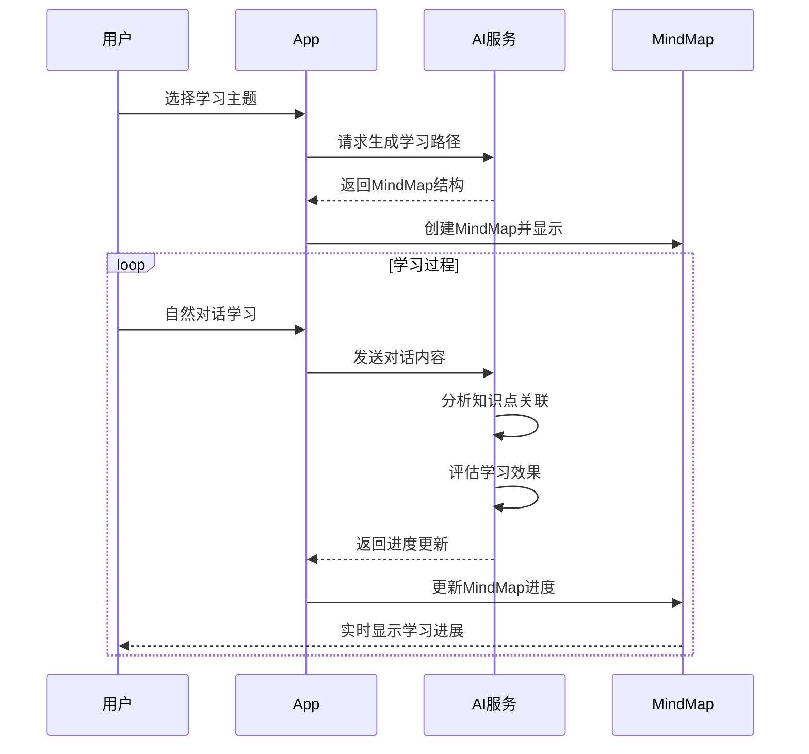

## 架构设计

### 预置课程使用流程
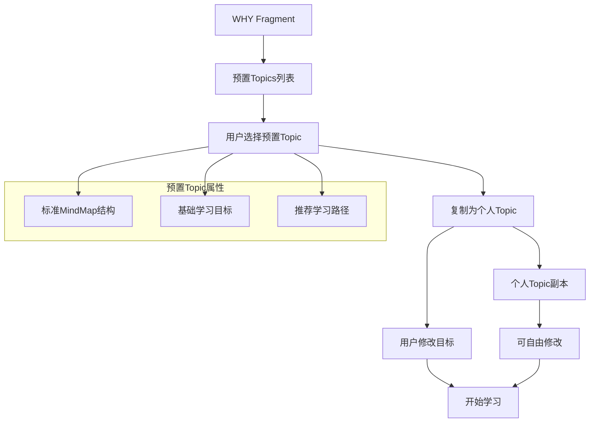

### 数据模型关系
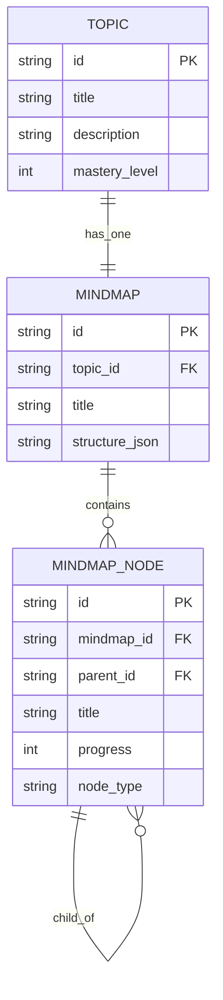

### 系统架构
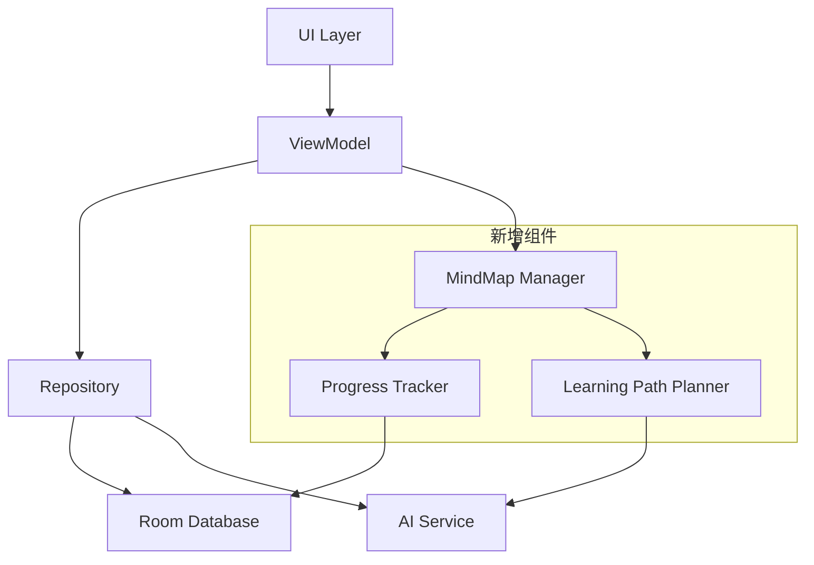

## UI设计

### 预置课程管理
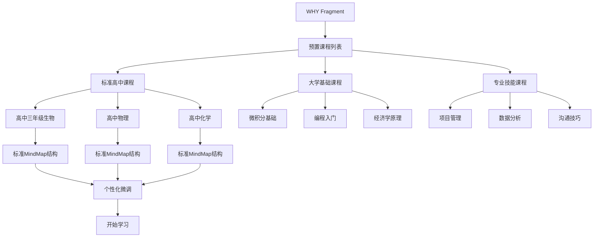

### ChatFragment异构Item扩展
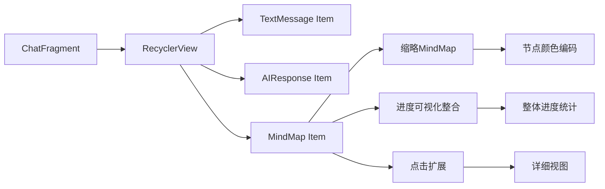

### MindMap可视化设计
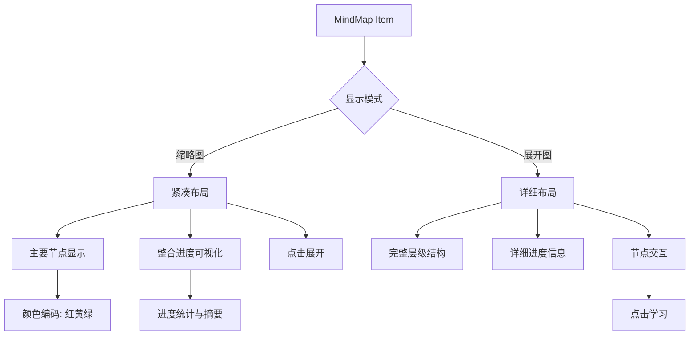

## AI集成设计

### Prompt处理流程
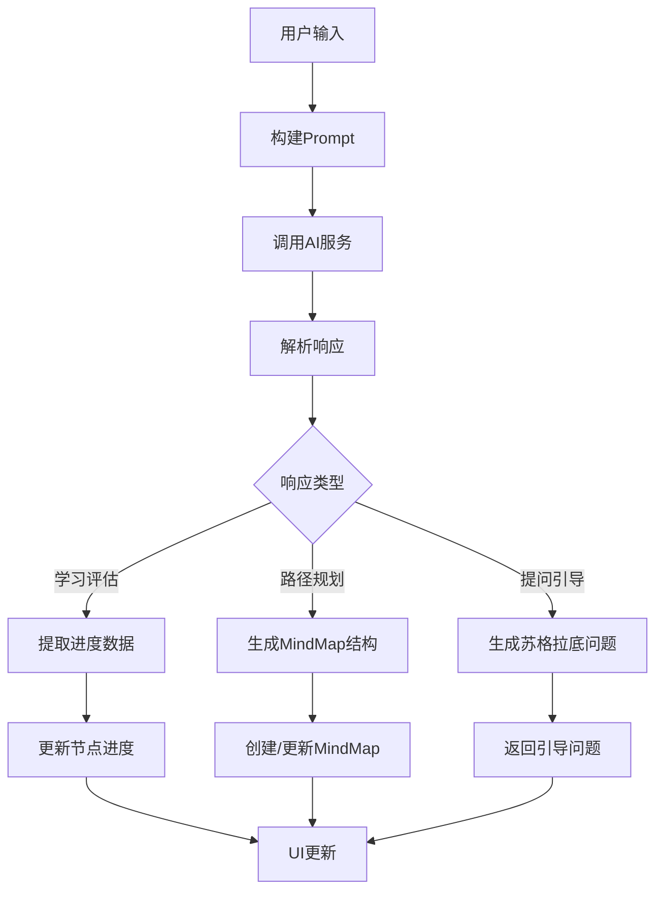

### AI响应数据结构
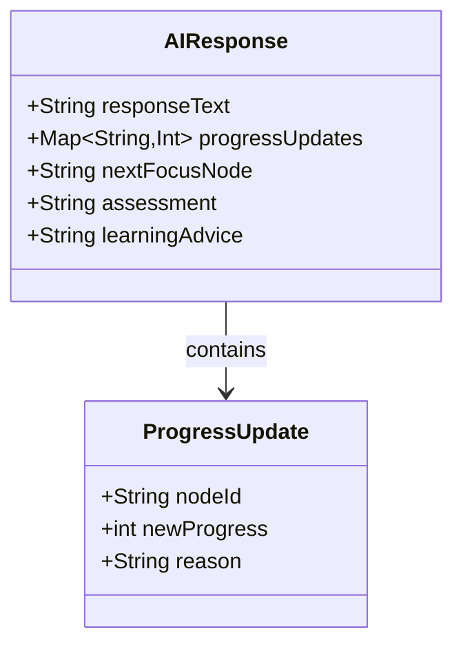

## 学习流程设计

### 智能学习引导
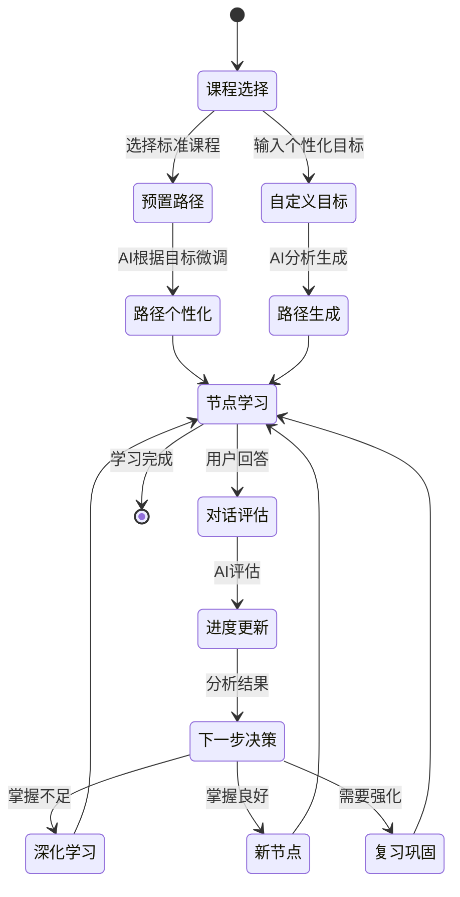

### 进度评估机制
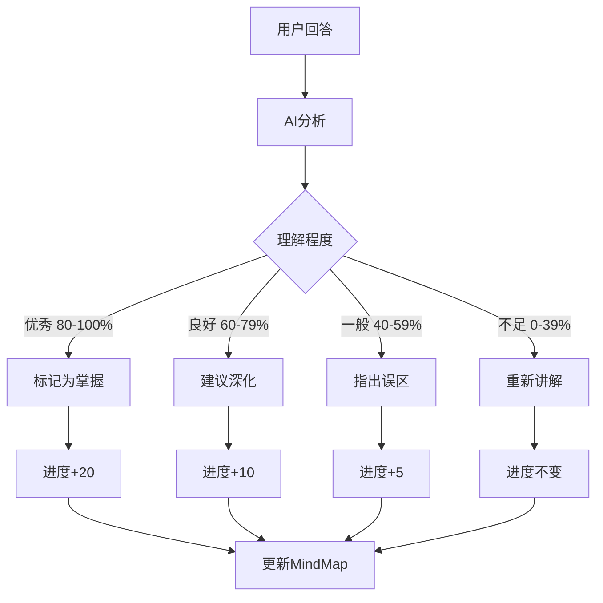

## 技术实现策略

### 分阶段实施
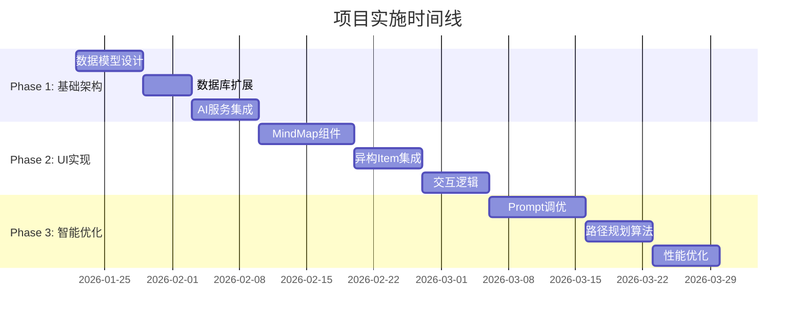

### 风险评估与缓解
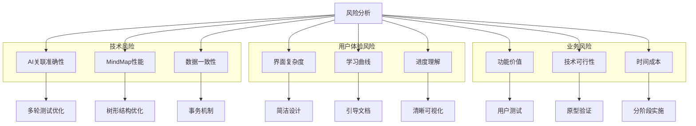

## 成功指标

### 核心指标追踪
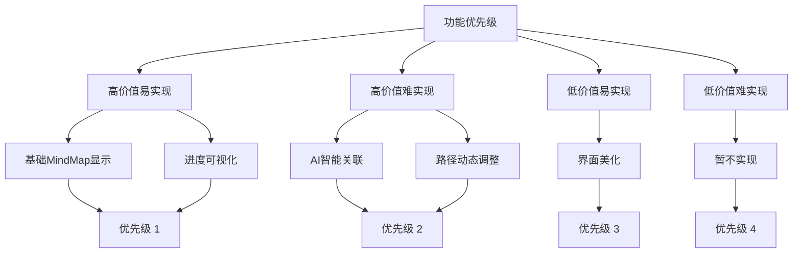

---

## 设计审核要点

### 架构合理性
- MindMap与现有Topic模型的集成方式
- 数据流和状态管理设计
- AI服务的职责边界划分

### 用户体验
- 自然学习流程的设计
- MindMap的交互简洁性
- 进度可视化的直观性

### 技术可行性
- Android平台的技术限制考虑
- AI集成的实际可行性
- 性能和维护性考量