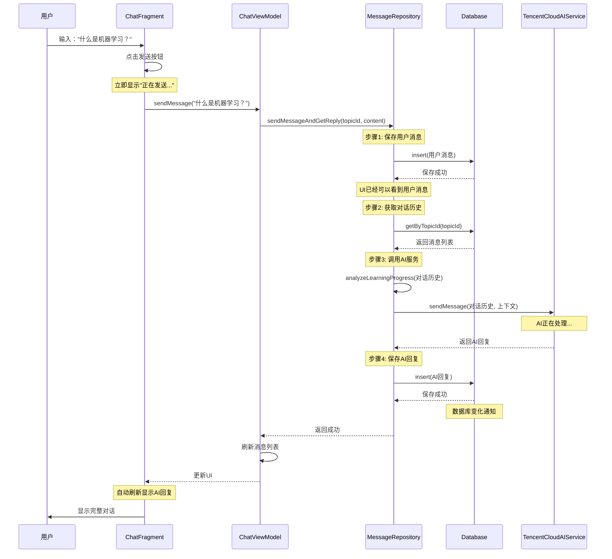

# 用户发送消息完整流程示例

## 场景描述
用户在ChatFragment中发送一条消息："什么是机器学习？"

## 完整数据流

```
┌─────────────┐
│ ChatFragment│ (UI层)
└──────┬──────┘
       │ 1. 用户点击发送按钮
       │
       ▼
┌─────────────────┐
│ ChatViewModel  │ (ViewModel层)
└──────┬─────────┘
       │ 2. sendMessage(content)
       │
       ▼
┌─────────────────────┐
│ MessageRepository   │ (Repository层)
└──────┬──────────────┘
       │ 3. sendMessageAndGetReply()
       │
       ├──────────────────────┐
       │                      │
       ▼                      ▼
┌─────────────┐     ┌─────────────────┐
│   Database  │     │  AI Service    │
│  (Local)   │     │ (TencentCloud) │
└──────┬──────┘     └────────┬───────┘
       │                     │
       │ 4. 保存用户消息      │
       │                     │
       │ 5. 异步调用          │ 6. 调用AI API
       │                     │
       │                     │ 7. 返回AI回复
       │                     │
       │ 8. 保存AI回复       │
       │                     │
       └──────────────────────┘
                │
                ▼ 9. 数据库变化自动通知
         ┌─────────────┐
         │ LiveData/   │
         │  Flow      │
         └──────┬──────┘
                │
                ▼ 10. UI自动刷新
         ┌─────────────┐
         │ChatFragment │ (显示新消息)
         └─────────────┘
```

## 代码实现

### 1. ChatFragment (UI层)

```kotlin
class ChatFragment : Fragment() {
    private lateinit var viewModel: ChatViewModel
    private lateinit var binding: FragmentChatBinding
    
    override fun onViewCreated(view: View, savedInstanceState: Bundle?) {
        super.onViewCreated(view, savedInstanceState)
        
        // 观察消息列表，自动刷新UI
        viewLifecycleOwner.lifecycleScope.launch {
            viewModel.messages.collectLatest { messages ->
                chatAdapter.submitList(messages)
            }
        }
        
        // 设置发送按钮点击事件
        binding.btnSend.setOnClickListener {
            val content = binding.etMessage.text.toString().trim()
            if (content.isNotEmpty()) {
                // 调用ViewModel发送消息
                viewModel.sendMessage(content)
                binding.etMessage.text.clear()
            }
        }
    }
}
```

### 2. ChatViewModel (ViewModel层)

```kotlin
class ChatViewModel(
    private val messageRepository: MessageRepository  // 只依赖Repository
) : ViewModel() {
    
    private val _messages = MutableStateFlow<List<MessageEntity>>(emptyList())
    val messages: StateFlow<List<MessageEntity>> = _messages.asStateFlow()
    
    private val _isTyping = MutableStateFlow(false)
    val isTyping: StateFlow<Boolean> = _isTyping.asStateFlow()
    
    private val _errorState = MutableStateFlow<String?>(null)
    val errorState: StateFlow<String?> = _errorState.asStateFlow()
    
    private var currentTopicId: String? = null
    
    // Local-First: 加载消息时优先从Repository获取本地数据
    fun loadMessages(topicId: String) {
        currentTopicId = topicId
        viewModelScope.launch {
            try {
                // Repository会立即返回本地数据
                val messages = messageRepository.getMessagesByTopicId(topicId)
                _messages.value = messages
            } catch (e: Exception) {
                _errorState.value = e.message ?: "加载消息失败"
            }
        }
    }
    
    // 发送消息 - 通过Repository协调本地和AI服务
    fun sendMessage(content: String) {
        val topicId = currentTopicId ?: return
        
        viewModelScope.launch {
            try {
                _isTyping.value = true
                _errorState.value = null
                
                // Repository会处理：
                // 1. 立即保存用户消息到数据库
                // 2. 异步调用AI服务
                // 3. 保存AI回复到数据库
                messageRepository.sendMessageAndGetReply(topicId, content)
                
                // 刷新消息列表（从本地数据库读取，包含用户消息和AI回复）
                loadMessages(topicId)
                
            } catch (e: Exception) {
                _errorState.value = e.message ?: "发送消息失败"
                
                // 发送错误提示消息
                val errorMessage = MessageEntity(
                    id = UUID.randomUUID().toString(),
                    topicId = topicId,
                    content = "抱歉，我遇到了一些问题: ${e.message}",
                    senderType = "AI",
                    messageType = "TEXT",
                    timestamp = System.currentTimeMillis()
                )
                _messages.value = _messages.value + errorMessage
                
            } finally {
                _isTyping.value = false
            }
        }
    }
}
```

### 3. MessageRepository (Repository层) - 核心逻辑

```kotlin
class MessageRepository(
    private val messageDao: MessageDao,
    private val topicDao: TopicDao,
    private val aiService: TencentCloudAIService
) {
    
    // Local-First: 获取消息时直接从数据库读取
    fun getMessagesByTopicId(topicId: String): List<MessageEntity> {
        return messageDao.getByTopicId(topicId)
    }
    
    // 核心方法：发送消息并获取AI回复（Local-First策略）
    suspend fun sendMessageAndGetReply(
        topicId: String, 
        userContent: String
    ): MessageEntity? {
        
        // ==================== 步骤1: 立即保存用户消息 ====================
        val userMessage = MessageEntity(
            id = UUID.randomUUID().toString(),
            topicId = topicId,
            content = userContent,
            senderType = "USER",
            messageType = "TEXT",
            timestamp = System.currentTimeMillis()
        )
        
        // 立即保存到数据库（同步操作）
        messageDao.insert(userMessage)
        
        // 此时UI可以立即看到用户消息，无需等待AI
        
        // ==================== 步骤2: 获取对话历史（用于AI分析） ====================
        val conversationHistory = messageDao.getByTopicId(topicId)
        
        // ==================== 步骤3: 异步调用AI服务 ====================
        try {
            // 分析学习进度
            val progressAnalysis = aiService.analyzeLearningProgress(conversationHistory)
            
            // 构建上下文
            val context = buildContext(conversationHistory, progressAnalysis)
            
            // 调用AI API（网络请求，可能耗时）
            val aiResponse = aiService.sendMessage(conversationHistory, context)
            
            // ==================== 步骤4: 保存AI回复到数据库 ====================
            val aiMessage = MessageEntity(
                id = UUID.randomUUID().toString(),
                topicId = topicId,
                content = aiResponse,
                senderType = "AI",
                messageType = "TEXT",
                timestamp = System.currentTimeMillis()
            )
            
            // 保存AI回复到数据库
            messageDao.insert(aiMessage)
            
            // 此时UI会自动刷新（因为数据库变化通知）
            
            return aiMessage
            
        } catch (e: Exception) {
            // AI调用失败，但用户消息已经保存
            // 可以记录日志，或者稍后重试
            throw e
        }
    }
    
    // 辅助方法：构建AI上下文
    private fun buildContext(
        history: List<MessageEntity>,
        progress: ProgressAnalysis
    ): String {
        return buildString {
            append("当前学习进度: ${progress.overallProgress}%\n")
            append("学习速度: ${String.format("%.2f", progress.learningVelocity)} 消息/分钟\n")
            if (progress.knowledgeGaps.isNotEmpty()) {
                append("知识缺口: ${progress.knowledgeGaps.joinToString(", ")}\n")
            }
            append("\n")
            append("请基于以上信息，使用苏格拉底教学法，通过提问引导用户深入理解概念。")
        }
    }
    
    // 处理文件上传（Local-First策略）
    suspend fun uploadFileAndGetAnalysis(
        topicId: String, 
        filePath: String
    ): Pair<MessageEntity?, MessageEntity?> {
        
        // 1. 立即保存文件消息
        val fileMessage = MessageEntity(
            id = UUID.randomUUID().toString(),
            topicId = topicId,
            content = "已上传文件: ${getFileName(filePath)}",
            senderType = "USER",
            messageType = "FILE",
            timestamp = System.currentTimeMillis()
        )
        messageDao.insert(fileMessage)
        
        // UI立即显示文件上传
        
        // 2. 异步解析文档
        try {
            val fileContent = readFileContent(filePath)
            val fileType = getFileType(filePath)
            val documentAnalysis = aiService.parseDocument(fileContent, fileType)
            
            // 3. 保存提取的内容
            val extractedFileMessage = MessageEntity(
                id = UUID.randomUUID().toString(),
                topicId = topicId,
                content = documentAnalysis.keyPoints.joinToString("\n"),
                senderType = "USER",
                messageType = "FILE_CONTENT",
                timestamp = System.currentTimeMillis()
            )
            messageDao.insert(extractedFileMessage)
            
            // 4. 生成AI反馈
            val aiResponse = "我已成功解析您的文档，提取了${documentAnalysis.concepts.size}个核心概念。让我们从这些概念开始学习吧！"
            
            val aiMessage = MessageEntity(
                id = UUID.randomUUID().toString(),
                topicId = topicId,
                content = aiResponse,
                senderType = "AI",
                messageType = "TEXT",
                timestamp = System.currentTimeMillis()
            )
            messageDao.insert(aiMessage)
            
            return Pair(fileMessage, aiMessage)
            
        } catch (e: Exception) {
            throw e
        }
    }
}
```

### 4. MessageDao (数据库访问层)

```kotlin
@Dao
interface MessageDao {
    
    @Query("SELECT * FROM messages WHERE topicId = :topicId ORDER BY timestamp ASC")
    suspend fun getByTopicId(topicId: String): List<MessageEntity>
    
    @Query("SELECT * FROM messages WHERE topicId = :topicId ORDER BY timestamp ASC")
    fun getByTopicIdFlow(topicId: String): Flow<List<MessageEntity>>
    
    @Insert
    suspend fun insert(message: MessageEntity)
    
    @Update
    suspend fun update(message: MessageEntity)
    
    @Delete
    suspend fun delete(message: MessageEntity)
}
```

### 5. TencentCloudAIService (AI服务层)

```kotlin
interface TencentCloudAIService {
    
    // 发送消息并获取AI回复
    suspend fun sendMessage(
        messages: List<MessageEntity>, 
        context: String
    ): String
    
    // 分析学习进度
    suspend fun analyzeLearningProgress(
        conversationHistory: List<MessageEntity>
    ): ProgressAnalysis
    
    // 其他AI方法...
}
```

## 时序图



## 关键优势

### 1. 即时响应
- **步骤1保存用户消息后**，UI立即显示，用户无需等待AI回复
- **异步AI调用**不阻塞UI线程

### 2. 数据持久化
- 所有消息（用户和AI）都保存在本地数据库
- **离线可用**，可以查看历史对话
- **数据安全**，不会因为网络问题丢失

### 3. 自动同步
- 数据库使用`Flow`或`LiveData`，自动通知UI更新
- **无需手动刷新**，数据库变化自动触发UI更新

### 4. 解耦设计
- ViewModel不直接依赖AI服务
- AI服务可以自由切换（腾讯云 → OpenAI → 其他）
- 前端UI无感知

### 5. 错误处理
- AI调用失败不影响用户消息的保存
- 友好的错误提示
- 可以实现重试机制

## 数据库表结构示例

### messages表
| id | topicId | content | senderType | messageType | timestamp |
|----|---------|----------|------------|-------------|-----------|
| msg1 | topic1 | 什么是机器学习？ | USER | TEXT | 1705901234567 |
| msg2 | topic1 | 机器学习是让计算机从数据中学习的方法... | AI | TEXT | 1705901235000 |

## 实际执行流程

### 时间线
```
t=0ms:    用户点击发送
t=1ms:    ViewModel调用Repository
t=2ms:    保存用户消息到数据库 ✓
t=3ms:    UI显示用户消息 ✓ (用户看到自己的消息)
t=10ms:   Repository获取对话历史
t=20ms:   调用AI服务 (异步开始)
t=2000ms: AI返回回复
t=2002ms: 保存AI回复到数据库 ✓
t=2003ms: UI自动刷新 ✓ (用户看到AI回复)
```

### 关键点
- **t=3ms**: 用户立即看到自己的消息，无需等待
- **t=20ms - 2000ms**: AI处理期间，UI保持响应
- **t=2003ms**: 自动刷新，无需手动操作

## 对比：没有Repository层的问题

```kotlin
// 错误示例：ViewModel直接调用AI服务
class BadChatViewModel(
    private val aiService: TencentCloudAIService  // 直接依赖AI
) : ViewModel() {
    
    fun sendMessage(content: String) {
        viewModelScope.launch {
            // 问题1: 阻塞等待AI回复，UI不响应
            val aiResponse = aiService.sendMessage(listOf(), "")
            
            // 问题2: 消息没有持久化，无法离线查看
            _messages.value = _messages.value + aiResponse
        }
    }
}
```

### 问题分析
❌ **用户消息不持久化** - 刷新页面后丢失  
❌ **阻塞UI线程** - 用户看不到自己的消息  
❌ **无法离线使用** - 必须联网  
❌ **AI服务耦合** - 难以切换AI提供商  
❌ **无法重试** - 网络失败后无法恢复  

## 总结

### Local-First策略的核心
1. **优先本地**: 所有数据先存入本地数据库
2. **即时响应**: UI立即显示本地数据
3. **异步增强**: 后台调用AI服务
4. **自动同步**: 数据库变化自动更新UI

### Repository层的职责
1. **数据协调**: 协调本地数据库和远程AI服务
2. **持久化**: 确保所有数据都持久化
3. **错误处理**: 统一处理网络异常
4. **缓存策略**: 实现Local-First缓存

### ViewModel层的简化
1. **只调用Repository**: 不直接依赖AI服务
2. **管理UI状态**: 处理加载、错误状态
3. **数据转换**: 将数据转换为UI需要的格式
4. **无业务逻辑**: 业务逻辑在Repository层

这种架构设计确保了良好的用户体验、数据安全性、代码可维护性！
