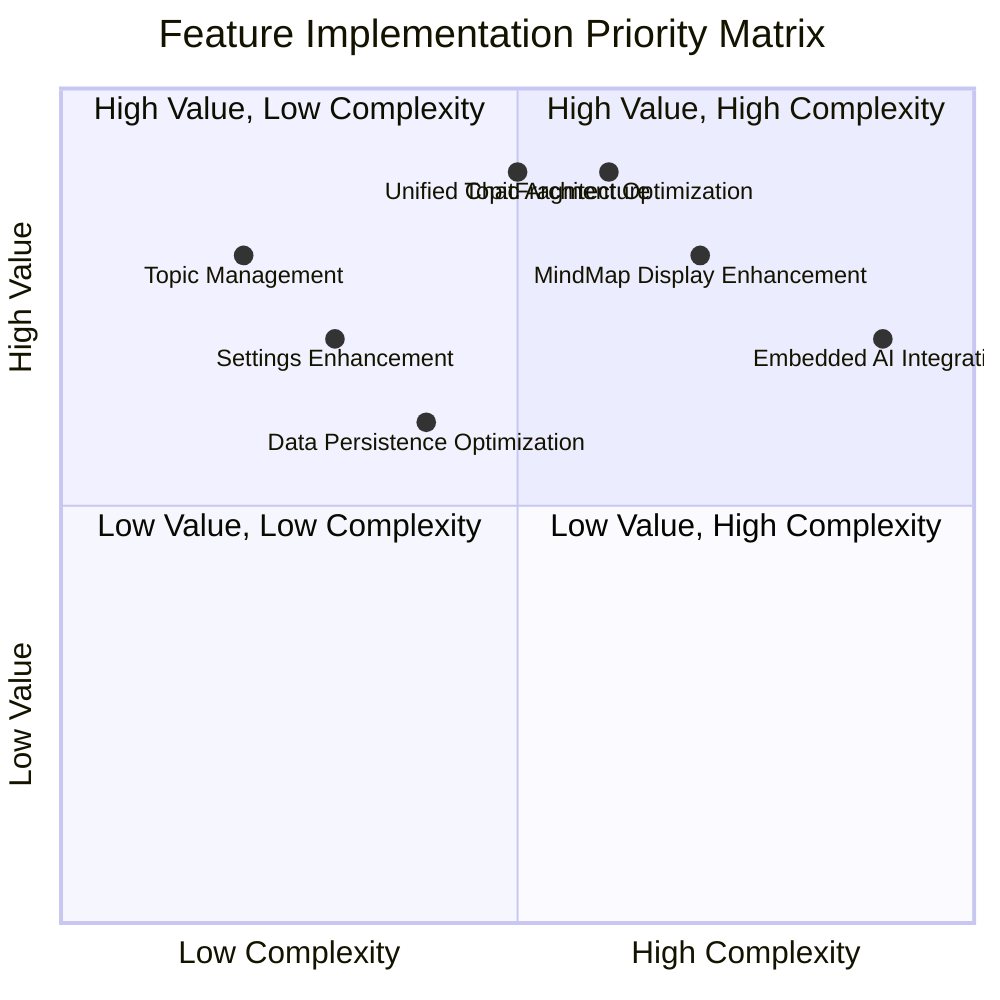
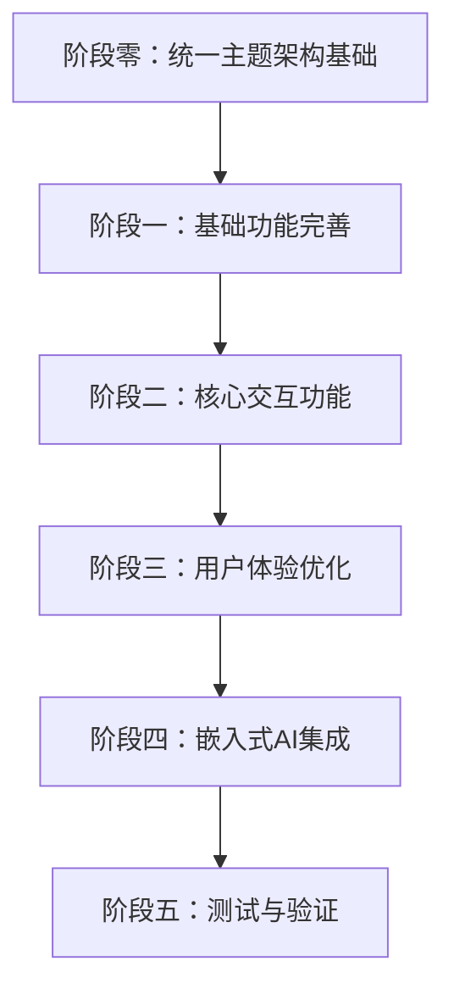

# 嵌入式AI模型实施计划

**项目路径**: `d:/git/autodroid/autodroid-TeachItBack`  
**分支**: `feature/teach-it-back-dev`  
**创建时间**: 2026-01-26  
**实施策略**: 严格遵循设计文档 `embedded_ai_model_brainstorming_20260125.md` 中的实施策略

---

## 📋 实施策略概览

**指导原则**：先完成基础功能，再逐步添加嵌入式AI功能

### 实施优先级矩阵（按设计文档）


### 实施流程图


---

## 🎯 阶段零：统一主题架构基础（必须优先完成）

### 任务0.1：扩展TopicEntity数据模型
**文件路径**: `app/src/main/kotlin/com/autodroid/teachitback/model/TopicEntity.kt`  
**预估时间**: 5分钟  
**验证**: 编译通过，无语法错误

**重要性说明**: 这是所有后续任务的基础，必须首先完成TopicEntity的扩展，包括添加path、parentId、capabilities和servicePreferences字段。

---

## 🎯 阶段一：基础功能完善（1-2周）

### 任务1.1：Topic管理功能完善
**文件路径**: `app/src/main/kotlin/com/autodroid/teachitback/repository/TopicRepository.kt`  
**预估时间**: 5分钟  
**验证**: 创建、编辑、分类功能完善


### 任务1.2：添加ChatGLM和TinyBERT设置项
**文件路径**: `app/src/main/kotlin/com/autodroid/teachitback/ui/adapter/SettingsItem.kt`  
**预估时间**: 6分钟  
**验证**: 
- 添加TYPE_CHATGLM_AI_SERVICE_ITEM和TYPE_TINYBERT_AI_SERVICE_ITEM常量
- 创建ChatGLMAIServiceItem数据类（包含模型下载、存储管理等功能）
- 创建TinyBERTAIServiceItem数据类（包含模型下载、存储管理等功能）
- 设置项在界面中正确显示

**说明**: 嵌入式AI服务的设置项需要包含模型管理功能（下载、删除、存储策略），与云AI服务不同。

### 任务1.3：设置功能完善
**文件路径**: `app/src/main/kotlin/com/autodroid/teachitback/ui/SettingsFragment.kt`  
**预估时间**: 4分钟  
**验证**: 用户偏好、AI配置、主题设置界面完善

### 任务1.4：数据持久化优化
**文件路径**: `app/src/main/kotlin/com/autodroid/teachitback/database/AppDatabase.kt`  
**预估时间**: 5分钟  
**验证**: 数据库结构优化和迁移机制

---

## 🎯 阶段二：统一主题架构增强（基于扩展后的TopicEntity）

### 任务2.1：创建TopicTreeManager
**文件路径**: `app/src/main/kotlin/com/autodroid/teachitback/service/TopicTreeManager.kt`
**预估时间**: 8分钟
**验证**: 主题树构建和智能路由功能正常

### 任务2.2：扩展TopicDao
**文件路径**: `app/src/main/kotlin/com/autodroid/teachitback/database/TopicDao.kt`
**预估时间**: 4分钟
**验证**: 新增查询方法正常工作

### 任务2.3：创建TopicConverters
**文件路径**: `app/src/main/kotlin/com/autodroid/teachitback/database/TopicConverters.kt`
**预估时间**: 5分钟
**验证**: 数据类型转换正常工作

**说明**：TopicConverters用于Room数据库的类型转换，将复杂的数据类型转换为Room可以存储的简单类型：

**需要转换的类型**：
1. `List<String>` (path字段) → 使用Gson转换为JSON字符串
2. `Set<AIAbility>` (capabilities字段) → 转换为JSON字符串或逗号分隔的字符串
3. `Map<String, Double>` (servicePreferences字段) → 使用Gson转换为JSON字符串

**示例代码**：
```kotlin
class TopicConverters {
    @TypeConverter
    fun fromStringList(list: List<String>?): String {
        return Gson().toJson(list)
    }
    
    @TypeConverter
    fun toStringList(json: String?): List<String> {
        return Gson().fromJson(json, object : TypeToken<List<String>>() {}.type)
    }
    
    @TypeConverter
    fun fromAIAbilitySet(set: Set<AIAbility>?): String {
        return Gson().toJson(set.map { it.name })
    }
    
    @TypeConverter
    fun toAIAbilitySet(json: String?): Set<AIAbility> {
        val names = Gson().fromJson(json, Array<String>::class.java)
        return names.map { AIAbility.valueOf(it) }.toSet()
    }
    
    @TypeConverter
    fun fromServicePreferencesMap(map: Map<String, Double>?): String {
        return Gson().toJson(map)
    }
    
    @TypeConverter
    fun toServicePreferencesMap(json: String?): Map<String, Double> {
        return Gson().fromJson(json, object : TypeToken<Map<String, Double>>() {}.type)
    }
}
```

**使用方式**：在AppDatabase类中使用`@TypeConverters(TopicConverters::class)`注解。

### 任务2.4：预设主题初始化
**文件路径**: `app/src/main/kotlin/com/autodroid/teachitback/service/PresetTopicInitializer.kt`
**预估时间**: 5分钟
**验证**: 预设主题正确初始化

### 任务2.5：创建ServiceSettingsViewModel
**文件路径**: `app/src/main/kotlin/com/autodroid/teachitback/viewmodel/ServiceSettingsViewModel.kt`
**预估时间**: 8分钟
**验证**:
- 管理所有AI服务的SettingsItem列表
- 处理服务启用/禁用状态切换
- 处理服务优先级更新
- 处理嵌入式服务的模型下载/删除
- 使用DataStore持久化所有状态变化

**说明**：ServiceSettingsViewModel统一管理所有AI服务状态（云服务和嵌入式服务），替代了之前的UserServicePreferences类。

**注意**: AIAbility枚举已存在于 `app/src/main/kotlin/com/autodroid/teachitback/service/AIRouterService.kt` 中，无需重复创建。

---

## 🎯 阶段三：核心交互功能（1-2周）

### 任务3.0：输入建议系统
**文件路径**: `app/src/main/kotlin/com/autodroid/teachitback/service/InputSuggestionDetector.kt`  
**预估时间**: 4分钟  
**验证**: 智能输入建议功能

### 任务3.1：ChatFragment优化
**文件路径**: `app/src/main/kotlin/com/autodroid/teachitback/ui/ChatFragment.kt`  
**预估时间**: 5分钟  
**验证**: 消息流、文件上传体验改进

### 任务3.2：MindMap显示完善
**文件路径**: `app/src/main/kotlin/com/autodroid/teachitback/ui/MindMapFragment.kt`  
**预估时间**: 5分钟  
**验证**: 进度同步、交互体验增强

### 任务3.3：基础功能测试
**文件路径**: `app/src/test/java/com/autodroid/teachitback/`  
**预估时间**: 3分钟  
**验证**: 稳定性优化和性能测试

---

## 🎯 阶段四：用户体验优化（1-2周）

### 任务4.1：设置界面增强
**文件路径**: `app/src/main/kotlin/com/autodroid/teachitback/ui/SettingsFragment.kt`  
**预估时间**: 4分钟  
**验证**: 服务优先级配置界面正常

### 任务4.2：性能优化
**文件路径**: `app/src/main/kotlin/com/autodroid/teachitback/service/`  
**预估时间**: 5分钟  
**验证**: 系统性能调优

### 任务4.3：错误处理
**文件路径**: `app/src/main/kotlin/com/autodroid/teachitback/service/ErrorHandler.kt`  
**预估时间**: 3分钟  
**验证**: 优雅的降级和提示

---

## 🎯 阶段五：嵌入式AI集成（2-3周）

### 任务5.1：MNN框架集成
**文件路径**: `app/src/main/kotlin/com/autodroid/teachitback/framework/MNNIntegration.kt`  
**预估时间**: 5分钟  
**验证**: MNN框架集成和模型加载器

### 任务5.2：创建ChatGLM嵌入式服务
**文件路径**: `app/src/main/kotlin/com/autodroid/teachitback/service/AIServiceChatGLM.kt`  
**预估时间**: 5分钟  
**验证**: ChatGLM-6B模型集成

### 任务5.3：创建TinyBERT嵌入式服务
**文件路径**: `app/src/main/kotlin/com/autodroid/teachitback/service/AIServiceTinyBERT.kt`  
**预估时间**: 5分钟  
**验证**: TinyBERT快速答案判断集成

### 任务5.5：增强智能路由
**文件路径**: `app/src/main/kotlin/com/autodroid/teachitback/router/AIServiceRouter.kt`  
**预估时间**: 4分钟  
**验证**: 模型切换和降级策略实现

### 任务5.5：更新服务注册表
**文件路径**: `app/src/main/kotlin/com/autodroid/teachitback/registry/AIServiceRegistry.kt`  
**预估时间**: 4分钟  
**验证**: 嵌入式服务正确注册

### 任务5.6：创建ResourceManager
**文件路径**: `app/src/main/kotlin/com/autodroid/teachitback/service/ResourceManager.kt`  
**预估时间**: 5分钟  
**验证**: 模型下载、资源管理、GitHub集成功能

---

## 🎯 阶段六：测试与验证（1周）

### 任务6.1：创建AIServiceChatGLMTest
**文件路径**: `app/src/test/java/com/autodroid/teachitback/service/AIServiceChatGLMTest.kt`  
**预估时间**: 5分钟  
**验证**: ChatGLM服务功能测试

### 任务6.2：创建AIServiceTinyBERTTest
**文件路径**: `app/src/test/java/com/autodroid/teachitback/service/AIServiceTinyBERTTest.kt`  
**预估时间**: 5分钟  
**验证**: TinyBERT快速答案判断测试

### 任务6.3：创建嵌入式AI集成测试
**文件路径**: `app/src/androidTest/java/com/autodroid/teachitback/EmbeddedAIIntegrationTest.kt`  
**预估时间**: 5分钟  
**验证**: 服务路由和状态管理集成测试

---

## 📅 实施优先级（按设计文档）

1. ✅ **扩展TopicEntity数据模型** - 所有功能的基础，必须首先完成
2. ✅ **Topic管理功能** - 核心基础功能，高价值低复杂度
3. ✅ **设置功能完善** - 用户体验关键，高价值低复杂度  
4. ✅ **数据持久化优化** - 系统稳定性基础，中等复杂度
5. ✅ **ChatFragment优化** - 核心交互体验，高价值中等复杂度
6. ✅ **MindMap显示完善** - 特色功能完善，高价值中等复杂度
7. ✅ **统一主题架构增强** - 智能路由基础，高价值中等复杂度
8. ⏳ **嵌入式AI集成** - 高级功能，高价值高复杂度（最后阶段）

**实施原则**：
- ✅ **风险可控**：先完成稳定功能，再添加复杂特性
- ✅ **用户体验**：基础交互功能先完善
- ✅ **技术可行性**：避免过早引入嵌入式AI的复杂性
- ✅ **迭代开发**：每个阶段都有明确的交付物

---

## 📊 预估时间线

| 阶段 | 任务数 | 预估时间 | 优先级 |
|------|--------|----------|--------|
| 阶段零：统一主题架构基础 | 1 | 5分钟 | 最高 |
| 阶段一：基础功能完善 | 3 | 14分钟 | 高 |
| 阶段二：统一主题架构增强 | 5 | 32分钟 | 高 |
| 阶段三：核心交互功能 | 4 | 17分钟 | 高 |
| 阶段四：用户体验优化 | 4 | 16分钟 | 中 |
| 阶段五：嵌入式AI集成 | 7 | 34分钟 | 高 |
| 阶段六：测试与验证 | 3 | 15分钟 | 低 |
| **总计** | **27** | **133分钟 (约2.22小时)** | - |

---

## ✅ 验证标准

### 编译验证
- 每个任务完成后运行 `./gradlew compileDebugKotlin`
- 确保无编译错误
- 检查警告并解决关键问题

### 功能验证
- 服务启用/禁用功能正常
- 嵌入式服务正确注册
- 输入建议系统仅在发送时触发
- UI反映当前服务状态

### 集成验证
- 所有服务在设置中显示
- 路由考虑服务状态
- 嵌入式服务的模型管理正常
- 输入建议平滑集成

---

## 🎯 关键里程碑

1. **阶段零完成**：TopicEntity数据模型扩展完成，为所有后续功能奠定基础
2. **阶段一完成**：基础功能完善，用户可以管理主题和设置
3. **阶段二完成**：核心交互功能优化，聊天和思维导图体验提升
4. **阶段三完成**：统一主题架构增强实现，智能路由基础就绪
5. **阶段四完成**：用户体验优化，性能和稳定性提升
6. **阶段五完成**：嵌入式AI集成完成，本地模型可用
7. **阶段六完成**：测试验证通过，功能稳定可用

---

## 📝 嵌入式AI设置项详细设计

### ChatGLM和TinyBERT设置项的特殊性

与云AI服务不同，嵌入式AI服务的设置项需要包含额外的模型管理功能：

#### 1. ChatGLMAIServiceItem数据类设计
```kotlin
/**
 * ChatGLM嵌入式AI服务项
 */
data class ChatGLMAIServiceItem(
    val id: String = "chatglm-embedded",
    val name: String = "ChatGLM (嵌入式)",
    val description: String = "本地部署的ChatGLM-6B模型，离线可用，响应速度快，支持中文对话",
    
    // 模型管理
    val modelVersion: String = "chatglm3-6b",
    val modelSize: String = "约6GB",
    val isModelDownloaded: Boolean = false,
    val modelPath: String = "",
    val downloadProgress: Float = 0f,
    
    // 下载策略
    val downloadStrategy: ModelDownloadStrategy = ModelDownloadStrategy.WIFI_ONLY,
    
    // 性能配置
    val maxTokens: Int = 2048,
    val temperature: Float = 0.7f,
    
    // 服务状态（与云AI服务一致）
    val isEnabled: Boolean = false,  // 默认禁用，需要下载模型后才能启用
    val priority: Int = 5,  // 服务优先级，数值越大优先级越高
    
    // GitHub资源信息
    val githubRepoUrl: String = "https://github.com/THUDM/ChatGLM3",
    val modelDownloadUrl: String = "https://huggingface.co/THUDM/chatglm3-6b"
) : SettingsItem() {
    override fun getType(): Int = TYPE_CHATGLM_AI_SERVICE_ITEM
    
    /**
     * 启用服务时需要检查模型是否已下载
     */
    fun canEnable(): Boolean = isModelDownloaded
    
    /**
     * 获取服务启用状态的说明文本
     */
    fun getStatusText(): String = when {
        !isModelDownloaded -> "需要先下载模型"
        isEnabled -> "已启用"
        else -> "已禁用"
    }
}
```

#### 2. TinyBERTAIServiceItem 数据类设计
```kotlin
/**
 * TinyBERT嵌入式AI服务项
 */
data class TinyBERTAIServiceItem(
    val id: String = "tinybert-embedded",
    val name: String = "TinyBERT (嵌入式)",
    val description: String = "轻量级BERT模型，用于快速答案判断和分类，体积小响应快",
    
    // 模型管理
    val modelVersion: String = "tinybert-4l",
    val modelSize: String = "约50MB",
    val isModelDownloaded: Boolean = false,
    val modelPath: String = "",
    val downloadProgress: Float = 0f,
    
    // 下载策略
    val downloadStrategy: ModelDownloadStrategy = ModelDownloadStrategy.AUTO,
    
    // 性能配置
    val threshold: Float = 0.5f,  // 答案判断阈值
    
    // 服务状态（与云AI服务一致）
    val isEnabled: Boolean = false,  // 默认禁用，需要下载模型后才能启用
    val priority: Int = 5,  // 服务优先级，数值越大优先级越高
    
    // GitHub资源信息
    val githubRepoUrl: String = "https://github.com/huawei-noah/TinyBERT",
    val modelDownloadUrl: String = "https://huggingface.co/huawei-noah/TinyBERT"
) : SettingsItem() {
    override fun getType(): Int = TYPE_TINYBERT_AI_SERVICE_ITEM
    
    /**
     * 启用服务时需要检查模型是否已下载
     */
    fun canEnable(): Boolean = isModelDownloaded
    
    /**
     * 获取服务启用状态的说明文本
     */
    fun getStatusText(): String = when {
        !isModelDownloaded -> "需要先下载模型"
        isEnabled -> "已启用"
        else -> "已禁用"
    }
}
```

#### 3. 模型下载策略枚举
```kotlin
/**
 * 模型下载策略
 */
enum class ModelDownloadStrategy {
    AUTO,          // 自动下载
    WIFI_ONLY,     // 仅WiFi下下载
    MANUAL         // 手动触发下载
}
```

#### 4. 嵌入式服务设置项的UI特性

与云AI服务相比，嵌入式服务的UI需要额外的功能：

**云AI服务设置项**：
- API Key输入
- Base URL配置
- 模型选择
- 启用/禁用开关

**嵌入式AI服务设置项**（额外功能）：
- 模型下载进度显示
- 存储空间占用信息
- 模型版本信息
- 模型删除按钮
- 下载策略选择（AUTO/WIFI_ONLY/MANUAL）
- 模型路径显示

#### 5. 实施要点

在SettingsFragment中需要：
1. 检查模型是否已下载（ResourceManager）
2. 显示下载进度
3. 根据下载状态动态显示UI元素
4. 处理模型下载失败的情况
5. 显示存储空间使用情况
6. 提供模型管理按钮（下载/删除）
7. **管理isEnabled状态**：与云AI服务一致，isEnabled存储在SettingsItem中，通过ViewModel管理状态变更
8. **持久化状态**：使用DataStore或SharedPreferences持久化每个服务的isEnabled状态
9. **状态同步**：确保UI状态与持久化存储保持同步

#### 6. 服务状态管理设计

**正确的架构**（与云AI服务保持一致）：
- SettingsItem包含所有状态字段（isEnabled、priority等）
- ServiceSettingsViewModel统一管理所有SettingsItem列表和状态变更
- DataStore持久化所有可变状态（isEnabled、priority、downloadStrategy等）
- UI通过ViewModel观察状态变化
- ❌ **不使用UserServicePreferences类**，所有管理逻辑都在ViewModel中

**SettingsItem的状态字段**（每个AI服务都应该有）：
- `isEnabled: Boolean` - 服务是否启用
- `priority: Int` - 服务优先级（数值越大优先级越高）
- 嵌入式服务额外字段：
  - `isModelDownloaded: Boolean` - 模型是否已下载
  - `downloadProgress: Float` - 下载进度
  - `downloadStrategy: ModelDownloadStrategy` - 下载策略

**ServiceSettingsViewModel的核心职责**：
1. 管理所有AI服务的SettingsItem列表
2. 处理服务启用/禁用状态切换
3. 处理服务优先级更新
4. 处理嵌入式服务的模型下载/删除
5. 管理全局策略（modelDownloadStrategy、storageManagementStrategy）
6. 使用DataStore持久化所有状态变化

**不推荐的架构**（需要避免）：
- ❌ 使用UserServicePreferences统一管理服务状态
- ❌ SettingsItem中的状态不从持久化存储读取
- ❌ 状态管理分散在多个地方
- ❌ 混合使用SharedPreferences和DataStore

**设计修正依据**：
- 参考现有云AI服务（DoubaoAIServiceItem等）的实现方式
- 保持架构简洁，避免职责分散
- 符合MVVM架构最佳实践
- 所有状态都跟随SettingsItem，保持一致性
- 保持代码一致性和可维护性
- 符合MVVM架构最佳实践

---

**实施策略依据**：基于设计文档第1900-1971行的实施策略，确保开发过程有序且风险可控。
