# Teach It Back 应用程序设计文档

## 概述

**Teach It Back** 是一款革命性的AI驱动学习应用，通过"目标设定 → AI智能分解 → 可视化路径 → 交互学习"的完整闭环，帮助用户实现深度知识掌握。

### 核心价值主张

**目标导向的个性化学习路径**
- **智能目标分解**：AI将用户设定的学习目标自动分解为可管理的WBS工作包
- **可视化MindMap路径**：生成清晰的树状学习路线图，实时显示学习进度
- **多模型AI支持**：支持14种主流AI大模型，用户可根据需求选择最适合的智能助手

**科学的交互式学习体验**
- **苏格拉底教学法**：AI通过精心设计的提问引导深度思考，发现知识盲点
- **费曼学习技巧**：用户通过向AI讲解来检验理解深度，"学会的最高境界是教会别人"
- **自适应学习路径**：AI根据用户表现实时调整难度和进度，确保最佳学习效果

**真实场景验证**
- **CFP备考案例**：帮助学员在复杂财务规划概念中实现从50%到95%的理解突破
- **多领域适用**：适合学生备考、职场技能提升、终身学习等各类场景

### 核心理念
"Teach It Back"的核心思想是：**真正的学习发生在当您能够将知识清晰地教给他人时**。我们通过AI技术将这个理念转化为可操作的、高效的、个性化的学习体验。

## 核心交互流程

### 学习目标设置与WBS分解

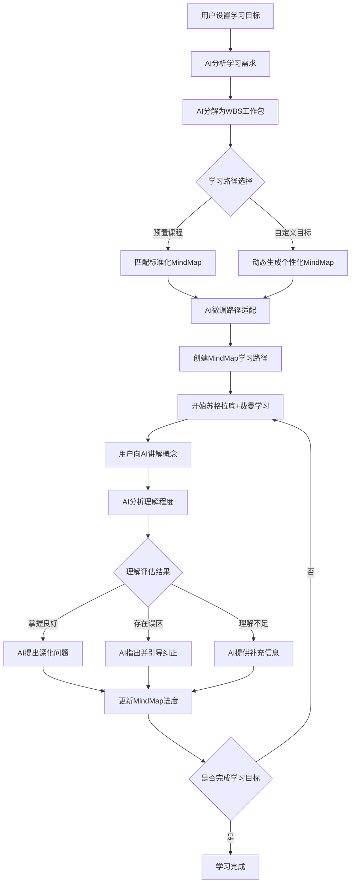
```mermaid
flowchart TD
    A[用户设置学习目标] --> B[AI分析学习需求]
    B --> C[AI分解为WBS工作包]
    C --> D{学习路径选择}
    D -->|预置课程| E[匹配标准化MindMap]
    D -->|自定义目标| F[动态生成个性化MindMap]
    E --> G[AI微调路径适配]
    F --> G
    G --> H[创建MindMap学习路径]
    H --> I[开始苏格拉底+费曼学习]
    
    I --> J[用户向AI讲解概念]
    J --> K[AI分析理解程度]
    K --> L{理解评估结果}
    L -->|掌握良好| M[AI提出深化问题]
    L -->|存在误区| N[AI指出并引导纠正]
    L -->|理解不足| O[AI提供补充信息]
    M --> P[更新MindMap进度]
    N --> P
    O --> P
    P --> Q{是否完成学习目标}
    Q -->|否| I
    Q -->|是| R[学习完成]
```

### 苏格拉底-费曼结合法详细流程

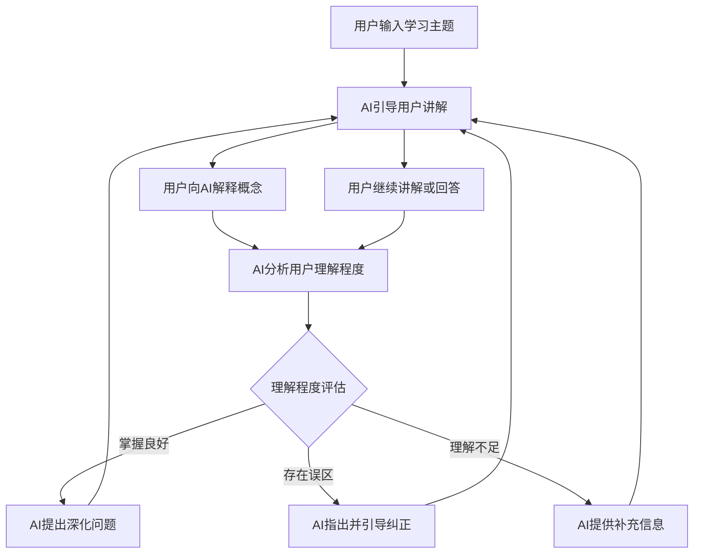
```mermaid
graph TD
    A[用户输入学习主题] --> B[AI引导用户讲解]
    B --> C[用户向AI解释概念]
    C --> D[AI分析用户理解程度]
    D --> E{理解程度评估}
    E -->|掌握良好| F[AI提出深化问题]
    E -->|存在误区| G[AI指出并引导纠正]
    E -->|理解不足| H[AI提供补充信息]
    F --> B
    G --> B
    H --> B
    B --> I[用户继续讲解或回答]
    I --> D
```

## MindMap集成设计

### 智能MindMap学习路径管理

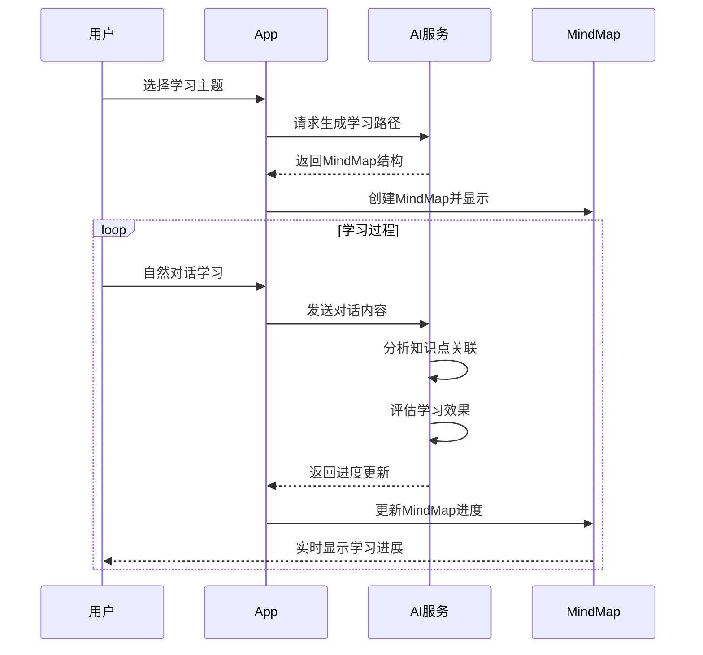
```mermaid
sequenceDiagram
    participant U as 用户
    participant A as App
    participant AI as AI服务
    participant M as MindMap
    
    U->>A: 选择学习主题
    A->>AI: 请求生成学习路径
    AI-->>A: 返回MindMap结构
    A->>M: 创建MindMap并显示
    
    loop 学习过程
        U->>A: 自然对话学习
        A->>AI: 发送对话内容
        AI->>AI: 分析知识点关联
        AI->>AI: 评估学习效果
        AI-->>A: 返回进度更新
        A->>M: 更新MindMap进度
        M-->>U: 实时显示学习进展
    end
```

### 预置课程使用流程

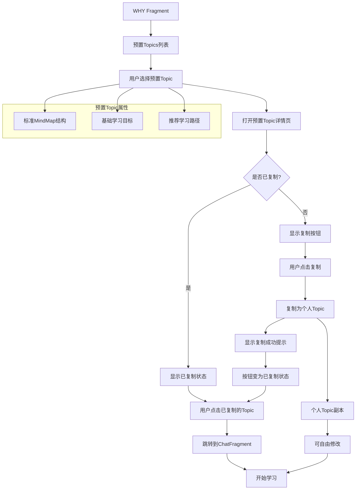
```mermaid
graph TB
    A[WHY Fragment] --> B[预置Topics列表]
    B --> C[用户选择预置Topic]
    C --> D[打开预置Topic详情页]
    D --> E{是否已复制?}
    E -->|否| F[显示复制按钮]
    E -->|是| G[显示已复制状态]
    F --> H[用户点击复制]
    H --> I[复制为个人Topic]
    I --> J[显示复制成功提示]
    J --> K[按钮变为已复制状态]
    G --> L[用户点击已复制的Topic]
    K --> L
    L --> M[跳转到ChatFragment]
    M --> N[开始学习]
    
    subgraph "预置Topic属性"
        O[标准MindMap结构]
        P[基础学习目标]
        Q[推荐学习路径]
    end
    
    C --> O
    C --> P
    C --> Q
    
    I --> R[个人Topic副本]
    R --> S[可自由修改]
    S --> N
```

### 预置课程详情页设计

#### 页面结构

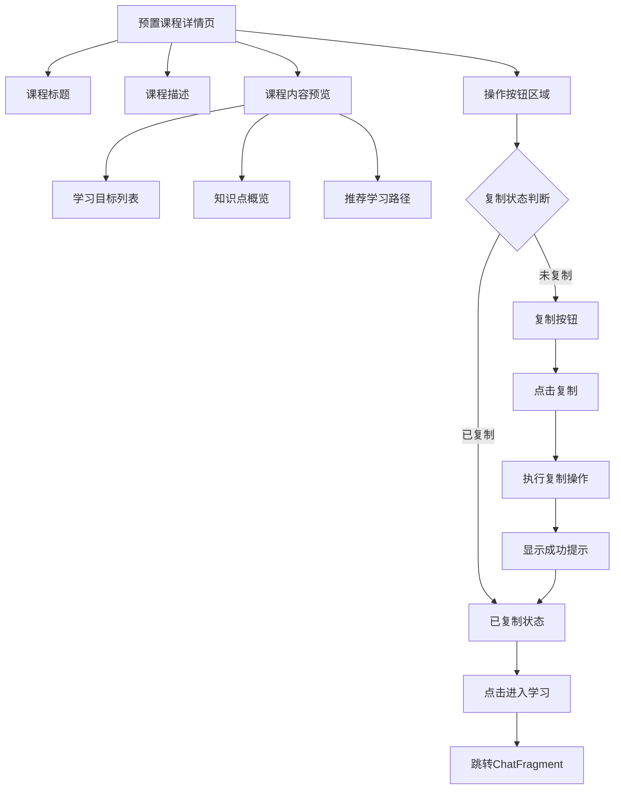
```mermaid
graph TB
    A[预置课程详情页] --> B[课程标题]
    A --> C[课程描述]
    A --> D[课程内容预览]
    A --> E[操作按钮区域]
    
    D --> F[学习目标列表]
    D --> G[知识点概览]
    D --> H[推荐学习路径]
    
    E --> I{复制状态判断}
    I -->|未复制| J[复制按钮]
    I -->|已复制| K[已复制状态]
    
    J --> L[点击复制]
    L --> M[执行复制操作]
    M --> N[显示成功提示]
    N --> K
    
    K --> O[点击进入学习]
    O --> P[跳转ChatFragment]
```

#### UI组件设计

**详情页布局：**

| 组件 | 说明 | 交互行为 |
|------|------|----------|
| 标题栏 | 显示课程名称 | 返回按钮返回WHY Fragment |
| 课程卡片 | 显示课程标题和描述 | 卡片样式，带阴影效果 |
| 内容预览区 | 展示学习目标、知识点等 | 可滚动查看详细内容 |
| 复制按钮 | 未复制时显示 | 点击复制课程到个人列表 |
| 已复制状态 | 已复制时显示 | 点击跳转到学习页面 |
| 学习入口 | 已复制后可用 | 直接进入ChatFragment |

#### 复制状态管理

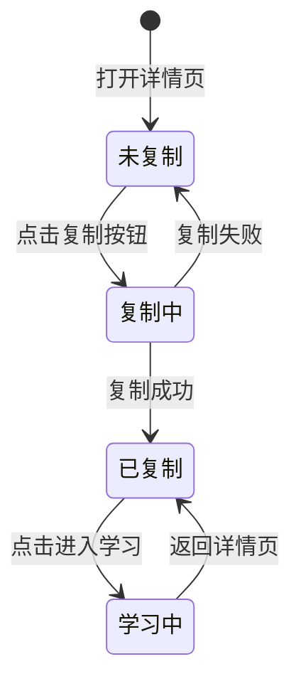
```mermaid
stateDiagram-v2
    [*] --> 未复制 : 打开详情页
    未复制 --> 复制中 : 点击复制按钮
    复制中 --> 已复制 : 复制成功
    复制中 --> 未复制 : 复制失败
    已复制 --> 学习中 : 点击进入学习
    学习中 --> 已复制 : 返回详情页
```

#### 数据流设计

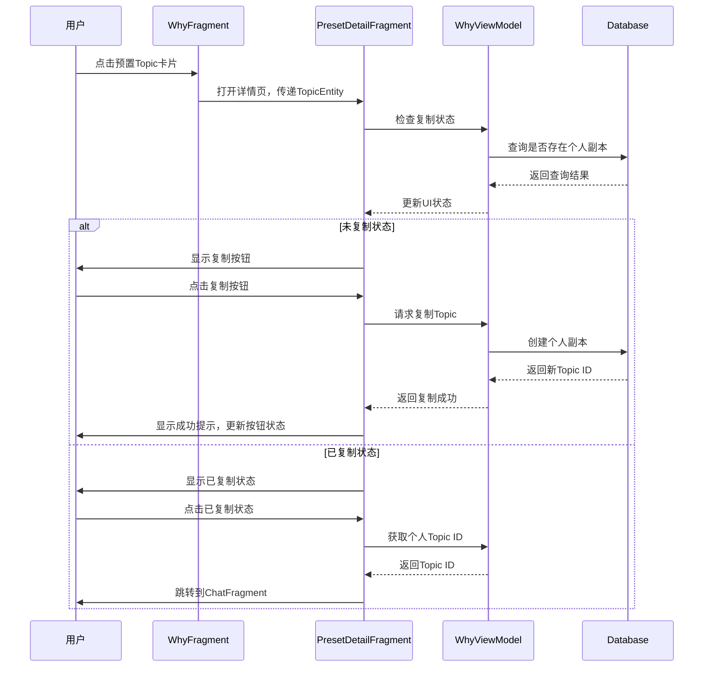
```mermaid
sequenceDiagram
    participant U as 用户
    participant WF as WhyFragment
    participant PD as PresetDetailFragment
    participant VM as WhyViewModel
    participant DB as Database
    
    U->>WF: 点击预置Topic卡片
    WF->>PD: 打开详情页，传递TopicEntity
    PD->>VM: 检查复制状态
    VM->>DB: 查询是否存在个人副本
    DB-->>VM: 返回查询结果
    VM-->>PD: 更新UI状态
    
    alt 未复制状态
        PD->>U: 显示复制按钮
        U->>PD: 点击复制按钮
        PD->>VM: 请求复制Topic
        VM->>DB: 创建个人副本
        DB-->>VM: 返回新Topic ID
        VM-->>PD: 返回复制成功
        PD->>U: 显示成功提示，更新按钮状态
    else 已复制状态
        PD->>U: 显示已复制状态
        U->>PD: 点击已复制状态
        PD->>VM: 获取个人Topic ID
        VM-->>PD: 返回Topic ID
        PD->>U: 跳转到ChatFragment
    end
```

#### 数据模型扩展

**TopicEntity 扩展字段：**

| 字段 | 类型 | 说明 |
|------|------|------|
| id | String | 主键，话题唯一标识 |
| title | String | 话题标题 |
| description | String | 话题描述 |
| createdAt | Long | 创建时间戳 |
| lastAccessed | Long | 最后访问时间戳 |
| masteryLevel | Int | 掌握程度 (0-100) |
| nextLearningGoal | String | 下一步学习目标 |
| category | String | 话题分类 |
| isPreset | Boolean | 是否为预置课程 |
| presetTopicId | String | 关联的预置课程ID（个人副本时使用） |

**PresetTopicDetail 数据模型：**

```kotlin
data class PresetTopicDetail(
    val topic: TopicEntity,
    val isCopied: Boolean,
    val personalTopicId: String?,
    val learningGoals: List<String>,
    val knowledgePoints: List<String>,
    val recommendedPath: List<String>
)
```

#### 状态管理

**WhyViewModel 状态：**

```kotlin
class WhyViewModel(application: Application) : AndroidViewModel(application) {
    
    private val _presetDetail = MutableStateFlow<PresetTopicDetail?>(null)
    val presetDetail: StateFlow<PresetTopicDetail?> = _presetDetail.asStateFlow()
    
    private val _copyInProgress = MutableStateFlow(false)
    val copyInProgress: StateFlow<Boolean> = _copyInProgress.asStateFlow()
    
    fun loadPresetTopicDetail(presetTopic: TopicEntity) {
        viewModelScope.launch {
            val personalTopic = topicRepository.getPersonalCopy(presetTopic.id)
            _presetDetail.value = PresetTopicDetail(
                topic = presetTopic,
                isCopied = personalTopic != null,
                personalTopicId = personalTopic?.id,
                learningGoals = extractLearningGoals(presetTopic),
                knowledgePoints = extractKnowledgePoints(presetTopic),
                recommendedPath = extractRecommendedPath(presetTopic)
            )
        }
    }
    
    fun copyPresetTopic(presetTopic: TopicEntity, onComplete: (Boolean) -> Unit) {
        viewModelScope.launch {
            _copyInProgress.value = true
            try {
                val personalTopic = presetTopic.copy(
                    id = UUID.randomUUID().toString(),
                    isPreset = false,
                    presetTopicId = presetTopic.id,
                    createdAt = System.currentTimeMillis()
                )
                topicRepository.insertTopic(personalTopic)
                onComplete(true)
            } catch (e: Exception) {
                _errorMessage.value = "复制课程失败: ${e.message}"
                onComplete(false)
            } finally {
                _copyInProgress.value = false
            }
        }
    }
}
```

#### Fragment交互设计

**PresetDetailFragment 生命周期：**

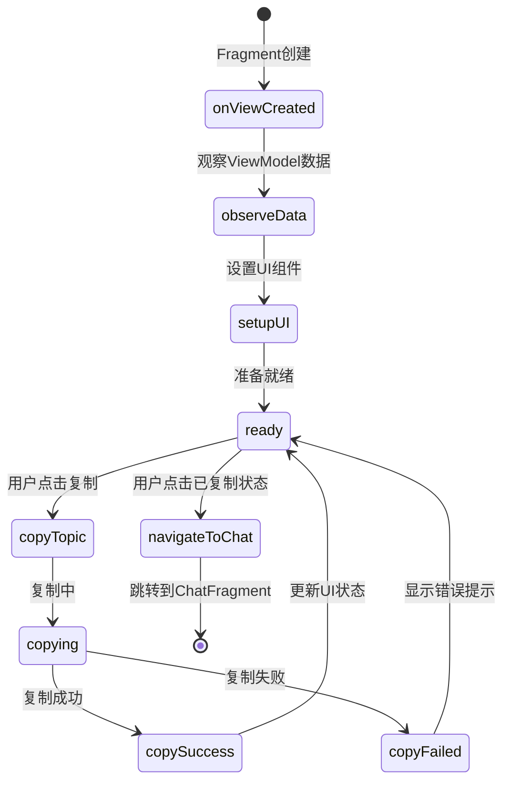
```mermaid
stateDiagram-v2
    [*] --> onViewCreated : Fragment创建
    onViewCreated --> observeData : 观察ViewModel数据
    observeData --> setupUI : 设置UI组件
    setupUI --> ready : 准备就绪
    
    ready --> copyTopic : 用户点击复制
    copyTopic --> copying : 复制中
    copying --> copySuccess : 复制成功
    copying --> copyFailed : 复制失败
    copySuccess --> ready : 更新UI状态
    copyFailed --> ready : 显示错误提示
    
    ready --> navigateToChat : 用户点击已复制状态
    navigateToChat --> [*] : 跳转到ChatFragment
```

### ChatFragment异构Item扩展

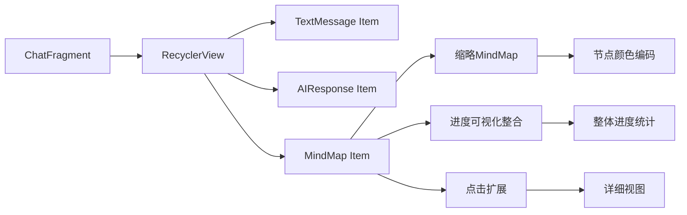
```mermaid
graph LR
    A[ChatFragment] --> B[RecyclerView]
    B --> C[TextMessage Item]
    B --> D[AIResponse Item]
    B --> E[MindMap Item]
    
    E --> F[缩略MindMap]
    E --> G[进度可视化整合]
    E --> H[点击扩展]
    
    F --> I[节点颜色编码]
    G --> J[整体进度统计]
    H --> K[详细视图]
```

### AI集成与MindMap更新流程

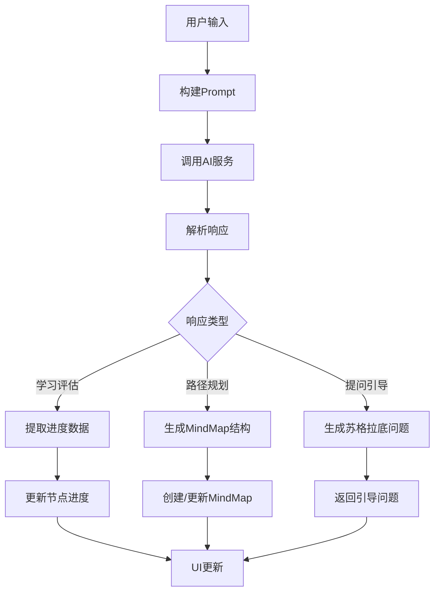
```mermaid
flowchart TD
    A[用户输入] --> B[构建Prompt]
    B --> C[调用AI服务]
    C --> D[解析响应]
    D --> E{响应类型}
    
    E -->|学习评估| F[提取进度数据]
    E -->|路径规划| G[生成MindMap结构]
    E -->|提问引导| H[生成苏格拉底问题]
    
    F --> I[更新节点进度]
    G --> J[创建/更新MindMap]
    H --> K[返回引导问题]
    
    I --> L[UI更新]
    J --> L
    K --> L
```

## 学习方法论
苏格拉底-费曼结合法
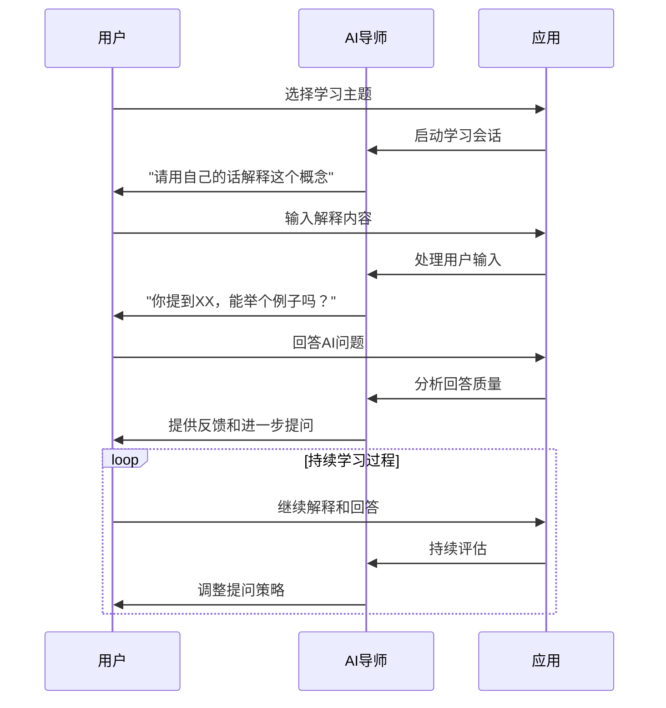
```mermaid
sequenceDiagram
    participant User as 用户
    participant AI as AI导师
    participant App as 应用
    
    User->>App: 选择学习主题
    App->>AI: 启动学习会话
    AI->>User: "请用自己的话解释这个概念"
    User->>App: 输入解释内容
    App->>AI: 处理用户输入
    AI->>User: "你提到XX，能举个例子吗？"
    User->>App: 回答AI问题
    App->>AI: 分析回答质量
    AI->>User: 提供反馈和进一步提问
    loop 持续学习过程
        User->>App: 继续解释和回答
        App->>AI: 持续评估
        AI->>User: 调整提问策略
    end
```

## 架构设计

### 整体架构流程图

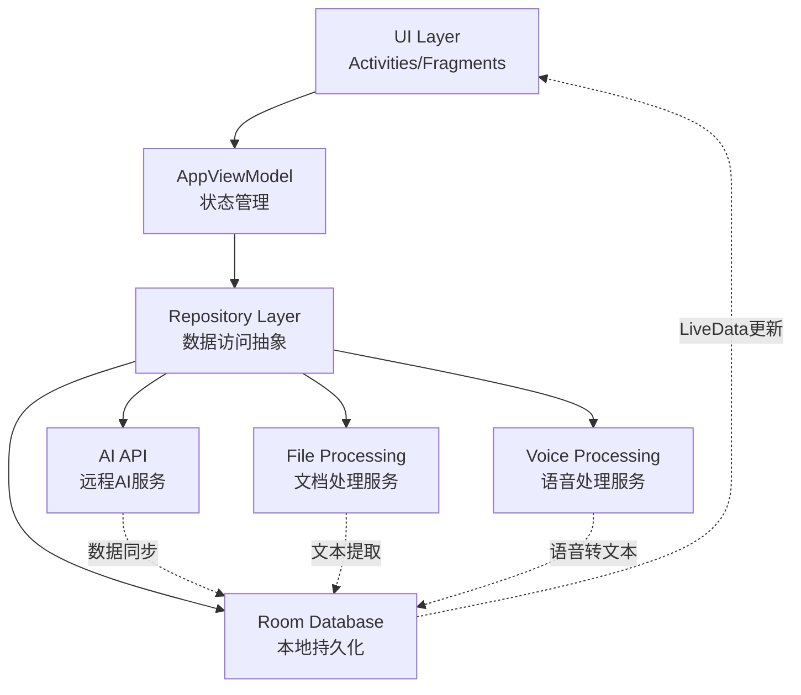
```mermaid
graph TB
    A[UI Layer<br/>Activities/Fragments] --> B[AppViewModel<br/>状态管理]
    B --> C[Repository Layer<br/>数据访问抽象]
    C --> D[Room Database<br/>本地持久化]
    C --> E[AI API<br/>远程AI服务]
    C --> F[File Processing<br/>文档处理服务]
    C --> G[Voice Processing<br/>语音处理服务]
    
    D -.->|LiveData更新| A
    E -.->|数据同步| D
    F -.->|文本提取| D
    G -.->|语音转文本| D
```

### 本地优先设计理念

采用"本地优先"（Local-First）设计，确保离线可用性和响应性：

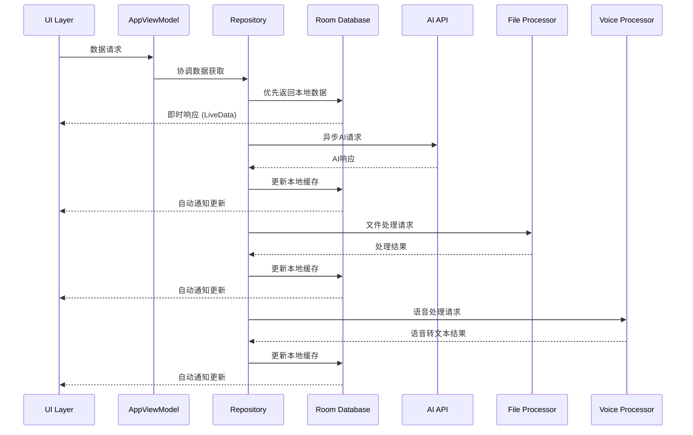
```mermaid
sequenceDiagram
    participant U as UI Layer
    participant V as AppViewModel
    participant R as Repository
    participant D as Room Database
    participant A as AI API
    participant F as File Processor
    participant G as Voice Processor
    
    U->>V: 数据请求
    V->>R: 协调数据获取
    R->>D: 优先返回本地数据
    D-->>U: 即时响应 (LiveData)
    
    R->>A: 异步AI请求
    A-->>R: AI响应
    R->>D: 更新本地缓存
    D-->>U: 自动通知更新
    
    R->>F: 文件处理请求
    F-->>R: 处理结果
    R->>D: 更新本地缓存
    D-->>U: 自动通知更新
    
    R->>G: 语音处理请求
    G-->>R: 语音转文本结果
    R->>D: 更新本地缓存
    D-->>U: 自动通知更新
```

## 核心设计模式

### 1. MVVM 模式

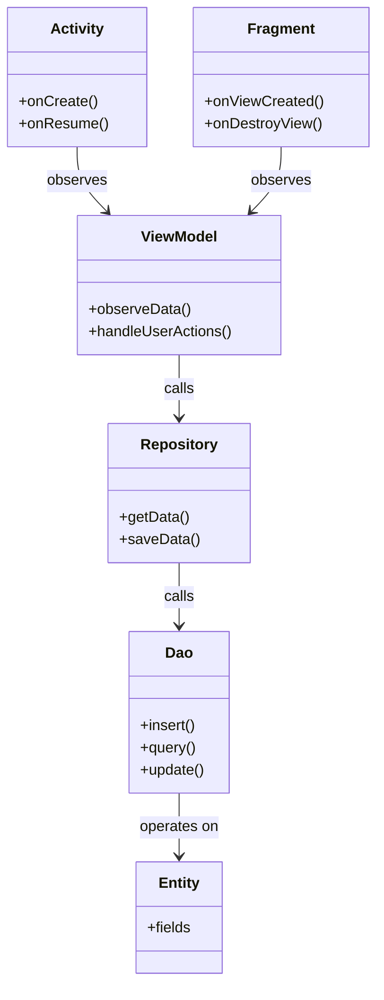
```mermaid
classDiagram
    class Activity {
        +onCreate()
        +onResume()
    }
    class Fragment {
        +onViewCreated()
        +onDestroyView()
    }
    class ViewModel {
        +observeData()
        +handleUserActions()
    }
    class Repository {
        +getData()
        +saveData()
    }
    class Dao {
        +insert()
        +query()
        +update()
    }
    class Entity {
        +fields
    }
    
    Activity --> ViewModel : observes
    Fragment --> ViewModel : observes
    ViewModel --> Repository : calls
    Repository --> Dao : calls
    Dao --> Entity : operates on
```

### 2. Repository 模式

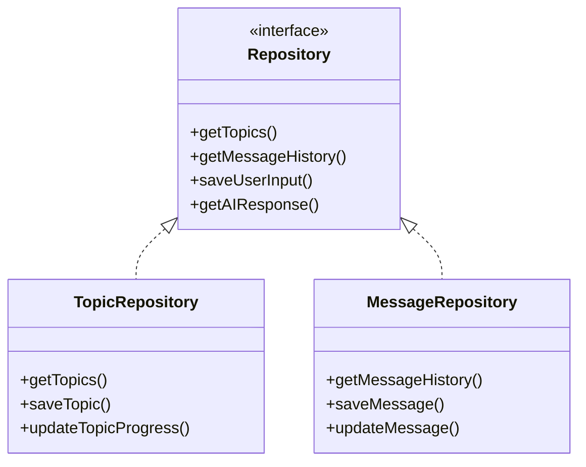
```mermaid
classDiagram
    class Repository {
        <<interface>>
        +getTopics()
        +getMessageHistory()
        +saveUserInput()
        +getAIResponse()
    }
    
    class TopicRepository {
        +getTopics()
        +saveTopic()
        +updateTopicProgress()
    }
    
    class MessageRepository {
        +getMessageHistory()
        +saveMessage()
        +updateMessage()
    }
    
    Repository <|.. TopicRepository
    Repository <|.. MessageRepository
```

### 3. 观察者模式

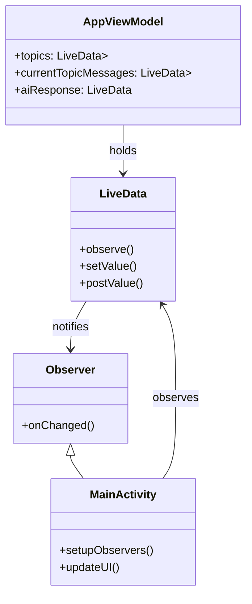
```mermaid
classDiagram
    class LiveData {
        +observe()
        +setValue()
        +postValue()
    }
    
    class Observer {
        +onChanged()
    }
    
    class AppViewModel {
        +topics: LiveData<List<Topic>>
        +currentTopicMessages: LiveData<List<Message>>
        +aiResponse: LiveData<String>
    }
    
    class MainActivity {
        +setupObservers()
        +updateUI()
    }
    
    Observer <|-- MainActivity
    LiveData --> Observer : notifies
    AppViewModel --> LiveData : holds
    MainActivity --> LiveData : observes
```

## 数据模型设计

### 核心实体关系图

根据您的要求，我们采用简化的模型，将Topic视为持续对话，并集成了MindMap功能：

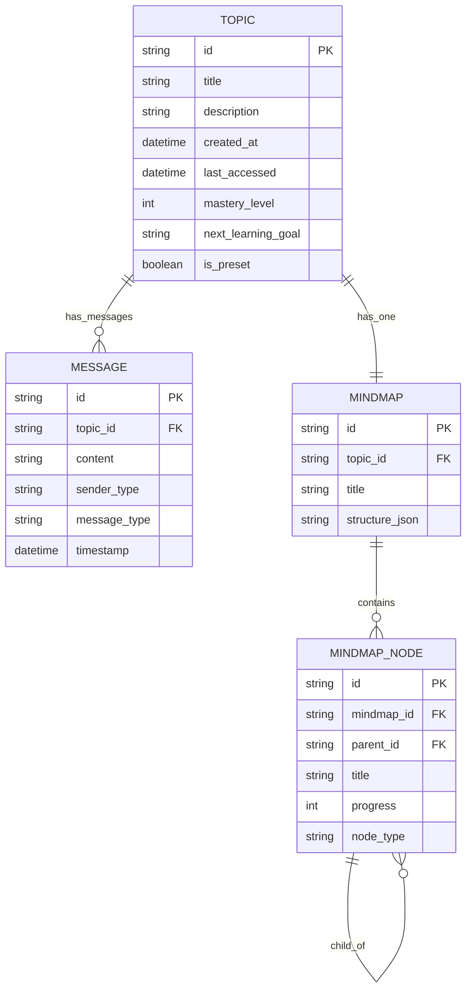
```mermaid
erDiagram
    TOPIC {
        string id PK
        string title
        string description
        datetime created_at
        datetime last_accessed
        int mastery_level
        string next_learning_goal
        boolean is_preset
    }
    
    MESSAGE {
        string id PK
        string topic_id FK
        string content
        string sender_type
        string message_type
        datetime timestamp
    }
    
    MINDMAP {
        string id PK
        string topic_id FK
        string title
        string structure_json
    }
    
    MINDMAP_NODE {
        string id PK
        string mindmap_id FK
        string parent_id FK
        string title
        int progress
        string node_type
    }
    
    TOPIC ||--|| MINDMAP : has_one
    TOPIC ||--o{ MESSAGE : has_messages
    MINDMAP ||--o{ MINDMAP_NODE : contains
    MINDMAP_NODE ||--o{ MINDMAP_NODE : child_of
```

### 数据库实体定义

**TopicEntity 实体结构：**

| 字段 | 类型 | 说明 |
|------|------|------|
| id | String | 主键，话题唯一标识 |
| title | String | 话题标题 |
| description | String | 话题描述 |
| createdAt | Long | 创建时间戳 |
| lastAccessed | Long | 最后访问时间戳 |
| masteryLevel | Int | 掌握程度 (0-100) |
| nextLearningGoal | String | 下一步学习目标 |
| category | String | 话题分类 |

**MessageEntity 实体结构：**

| 字段 | 类型 | 说明 |
|------|------|------|
| id | String | 主键，消息唯一标识 |
| topicId | String | 外键，关联话题ID |
| content | String | 消息内容 |
| senderType | String | 发送者类型 (USER, AI) |
| messageType | String | 消息类型 (TEXT, AUDIO, FILE_CONTENT) |
| timestamp | Long | 时间戳 |

### 异构Items数据模型

**TOPICS Fragment 异构Items：**

| Item类型 | 数据模型 | 说明 |
|---------|---------|------|
| TopicCardItem | TopicCardData | 话题卡片，包含标题、进度、描述 |
| ProgressCardItem | ProgressSummaryData | 进度概览卡片，显示整体学习进度 |
| RecentActivityItem | ActivityData | 最近活动记录 |

**WHY Fragment 异构Items：**

| Item类型 | 数据模型 | 说明 |
|---------|---------|------|
| AppIntroItem | AppIntroData | 应用介绍卡片 |
| UsageGuideItem | GuideData | 使用指南步骤 |
| FeaturePromoItem | PromoData | 功能推广卡片 |
| PresetTopicItem | TopicEntity | 预置课程卡片，用户可复制到自己的学习列表 |

**SETTINGS Fragment 异构Items：**

| Item类型 | 数据模型 | 说明 |
|---------|---------|------|
| UserProfileItem | ProfileData | 用户资料设置 |
| AISettingsItem | AISettingData | AI模型和参数设置 |
| AppPreferenceItem | PreferenceData | 应用偏好设置 |

## 多模态输入系统

### 输入处理架构

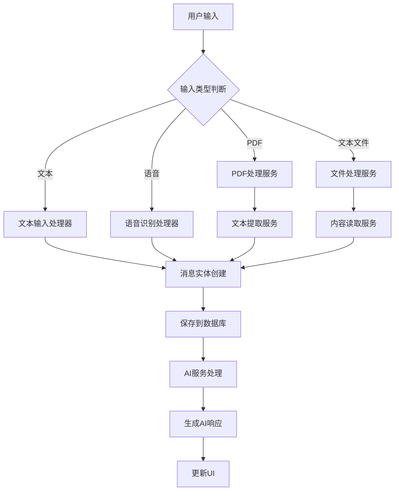
```mermaid
graph TD
    A[用户输入] --> B{输入类型判断}
    B -->|文本| C[文本输入处理器]
    B -->|语音| D[语音识别处理器]
    B -->|PDF| E[PDF处理服务]
    B -->|文本文件| F[文件处理服务]
    
    C --> G[消息实体创建]
    D --> G
    E --> H[文本提取服务]
    H --> G
    F --> I[内容读取服务]
    I --> G
    
    G --> J[保存到数据库]
    J --> K[AI服务处理]
    K --> L[生成AI响应]
    L --> M[更新UI]
```

### 文件处理流程

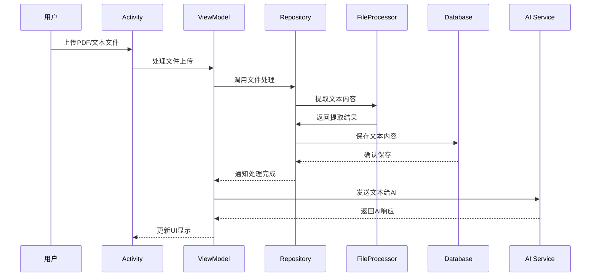
```mermaid
sequenceDiagram
    participant U as 用户
    participant A as Activity
    participant VM as ViewModel
    participant R as Repository
    participant FP as FileProcessor
    participant DB as Database
    participant AI as AI Service
    
    U->>A: 上传PDF/文本文件
    A->>VM: 处理文件上传
    VM->>R: 调用文件处理
    R->>FP: 提取文本内容
    FP->>R: 返回提取结果
    R->>DB: 保存文本内容
    DB-->>R: 确认保存
    R-->>VM: 通知处理完成
    VM->>AI: 发送文本给AI
    AI-->>VM: 返回AI响应
    VM-->>A: 更新UI显示
```

## AI 集成架构

### 多模型可切换AI服务设计

应用支持多种AI大模型的无缝切换，用户可以根据需求选择最适合的AI服务：


```mermaid
classDiagram
    class AIService {
        <<interface>>
        +sendMessage()
        +processFileContent()
        +getModelName()
    }
    
    class DoubaoAIService {
        +sendMessage()
        +processFileContent()
        +getModelName()
    }
    
    class DeepSeekAIService {
        +sendMessage()
        +processFileContent()
        +getModelName()
    }
    
    class MinimaxAIService {
        +sendMessage()
        +processFileContent()
        +getModelName()
    }
    
    class KimiAIService {
        +sendMessage()
        +processFileContent()
        +getModelName()
    }
    
    class OpenAIService {
        +sendMessage()
        +processFileContent()
        +getModelName()
    }
    
    class ErnieAIService {
        +sendMessage()
        +processFileContent()
        +getModelName()
    }
    
    class QwenAIService {
        +sendMessage()
        +processFileContent()
        +getModelName()
    }
    
    class ZhipuAIService {
        +sendMessage()
        +processFileContent()
        +getModelName()
    }
    
    class SparkAIService {
        +sendMessage()
        +processFileContent()
        +getModelName()
    }
    
    class HunyuanAIService {
        +sendMessage()
        +processFileContent()
        +getModelName()
    }
    
    class BaichuanAIService {
        +sendMessage()
        +processFileContent()
        +getModelName()
    }
    
    class LingyiAIService {
        +sendMessage()
        +processFileContent()
        +getModelName()
    }
    
    class JieyueAIService {
        +sendMessage()
        +processFileContent()
        +getModelName()
    }
    
    class AppViewModel {
        -aiService: AIService
        +setAIService()
        +sendUserMessage()
    }
    
    AIService <|.. DoubaoAIService
    AIService <|.. DeepSeekAIService
    AIService <|.. MinimaxAIService
    AIService <|.. KimiAIService
    AIService <|.. OpenAIService
    AIService <|.. ErnieAIService
    AIService <|.. QwenAIService
    AIService <|.. ZhipuAIService
    AIService <|.. SparkAIService
    AIService <|.. HunyuanAIService
    AIService <|.. BaichuanAIService
    AIService <|.. LingyiAIService
    AIService <|.. JieyueAIService
    AppViewModel --> AIService
```

#### 支持的AI模型列表

应用支持以下14种主流AI大模型：

| AI模型 | 厂商 | 特点 | 适用场景 |
|--------|------|------|----------|
| 豆包AI | 字节跳动 | 中文理解强，上下文长 | 日常对话、知识问答 |
| DeepSeek | DeepSeek | 开源模型，免费使用 | 编程、技术问题 |
| MiniMax | MiniMax | 多模态能力强 | 创意写作、图像理解 |
| Kimi | 月之暗面 | 超长上下文支持 | 文档分析、长文本处理 |
| OpenAI | OpenAI | 国际领先，通用性强 | 多语言、复杂推理 |
| 文心一言 | 百度 | 中文优化，知识丰富 | 中文内容创作 |
| 通义千问 | 阿里云 | 企业级服务 | 商业应用、数据分析 |
| 智谱AI | 智谱华章 | 学术背景强 | 科研、学术写作 |
| 讯飞星火 | 科大讯飞 | 语音交互优势 | 语音转文本场景 |
| 混元AI | 腾讯 | 多模态融合 | 游戏、娱乐应用 |
| 百川AI | 百川智能 | 开源模型 | 开发者、研究用途 |
| 零一万物 | 零一万物 | 垂直领域优化 | 专业领域应用 |
| 阶跃AI | 阶跃星辰 | 新兴模型 | 创新应用测试 |

#### AI模型切换流程

```mermaid
sequenceDiagram
    participant U as 用户
    participant SF as SettingsFragment
    participant VM as AppViewModel
    participant R as Repository
    participant AI as 当前AI服务
    
    U->>SF: 进入设置界面
    SF->>VM: 加载当前AI设置
    VM-->>SF: 显示当前AI模型
    
    U->>SF: 选择新的AI模型
    SF->>VM: 请求切换AI服务
    VM->>R: 更新AI配置
    R-->>VM: 确认配置更新
    VM->>AI: 切换AI服务实例
    VM-->>SF: 通知切换成功
    SF-->>U: 显示切换结果
    
    Note over U,AI: 后续对话将使用新选择的AI模型
```

## UI 架构

### 主界面布局

```mermaid
graph TB
    A[MainActivity] --> B[TOPICS Fragment]
    A --> C[WHY Fragment]
    A --> D[SETTINGS Fragment]
    
    B --> E[RecyclerView - 异构Items]
    C --> F[RecyclerView - 异构Items]
    D --> G[RecyclerView - 异构Items]
    
    E --> H[Topic Card with Progress]
    E --> J[Recent Activity]
    
    F --> K[App Introduction]
    F --> L[Usage Guide]
    F --> M[Feature Promotion]
    
    G --> N[User Profile]
    G --> O[AI Settings]
    G --> P[App Preferences]
    
    B --> Q[Topic Selection]
    Q --> R[ChatFragment]
    R --> S[Message RecyclerView]
    R --> T[Input Controls]
    S --> U[自然语言进度查询]
```

**界面架构说明：**
- **TOPICS Fragment**: 主题管理和学习入口
  - 支持异构items：带进度的话题卡片、最近活动
  - 话题卡片直接显示进度摘要，无需单独的进度卡片
  - 点击话题卡片进入ChatFragment开始学习
- **WHY Fragment**: 应用介绍和功能推广
  - 支持异构items：应用介绍、使用指南、功能推广
  - 帮助用户了解应用价值和使用方法
- **SETTINGS Fragment**: 用户设置和偏好
  - 支持异构items：用户资料、AI设置、应用偏好
  - 提供个性化配置选项

**交互流程：**
1. 用户从TOPICS Fragment选择话题
2. 进入ChatFragment进行学习对话
3. 在对话中可直接使用自然语言查询进度
4. 返回主界面查看其他功能

## 数据流与状态管理

### 响应式数据流

```mermaid
sequenceDiagram
    participant UI as UI Layer
    participant VM as ViewModel
    participant R as Repository
    participant DB as Room Database
    participant AI as AI Service
    
    UI->>VM: 用户操作
    VM->>R: 数据请求/更新
    R->>DB: 本地操作
    DB-->>VM: LiveData更新
    VM-->>UI: UI更新
    
    R->>AI: AI请求
    AI-->>R: AI响应
    R->>DB: 保存响应
    DB-->>UI: 自动更新
    
    Note over UI,AI: 进度查询流程
    UI->>VM: "请总结一下我的学习进度"
    VM->>R: 请求进度分析
    R->>DB: 获取学习数据
    DB-->>R: 返回学习记录
    R->>AI: 发送进度分析请求
    AI-->>R: 生成智能进度报告
    R->>VM: 返回进度分析
    VM-->>UI: 在对话中显示进度总结
```

### 话题状态管理

```mermaid
stateDiagram-v2
    [*] --> Idle : 应用启动
    Idle --> TopicSelection : 用户打开应用
    TopicSelection --> ChatActive : 选择话题开始对话
    ChatActive --> MessageProcessing : 用户发送消息
    MessageProcessing --> AIResponding : 等待AI响应
    AIResponding --> ChatActive : AI响应完成
    ChatActive --> TopicSelection : 返回话题选择
    ChatActive --> [*] : 应用退出
```

## 文件处理服务

### PDF 文本提取流程

```mermaid
flowchart TD
    A[用户上传PDF] --> B[检查文件格式]
    B --> C{是否为PDF?}
    C -->|是| D[使用PdfBox库]
    C -->|否| E[使用文件读取器]
    
    D --> F[提取文本内容]
    E --> F
    
    F --> G[处理文本格式]
    G --> H[保存到数据库]
    H --> I[AI处理文本]
    I --> J[生成响应消息]
    J --> K[更新UI显示]
```

## 学习进度跟踪

### 智能进度评估

```mermaid
graph TD
    A[用户回答] --> B[AI分析回答质量]
    B --> C{理解程度评估}
    C -->|高| D[标记为掌握]
    C -->|中| E[识别知识缺口]
    C -->|低| F[建议复习]
    
    D --> G[更新掌握度]
    E --> H[记录薄弱环节]
    F --> I[生成复习计划]
    
    G --> J[推荐下一步学习]
    H --> J
    I --> J
    J --> K[更新进度卡片]
```

## 核心组件交互

### 主要交互流程

```mermaid
sequenceDiagram
    participant User as 用户
    participant UI as MainActivity
    participant VM as AppViewModel
    participant Repo as Repository
    participant DB as RoomDatabase
    participant AI as AIClient
    participant FP as FileProcessor
    
    User->>UI: 启动应用
    UI->>VM: 初始化
    VM->>Repo: 加载话题列表
    Repo->>DB: 查询话题
    DB-->>VM: 返回话题列表
    VM-->>UI: 更新话题列表
    
    User->>UI: 选择话题
    UI->>VM: 开始对话
    VM->>Repo: 加载话题消息历史
    Repo->>DB: 查询消息历史
    DB-->>VM: 返回消息历史
    VM-->>UI: 切换到对话界面
    
    User->>UI: 发送消息/上传文件
    UI->>VM: 处理输入
    alt 文本消息
        VM->>Repo: 保存消息
        Repo->>DB: 保存到数据库
        VM->>AI: 发送AI请求
        AI-->>VM: 返回AI响应
    else 文件上传
        VM->>FP: 处理文件
        FP-->>VM: 返回文本内容
        VM->>Repo: 保存消息
        Repo->>DB: 保存到数据库
        VM->>AI: 发送AI请求
        AI-->>VM: 返回AI响应
    end
    Repo->>DB: 保存AI响应
    DB-->>UI: LiveData通知更新
    UI-->>User: 显示对话
```

## 数据持久化策略

### 本地数据库设计

```mermaid
erDiagram
    TOPIC {
        string id PK "话题ID"
        string title "话题标题"
        string description "话题描述"
        int mastery_level "掌握程度"
        string next_goal "下一步目标"
        long created_at "创建时间"
        long updated_at "更新时间"
    }
    
    MESSAGE {
        string id PK "消息ID"
        string topic_id FK "话题ID"
        string content "消息内容"
        string sender_type "发送者类型"
        string message_type "消息类型"
        long timestamp "时间戳"
    }
    
    TOPIC ||--o{ MESSAGE : hasMany
    
    FILE_ATTACHMENT {
        string id PK "附件ID"
        string message_id FK "消息ID"
        string file_path "文件路径"
        string extracted_text "提取文本"
        string file_type "文件类型"
    }
```

## 错误处理与恢复

### 错误处理策略

```mermaid
graph TD
    A[发生错误] --> B{错误类型}
    B -->|网络错误| C[使用缓存数据]
    B -->|AI服务错误| D[显示友好提示]
    B -->|文件处理错误| E[提示重新上传]
    B -->|数据库错误| F[数据恢复机制]
    
    C --> G[降级到离线模式]
    D --> H[重试机制]
    E --> I[错误日志记录]
    F --> J[数据完整性检查]
    
    G --> K[通知用户]
    H --> L[自动重试]
    I --> M[用户手动重试]
    J --> N[数据同步]
```

## 性能优化

### 缓存策略

```mermaid
graph LR
    A[数据请求] --> B{缓存检查}
    B -->|缓存命中| C[返回缓存数据]
    B -->|缓存未命中| D[请求网络/AI服务]
    D --> E[更新缓存]
    E --> F[返回数据]
    C --> G[UI更新]
    F --> G
```

## MindMap集成设计

### 智能学习路径管理

Teach It Back集成了智能MindMap功能，为每个学习话题提供可视化的学习路径和进度跟踪。

#### 数据模型关系

```mermaid
erDiagram
    TOPIC {
        string id PK
        string title
        string description
        datetime created_at
        datetime last_accessed
        int mastery_level
        string next_learning_goal

        boolean is_preset
    }
    
    MINDMAP {
        string id PK
        string topic_id FK
        string title
        string structure_json
    }
    
    MINDMAP_NODE {
        string id PK
        string mindmap_id FK
        string parent_id FK
        string title
        int progress
        string node_type
    }
    
    TOPIC ||--|| MINDMAP : has_one
    MINDMAP ||--o{ MINDMAP_NODE : contains
    MINDMAP_NODE ||--o{ MINDMAP_NODE : child_of
```

#### MindMap实体定义

**MindMapEntity 实体结构：**

| 字段 | 类型 | 说明 |
|------|------|------|
| id | String | 主键，MindMap唯一标识 |
| topicId | String | 外键，关联话题ID |
| title | String | MindMap标题 |
| structure | String | MindMap结构JSON |

**MindMapNode 实体结构：**

| 字段 | 类型 | 说明 |
|------|------|------|
| id | String | 主键，节点唯一标识 |
| mindMapId | String | 外键，关联MindMap ID |
| parentId | String | 父节点ID（可为空） |
| title | String | 节点标题 |
| progress | Int | 学习进度 (0-100) |
| nodeType | String | 节点类型（根节点、子节点等） |

#### 预置课程系统

应用提供预置课程系统，包含标准化的MindMap结构：

```mermaid
graph TB
    A[预置课程分类] --> B[高中课程]
    A --> C[大学基础课程]
    A --> D[专业技能课程]
    
    B --> E[高中三年级生物]
    B --> F[高中物理]
    B --> G[高中化学]
    
    C --> H[微积分基础]
    C --> I[编程入门]
    C --> J[经济学原理]
    
    D --> K[项目管理]
    D --> L[数据分析]
    D --> M[沟通技巧]
    
    E --> N[标准MindMap结构]
    F --> O[标准MindMap结构]
    G --> P[标准MindMap结构]
    
    N --> Q[个性化学习路径]
    O --> Q
    P --> Q
    Q --> R[开始智能学习]
```

#### ChatFragment异构Item扩展

MindMap作为ChatFragment中的异构Item类型集成：

```mermaid
graph LR
    A[ChatFragment] --> B[RecyclerView]
    B --> C[TextMessage Item]
    B --> D[AIResponse Item]
    B --> E[MindMap Item]
    
    E --> F[缩略MindMap视图]
    E --> G[进度可视化]
    E --> H[点击展开功能]
    
    F --> I[节点颜色编码: 红黄绿]
    G --> J[整体进度统计]
    H --> K[详细树形结构]
```

#### AI驱动的进度评估

AI服务根据用户对话内容自动评估学习进度并更新MindMap：

```mermaid
stateDiagram-v2
    [*] --> 课程选择
    课程选择 --> 预置路径 : 选择标准课程
    课程选择 --> 自定义目标 : 输入个性化目标
    
    预置路径 --> 路径个性化 : AI根据目标微调
    自定义目标 --> 路径生成 : AI分析生成
    
    路径个性化 --> 节点学习
    路径生成 --> 节点学习
    
    节点学习 --> 对话评估 : 用户回答
    对话评估 --> 进度更新 : AI评估
    进度更新 --> 下一步决策 : 分析结果
    
    下一步决策 --> 深化学习 : 掌握不足
    下一步决策 --> 新节点 : 掌握良好
    下一步决策 --> 复习巩固 : 需要强化
    
    深化学习 --> 节点学习
    新节点 --> 节点学习
    复习巩固 --> 节点学习
    
    节点学习 --> [*] : 学习完成
```

#### 进度可视化设计

```mermaid
graph TD
    A[用户回答] --> B[AI分析]
    B --> C{理解程度}
    
    C -->|优秀 80-100%| D[标记为掌握]
    C -->|良好 60-79%| E[建议深化]
    C -->|一般 40-59%| F[指出误区]
    C -->|不足 0-39%| G[重新讲解]
    
    D --> H[进度+20]
    E --> I[进度+10]
    F --> J[进度+5]
    G --> K[进度不变]
    
    H --> L[更新MindMap]
    I --> L
    J --> L
    K --> L
```

### 技术实现特性

1. **树形结构支持**：支持多层嵌套的树形结构，最多可达4层深度
2. **实时进度更新**：基于AI对话分析自动更新节点进度
3. **颜色编码系统**：红黄绿颜色编码直观显示学习状态
4. **预置课程库**：包含多个学科的标准化MindMap结构
5. **交互式UI**：支持节点展开/折叠、点击学习等交互

### 最新功能特性

#### 预置课程系统
- 提供11个标准化预置课程：高中数学、高中物理、高中化学、高中生物、高中英语、高中历史、高中地理、高中政治、CFP财务规划、编程入门、经济学原理
- 预置课程详情页展示：学习目标、知识点概览、推荐学习路径
- 一键复制功能：将预置课程复制到个人学习列表
- 复制状态管理：防止重复复制，显示已复制状态
- MindMap自动关联：复制课程时自动复制对应的MindMap结构

#### TopicsFragment空状态设计
- 初始空白状态：首次安装应用时TopicsFragment显示空白
- 空状态引导提示：提示用户创建自己的学习主题或从预置课程复制
- 预置课程独立显示：预置课程只在WHY Fragment显示，不在TopicsFragment显示
- 用户主题管理：用户创建或复制的主题在TopicsFragment中管理

#### ChatFragment智能MindMap显示
- 动态位置调整：根据消息数量智能调整MindMap显示位置
- 消息少于10个：MindMap显示在第一个位置
- 消息大于等于10个：MindMap显示在倒数第10个位置
- 自动加载机制：进入ChatFragment时自动加载并显示MindMap
- 可配置参数：MindMap显示位置参数可配置（当前设置为10）

#### 数据初始化优化
- 移除Demo数据：初始化时不再创建demo topics
- 预置课程初始化：自动创建预置课程及其MindMap结构
- 空白状态准备：确保TopicsFragment初始状态为空白
- MindMap完整性：所有预置课程都有对应的MindMap结构

### 系统架构扩展

```mermaid
graph TB
    A[UI Layer] --> B[ViewModel]
    B --> C[Repository]
    C --> D[Room Database]
    C --> E[AI Service]
    
    subgraph "MindMap组件"
        F[MindMap Manager]
        G[Progress Tracker]
        H[Learning Path Planner]
    end
    
    B --> F
    F --> G
    F --> H
    G --> D
    H --> E
```

这个设计文档涵盖了Teach It Back应用的核心架构，包括MVVM模式、本地优先存储、多模态输入处理以及智能MindMap集成等关键技术，并使用mermaid图表清晰地表达了各个设计概念和组件关系。MindMap功能为学习过程提供了可视化的路径指导和进度跟踪，增强了用户的学习体验。