# Teach It Back 应用程序设计文档

## 概述

Teach It Back 是一款基于苏格拉底教学法和费曼学习法的AI驱动学习应用，用户通过APP直接向AI讲解知识，AI评估用户的理解程度来深化学习效果。用户将所学知识"教回"给AI，AI通过智能提问和反馈来检验和强化用户的知识掌握情况。

## 核心交互流程

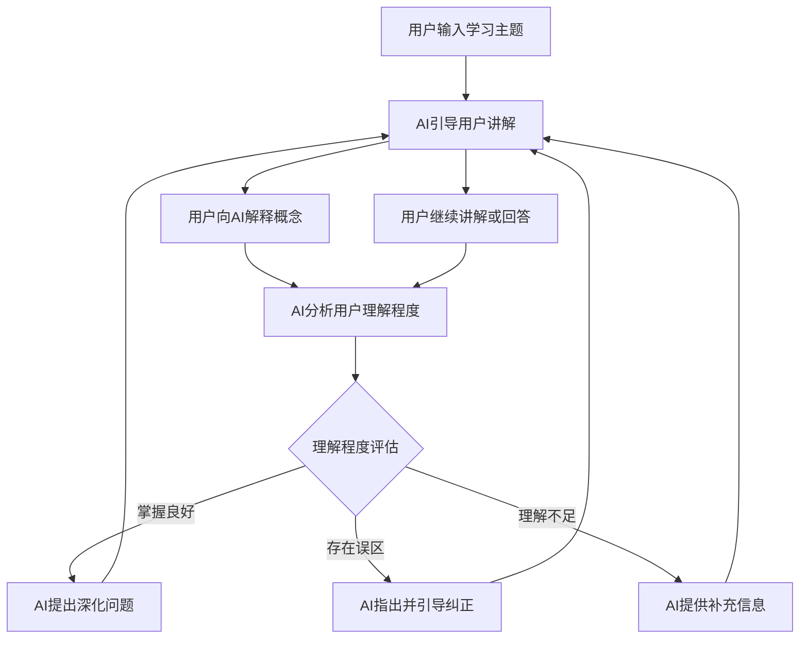
```mermaid
graph TD
    A[用户输入学习主题] --> B[AI引导用户讲解]
    B --> C[用户向AI解释概念]
    C --> D[AI分析用户理解程度]
    D --> E{理解程度评估}
    E -->|掌握良好| F[AI提出深化问题]
    E -->|存在误区| G[AI指出并引导纠正]
    E -->|理解不足| H[AI提供补充信息]
    F --> B
    G --> B
    H --> B
    B --> I[用户继续讲解或回答]
    I --> D
```

## 学习方法论
苏格拉底-费曼结合法
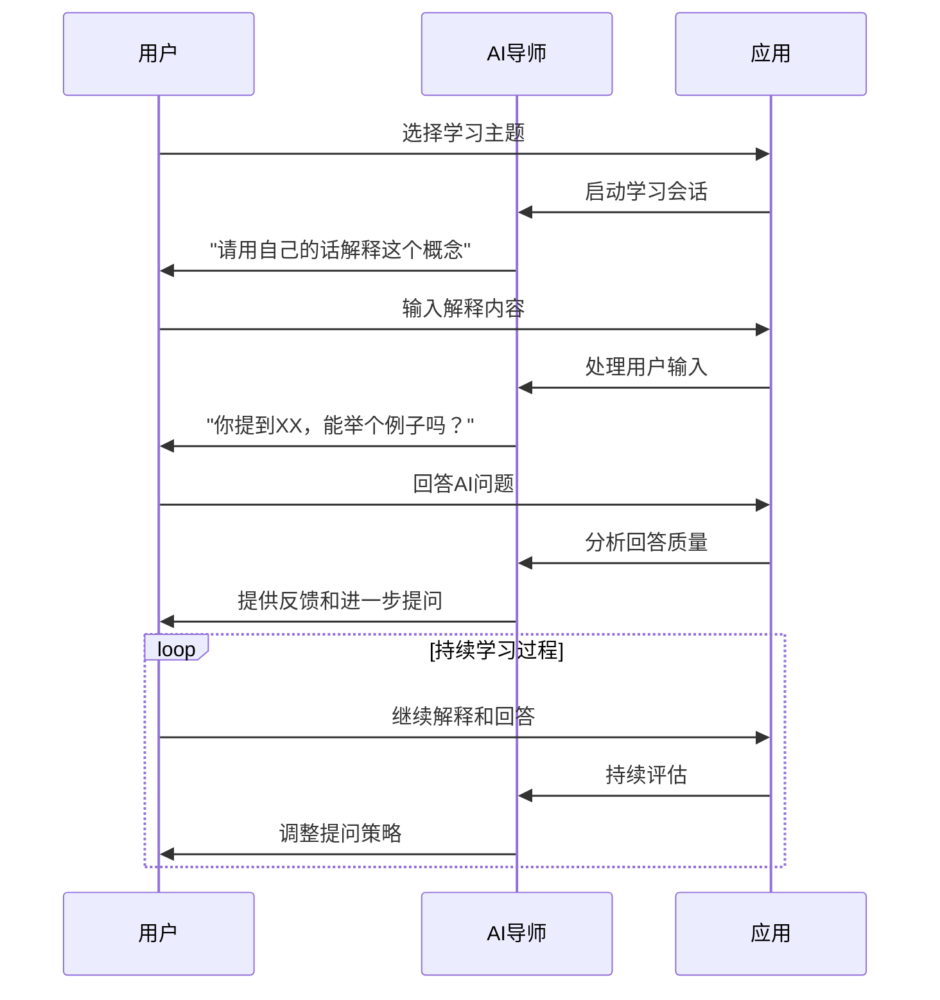
```mermaid
sequenceDiagram
    participant User as 用户
    participant AI as AI导师
    participant App as 应用
    
    User->>App: 选择学习主题
    App->>AI: 启动学习会话
    AI->>User: "请用自己的话解释这个概念"
    User->>App: 输入解释内容
    App->>AI: 处理用户输入
    AI->>User: "你提到XX，能举个例子吗？"
    User->>App: 回答AI问题
    App->>AI: 分析回答质量
    AI->>User: 提供反馈和进一步提问
    loop 持续学习过程
        User->>App: 继续解释和回答
        App->>AI: 持续评估
        AI->>User: 调整提问策略
    end
```

## 架构设计

### 整体架构流程图

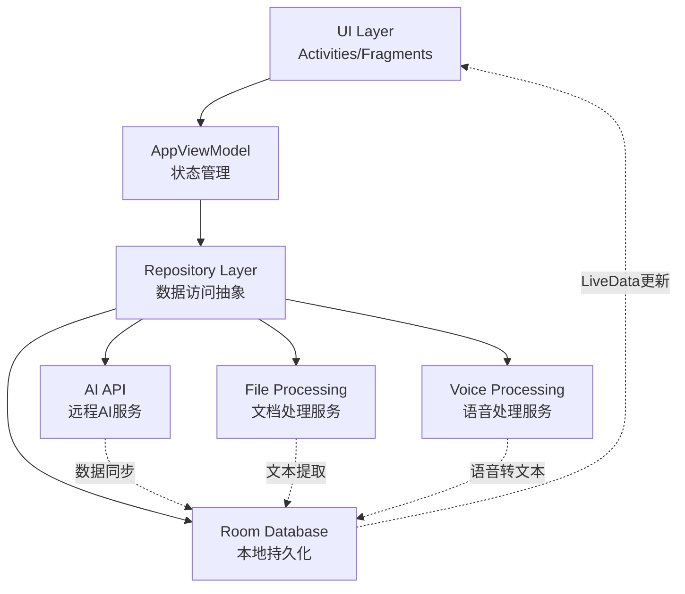
```mermaid
graph TB
    A[UI Layer<br/>Activities/Fragments] --> B[AppViewModel<br/>状态管理]
    B --> C[Repository Layer<br/>数据访问抽象]
    C --> D[Room Database<br/>本地持久化]
    C --> E[AI API<br/>远程AI服务]
    C --> F[File Processing<br/>文档处理服务]
    C --> G[Voice Processing<br/>语音处理服务]
    
    D -.->|LiveData更新| A
    E -.->|数据同步| D
    F -.->|文本提取| D
    G -.->|语音转文本| D
```

### 本地优先设计理念

采用"本地优先"（Local-First）设计，确保离线可用性和响应性：

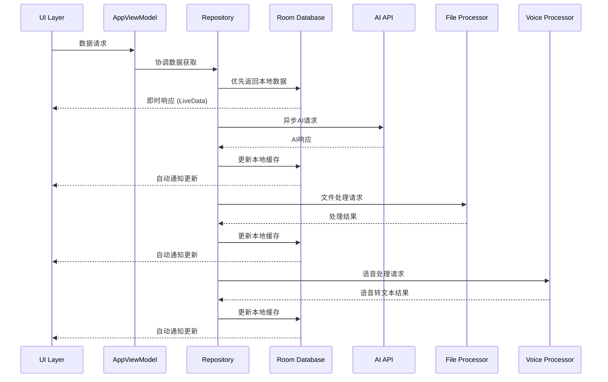
```mermaid
sequenceDiagram
    participant U as UI Layer
    participant V as AppViewModel
    participant R as Repository
    participant D as Room Database
    participant A as AI API
    participant F as File Processor
    participant G as Voice Processor
    
    U->>V: 数据请求
    V->>R: 协调数据获取
    R->>D: 优先返回本地数据
    D-->>U: 即时响应 (LiveData)
    
    R->>A: 异步AI请求
    A-->>R: AI响应
    R->>D: 更新本地缓存
    D-->>U: 自动通知更新
    
    R->>F: 文件处理请求
    F-->>R: 处理结果
    R->>D: 更新本地缓存
    D-->>U: 自动通知更新
    
    R->>G: 语音处理请求
    G-->>R: 语音转文本结果
    R->>D: 更新本地缓存
    D-->>U: 自动通知更新
```

## 核心设计模式

### 1. MVVM 模式

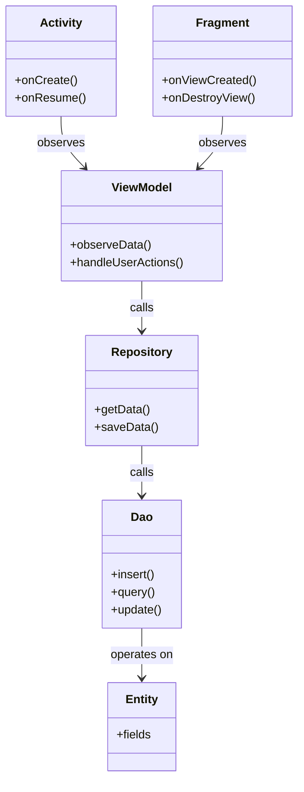
```mermaid
classDiagram
    class Activity {
        +onCreate()
        +onResume()
    }
    class Fragment {
        +onViewCreated()
        +onDestroyView()
    }
    class ViewModel {
        +observeData()
        +handleUserActions()
    }
    class Repository {
        +getData()
        +saveData()
    }
    class Dao {
        +insert()
        +query()
        +update()
    }
    class Entity {
        +fields
    }
    
    Activity --> ViewModel : observes
    Fragment --> ViewModel : observes
    ViewModel --> Repository : calls
    Repository --> Dao : calls
    Dao --> Entity : operates on
```

### 2. Repository 模式

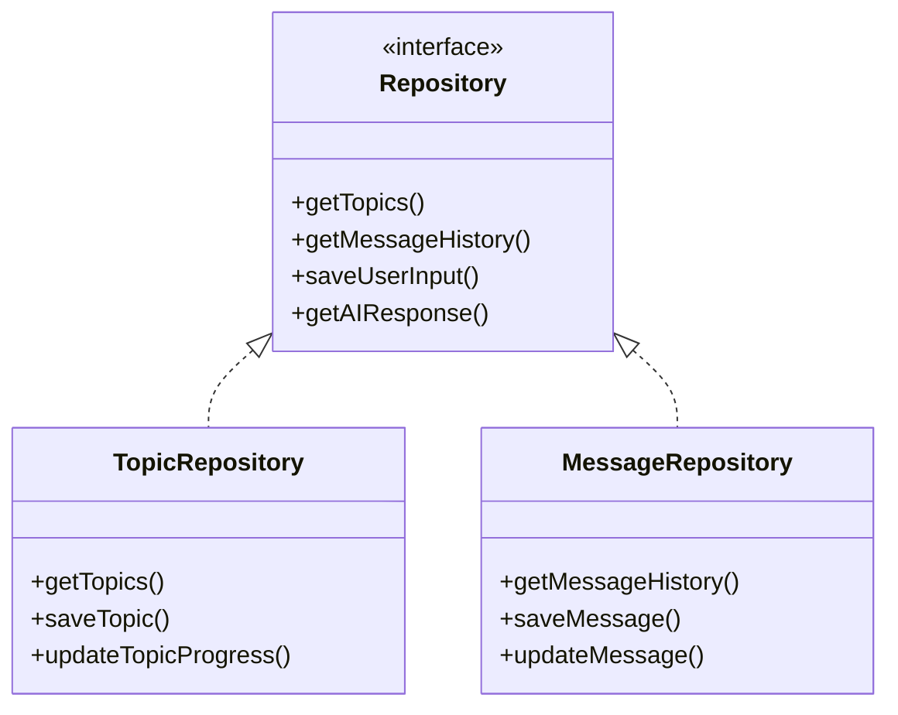
```mermaid
classDiagram
    class Repository {
        <<interface>>
        +getTopics()
        +getMessageHistory()
        +saveUserInput()
        +getAIResponse()
    }
    
    class TopicRepository {
        +getTopics()
        +saveTopic()
        +updateTopicProgress()
    }
    
    class MessageRepository {
        +getMessageHistory()
        +saveMessage()
        +updateMessage()
    }
    
    Repository <|.. TopicRepository
    Repository <|.. MessageRepository
```

### 3. 观察者模式

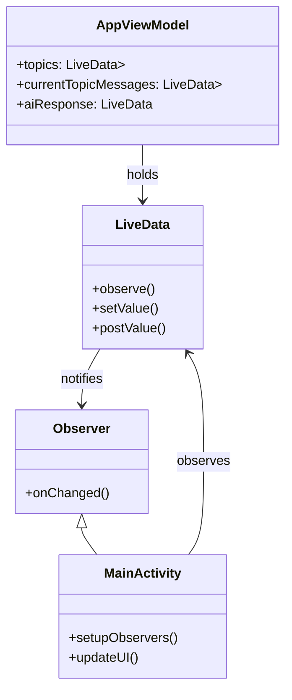
```mermaid
classDiagram
    class LiveData {
        +observe()
        +setValue()
        +postValue()
    }
    
    class Observer {
        +onChanged()
    }
    
    class AppViewModel {
        +topics: LiveData<List<Topic>>
        +currentTopicMessages: LiveData<List<Message>>
        +aiResponse: LiveData<String>
    }
    
    class MainActivity {
        +setupObservers()
        +updateUI()
    }
    
    Observer <|-- MainActivity
    LiveData --> Observer : notifies
    AppViewModel --> LiveData : holds
    MainActivity --> LiveData : observes
```

## 数据模型设计

### 核心实体关系图

根据您的要求，我们采用简化的模型，将Topic视为持续对话：

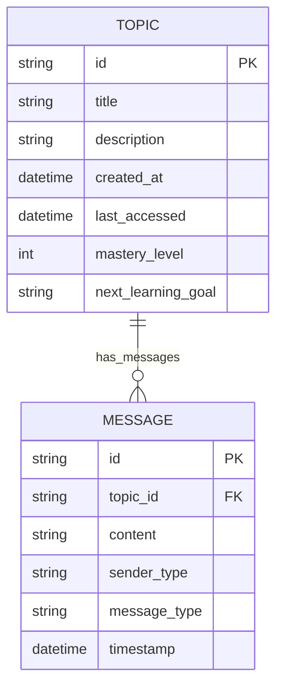
```mermaid
erDiagram
    TOPIC {
        string id PK
        string title
        string description
        datetime created_at
        datetime last_accessed
        int mastery_level
        string next_learning_goal
    }
    
    MESSAGE {
        string id PK
        string topic_id FK
        string content
        string sender_type
        string message_type
        datetime timestamp
    }
    
    TOPIC ||--o{ MESSAGE : "has_messages"
```

### 数据库实体定义

**TopicEntity 实体结构：**

| 字段 | 类型 | 说明 |
|------|------|------|
| id | String | 主键，话题唯一标识 |
| title | String | 话题标题 |
| description | String | 话题描述 |
| createdAt | Long | 创建时间戳 |
| lastAccessed | Long | 最后访问时间戳 |
| masteryLevel | Int | 掌握程度 (0-100) |
| nextLearningGoal | String | 下一步学习目标 |
| category | String | 话题分类 |

**MessageEntity 实体结构：**

| 字段 | 类型 | 说明 |
|------|------|------|
| id | String | 主键，消息唯一标识 |
| topicId | String | 外键，关联话题ID |
| content | String | 消息内容 |
| senderType | String | 发送者类型 (USER, AI) |
| messageType | String | 消息类型 (TEXT, AUDIO, FILE_CONTENT) |
| timestamp | Long | 时间戳 |

### 异构Items数据模型

**TOPICS Fragment 异构Items：**

| Item类型 | 数据模型 | 说明 |
|---------|---------|------|
| TopicCardItem | TopicCardData | 话题卡片，包含标题、进度、描述 |
| ProgressCardItem | ProgressSummaryData | 进度概览卡片，显示整体学习进度 |
| RecentActivityItem | ActivityData | 最近活动记录 |

**WHY Fragment 异构Items：**

| Item类型 | 数据模型 | 说明 |
|---------|---------|------|
| AppIntroItem | AppIntroData | 应用介绍卡片 |
| UsageGuideItem | GuideData | 使用指南步骤 |
| FeaturePromoItem | PromoData | 功能推广卡片 |

**SETTINGS Fragment 异构Items：**

| Item类型 | 数据模型 | 说明 |
|---------|---------|------|
| UserProfileItem | ProfileData | 用户资料设置 |
| AISettingsItem | AISettingData | AI模型和参数设置 |
| AppPreferenceItem | PreferenceData | 应用偏好设置 |

## 多模态输入系统

### 输入处理架构

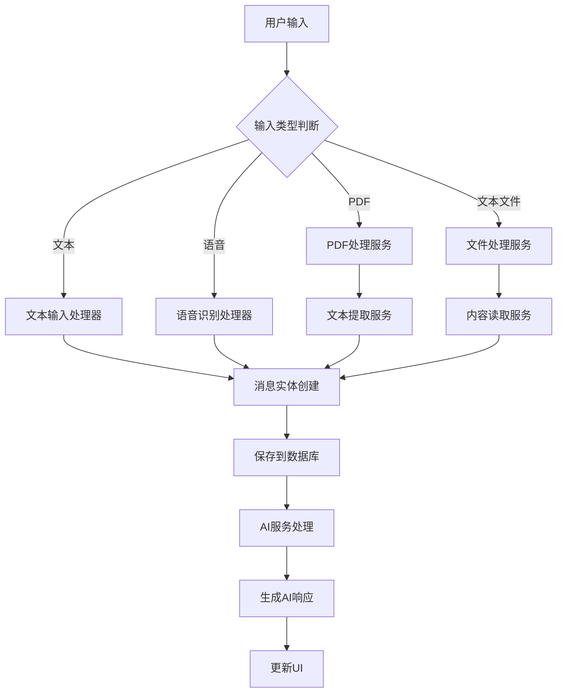
```mermaid
graph TD
    A[用户输入] --> B{输入类型判断}
    B -->|文本| C[文本输入处理器]
    B -->|语音| D[语音识别处理器]
    B -->|PDF| E[PDF处理服务]
    B -->|文本文件| F[文件处理服务]
    
    C --> G[消息实体创建]
    D --> G
    E --> H[文本提取服务]
    H --> G
    F --> I[内容读取服务]
    I --> G
    
    G --> J[保存到数据库]
    J --> K[AI服务处理]
    K --> L[生成AI响应]
    L --> M[更新UI]
```

### 文件处理流程

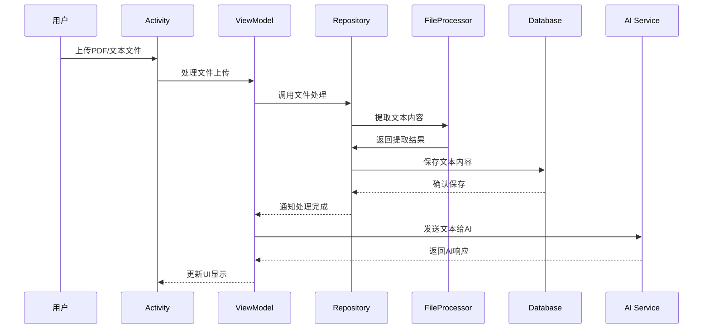
```mermaid
sequenceDiagram
    participant U as 用户
    participant A as Activity
    participant VM as ViewModel
    participant R as Repository
    participant FP as FileProcessor
    participant DB as Database
    participant AI as AI Service
    
    U->>A: 上传PDF/文本文件
    A->>VM: 处理文件上传
    VM->>R: 调用文件处理
    R->>FP: 提取文本内容
    FP->>R: 返回提取结果
    R->>DB: 保存文本内容
    DB-->>R: 确认保存
    R-->>VM: 通知处理完成
    VM->>AI: 发送文本给AI
    AI-->>VM: 返回AI响应
    VM-->>A: 更新UI显示
```

## AI 集成架构

### 可切换AI服务设计

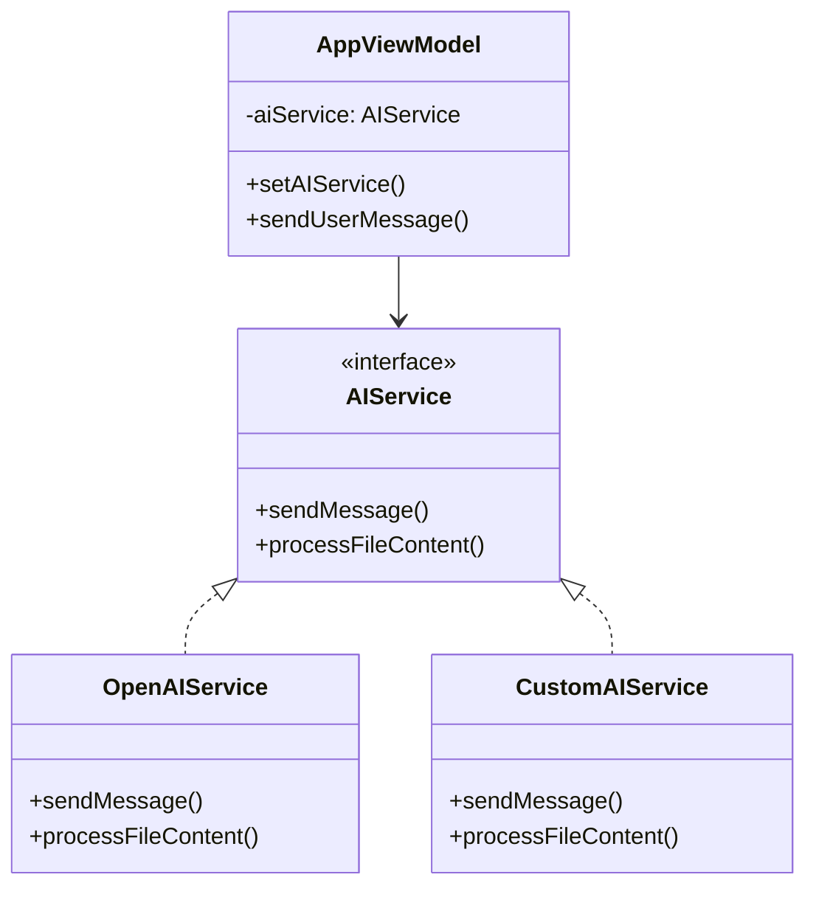
```mermaid
classDiagram
    class AIService {
        <<interface>>
        +sendMessage()
        +processFileContent()
    }
    
    class OpenAIService {
        +sendMessage()
        +processFileContent()
    }
    
    class CustomAIService {
        +sendMessage()
        +processFileContent()
    }
    
    class AppViewModel {
        -aiService: AIService
        +setAIService()
        +sendUserMessage()
    }
    
    AIService <|.. OpenAIService
    AIService <|.. CustomAIService
    AppViewModel --> AIService
```

## UI 架构

### 主界面布局

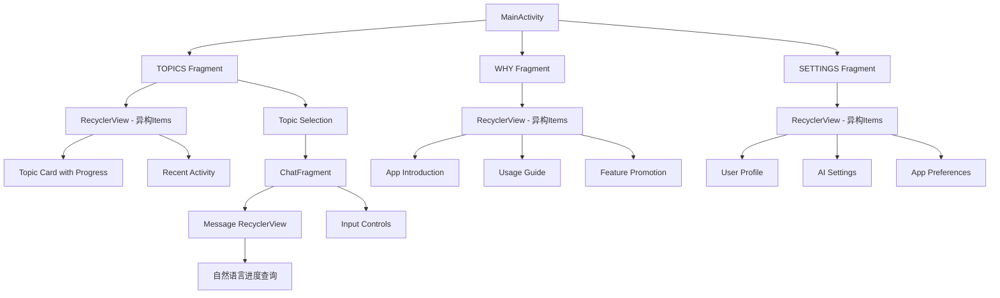
```mermaid
graph TB
    A[MainActivity] --> B[TOPICS Fragment]
    A --> C[WHY Fragment]
    A --> D[SETTINGS Fragment]
    
    B --> E[RecyclerView - 异构Items]
    C --> F[RecyclerView - 异构Items]
    D --> G[RecyclerView - 异构Items]
    
    E --> H[Topic Card with Progress]
    E --> J[Recent Activity]
    
    F --> K[App Introduction]
    F --> L[Usage Guide]
    F --> M[Feature Promotion]
    
    G --> N[User Profile]
    G --> O[AI Settings]
    G --> P[App Preferences]
    
    B --> Q[Topic Selection]
    Q --> R[ChatFragment]
    R --> S[Message RecyclerView]
    R --> T[Input Controls]
    S --> U[自然语言进度查询]
```

**界面架构说明：**
- **TOPICS Fragment**: 主题管理和学习入口
  - 支持异构items：带进度的话题卡片、最近活动
  - 话题卡片直接显示进度摘要，无需单独的进度卡片
  - 点击话题卡片进入ChatFragment开始学习
- **WHY Fragment**: 应用介绍和功能推广
  - 支持异构items：应用介绍、使用指南、功能推广
  - 帮助用户了解应用价值和使用方法
- **SETTINGS Fragment**: 用户设置和偏好
  - 支持异构items：用户资料、AI设置、应用偏好
  - 提供个性化配置选项

**交互流程：**
1. 用户从TOPICS Fragment选择话题
2. 进入ChatFragment进行学习对话
3. 在对话中可直接使用自然语言查询进度
4. 返回主界面查看其他功能

## 数据流与状态管理

### 响应式数据流

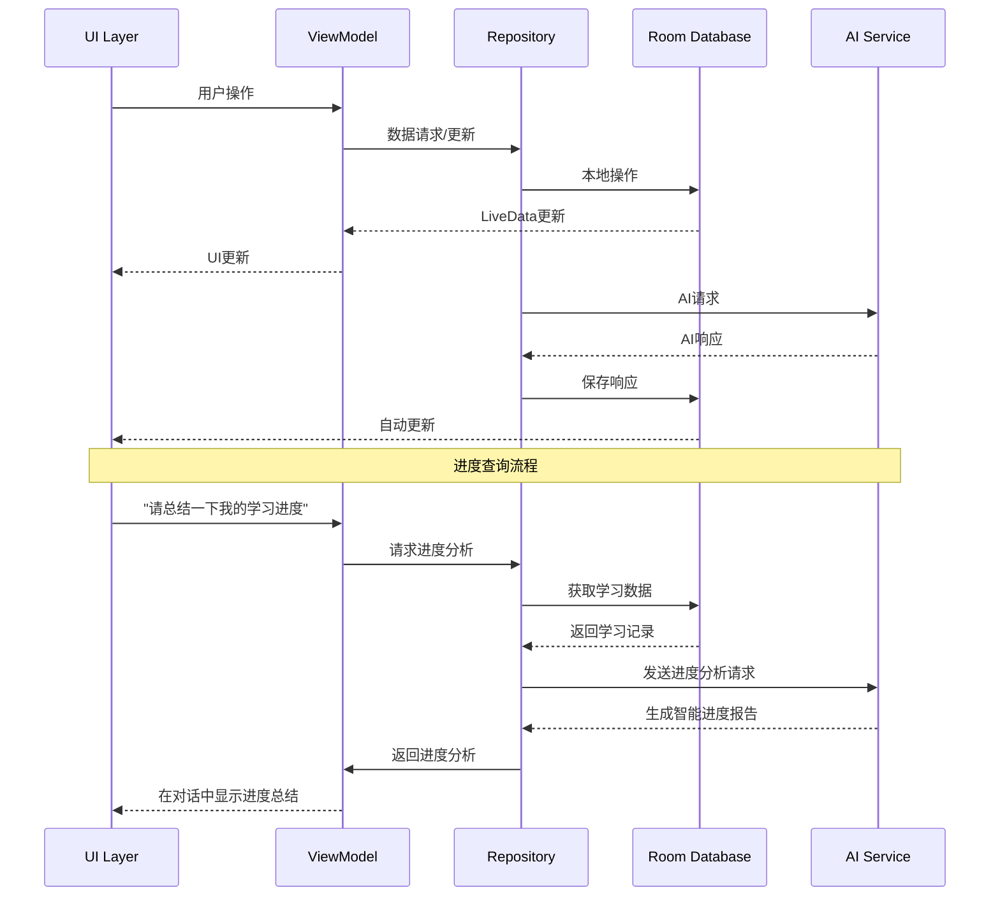
```mermaid
sequenceDiagram
    participant UI as UI Layer
    participant VM as ViewModel
    participant R as Repository
    participant DB as Room Database
    participant AI as AI Service
    
    UI->>VM: 用户操作
    VM->>R: 数据请求/更新
    R->>DB: 本地操作
    DB-->>VM: LiveData更新
    VM-->>UI: UI更新
    
    R->>AI: AI请求
    AI-->>R: AI响应
    R->>DB: 保存响应
    DB-->>UI: 自动更新
    
    Note over UI,AI: 进度查询流程
    UI->>VM: "请总结一下我的学习进度"
    VM->>R: 请求进度分析
    R->>DB: 获取学习数据
    DB-->>R: 返回学习记录
    R->>AI: 发送进度分析请求
    AI-->>R: 生成智能进度报告
    R->>VM: 返回进度分析
    VM-->>UI: 在对话中显示进度总结
```

### 话题状态管理

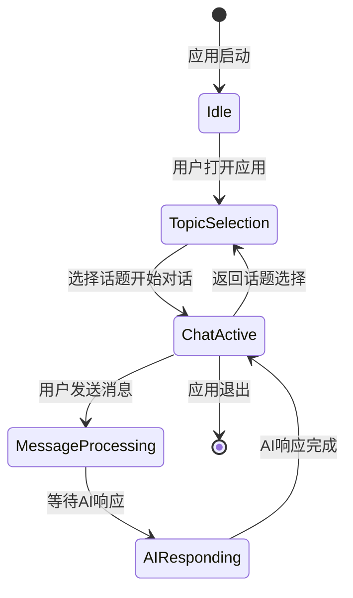
```mermaid
stateDiagram-v2
    [*] --> Idle : 应用启动
    Idle --> TopicSelection : 用户打开应用
    TopicSelection --> ChatActive : 选择话题开始对话
    ChatActive --> MessageProcessing : 用户发送消息
    MessageProcessing --> AIResponding : 等待AI响应
    AIResponding --> ChatActive : AI响应完成
    ChatActive --> TopicSelection : 返回话题选择
    ChatActive --> [*] : 应用退出
```

## 文件处理服务

### PDF 文本提取流程

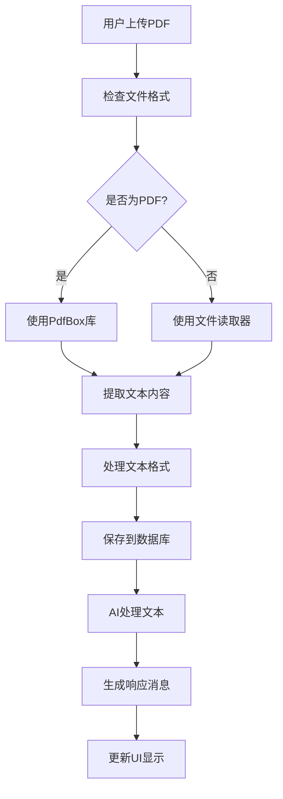
```mermaid
flowchart TD
    A[用户上传PDF] --> B[检查文件格式]
    B --> C{是否为PDF?}
    C -->|是| D[使用PdfBox库]
    C -->|否| E[使用文件读取器]
    
    D --> F[提取文本内容]
    E --> F
    
    F --> G[处理文本格式]
    G --> H[保存到数据库]
    H --> I[AI处理文本]
    I --> J[生成响应消息]
    J --> K[更新UI显示]
```

## 学习进度跟踪

### 智能进度评估

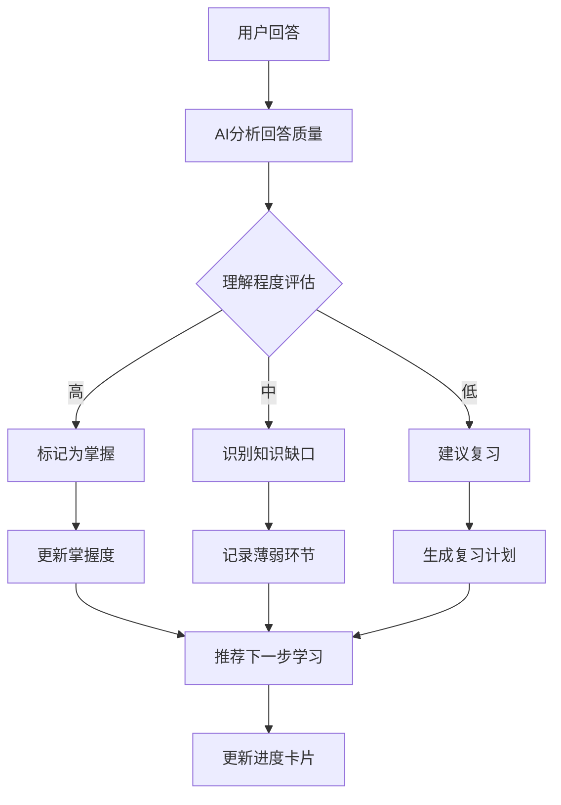
```mermaid
graph TD
    A[用户回答] --> B[AI分析回答质量]
    B --> C{理解程度评估}
    C -->|高| D[标记为掌握]
    C -->|中| E[识别知识缺口]
    C -->|低| F[建议复习]
    
    D --> G[更新掌握度]
    E --> H[记录薄弱环节]
    F --> I[生成复习计划]
    
    G --> J[推荐下一步学习]
    H --> J
    I --> J
    J --> K[更新进度卡片]
```

## 核心组件交互

### 主要交互流程

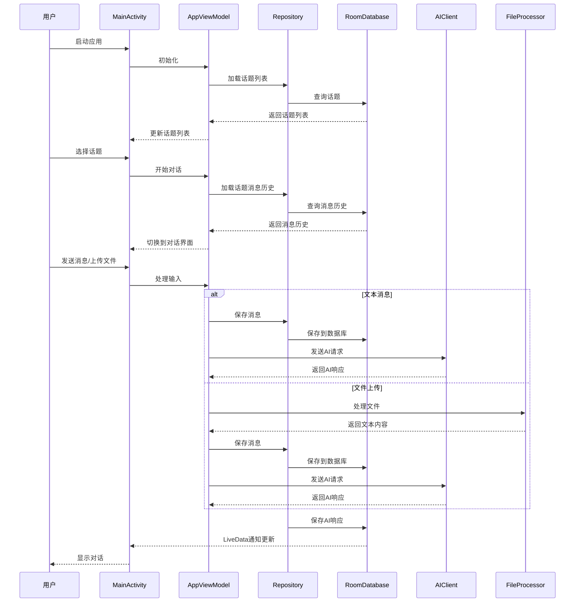
```mermaid
sequenceDiagram
    participant User as 用户
    participant UI as MainActivity
    participant VM as AppViewModel
    participant Repo as Repository
    participant DB as RoomDatabase
    participant AI as AIClient
    participant FP as FileProcessor
    
    User->>UI: 启动应用
    UI->>VM: 初始化
    VM->>Repo: 加载话题列表
    Repo->>DB: 查询话题
    DB-->>VM: 返回话题列表
    VM-->>UI: 更新话题列表
    
    User->>UI: 选择话题
    UI->>VM: 开始对话
    VM->>Repo: 加载话题消息历史
    Repo->>DB: 查询消息历史
    DB-->>VM: 返回消息历史
    VM-->>UI: 切换到对话界面
    
    User->>UI: 发送消息/上传文件
    UI->>VM: 处理输入
    alt 文本消息
        VM->>Repo: 保存消息
        Repo->>DB: 保存到数据库
        VM->>AI: 发送AI请求
        AI-->>VM: 返回AI响应
    else 文件上传
        VM->>FP: 处理文件
        FP-->>VM: 返回文本内容
        VM->>Repo: 保存消息
        Repo->>DB: 保存到数据库
        VM->>AI: 发送AI请求
        AI-->>VM: 返回AI响应
    end
    Repo->>DB: 保存AI响应
    DB-->>UI: LiveData通知更新
    UI-->>User: 显示对话
```

## 数据持久化策略

### 本地数据库设计

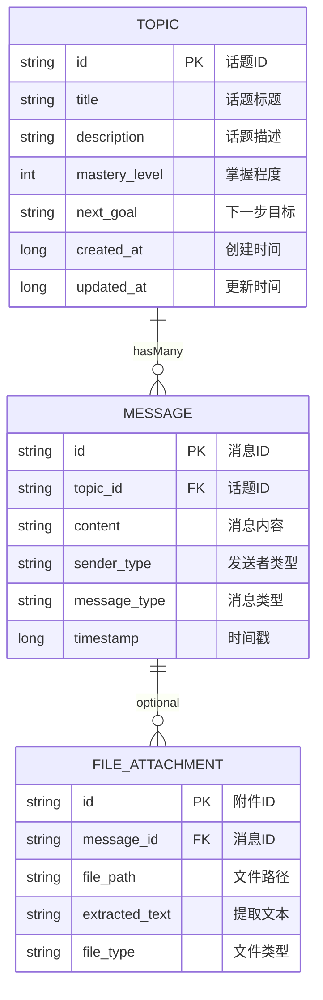
```mermaid
erDiagram
    TOPIC ||--o{ MESSAGE : "hasMany"
    MESSAGE ||--o{ FILE_ATTACHMENT : "optional"
    
    TOPIC {
        string id PK "话题ID"
        string title "话题标题"
        string description "话题描述"
        int mastery_level "掌握程度"
        string next_goal "下一步目标"
        long created_at "创建时间"
        long updated_at "更新时间"
    }
    
    MESSAGE {
        string id PK "消息ID"
        string topic_id FK "话题ID"
        string content "消息内容"
        string sender_type "发送者类型"
        string message_type "消息类型"
        long timestamp "时间戳"
    }
    
    FILE_ATTACHMENT {
        string id PK "附件ID"
        string message_id FK "消息ID"
        string file_path "文件路径"
        string extracted_text "提取文本"
        string file_type "文件类型"
    }
```

## 错误处理与恢复

### 错误处理策略

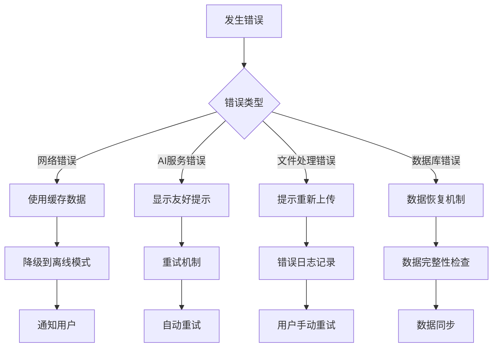
```mermaid
graph TD
    A[发生错误] --> B{错误类型}
    B -->|网络错误| C[使用缓存数据]
    B -->|AI服务错误| D[显示友好提示]
    B -->|文件处理错误| E[提示重新上传]
    B -->|数据库错误| F[数据恢复机制]
    
    C --> G[降级到离线模式]
    D --> H[重试机制]
    E --> I[错误日志记录]
    F --> J[数据完整性检查]
    
    G --> K[通知用户]
    H --> L[自动重试]
    I --> M[用户手动重试]
    J --> N[数据同步]
```

## 性能优化

### 缓存策略

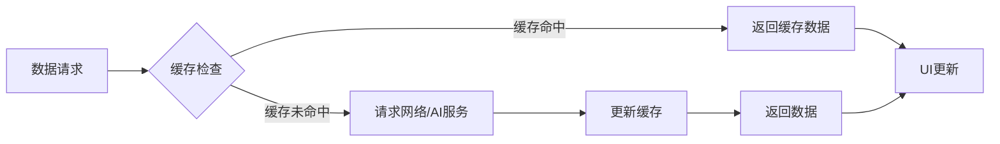
```mermaid
graph LR
    A[数据请求] --> B{缓存检查}
    B -->|缓存命中| C[返回缓存数据]
    B -->|缓存未命中| D[请求网络/AI服务]
    D --> E[更新缓存]
    E --> F[返回数据]
    C --> G[UI更新]
    F --> G
```

这个设计文档涵盖了Teach It Back应用的核心架构，采用了MVVM模式、本地优先存储、多模态输入处理等关键技术，并使用mermaid图表清晰地表达了各个设计概念和组件关系。设计简化了原有的Session概念，使Topic成为持续的对话实体，更符合微信聊天式的用户体验。