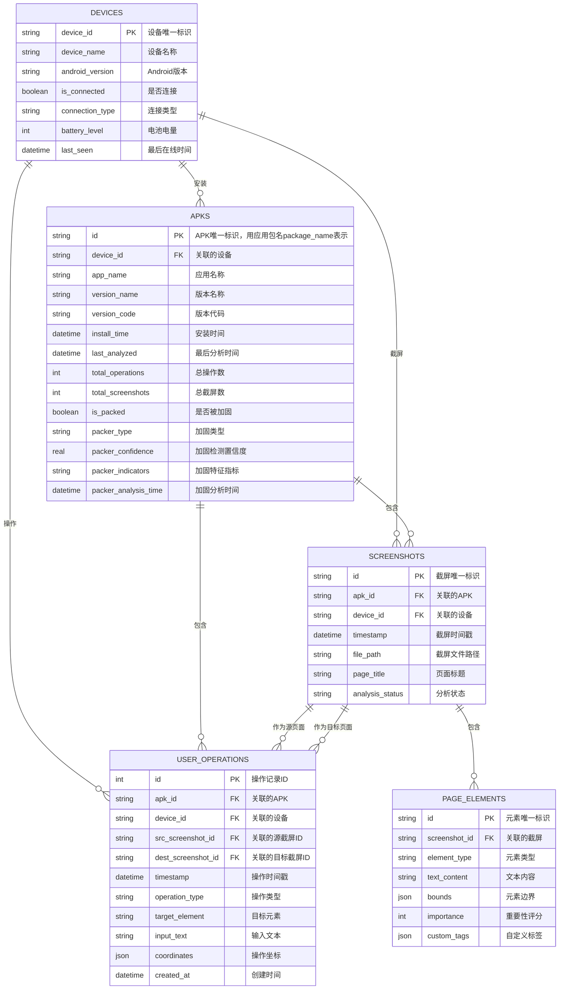
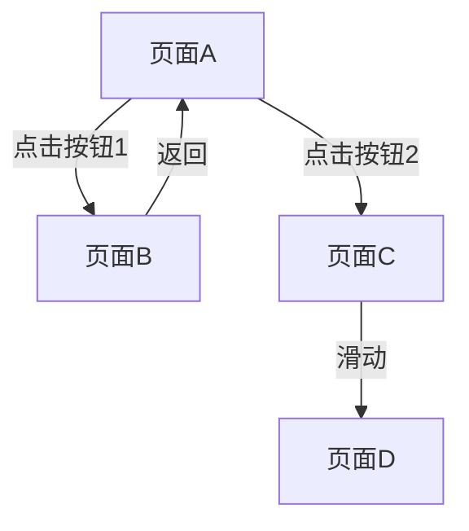

# 交互式APP分析程序

## 设计理念
**用户操作，程序监控，最后分析** - 用户正常使用应用，程序实时监控、记录，在用户停止监控后统一分析所有监控内容，构建操作图和元素信息

## 功能描述
1. **应用结构分析** - 分析应用的整体架构和页面层次关系
2. **页面关系图生成** - 可视化页面之间的导航关系和交互流程
3. **页面元素识别** - 多模态识别UI元素及其属性（视觉+UI层次结构）
4. **用户操作监控** - 实时监控用户操作并记录操作轨迹
5. **多模态分析** - 结合视觉识别和UI层次结构分析
6. **操作图生成** - 构建用户操作与页面转换的关系图
7. **报告生成** - 自动生成详细的Markdown格式分析报告

## 类型化原则

### 类型化设计规范

为了提升代码的可读性、可维护性和类型安全性，所有API、函数方法参数和返回值必须采用类型化类定义，禁止使用原始的字典和列表类型。

#### 核心原则

1. **禁止使用原始类型**：
   - ❌ 禁止使用 `Dict[str, Any]`、`List[Dict[str, Any]]` 等原始类型
   - ✅ 必须使用具体的Pydantic模型或dataclass定义

2. **分层类型定义**：
   - **数据库层**：使用Peewee ORM模型定义数据库表结构
   - **业务层**：使用Pydantic模型定义API请求/响应格式
   - **数据传输**：使用类型化的DTO（Data Transfer Object）

3. **类型一致性**：
   - 所有函数参数和返回值必须有明确的类型注解
   - 避免使用 `Any` 类型，除非绝对必要
   - 使用Python的类型提示系统（Type Hints）

#### 适用范围

**必须使用类型化模型的场景**：
- **数据库操作**：所有数据库查询方法的返回值必须使用类型化模型
- **API接口**：所有API的请求和响应参数必须使用类型化模型
- **服务层**：所有服务方法的参数和返回值必须使用类型化模型
- **数据传输**：模块间数据传输必须使用类型化DTO

#### 具体实施要求

**数据库操作层**：
- 所有数据库查询方法必须返回具体的Pydantic模型，而不是原始字典
- 数据库管理器类（如 `DatabaseManager`）的所有公共方法必须使用类型化返回值
- 禁止在数据库层使用 `Dict[str, Any]` 作为返回值类型

**API层**：
- 所有FastAPI端点必须使用Pydantic模型定义请求和响应
- 禁止在API层使用原始字典类型
- 所有API响应必须使用类型化模型包装

**服务层**：
- 所有业务逻辑方法必须使用类型化参数和返回值
- 服务层之间传递数据必须使用类型化DTO
- 禁止在服务层使用原始字典进行数据传递

#### 示例对比

**❌ 错误示例 - 使用原始字典类型**
```python
def get_user_operations(self, apk_id: str, limit: int = 100) -> List[Dict[str, Any]]:
    # 返回原始字典，难以维护和理解
    return [{'id': 1, 'action_type': 'click', ...}]

def get_screenshots_by_apk(self, apk_id: str, limit: int = 50) -> List[Dict[str, Any]]:
    # 违反类型化原则，使用原始字典
    return [{'screenshot_id': '123', 'file_path': '/path/to/image.png', ...}]
```

**✅ 正确示例 - 使用类型化模型**
```python
from pydantic import BaseModel
from typing import List

class UserOperation(BaseModel):
    id: str
    action_type: str
    timestamp: float
    # ... 其他字段

class ScreenshotInfo(BaseModel):
    id: str
    apk_id: str
    timestamp: float
    file_path: str
    # ... 其他字段

def get_user_operations(self, apk_id: str, limit: int = 100) -> List[UserOperation]:
    # 返回类型化对象，清晰明确
    return [UserOperation(id='1', action_type='click', ...)]

def get_screenshots_by_apk(self, apk_id: str, limit: int = 50) -> List[ScreenshotInfo]:
    # 遵循类型化原则，使用具体的模型类
    return [ScreenshotInfo(id='123', apk_id=apk_id, ...)]
```

#### 实施要求

1. **立即重构**：现有代码中所有使用原始字典类型的地方必须逐步重构为类型化模型
2. **新开发**：所有新开发的模块必须遵循类型化原则
3. **代码审查**：在代码审查中严格检查类型化规范的遵守情况
4. **文档更新**：更新相关文档以反映类型化设计原则
5. **模型统一**：所有类型化模型必须定义在共享的模型文件中（如 `core/database/models.py`），避免重复定义

## 自动设备检测机制

### 设计理念
**分析器应该能够自动检测所有连接的设备，无需在配置文件中硬编码设备ID** - 作为分析器，我们应具备分析任意连接的设备上APK应用的能力

### 自动检测实现

#### 1. **设备发现机制**
- **动态检测**：通过`adb devices`命令实时检测所有连接的设备
- **支持多种连接方式**：USB连接、无线调试连接
- **设备状态监控**：持续监控设备连接状态，自动处理设备断开和重新连接

#### 2. **配置管理优化**
- **无需硬编码设备ID**：移除config.yaml中的device.id配置项
- **自动设备列表**：ConfigManager的`get_connected_devices()`方法自动返回所有连接的设备
- **多设备支持**：分析器可以同时处理多个连接的设备

#### 3. **技术实现细节**
```python
# ConfigManager中的自动设备检测方法
def get_connected_devices(self) -> List[str]:
    """获取所有连接的设备ID"""
    import subprocess
    try:
        result = subprocess.run(["adb", "devices"], capture_output=True, text=True)
        if result.returncode != 0:
            print(f"❌ 获取设备列表失败: {result.stderr}")
            return []
        
        devices = []
        for line in result.stdout.strip().split('\n')[1:]:  # 跳过第一行标题
            if line.strip() and '\tdevice' in line:
                device_id = line.split('\t')[0].strip()
                if device_id:
                    devices.append(device_id)
        
        print(f"📱 检测到 {len(devices)} 个连接的设备: {devices}")
        return devices
    except Exception as e:
        print(f"❌ 获取设备列表失败: {e}")
        return []
```

#### 4. **工作流程**
1. **启动时自动检测**：分析器启动时自动扫描所有连接的设备
2. **实时状态更新**：在分析过程中持续监控设备连接状态
3. **多设备并行处理**：支持同时分析多个设备上的APK应用
4. **错误处理**：自动处理设备断开连接的情况

### 设计优势
- **灵活性**：无需修改配置文件即可分析任意连接的设备
- **自动化**：自动检测设备连接状态，减少手动配置
- **多设备支持**：可以同时分析多个设备上的应用
- **实时性**：动态响应设备连接状态变化

## 技术架构

### 核心模块划分

#### 1. **设备连接模块** (`device/`)
- **功能职责**：设备连接管理、ADB命令执行、应用启动和状态监控
- **核心文件**：`service.py`, `database.py`, `models.py`
- **关键特性**：
  - **自动设备检测**：通过ADB命令自动发现所有连接的设备，无需在配置文件中硬编码设备ID
  - **设备状态检测和连接管理**：实时监控设备连接状态
  - **应用包管理**：启动、停止、安装应用
  - **屏幕截图和UI层次结构获取**：获取设备屏幕状态
  - **设备状态监控**：不包含自动操作控制
- **重要说明**：该模块仅提供设备状态监控和基础操作功能，不包含自动控制应用的tap、input_text、press_back等操作，分析器完全依赖用户手动操作进行监控和记录
- **自动检测机制**：
  - 使用`adb devices`命令自动发现所有连接的设备
  - 支持USB和无线连接设备
  - 动态更新设备连接状态
  - 分析器可以分析任意连接的设备上的APK应用

#### 2. **用户操作自动监控模块** (`useroperation/`)
- **功能职责**：实时监控用户手动操作并记录操作轨迹
- **核心文件**：`monitoring_system.py`, `user_operation_manager.py`
- **关键特性**：
  - 独立进程运行，与菜单交互式模块互不影响
  - 实时记录用户手动点击、输入、滑动等操作
  - 操作时间戳和坐标记录
  - 操作序列存储和管理
- **重要说明**：该模块仅负责监控和记录用户手动操作，不包含任何自动控制功能，分析器完全依赖用户手动操作进行数据采集

#### 3. **菜单交互式截屏模块** (`screenshot/`)
- **功能职责**：提供用户交互界面，支持手动截屏和页面分析
- **核心文件**：`screenshot_manager.py`, `page_recognizer.py`
- **关键特性**：
  - 用户交互界面和菜单系统
  - 手动截屏和页面快照管理
  - 实时页面识别和分析
  - 与用户操作监控模块并行运行

#### 4. **分析管理模块** (`analysis/`)
- **功能职责**：页面元素分析、操作导航、多模态分析
- **核心文件**：`interactive_analyzer.py`
- **关键特性**：
  - 多模态页面识别（视觉+UI层次结构）
  - 页面元素识别和重要性评分
  - 操作图构建和导航分析
  - 分析报告生成

#### 5. **编辑管理模块** (`editor/`)
- **功能职责**：用户操作与截屏、页面元素的关联编辑
- **核心文件**：`operation_recorder.py`, `screenshot_manager.py`, `element_editor.py`
- **前端界面**：`editor/frontend/` - Svelte前端应用
- **关键特性**：
  - 用户操作与截屏的精确关联
  - 页面元素标注和重要性标记
  - 自动化脚本生成优化
  - 编辑后的精准导航和元素信息
  - **截屏按钮功能**：前端提供"截屏"按钮，支持手动截屏并自动关联后续用户操作

### 前端截屏按钮功能设计

#### 功能描述
在编辑管理模块的前端界面（`d:\git\autodroid\autodroid-analyzer\editor\frontend`）中，提供一个"截屏"按钮，实现以下功能：

1. **截屏触发**：用户点击"截屏"按钮后，前端调用后台截屏API
2. **截屏保存**：后台截取设备屏幕并保存为screenshots记录
3. **关联设置**：返回的screenshot_id自动设置为后续用户操作的src_screenshot_id
4. **状态管理**：前端维护当前活跃的截屏状态

#### 技术实现

##### 前端组件设计
```svelte
<!-- 截屏按钮组件 -->
<script>
  import { api } from '$lib/api';
  
  let currentApkId = null; // 当前分析的APK ID
  let activeScreenshotId = null; // 当前活跃截屏ID
  let isScreenshotting = false; // 截屏状态
  
  // 截屏按钮点击处理
  async function captureScreenshot() {
    if (!currentApkId) {
      alert('请先选择要分析的APK');
      return;
    }
    
    isScreenshotting = true;
    try {
      const result = await api.captureScreenshot(currentApkId);
      if (result.success) {
        activeScreenshotId = result.data.screenshot_id;
        console.log(`截屏成功，截屏ID: ${activeScreenshotId}`);
        // 更新UI状态，显示当前活跃截屏
      } else {
        alert(`截屏失败: ${result.error}`);
      }
    } catch (error) {
      console.error('截屏异常:', error);
      alert('截屏过程中发生异常');
    } finally {
      isScreenshotting = false;
    }
  }
</script>

<button 
  class="screenshot-btn {isScreenshotting ? 'loading' : ''}"
  on:click={captureScreenshot}
  disabled={isScreenshotting || !currentApkId}
>
  {#if isScreenshotting}
    <span class="spinner">截屏中...</span>
  {:else}
    <span>📸 截屏</span>
  {/if}
</button>

<!-- 当前截屏状态显示 -->
{#if activeScreenshotId}
  <div class="current-screenshot">
    <span>当前截屏: {activeScreenshotId}</span>
  </div>
{/if}
```

##### 后端API接口
```python
# API端点：/api/screenshot/capture
@app.post("/api/screenshot/capture")
async def capture_screenshot(apk_id: str):
    """
    截取屏幕截图并保存到数据库
    - 调用设备连接模块截取屏幕
    - 保存截屏信息到screenshots表
    - 返回screenshot_id供后续操作关联
    """
    try:
        # 1. 调用设备截屏功能
        screenshot_path = device_manager.capture_screenshot()
        
        # 2. 保存截屏记录到数据库
        screenshot_data = {
            'timestamp': time.time(),
            'file_path': screenshot_path,
            'page_title': '手动截屏',
            'analysis_status': 'pending'
        }
        screenshot_id = db_manager.save_screenshot(apk_id, screenshot_data)
        
        # 3. 返回截屏ID
        return {
            'success': True,
            'data': {
                'screenshot_id': screenshot_id,
                'file_path': screenshot_path,
                'timestamp': screenshot_data['timestamp']
            }
        }
    except Exception as e:
        return {
            'success': False,
            'error': f'截屏失败: {str(e)}'
        }
```

##### 用户操作记录关联
```python
# 记录用户操作时自动关联当前活跃截屏
async def record_user_operation(apk_id: str, operation_data: dict):
    """
    记录用户操作，自动关联当前截屏作为src_screenshot_id
    """
    # 获取前端传递的当前截屏ID
    src_screenshot_id = operation_data.get('src_screenshot_id')
    
    # 如果没有指定，使用当前活跃截屏
    if not src_screenshot_id:
        src_screenshot_id = get_current_active_screenshot(apk_id)
    
    # 保存用户操作记录
    operation_data.update({
        'apk_id': apk_id,
        'src_screenshot_id': src_screenshot_id,
        'dest_screenshot_id': None  # 后续页面切换时更新
    })
    
    return db_manager.save_user_operation(operation_data)
```

#### 数据流关系
1. **用户点击"截屏"按钮** → 前端调用截屏API
2. **后端截屏** → 保存screenshots记录 → 返回screenshot_id
3. **前端设置活跃截屏** → 后续用户操作自动关联src_screenshot_id
4. **页面切换时** → 自动更新dest_screenshot_id，建立完整的操作链

#### 设计优势
- **精确的操作关联**：确保每个用户操作都有对应的源页面截屏
- **手动控制能力**：用户可以在关键操作前手动截屏，确保数据准确性
- **自动化流程**：截屏后自动关联，减少手动操作步骤
- **状态可视化**：前端清晰显示当前活跃截屏状态

### 模块间数据流
```
设备连接模块 → 用户操作监控模块（独立进程）
    ↓
菜单交互式截屏模块（并行运行）
    ↓
分析管理模块（统一分析）
    ↓
编辑管理模块（精准关联）
    ↓
自动化脚本生成
```

### 模块独立性设计
- **用户操作监控模块**：在analyzer启动后作为独立进程运行
- **菜单交互式模块**：与监控模块并行，互不影响
- **分析管理模块**：在监控结束后统一分析所有数据
- **编辑管理模块**：提供精准的关联编辑功能

### 操作图构建流程
1. **用户操作监控**：实时记录用户点击、输入等操作
2. **元素关联**：将操作与当前页面元素关联
3. **页面切换检测**：监控页面变化事件
4. **操作图构建**：建立操作→页面转换的关系图
5. **路径分析**：分析用户操作路径和页面导航关系

## 数据模型

### 实体关系图 (ER Diagram)

基于以APK为核心的数据库设计，以下是系统的数据模型ER图：



### 实体关系说明

#### 1. **APKS (APK表)** - 核心实体
- **主键**: id (APK唯一标识，用应用包名package_name表示)
- **关系**: 一个APK包含多个截屏(SCREENSHOTS)和用户操作(USER_OPERATIONS)
- **统计字段**: total_operations, total_screenshots 用于跟踪分析进度
- **加固检测字段**: 
  - is_packed: 标识APK是否被加固
  - packer_type: 具体的加固类型（如360加固、腾讯加固等）
  - packer_confidence: 加固检测的置信度（0-1）
  - packer_indicators: 检测到的加固特征指标
  - packer_analysis_time: 最后一次加固分析的时间

#### 2. **SCREENSHOTS (截屏表)** - 页面快照
- **主键**: screenshot_id (截屏唯一标识)
- **外键**: apk_id (关联到APKS表)
- **关系**: 一个截屏关联多个用户操作和页面元素

#### 3. **USER_OPERATIONS (用户操作表)** - 操作记录
- **主键**: id (自增ID)
- **外键**: apk_id, src_screenshot_id, dest_screenshot_id (三重关联)
- **功能**: 记录用户的具体操作，包括类型、目标元素、输入内容等
- **关键改进**: 新增src_screenshot_id和dest_screenshot_id，精确记录操作导致的页面转换

#### 4. **PAGE_ELEMENTS (页面元素表)** - UI元素信息
- **主键**: id (元素唯一标识)
- **外键**: screenshot_id (关联到截屏)
- **功能**: 存储页面元素的详细信息，包括类型、文本、边界等

### 数据流关系
1. **APK → 截屏**: 一个APK在分析过程中会产生多个页面截屏
2. **截屏 → 用户操作**: 
   - 源截屏(src_screenshot_id): 操作发生时的页面状态
   - 目标截屏(dest_screenshot_id): 操作导致的页面状态
3. **截屏 → 页面元素**: 每个截屏包含多个UI元素
4. **用户操作 → 页面转换**: 通过src_screenshot_id和dest_screenshot_id精确记录操作导致的页面转换关系

### 设计优势
- **精确的页面转换跟踪**: 能够准确记录每个操作导致的页面变化
- **完整的操作路径重建**: 通过截屏链可以重建完整的用户操作路径
- **更好的数据分析**: 支持分析操作的成功率、页面转换频率等指标

## 工作流程

### 分析流程（用户操作，程序监控，最后分析）

1. **初始化阶段**
   - **自动检测连接设备**：通过`adb devices`命令自动发现所有连接的Android设备
   - **设备选择**：如果检测到多个设备，提示用户选择目标设备
   - **检查设备状态和应用包名**：验证设备连接状态和可用性
   - **用户启动目标应用**：用户手动启动需要分析的应用
   - **程序显示监控模式提示信息**：显示分析器已就绪，等待用户操作

2. **纯监控阶段（启动时不分析）**
   - 仅记录初始页面信息，不进行任何分析
   - 启动用户操作监控线程
   - 实时监控用户操作（点击、输入、滑动等）
   - 记录页面切换事件和屏幕变化
   - 捕获屏幕截图和UI层次结构（仅记录，不分析）
   - 显示当前监控状态（已记录操作数、已监控页面数）

3. **用户操作阶段**
   - 用户在手机上自由操作应用
   - 程序持续监控并记录所有操作
   - 实时反馈监控进度
   - 用户可随时查看监控状态

4. **停止监控阶段**
   - 用户输入"stop"停止监控
   - 程序停止所有监控线程
   - 显示监控数据统计

5. **统一分析阶段（stop后分析）**
   - 对监控期间记录的所有页面进行多模态分析
   - 分析每个页面的UI元素及重要性评分
   - 分析用户操作序列，生成操作图
   - 构建操作-页面转换关系图
   - 生成详细的元素信息表

6. **报告生成阶段**
   - 生成Markdown格式的详细分析报告
   - 包含操作图、页面关系图、元素识别结果
   - 记录用户操作序列和监控统计

### 关键改进
- **启动时不分析**：避免在监控阶段进行不必要的分析，减少资源消耗
- **纯监控模式**：专注于记录用户操作和页面变化，不干扰用户体验
- **统一分析**：在监控结束后统一分析所有数据，确保数据完整性
- **操作图生成**：基于完整的监控数据生成准确的操作流程图

### 分析模式
1. **完整交互式分析** - 完整的应用遍历和分析
2. **仅用户操作监控** - 只监控用户操作不主动分析
3. **多模态分析** - 结合视觉和UI层次结构的深度分析
4. **操作图构建模式** - 专注于构建用户操作与页面转换的关系图

### 操作图构建策略
1. **被动监控模式**：用户自由操作，程序记录操作轨迹和页面转换
2. **主动引导模式**：程序提示用户操作特定元素，构建完整的操作路径
3. **混合模式**：结合被动监控和主动引导，确保操作图覆盖完整

## 实现细节

### 多模态分析技术
- **视觉分析**：使用OpenCV进行图像处理和特征提取
- **UI层次结构分析**：解析XML布局文件获取元素信息
- **相似度计算**：基于图像哈希和结构特征进行页面匹配

### 操作图构建技术
1. **实时操作监控**：监听用户触摸事件和输入操作
2. **页面变化检测**：通过屏幕截图对比和UI层次结构变化检测页面切换
3. **操作-元素关联**：将用户操作坐标与UI元素进行匹配
4. **操作图算法**：构建有向图表示操作与页面转换关系
5. **路径分析**：使用图算法分析操作路径的覆盖率和完整性

### 元素识别功能
- **可点击元素检测**：识别按钮、链接等交互元素
- **文本元素提取**：提取界面中的文本内容
- **布局复杂度分析**：评估页面布局的复杂程度
- **推荐交互点**：智能推荐最佳交互位置

### 操作图构建功能
- **用户操作监控**：实时记录用户点击、输入、滑动等操作
- **操作元素关联**：将用户操作与具体的UI元素关联
- **页面转换检测**：监控页面切换事件，建立操作→页面转换关系
- **操作图可视化**：生成可视化的操作流程图
- **路径分析**：分析用户操作路径的覆盖率和完整性

### 报告格式
```markdown
# 应用分析报告

## 应用结构
- 页面数量：X
- 页面关系图
- 导航路径分析

## 操作图分析
### 操作图概览
- 总操作数：N
- 页面转换数：M
- 操作路径覆盖率：P%

### 操作路径详情


## 页面分析
### 页面1：首页
- 元素数量：Y
- 可点击元素：Z
- 布局复杂度：高/中/低

## 用户操作记录
### 操作序列
1. **操作1**：点击"登录"按钮 (页面A → 页面B)
   - 操作时间：时间戳
   - 目标元素：按钮[登录]
   - 操作位置：(x,y)
   
2. **操作2**：输入用户名 (页面B)
   - 操作时间：时间戳
   - 目标元素：输入框[用户名]
   - 输入内容：user123

### 操作统计
- 点击操作：K次
- 输入操作：L次
- 滑动操作：M次
- 平均操作间隔：T秒
```

## 配置要求

### 环境依赖
- Python 3.12+
- OpenCV 4.12+
- ADB工具
- Android设备（已开启USB调试）

### 应用配置
- 目标应用包名
- 分析模式选择
- 输出目录设置

## API接口设计

### 核心类接口

#### PageRecognizer类
```python
class PageRecognizer:
    def __init__(self, device_id: str = None):
        """初始化页面识别器"""
        
    def recognize_page(self, screenshot_path: str, xml_path: str) -> PageInfo:
        """识别页面信息"""
        
    def get_page_elements(self, page_info: PageInfo) -> List[UIElement]:
        """获取页面元素列表"""
        
    def analyze_layout_complexity(self, elements: List[UIElement]) -> ComplexityLevel:
        """分析布局复杂度"""
```

### 核心类设计
```python
class AppAnalyzer:
    """应用分析器主类"""
    def __init__(self, device):
        self.device = device
        self.pages = []
        self.operations = []
        self.operation_graph = OperationGraph()
    
    def analyze_app(self):
        """执行应用分析"""
        pass
    
    def monitor_user_operations(self):
        """监控用户操作并构建操作图"""
        pass
    
    def generate_operation_graph(self):
        """生成操作图"""
        pass
    
    def generate_report(self):
        """生成分析报告"""
        pass

class OperationGraph:
    """操作图类"""
    def __init__(self):
        self.nodes = {}  # 页面节点
        self.edges = []  # 操作边
    
    def add_operation(self, source_page, operation, target_page):
        """添加操作边"""
        pass
    
    def get_path_coverage(self):
        """获取路径覆盖率"""
        pass
    
    def visualize(self):
        """可视化操作图"""
        pass

class UserOperation:
    """用户操作类"""
    def __init__(self, operation_type, target_element, timestamp, position=None, input_data=None):
        self.operation_type = operation_type  # click, input, swipe, etc.
        self.target_element = target_element  # UI元素信息
        self.timestamp = timestamp
        self.position = position  # 操作位置
        self.input_data = input_data  # 输入数据
```

#### InteractiveAnalyzer类
```python
class InteractiveAnalyzer:
    def __init__(self, device_id: str = None, app_package: str = None):
        """初始化交互式分析器"""
        
    def start_analysis(self, mode: AnalysisMode) -> bool:
        """开始分析"""
        
    def monitor_user_actions(self) -> List[UserAction]:
        """监控用户操作"""
        
    def generate_report(self, output_path: str) -> bool:
        """生成分析报告"""
```

### 数据结构

#### PageInfo类
```python
@dataclass
class PageInfo:
    page_id: str
    page_name: str
    screenshot_path: str
    xml_path: str
    elements: List[UIElement]
    timestamp: datetime
    similarity_score: float
```

#### UIElement类
```python
@dataclass
class UIElement:
    element_id: str
    element_type: ElementType
    bounds: Tuple[int, int, int, int]  # (x1, y1, x2, y2)
    text: str
    clickable: bool
    enabled: bool
    visible: bool
```

## 错误处理机制

### 异常类型
1. **DeviceConnectionError** - 设备连接失败
2. **AppLaunchError** - 应用启动失败
3. **PageRecognitionError** - 页面识别失败
4. **AnalysisTimeoutError** - 分析超时
5. **ReportGenerationError** - 报告生成失败

### 重试策略
- 设备连接失败：重试3次，每次间隔5秒
- 页面识别失败：尝试备用识别方法
- 分析超时：自动重启分析流程

## 性能优化

### 内存管理
- 及时释放截图和XML文件
- 使用生成器处理大量数据
- 限制并发分析任务数量

### 缓存策略
- 页面识别结果缓存
- 元素分析结果缓存
- 报告模板缓存

### 并行处理
- 多页面并行分析
- 异步IO操作
- 批量处理用户操作记录

## 扩展功能规划

### 短期目标（1-2个月）
- [ ] 优化多模态分析的准确性
- [ ] 添加自动化测试用例生成
- [ ] 支持更多应用类型和场景
- [ ] 完善错误处理和日志系统
- [ ] 添加性能监控和优化

### 中期目标（3-6个月）
- [ ] 集成性能分析功能
- [ ] 添加AI辅助决策
- [ ] 支持云端分析和报告共享
- [ ] 开发Web管理界面
- [ ] 支持多设备并行分析

### 长期目标（6个月以上）
- [ ] 机器学习模型优化
- [ ] 自动化测试脚本生成
- [ ] 智能路径规划
- [ ] 跨平台支持（iOS/Web）
- [ ] 企业级部署方案

## 部署和运维

### 开发环境
- Python虚拟环境管理
- 依赖包版本锁定
- 开发调试工具集成

### 生产环境
- Docker容器化部署
- 配置文件管理
- 日志和监控系统
- 自动备份和恢复

### 持续集成
- 自动化测试流程
- 代码质量检查
- 版本发布管理

## 文档和培训

### 用户文档
- 快速开始指南
- 详细使用手册
- 故障排除指南

### 开发文档
- API参考文档
- 架构设计文档
- 代码注释规范

### 培训材料
- 视频教程
- 示例项目
- 最佳实践指南
