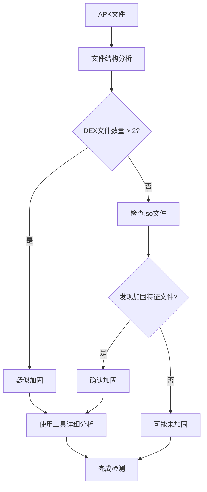

# APK加固检测指南

## 📋 概述

APK加固是一种保护Android应用程序的技术，通过代码混淆、加密、反调试等手段来防止逆向工程。本指南介绍如何判断一个APK是否被加固以及如何识别具体的加固厂商。

## 🔍 加固检测方法

### 1. 文件结构分析

#### 1.1 DEX文件分析
```bash
# 解压APK查看DEX文件
unzip -l app.apk | grep ".dex"
```

**正常APK特征：**
- 通常只有1-2个DEX文件（classes.dex, classes2.dex）
- DEX文件大小合理

**加固APK特征：**
- 多个DEX文件（classes.dex, classes2.dex, classes3.dex等）
- 主DEX文件很小（可能只是壳代码）

#### 1.2 原生库分析
```bash
# 查看lib目录
unzip -l app.apk | grep "lib/.*\.so"
```

**可疑的.so文件：**
- `libjiagu.so` - 360加固
- `libshell.so` - 腾讯加固
- `libexec.so` - 爱加密
- `libsecexe.so` - 梆梆加固
- `libnaga.so` - 娜迦加固

#### 1.3 Assets资源分析
```bash
# 查看assets目录
unzip -l app.apk | grep "assets/"
```

**加固相关文件：**
- `assets/jiagu` - 360加固
- `assets/tp` - 腾讯加固
- `assets/ijiami` - 爱加密
- `assets/bangcle` - 梆梆加固

### 2. 使用自动化检测工具

#### 2.1 使用内置检测工具

**检测本地APK文件：**
```bash
# 使用项目中的检测工具
python apk_packer_detector.py your_app.apk
```

**检测设备上已安装的应用：**
```bash
# 检测设备上的应用（需要ADB连接）
python apk_packer_detector.py --device com.example.app

# 指定设备检测（多设备环境）
python apk_packer_detector.py --device com.example.app emulator-5554
```

**输出示例（本地APK）：**
```
============================================================
APK加固检测报告
============================================================
APK路径: your_app.apk
检测方式: 本地文件
文件总数: 156
DEX文件: 3
原生库: 8
----------------------------------------
🔴 检测结果: 该APK已被加固
加固类型: 360加固
置信度: 85.00%
检测到的特征:
  • 发现文件: libjiagu.so
  • 发现文件: assets/jiagu
  • classes.dex: jiagu
```

**输出示例（设备检测）：**
```
============================================================
APK加固检测报告
============================================================
应用包名: com.example.app
设备ID: emulator-5554
检测方式: 设备提取
文件总数: 142
DEX文件: 2
原生库: 6
----------------------------------------
🟢 检测结果: 该APK未被加固
未发现明显的加固特征
```

#### 2.2 设备检测功能

**设备检测的工作原理：**
1. 通过ADB连接到Android设备
2. 使用`pm path`命令获取应用在设备上的APK路径
3. 使用`adb pull`命令将APK文件提取到本地临时目录
4. 使用相同的检测算法分析提取的APK文件
5. 清理临时文件

**设备检测的优势：**
- 无需手动下载APK文件
- 可以直接检测已安装的应用
- 支持多设备环境
- 自动清理临时文件，不占用存储空间

**设备检测的要求：**
- Android设备已启用USB调试
- ADB工具已安装并配置
- 设备已通过USB或Wi-Fi连接

#### 2.3 检测结果解读

- **置信度 < 30%**: 可能未被加固
- **置信度 30%-60%**: 疑似加固，需要进一步分析
- **置信度 > 60%**: 确认被加固

#### 2.4 测试设备检测功能

**使用测试脚本：**
```bash
# 运行测试脚本
python test_device_detection.py
```

**测试脚本功能：**
1. 自动检查ADB连接状态
2. 列出可用的Android设备
3. 测试常见应用的加固情况
4. 提供详细的检测报告

### 3. 手动检测方法

#### 3.1 使用APKTool反编译
```bash
# 安装APKTool
apt-get install apktool

# 反编译APK
apktool d app.apk -o decompiled_app

# 查看反编译结果
cd decompiled_app
ls -la
```

**加固APK的反编译特征：**
- smali代码很少或难以理解
- 存在大量加密字符串
- 资源文件被加密

#### 3.2 使用Jadx查看源码
```bash
# 安装Jadx
apt-get install jadx

# 查看APK源码
jadx-gui app.apk
```

**加固APK的源码特征：**
- 类名和方法名被混淆（a, b, c等）
- 存在native方法调用
- 代码逻辑难以理解

### 4. 动态检测方法

#### 4.1 运行时分析
```python
# 使用Frida进行动态分析
import frida

# 检测加固相关的系统调用
script = """
Java.perform(function() {
    // 检测加固相关的类加载
    var classLoader = Java.use('java.lang.ClassLoader');
    classLoader.loadClass.implementation = function(className) {
        if (className.indexOf('jiagu') !== -1 || 
            className.indexOf('shell') !== -1) {
            console.log('发现加固类: ' + className);
        }
        return this.loadClass(className);
    };
});
"""
```

#### 4.2 内存Dump分析
```bash
# 使用gdb或lldb进行内存dump
adb shell ps | grep your_app
adb shell cat /proc/<pid>/maps > memory_maps.txt
```

## 🛠️ 加固厂商特征库

### 主要加固厂商特征

| 加固厂商 | 特征文件 | 字符串特征 | 检测指标 |
|---------|---------|-----------|---------|
| **360加固** | `libjiagu.so` | `jiagu`, `360` | 高置信度 |
| **腾讯加固** | `libshell.so` | `tencent`, `tpsdk` | 高置信度 |
| **爱加密** | `libexec.so` | `ijiami`, `aijiami` | 中置信度 |
| **梆梆加固** | `libsecexe.so` | `bangcle`, `secexe` | 高置信度 |
| **娜迦加固** | `libnaga.so` | `naga`, `nagaencrypt` | 中置信度 |
| **通付盾** | `libtpsecurity.so` | `tpsecurity` | 中置信度 |
| **阿里聚安全** | `libmobisec.so` | `alibaba` | 低置信度 |

### 其他检测指标

1. **签名验证**：检查APK签名是否被修改
2. **证书信息**：查看开发者证书信息
3. **权限分析**：检查是否请求敏感权限
4. **资源加密**：检查资源文件是否被加密

## 📊 检测流程

### 快速检测流程


### 详细检测流程
1. **初步筛查**：使用`apk_packer_detector.py`进行快速检测
2. **文件分析**：手动检查APK文件结构
3. **反编译验证**：使用APKTool和Jadx进行源码分析
4. **动态分析**：在运行时检测加固行为
5. **综合判断**：结合多个指标得出最终结论

## 🔧 自动化集成

### 集成到您的项目中
```python
from core.apk.apk_packer_detector import APKPackerDetector

def analyze_apk_security(apk_path):
    """分析APK安全性"""
    detector = APKPackerDetector()
    result = detector.detect_packer(apk_path)
    
    if result["is_packed"]:
        print(f"警告: APK已被{result['packer_type']}加固")
        # 采取相应的安全措施
        return False
    else:
        print("APK安全性检查通过")
        return True

# 使用示例
if analyze_apk_security("app.apk"):
    # 安全，可以继续处理
    process_apk("app.apk")
else:
    # 不安全，拒绝处理
    reject_apk("app.apk")
```

## ⚠️ 注意事项

1. **误报可能**：某些安全SDK可能被误判为加固
2. **新型加固**：新型加固技术可能无法被检测到
3. **法律合规**：检测加固APK需遵守相关法律法规
4. **技术限制**：高级加固技术可能需要专业工具分析

## 📚 参考资料

- [APKTool官方文档](https://ibotpeaches.github.io/Apktool/)
- [Jadx GitHub仓库](https://github.com/skylot/jadx)
- [Frida官方文档](https://frida.re/docs/)
- [Android安全检测指南](https://source.android.com/security)

---

**最后更新**: 2024年
**工具版本**: v1.0
**适用场景**: Android应用安全分析、自动化测试、安全审计