# AutoDroid App 分层架构设计

## 架构概述

本应用采用分层架构设计模式，遵循单一职责原则和依赖倒置原则，确保代码的可维护性、可测试性和可扩展性。数据持久化使用Room数据库，结合LiveData实现响应式UI更新。

## 分层架构

### 架构流程图

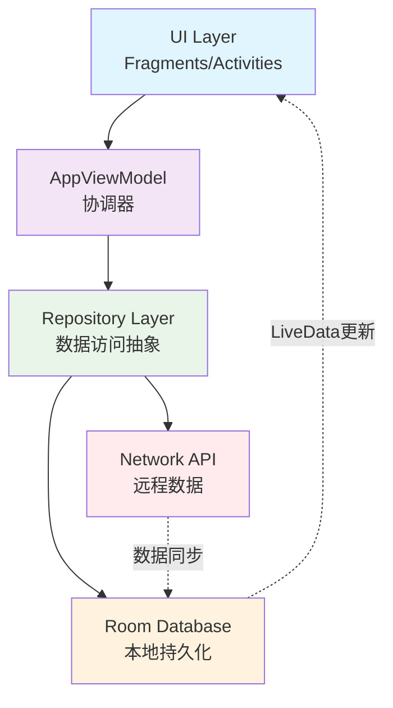
```mermaid
graph TB
    A[UI Layer<br/>Fragments/Activities] --> B[AppViewModel<br/>协调器]
    B --> C[Repository Layer<br/>数据访问抽象]
    C --> D[Room Database<br/>本地持久化]
    C --> E[Network API<br/>远程数据]
    
    D -.->|LiveData更新| A
    E -.->|数据同步| D
    
    style A fill:#e1f5fe
    style B fill:#f3e5f5
    style C fill:#e8f5e8
    style D fill:#fff3e0
    style E fill:#ffebee
```

### 本地优先设计理念

采用"本地优先"（Local-First）设计，确保离线可用性和响应性：

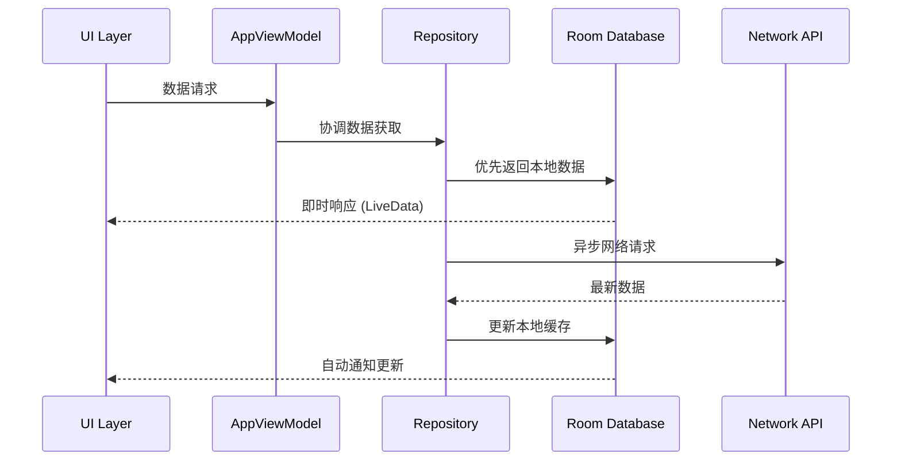
```mermaid
sequenceDiagram
    participant U as UI Layer
    participant V as AppViewModel
    participant R as Repository
    participant D as Room Database
    participant N as Network API
    
    U->>V: 数据请求
    V->>R: 协调数据获取
    R->>D: 优先返回本地数据
    D-->>U: 即时响应 (LiveData)
    
    R->>N: 异步网络请求
    N-->>R: 最新数据
    R->>D: 更新本地缓存
    D-->>U: 自动通知更新
```

## 各层职责

### 架构层次结构

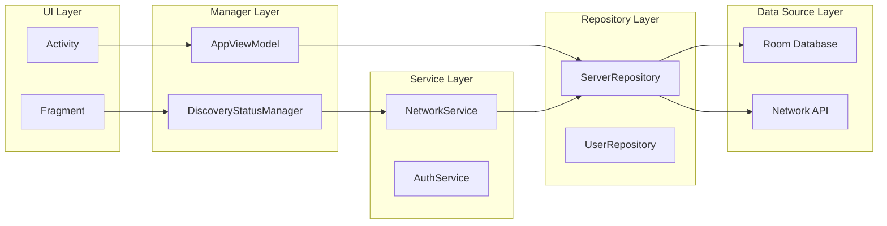
```mermaid
graph LR
    subgraph "UI Layer"
        A1[Activity]
        A2[Fragment]
    end
    
    subgraph "Manager Layer"
        B1[DiscoveryStatusManager]
        B2[AppViewModel]
    end
    
    subgraph "Service Layer"
        C1[NetworkService]
        C2[AuthService]
    end
    
    subgraph "Repository Layer"
        D1[ServerRepository]
        D2[UserRepository]
    end
    
    subgraph "Data Source Layer"
        E1[Room Database]
        E2[Network API]
    end
    
    A1 --> B2
    A2 --> B1
    B1 --> C1
    B2 --> D1
    C1 --> D1
    D1 --> E1
    D1 --> E2
```

### 各层职责说明

| 层级 | 职责 | 关键组件 | 特点 |
|------|------|----------|------|
| **UI层** | 界面展示、用户交互 | Activity/Fragment | 观察LiveData，无业务逻辑 |
| **Manager层** | UI业务逻辑协调 | DiscoveryStatusManager | 管理UI状态，协调Service |
| **Service层** | 具体业务功能 | NetworkService | 执行业务操作，调用Repository |
| **Repository层** | 数据访问管理 | ServerRepository | 统一数据接口，缓存策略 |
| **Data Source层** | 数据存储获取 | Room数据库/网络API | 数据持久化，网络请求 |

## 设计原则

### 单一职责原则 (SRP)

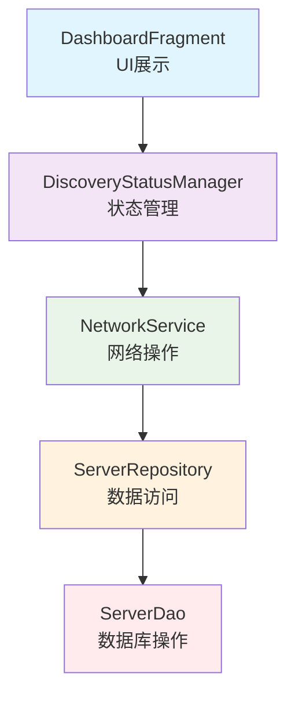
```mermaid
graph TD
    A[DashboardFragment<br/>UI展示] --> B[DiscoveryStatusManager<br/>状态管理]
    B --> C[NetworkService<br/>网络操作]
    C --> D[ServerRepository<br/>数据访问]
    D --> E[ServerDao<br/>数据库操作]
    
    style A fill:#e1f5fe
    style B fill:#f3e5f5
    style C fill:#e8f5e8
    style D fill:#fff3e0
    style E fill:#ffebee
```

### 依赖倒置原则 (DIP)

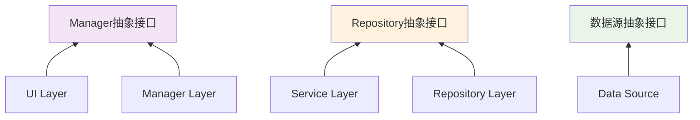
```mermaid
graph BT
    A[UI Layer] --> B[Manager抽象接口]
    C[Manager Layer] --> B
    D[Service Layer] --> E[Repository抽象接口]
    F[Repository Layer] --> E
    G[Data Source] --> H[数据源抽象接口]
    
    style B fill:#f3e5f5
    style E fill:#fff3e0
    style H fill:#e8f5e8
```

## 数据持久化方案

### 数据库结构设计

引用服务端数据模型（参考 `/d:/git/autodroid/autodroid-container/DESIGN.md#L174-175`），移动端本地缓存以下实体：

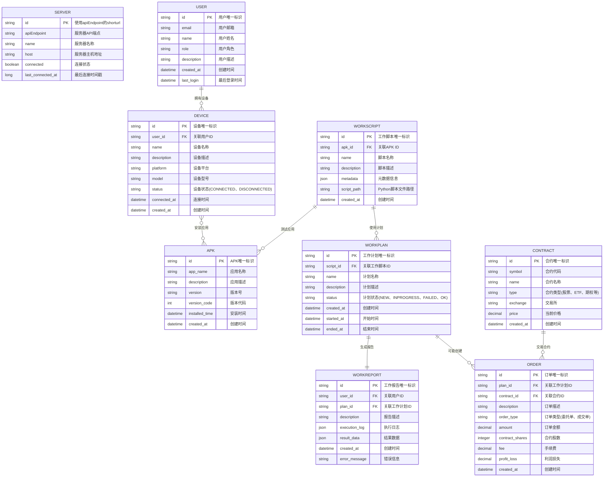
```mermaid
erDiagram
    SERVER {
        string id PK "使用apiEndpoint的shorturl"
        string apiEndpoint "服务器API端点"
        string name "服务器名称"
        string host "服务器主机地址"
        boolean connected "连接状态"
        long last_connected_at "最后连接时间戳"
    }
    
    USER {
        string id PK "用户唯一标识"
        string email "用户邮箱"
        string name "用户姓名"
        string role "用户角色"
        string description "用户描述"
        datetime created_at "创建时间"
        datetime last_login "最后登录时间"
    }
    
    DEVICE {
        string id PK "设备唯一标识"
        string user_id FK "关联用户ID"
        string name "设备名称"
        string description "设备描述"
        string platform "设备平台"
        string model "设备型号"
        string status "设备状态(CONNECTED、DISCONNECTED)"
        datetime connected_at "连接时间"
        datetime created_at "创建时间"
    }
    
    APK {
        string id PK "APK唯一标识"
        string app_name "应用名称"
        string description "应用描述"
        string version "版本号"
        int version_code "版本代码"
        datetime installed_time "安装时间"
        datetime created_at "创建时间"
    }
    
    WORKSCRIPT {
        string id PK "工作脚本唯一标识"
        string apk_id FK "关联APK ID"
        string name "脚本名称"
        string description "脚本描述"
        json metadata "元数据信息"
        string script_path "Python脚本文件路径"
        datetime created_at "创建时间"
    }
    
    WORKPLAN {
        string id PK "工作计划唯一标识"
        string script_id FK "关联工作脚本ID"
        string name "计划名称"
        string description "计划描述"
        string status "计划状态(NEW、INPROGRESS、FAILED、OK)"
        datetime created_at "创建时间"
        datetime started_at "开始时间"
        datetime ended_at "结束时间"
    }
    
    WORKREPORT {
        string id PK "工作报告唯一标识"
        string user_id FK "关联用户ID"
        string plan_id FK "关联工作计划ID"
        string description "报告描述"
        json execution_log "执行日志"
        json result_data "结果数据"
        datetime created_at "创建时间"
        string error_message "错误信息"
    }
    
    CONTRACT {
        string id PK "合约唯一标识"
        string symbol "合约代码"
        string name "合约名称"
        string type "合约类型(股票、ETF、期权等)"
        string exchange "交易所"
        decimal price "当前价格"
        datetime created_at "创建时间"
    }
    
    ORDER {
        string id PK "订单唯一标识"
        string plan_id FK "关联工作计划ID"
        string contract_id FK "关联合约ID"
        string description "订单描述"
        string order_type "订单类型(委托单、成交单)"
        decimal amount "订单金额"
        integer contract_shares "合约股数"
        decimal fee "手续费"
        decimal profit_loss "利润损失"
        datetime created_at "创建时间"
    }
    
    USER ||--o{ DEVICE : "拥有设备"
    DEVICE }o--o{ APK : "安装应用"
    WORKSCRIPT ||--o{ APK : "测试应用"
    WORKSCRIPT ||--o{ WORKPLAN : "使用计划"
    WORKPLAN ||--|| WORKREPORT : "生成报告"
    WORKPLAN ||--o{ ORDER : "可能创建"
    CONTRACT ||--o{ ORDER : "交易合约"
```

### 数据模型定义

引用服务端数据模型（参考 `/d:/git/autodroid/autodroid-container/DESIGN.md#L174-175`），移动端本地缓存以下实体：

**ServerEntity 实体类结构：**

| 字段 | 类型 | 说明 |
|------|------|------|
| id | String | 主键，服务器唯一标识 |
| apiEndpoint | String | 服务器API端点 |
| name | String | 服务器名称 |
| host | String | 服务器主机地址 |
| connected | Boolean | 连接状态 |
| last_connected_at | Long | 最后连接时间戳 |

**UserEntity 实体类结构：**

| 字段 | 类型 | 说明 |
|------|------|------|
| id | String | 主键，用户唯一标识 |
| email | String | 用户邮箱 |
| name | String | 用户姓名 |
| role | String | 用户角色 |
| description | String | 用户描述 |
| created_at | DateTime | 创建时间 |
| last_login | DateTime | 最后登录时间 |

**DeviceEntity 实体类结构：**

| 字段 | 类型 | 说明 |
|------|------|------|
| id | String | 主键，设备唯一标识 |
| user_id | String | 外键，关联用户ID |
| name | String | 设备名称 |
| description | String | 设备描述 |
| platform | String | 设备平台 |
| model | String | 设备型号 |
| status | String | 设备状态（CONNECTED、DISCONNECTED） |
| connected_at | DateTime | 连接时间 |
| created_at | DateTime | 创建时间 |

**ApkEntity 实体类结构：**

| 字段 | 类型 | 说明 |
|------|------|------|
| id | String | 主键，APK唯一标识 |
| app_name | String | 应用名称 |
| description | String | 应用描述 |
| version | String | 版本号 |
| version_code | Int | 版本代码 |
| installed_time | DateTime | 安装时间 |
| created_at | DateTime | 创建时间 |

**WorkScriptEntity 实体类结构：**

| 字段 | 类型 | 说明 |
|------|------|------|
| id | String | 主键，工作脚本唯一标识 |
| apk_id | String | 外键，关联APK ID |
| name | String | 脚本名称 |
| description | String | 脚本描述 |
| metadata | JSON | 元数据信息 |
| script_path | String | Python脚本文件路径 |
| created_at | DateTime | 创建时间 |

**WorkPlanEntity 实体类结构：**

| 字段 | 类型 | 说明 |
|------|------|------|
| id | String | 主键，工作计划唯一标识 |
| script_id | String | 外键，关联工作脚本ID |
| name | String | 计划名称 |
| description | String | 计划描述 |
| status | String | 计划状态（NEW、INPROGRESS、FAILED、OK） |
| created_at | DateTime | 创建时间 |
| started_at | DateTime | 开始时间 |
| ended_at | DateTime | 结束时间 |

**WorkReportEntity 实体类结构：**

| 字段 | 类型 | 说明 |
|------|------|------|
| id | String | 主键，工作报告唯一标识 |
| user_id | String | 外键，关联用户ID |
| plan_id | String | 外键，关联工作计划ID |
| description | String | 报告描述 |
| execution_log | JSON | 执行日志 |
| result_data | JSON | 结果数据 |
| created_at | DateTime | 创建时间 |
| error_message | String | 错误信息 |

**ContractEntity 实体类结构：**

| 字段 | 类型 | 说明 |
|------|------|------|
| id | String | 主键，合约唯一标识 |
| symbol | String | 合约代码 |
| name | String | 合约名称 |
| type | String | 合约类型（股票、ETF、期权等） |
| exchange | String | 交易所 |
| price | Decimal | 当前价格 |
| created_at | DateTime | 创建时间 |

**OrderEntity 实体类结构：**

| 字段 | 类型 | 说明 |
|------|------|------|
| id | String | 主键，订单唯一标识 |
| plan_id | String | 外键，关联工作计划ID |
| contract_id | String | 外键，关联合约ID |
| description | String | 订单描述 |
| order_type | String | 订单类型（委托单、成交单） |
| amount | Decimal | 订单金额 |
| contract_shares | Int | 合约股数 |
| fee | Decimal | 手续费 |
| profit_loss | Decimal | 利润损失 |
| created_at | DateTime | 创建时间 |

### 数据访问操作

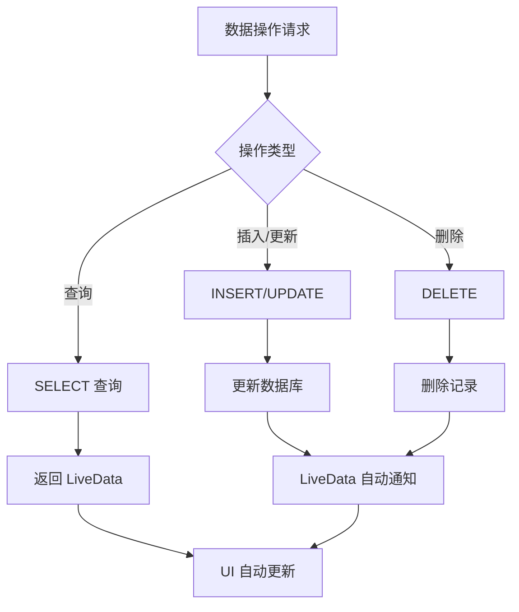
```mermaid
flowchart TD
    A[数据操作请求] --> B{操作类型}
    B -->|查询| C[SELECT 查询]
    B -->|插入/更新| D[INSERT/UPDATE]
    B -->|删除| E[DELETE]
    
    C --> F[返回 LiveData]
    D --> G[更新数据库]
    E --> H[删除记录]
    
    G --> I[LiveData 自动通知]
    H --> I
    F --> J[UI 自动更新]
    I --> J
```

### 响应式数据流

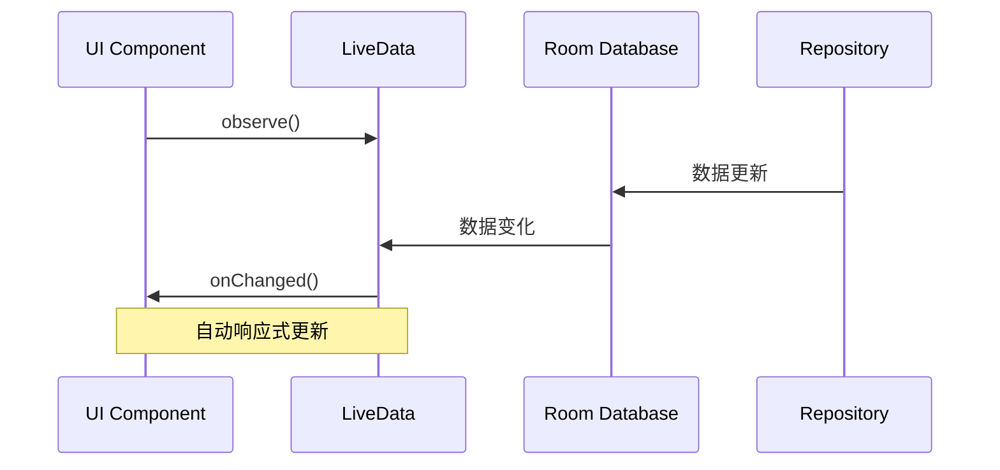
```mermaid
sequenceDiagram
    participant U as UI Component
    participant L as LiveData
    participant D as Room Database
    participant R as Repository
    
    U->>L: observe()
    R->>D: 数据更新
    D->>L: 数据变化
    L->>U: onChanged()
    
    Note over U,L: 自动响应式更新
```

## 核心组件交互流程

### DashboardFragment 生命周期管理

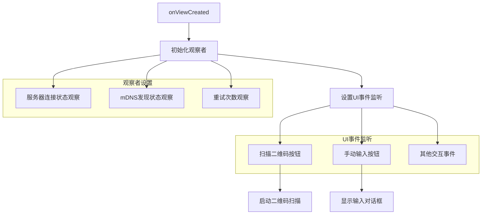
```mermaid
flowchart TD
    A[onViewCreated] --> B[初始化观察者]
    B --> C[设置UI事件监听]
    
    subgraph "观察者设置"
        C1[服务器连接状态观察]
        C2[mDNS发现状态观察]
        C3[重试次数观察]
    end
    
    B --> C1
    B --> C2
    B --> C3
    
    subgraph "UI事件监听"
        D1[扫描二维码按钮]
        D2[手动输入按钮]
        D3[其他交互事件]
    end
    
    C --> D1
    C --> D2
    C --> D3
    
    D1 --> E[启动二维码扫描]
    D2 --> F[显示输入对话框]
```

### DiscoveryStatusManager 状态管理流程

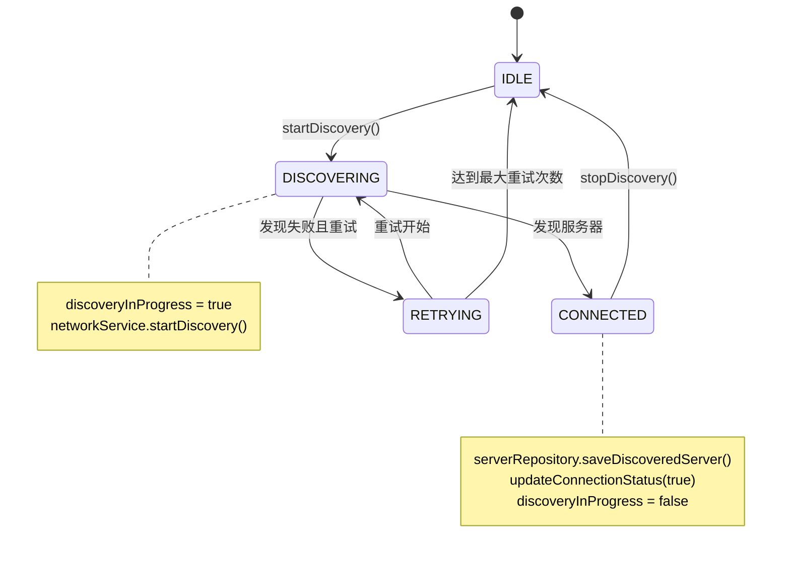
```mermaid
stateDiagram-v2
    [*] --> IDLE
    IDLE --> DISCOVERING : startDiscovery()
    DISCOVERING --> CONNECTED : 发现服务器
    DISCOVERING --> RETRYING : 发现失败且重试
    RETRYING --> DISCOVERING : 重试开始
    RETRYING --> IDLE : 达到最大重试次数
    CONNECTED --> IDLE : stopDiscovery()
    
    note right of DISCOVERING
        discoveryInProgress = true
        networkService.startDiscovery()
    end note
    
    note right of CONNECTED
        serverRepository.saveDiscoveredServer()
        updateConnectionStatus(true)
        discoveryInProgress = false
    end note
```

### 组件职责与交互关系

| 组件 | 主要职责 | 关键方法 | 依赖关系 |
|------|----------|----------|----------|
| **DashboardFragment** | UI展示与用户交互 | setupObservers(), setupUIListeners() | 依赖 DiscoveryStatusManager |
| **DiscoveryStatusManager** | 状态协调与管理 | startDiscovery(), stopDiscovery(), retryDiscovery() | 依赖 NetworkService, ServerRepository |
| **NetworkService** | 网络操作与发现 | startDiscovery(), performMDNSDiscovery() | 依赖 ServerRepository |
| **ServerRepository** | 数据访问与缓存 | getAllServers(), saveDiscoveredServer() | 依赖 ServerDao |

### 数据流与状态变化

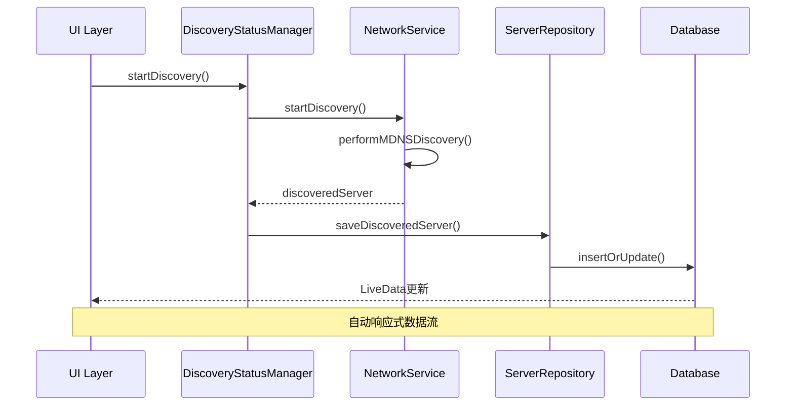
```mermaid
sequenceDiagram
    participant U as UI Layer
    participant M as DiscoveryStatusManager
    participant N as NetworkService
    participant R as ServerRepository
    participant D as Database
    
    U->>M: startDiscovery()
    M->>N: startDiscovery()
    N->>N: performMDNSDiscovery()
    N-->>M: discoveredServer
    M->>R: saveDiscoveredServer()
    R->>D: insertOrUpdate()
    D-->>U: LiveData更新
    
    Note over U,D: 自动响应式数据流
```

### 关键设计模式应用

#### 1. 观察者模式 (Observer Pattern)
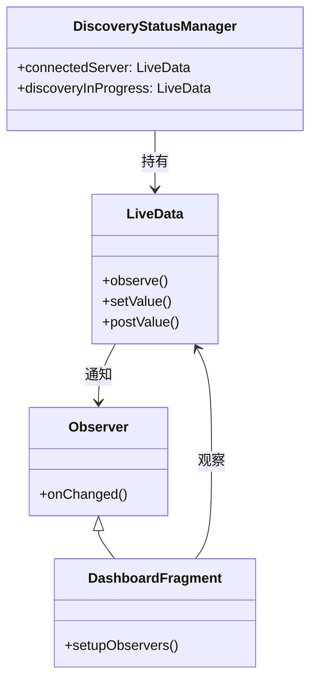
```mermaid
classDiagram
    class LiveData {
        +observe()
        +setValue()
        +postValue()
    }
    
    class Observer {
        +onChanged()
    }
    
    class DiscoveryStatusManager {
        +connectedServer: LiveData
        +discoveryInProgress: LiveData
    }
    
    class DashboardFragment {
        +setupObservers()
    }
    
    Observer <|-- DashboardFragment
    LiveData --> Observer : 通知
    DiscoveryStatusManager --> LiveData : 持有
    DashboardFragment --> LiveData : 观察
```

#### 2. 单例模式 (Singleton Pattern)
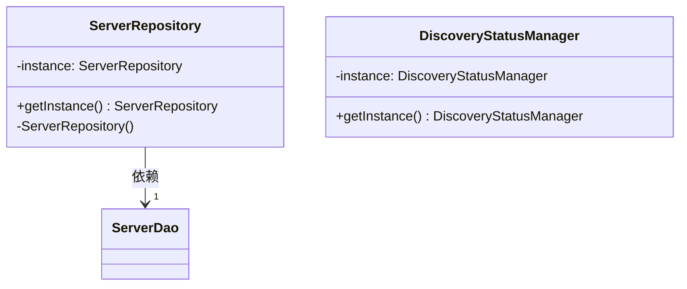
```mermaid
classDiagram
    class ServerRepository {
        -instance: ServerRepository
        +getInstance() ServerRepository
        -ServerRepository()
    }
    
    class DiscoveryStatusManager {
        -instance: DiscoveryStatusManager
        +getInstance() DiscoveryStatusManager
    }
    
    ServerRepository --> "1" ServerDao : 依赖
```

#### 3. 仓储模式 (Repository Pattern)
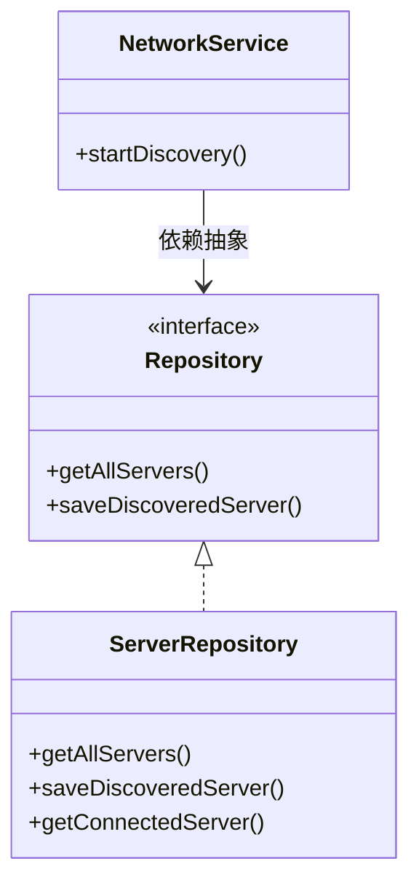
```mermaid
classDiagram
    class Repository {
        <<interface>>
        +getAllServers()
        +saveDiscoveredServer()
    }
    
    class ServerRepository {
        +getAllServers()
        +saveDiscoveredServer()
        +getConnectedServer()
    }
    
    class NetworkService {
        +startDiscovery()
    }
    
    Repository <|.. ServerRepository
    NetworkService --> Repository : 依赖抽象
```
    
    // 数据操作方法
    suspend fun saveDiscoveredServer(discoveredServer: DiscoveredServer) {
        val serverEntity = discoveredServer.toEntity()
        serverDao.insertOrUpdate(serverEntity)
        // 数据库更新后，LiveData会自动通知所有观察者
    }
    
    suspend fun updateConnectionStatus(serverId: String, connected: Boolean) {
        // 先将所有服务器设为未连接
        serverDao.setAllServersDisconnected()
        // 再设置当前服务器为已连接
        serverDao.updateConnectionStatus(serverId, connected)
    }
    
    suspend fun deleteServer(serverId: String) {
        serverDao.deleteById(serverId)
    }
    
    companion object {
        @Volatile private var instance: ServerRepository? = null
        
        fun getInstance(): ServerRepository {
            return instance ?: synchronized(this) {
                instance ?: ServerRepository(
                    DatabaseProvider.serverDao
                ).also { instance = it }
            }
        }
    }
}

// 扩展函数，转换数据模型
fun DiscoveredServer.toEntity(): ServerEntity {
    return ServerEntity(
        id = this.id,
        name = this.name,
        host = this.host,
        port = this.port,
        connected = false, // 初始状态为未连接
        lastSeen = this.discoveredTime,
        serverInfo = Gson().toJson(this) // 将整个对象转为JSON存储
    )
}
```

### DatabaseProvider
```kotlin
object DatabaseProvider {
    private val database: AppDatabase by lazy {
        Room.databaseBuilder(
            AutoDroidApplication.instance,
            AppDatabase::class.java,
            "autodroid_database"
        ).build()
    }
    
    val serverDao: ServerDao by lazy { database.serverDao() }
}

@Database(entities = [ServerEntity::class], version = 1)
abstract class AppDatabase : RoomDatabase() {
    abstract fun serverDao(): ServerDao
}
```

## 数据流向

```
UI事件 → Manager → Service → Repository → Database/API
                ↑                      ↓
UI更新 ← LiveData/Flow ← Repository ← 数据变化
```

## 数据模型

### ServerEntity
```kotlin
@Entity(tableName = "servers")
data class ServerEntity(
    @PrimaryKey val id: String,
    val name: String,
    val host: String,
    val port: Int,
    val connected: Boolean = false,
    val lastSeen: Long = System.currentTimeMillis(),
    val serverInfo: String? = null // JSON格式的完整服务器信息
)
```

### DiscoveredServer
```kotlin
data class DiscoveredServer(
    val id: String,
    val name: String,
    val host: String,
    val port: Int,
    val discoveredTime: Long = System.currentTimeMillis(),
    val additionalInfo: Map<String, String> = emptyMap()
)
```

## DAO (Data Access Object)

### ServerDao
```kotlin
@Dao
interface ServerDao {
    @Query("SELECT * FROM servers ORDER BY lastSeen DESC")
    fun getAllServers(): LiveData<List<ServerEntity>>
    
    @Query("SELECT * FROM servers WHERE connected = 1 LIMIT 1")
    fun getConnectedServer(): LiveData<ServerEntity?>
    
    @Query("SELECT * FROM servers WHERE id = :id")
    suspend fun getServerById(id: String): ServerEntity?
    
    @Insert(onConflict = OnConflictStrategy.REPLACE)
    suspend fun insert(server: ServerEntity)
    
    @Update
    suspend fun update(server: ServerEntity)
    
    @Query("UPDATE servers SET connected = 0")
    suspend fun setAllServersDisconnected()
    
    @Query("UPDATE servers SET connected = :connected WHERE id = :id")
    suspend fun updateConnectionStatus(id: String, connected: Boolean)
    
    @Query("DELETE FROM servers WHERE id = :id")
    suspend fun deleteById(id: String)
    
    @Query("DELETE FROM servers")
    suspend fun deleteAll()
    
    // 插入或更新，基于主键
    @Insert(onConflict = OnConflictStrategy.REPLACE)
    suspend fun insertOrUpdate(server: ServerEntity)
}
```

## 推荐的架构模式

基于实际开发经验和最佳实践，我们推荐以下简化的架构模式：

```
UI Layer (Fragments/Activities)
    ↓
AppViewModel (协调器)
    ↓
Repository Layer (数据访问抽象)
    ↓
Room Database (本地持久化)
    ↓
Network API (远程数据)
```

### 为什么Network API在Room Database之下？

这种架构设计体现了"本地优先"（Local-First）的设计理念，具有以下优势：

1. **离线优先体验**
   - 应用启动时首先从本地数据库加载数据，确保UI快速响应
   - 网络请求失败时，用户仍然可以看到本地缓存的数据
   - 提供无缝的用户体验，不受网络波动影响

2. **数据一致性**
   - Room Database作为单一数据源（Single Source of Truth）
   - 所有UI组件都观察同一个本地数据源，避免数据不一致
   - 网络数据首先保存到本地数据库，然后通过LiveData通知UI更新

3. **性能优化**
   - 本地数据库查询比网络请求快得多
   - 减少不必要的网络请求，节省用户流量
   - 支持数据预加载和缓存策略

4. **架构简化**
   - 移除了复杂的Manager层和Service层
   - AppViewModel直接协调Repository操作
   - Repository负责数据同步和缓存管理

5. **可测试性**
   - 可以轻松模拟Repository进行单元测试
   - 本地数据库操作更容易测试和验证
   - 网络层可以独立测试，不影响业务逻辑

## 架构优势总结

### 单一职责原则 (SRP) 的体现

1. **UI层 (Activity/Fragment)**
   - 只负责UI展示和用户交互
   - 不包含业务逻辑，只调用Manager层方法

2. **Manager层 (DiscoveryStatusManager)**
   - 专门管理服务器发现和连接状态
   - 协调Service层和Repository层，不直接操作数据库

3. **Service层 (NetworkService)**
   - 专注于网络操作和mDNS发现
   - 不关心数据如何存储，只负责获取数据

4. **Repository层 (ServerRepository)**
   - 专门负责数据管理和持久化
   - 提供统一的数据访问接口，隐藏数据源细节

5. **DAO层 (ServerDao)**
   - 专注于数据库操作
   - 只负责SQL查询和执行，不包含业务逻辑

### 依赖倒置原则 (DIP) 的体现

1. **高层模块不依赖低层模块**
   - DiscoveryStatusManager依赖ServerRepository接口，而不是具体实现
   - UI层依赖DiscoveryStatusManager的公共接口，而不是内部实现

2. **抽象不依赖细节**
   - ServerRepository定义抽象接口，不依赖具体的数据库实现
   - 通过LiveData提供响应式数据流，UI层只需观察数据变化

3. **细节依赖抽象**
   - ServerDao实现ServerRepository定义的数据访问抽象
   - 具体的数据库操作实现Repository层定义的接口

### 实际应用效果

1. **数据持久化**
   - 服务器信息保存在SQLite数据库中，不再因Activity/Fragment重建而丢失
   - 登录后服务器状态得以保持，解决了"Server Info登录后丢失"的问题

2. **响应式更新**
   - 使用LiveData实现数据变化自动通知UI更新
   - 任何组件修改服务器状态，所有相关UI组件都会自动更新

3. **可测试性**
   - 每一层职责明确，便于单元测试
   - 可以轻松模拟各层依赖，进行隔离测试

4. **可维护性**
   - 修改网络逻辑不影响UI代码
   - 更换数据库实现不影响业务逻辑层

5. **可扩展性**
   - 添加新的数据源只需实现Repository接口
   - 支持多种UI组件观察同一数据源
```

## 服务器信息管理流程

### 服务器状态管理架构

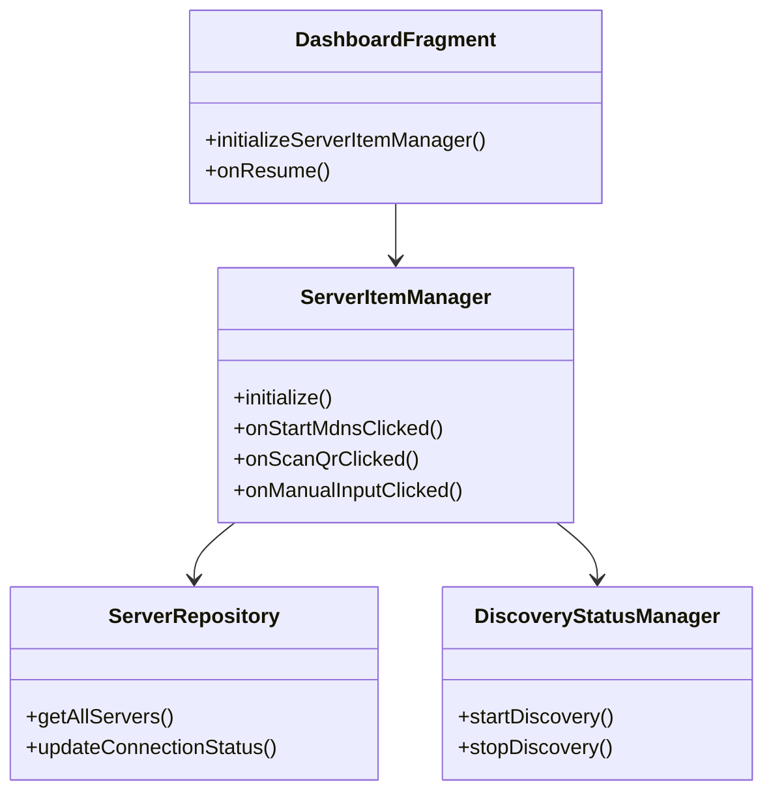
```mermaid
classDiagram
    class ServerItemManager {
        +initialize()
        +onStartMdnsClicked()
        +onScanQrClicked()
        +onManualInputClicked()
    }
    
    class ServerRepository {
        +getAllServers()
        +updateConnectionStatus()
    }
    
    class DashboardFragment {
        +initializeServerItemManager()
        +onResume()
    }
    
    class DiscoveryStatusManager {
        +startDiscovery()
        +stopDiscovery()
    }
    
    ServerItemManager --> ServerRepository
    DashboardFragment --> ServerItemManager
    ServerItemManager --> DiscoveryStatusManager
```

### 服务器状态管理流程

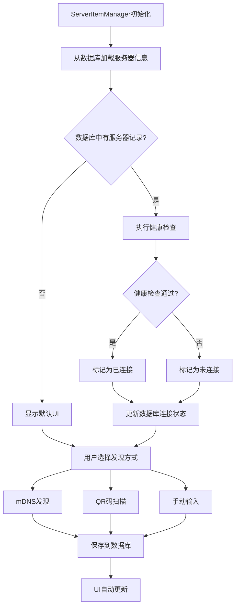
```mermaid
flowchart TD
    A[ServerItemManager初始化] --> B[从数据库加载服务器信息]
    B --> C{数据库中有服务器记录?}
    
    C -->|是| D[执行健康检查]
    C -->|否| E[显示默认UI]
    
    D --> F{健康检查通过?}
    F -->|是| G[标记为已连接]
    F -->|否| H[标记为未连接]
    
    G --> I[更新数据库连接状态]
    H --> I
    E --> J[用户选择发现方式]
    I --> J
    
    J --> K[mDNS发现]
    J --> L[QR码扫描]
    J --> M[手动输入]
    
    K --> N[保存到数据库]
    L --> N
    M --> N
    
    N --> O[UI自动更新]
```

### 服务器发现方式处理

| 发现方式 | 触发条件 | 主要操作 | 状态管理 |
|----------|----------|----------|----------|
| **mDNS发现** | 点击START mDNS按钮 | 启动mDNS发现，禁用按钮防重复点击 | 发现成功时保存服务器信息 |
| **QR码扫描** | 点击SCAN QRCODE按钮 | 终止mDNS发现，启动二维码扫描 | 扫描成功时保存服务器信息 |
| **手动输入** | 点击MANUAL INPUT按钮 | 终止mDNS发现，显示输入对话框 | 用户输入后验证并保存 |

### 页面生命周期管理

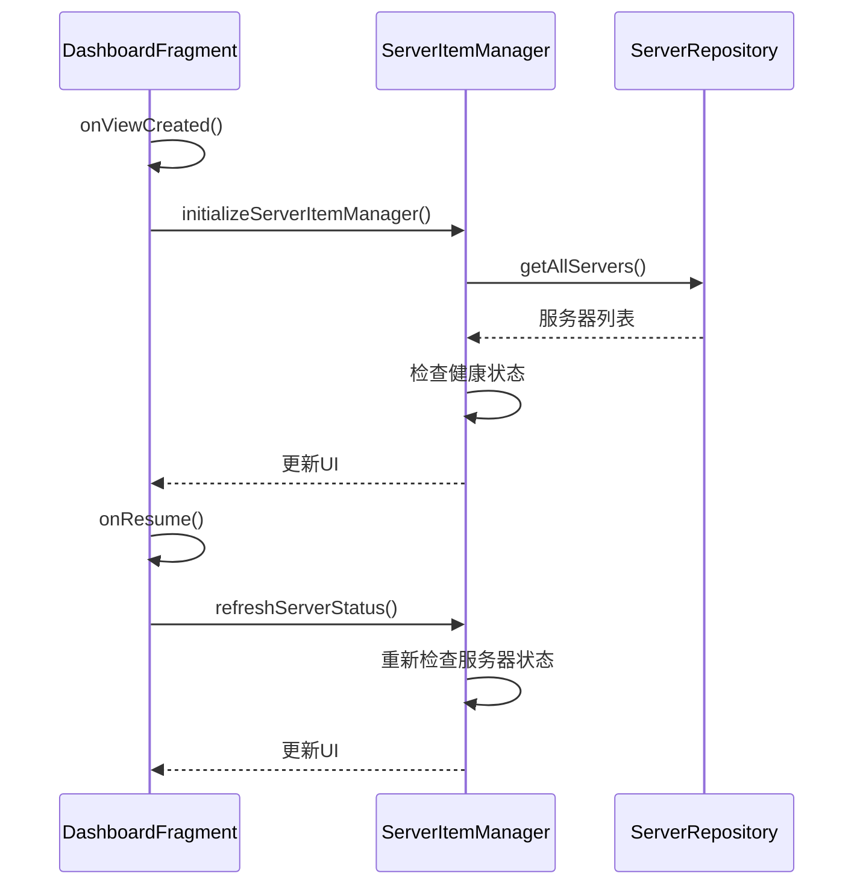
```mermaid
sequenceDiagram
    participant D as DashboardFragment
    participant S as ServerItemManager
    participant R as ServerRepository
    
    D->>D: onViewCreated()
    D->>S: initializeServerItemManager()
    S->>R: getAllServers()
    R-->>S: 服务器列表
    S->>S: 检查健康状态
    S-->>D: 更新UI
    
    D->>D: onResume()
    D->>S: refreshServerStatus()
    S->>S: 重新检查服务器状态
    S-->>D: 更新UI
```

### 服务器信息管理流程图

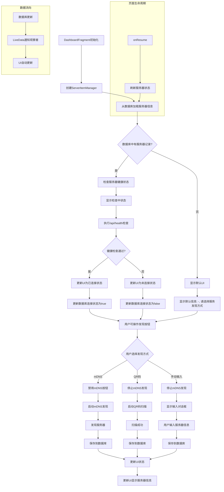
```mermaid
flowchart TD
    A[DashboardFragment初始化] --> B[创建ServerItemManager]
    B --> C[从数据库加载服务器信息]
    C --> D{数据库中有服务器记录?}
    
    D -->|是| E[检查服务器健康状态]
    D -->|否| F[显示默认UI]
    
    E --> G[显示检查中状态]
    G --> H[执行/api/health检查]
    H --> I{健康检查通过?}
    
    I -->|是| J[更新UI为已连接状态]
    I -->|否| K[更新UI为未连接状态]
    
    J --> L[更新数据库连接状态为true]
    K --> M[更新数据库连接状态为false]
    
    F --> N["显示默认信息: -, 请选择服务发现方式"]
    
    L --> O[用户可操作发现按钮]
    M --> O
    N --> O
    
    O --> P{用户选择发现方式}
    
    P -->|mDNS| Q[禁用mDNS按钮]
    Q --> R[启动mDNS发现]
    R --> S[发现服务器]
    S --> T[保存到数据库]
    T --> U[更新UI状态]
    
    P -->|QR码| V[停止mDNS发现]
    V --> W[启动QR码扫描]
    W --> X[扫描成功]
    X --> Y[保存到数据库]
    Y --> U
    
    P -->|手动输入| Z[停止mDNS发现]
    Z --> AA[显示输入对话框]
    AA --> AB[用户输入服务器信息]
    AB --> AC[保存到数据库]
    AC --> U
    
    U --> AD[更新UI显示服务器信息]
    
    subgraph 页面生命周期
        direction TB
        AE[onResume] --> AF[刷新服务器状态]
        AF --> C
    end
    
    subgraph 数据流向
        direction TB
        AG[数据库更新] --> AH[LiveData通知观察者]
        AH --> AI[UI自动更新]
    end
```

### 导航逻辑优化

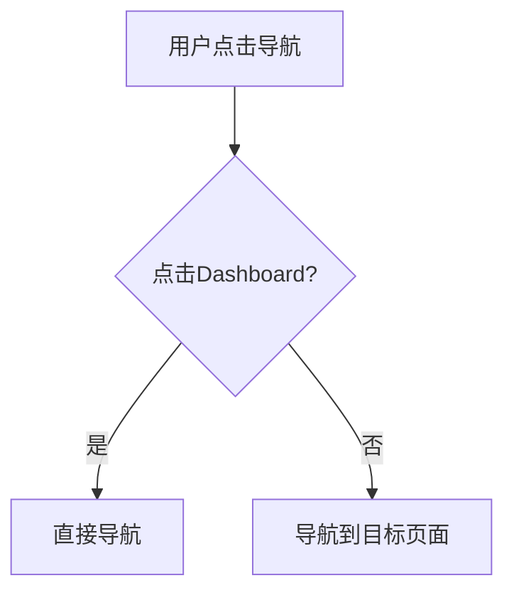
```mermaid
flowchart TD
    A[用户点击导航] --> B{点击Dashboard?}
    B -->|是| C[直接导航]
    B -->|否| D[导航到目标页面]
```

### 导航状态管理

| 状态条件 | 导航行为 | 数据来源 |
|----------|----------|----------|
| **任意状态** | 直接导航到目标页面 | 用户操作 |

## 手动输入功能设计

### 功能流程

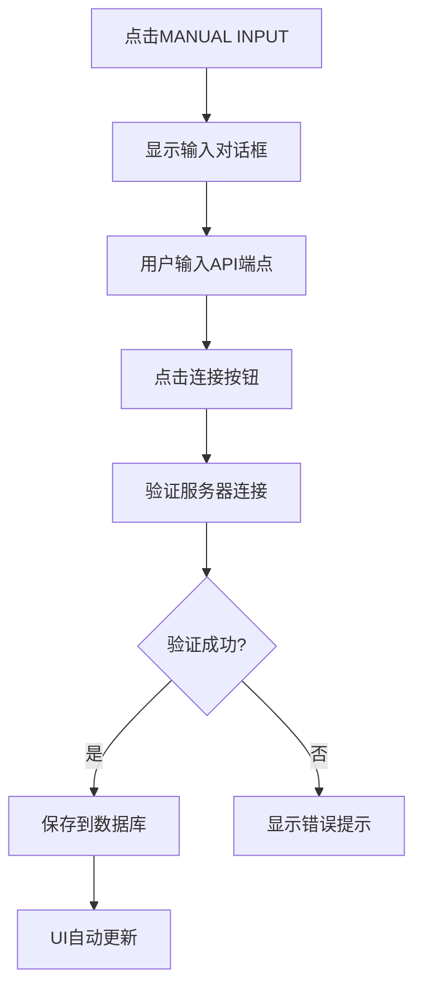
```mermaid
flowchart TD
    A[点击MANUAL INPUT] --> B[显示输入对话框]
    B --> C[用户输入API端点]
    C --> D[点击连接按钮]
    D --> E[验证服务器连接]
    E --> F{验证成功?}
    F -->|是| G[保存到数据库]
    F -->|否| H[显示错误提示]
    G --> I[UI自动更新]
```

### 手动输入架构

```mermaid
classDiagram
    class ServerItemManager {
        +showManualInputDialog()
        +handleManualInputConnection()
        -validateAndConnectToServer()
        -saveServerToDatabase()
    }
    
    class ApiClient {
        +getServerInfo()
    }
    
    class ServerRepository {
        +insertServer()
    }
    
    ServerItemManager --> ApiClient
    ServerItemManager --> ServerRepository
```

### 数据流时序

```mermaid
sequenceDiagram
    participant U as 用户
    participant S as ServerItemManager
    participant A as ApiClient
    participant R as ServerRepository
    participant UI as UI组件
    
    U->>S: 点击MANUAL INPUT
    S->>S: 显示输入对话框
    U->>S: 输入API端点
    U->>S: 点击连接
    S->>A: 验证服务器连接
    A-->>S: 返回服务器信息
    S->>R: 保存服务器信息
    R->>UI: LiveData通知更新
    UI->>UI: 更新界面显示
```
            connected = true,
            lastSeen = System.currentTimeMillis(),
            serverInfo = Gson().toJson(serverInfo),
            discoveryMethod = discoveryMethod
        )
        
        serverRepository.insertOrUpdate(serverEntity)
    }
}

// AppViewModel中的订阅逻辑（已存在）
class AppViewModel : ViewModel() {
    val server: LiveData<Server?> get() = serverRepository?.getConnectedServer()?.map { entity ->
        if (entity != null) {
            // 转换数据库实体为UI模型
            Server(
                name = entity.name,
                host = entity.host,
                port = entity.port,
                connected = entity.connected,
                serverInfo = parseServerInfo(entity.serverInfo)
            )
        } else {
            null
        }
    }
}
```

### UI自动更新机制

```mermaid
flowchart TD
    A[数据库更新] --> B[LiveData通知]
    B --> C[AppViewModel观察]
    C --> D[DashboardFragment更新UI]
    D --> E[item_server.xml显示]
```

### 设计优势总结

| 优势类别 | 具体体现 | 技术实现 |
|----------|----------|----------|
| **简单直接** | 用户输入API端点即可连接 | 手动输入对话框 |
| **数据驱动** | 响应式UI更新 | Room数据库 + LiveData |
| **状态一致** | 所有组件统一数据源 | 单一数据源架构 |
| **离线支持** | 应用重启状态保持 | 数据库持久化 |
| **错误处理** | 清晰提示重试机制 | 错误回调处理 |

### 架构集成关系

```mermaid
graph TB
    A[手动输入功能] --> B[数据库层]
    A --> C[ViewModel层]
    A --> D[UI层]
    A --> E[网络层]
    
    B --> F[Room数据库]
    C --> G[AppViewModel]
    D --> H[item_server.xml]
    E --> I[ApiClient]
```

## 状态管理架构

### DiscoveryStatusManager类结构

```mermaid
classDiagram
    class DiscoveryStatusManager {
        +serverInfo: MutableLiveData
        +connected: MutableLiveData
        +discoveryInProgress: MutableLiveData
        +isServiceRunning: MutableLiveData
        +init()
        +startNetworkService()
        +updateServerInfo()
    }
```

### MainActivity导航逻辑

```mermaid
flowchart TD
    A[MainActivity创建] --> B[设置底部导航]
    B --> C[绑定NavController]
    C --> D[允许所有导航]
```

### 导航状态管理

| 导航项 | 连接状态 | 认证状态 | 导航行为 |
|--------|----------|----------|----------|
| **所有页面** | 任意 | 任意 | 直接导航 |

### 数据模型定义

```mermaid
classDiagram
    class DiscoveredServer {
        -name: String
        -host: String
        -port: int
        -discoveredTime: long
        +getName()
        +getHost()
        +getPort()
        +getDiscoveredTime()
    }
```
