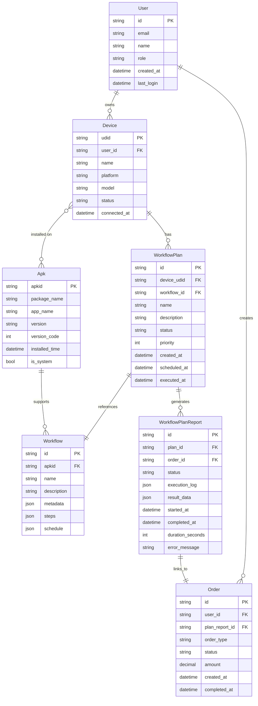

# 服务端设计文档 (Server-side Design Document)

## 1. 架构概述

Autodroid 服务端采用 FastAPI + Python 的微服务架构，提供以下核心功能：
- 设备管理和自动化控制
- 工作流调度和执行
- 实时监控和报告生成
- 前端 API 接口服务

## 2. 服务端驱动配置

### 2.1 FastAPI 服务器配置

#### 端口配置
```python
# 默认端口配置
FASTAPI_PORT = 8000
FASTAPI_HOST = "0.0.0.0"  # 允许所有网络接口访问
```

#### 启动配置
```python
# 使用 uvicorn 启动服务器
uvicorn api.main:app --host 0.0.0.0 --port 8000 --reload
```

### 2.2 前端 API 端点配置

#### 基础配置
```yaml
# frontend/config.yaml
server:
  url: http://localhost:8000
  api_base: /api
  use_https: false
  timeout: 10000
```

#### 动态配置支持
- 支持环境变量覆盖默认配置
- 支持配置文件热重载
- 支持多环境配置（开发/测试/生产）

### 2.3 mDNS 服务发现

#### 服务注册
```python
# mDNS 服务配置
SERVICE_TYPE = "_autodroid._tcp.local."
SERVICE_NAME = "Autodroid Server"
SERVICE_PORT = 8000
SERVICE_PROPERTIES = {
    'version': '1.0',
    'description': 'Autodroid Automation Server'
}
```

#### 自动发现机制
- 服务启动时自动注册 mDNS 服务
- 支持多网卡环境下的服务发布
- 提供服务健康检查机制

### 2.4 CORS 配置

```python
# CORS 中间件配置
app.add_middleware(
    CORSMiddleware,
    allow_origins=["http://localhost:5182", "http://127.0.0.1:5182"],
    allow_credentials=True,
    allow_methods=["*"],
    allow_headers=["*"],
)
```

## 3. API 接口设计

### 3.1 服务器信息接口

```python
@app.get("/api/server")
async def get_server_info():
    """获取服务器基本信息"""
    return {
        "name": "Autodroid Server",
        "hostname": socket.gethostname(),
        "ip_address": get_local_ip(),
        "platform": platform.platform(),
        "port": FASTAPI_PORT,
        "version": "1.0.0"
    }
```

### 3.2 设备管理接口

```python
@app.get("/api/devices")
async def get_devices():
    """获取已连接的设备列表"""
    return {"devices": device_manager.get_connected_devices()}

@app.post("/api/devices/{udid}/connect")
async def connect_device(udid: str):
    """连接指定设备"""
    return device_manager.connect_device(udid)
```

### 3.3 工作流接口

```python
@app.get("/api/workflows")
async def get_workflows():
    """获取可用工作流列表"""
    return {"workflows": workflow_manager.get_workflows()}

@app.post("/api/workflows/{workflow_id}/execute")
async def execute_workflow(workflow_id: str, device_udid: str):
    """在指定设备上执行工作流"""
    return workflow_manager.execute_workflow(workflow_id, device_udid)
```

## 4. 网络配置

### 4.1 多网卡支持

```python
def get_local_ip():
    """获取本地 IP 地址"""
    try:
        # 获取所有网络接口
        interfaces = netifaces.interfaces()
        for interface in interfaces:
            addrs = netifaces.ifaddresses(interface)
            if netifaces.AF_INET in addrs:
                for addr_info in addrs[netifaces.AF_INET]:
                    ip = addr_info['addr']
                    if ip != '127.0.0.1' and not ip.startswith('169.254'):
                        return ip
    except:
        pass
    return "127.0.0.1"
```

### 4.2 端口管理

```python
class PortManager:
    """端口管理类"""
    
    def __init__(self):
        self.used_ports = set()
    
    def get_available_port(self, start_port=8000, max_port=9000):
        """获取可用端口"""
        for port in range(start_port, max_port + 1):
            if port not in self.used_ports and self.is_port_available(port):
                self.used_ports.add(port)
                return port
        raise RuntimeError("No available ports found")
    
    def is_port_available(self, port):
        """检查端口是否可用"""
        try:
            with socket.socket(socket.AF_INET, socket.SOCK_STREAM) as s:
                s.bind(('', port))
                return True
        except:
            return False
```

## 5. 数据模型设计

### 5.1 核心数据模型关系

根据需求分析，我们设计以下数据模型关系：



### 5.2 数据模型分析

#### 实体关系说明：

1. **User (用户)**
   - 一个用户可以拥有多个设备（一对多关系）
   - 核心属性：用户ID、邮箱、姓名、角色、创建时间、最后登录时间

2. **Device (设备)**
   - 每个设备属于一个用户（多对一关系）
   - 每个设备可以安装多个APK（一对多关系）
   - 每个设备可以有多个工作流计划（一对多关系）
   - 核心属性：设备UDID、用户ID、设备名称、平台、型号、状态、连接时间

3. **Apk (应用程序)**
   - 每个APK可以支持多个工作流（一对多关系）
   - 同一个APK可以安装在多个设备上（多对多关系，通过Device-Apk关联表实现）
   - 核心属性：APK ID、包名、应用名称、版本、版本号、安装时间、是否系统应用

4. **Workflow (工作流)**
   - 每个工作流关联一个APK（多对一关系）
   - 每个工作流可以被多个工作流计划引用（一对多关系）
   - 核心属性：工作流ID、APK ID、名称、描述、元数据、步骤配置、调度配置

5. **WorkflowPlan (工作流计划)**
   - 每个工作流计划关联一个设备和一个工作流（多对一关系）
   - 每个工作流计划只能引用一个工作流（一对一关系）
   - 核心属性：计划ID、设备UDID、工作流ID、名称、描述、状态、优先级、创建时间、计划时间、执行时间

#### 关键业务规则：

1. **设备所有权**：设备必须属于一个用户，用户删除时级联删除其设备
2. **APK安装关系**：同一个APK可以在不同设备上安装，形成多对多关系
3. **工作流关联**：工作流与APK强关联，确保工作流只适用于特定应用
4. **计划执行**：工作流计划绑定到具体设备，支持调度和优先级管理
5. **执行报告**：每次计划执行都会生成详细的执行报告，记录执行状态、日志和结果数据
6. **订单关联**：成功的计划执行会自动关联到一个订单，支持业务结算和追踪

### 5.3 数据库表结构设计

```sql
-- 用户表
CREATE TABLE users (
    id TEXT PRIMARY KEY,
    email TEXT UNIQUE NOT NULL,
    name TEXT NOT NULL,
    role TEXT DEFAULT 'user',
    created_at TIMESTAMP DEFAULT CURRENT_TIMESTAMP,
    last_login TIMESTAMP
);

-- 设备表
CREATE TABLE devices (
    udid TEXT PRIMARY KEY,
    user_id TEXT NOT NULL,
    name TEXT NOT NULL,
    platform TEXT NOT NULL,
    model TEXT,
    status TEXT DEFAULT 'disconnected',
    connected_at TIMESTAMP,
    FOREIGN KEY (user_id) REFERENCES users(id) ON DELETE CASCADE
);

-- APK表
CREATE TABLE apks (
    apkid TEXT PRIMARY KEY,
    package_name TEXT NOT NULL,
    app_name TEXT NOT NULL,
    version TEXT,
    version_code INTEGER,
    installed_time TIMESTAMP DEFAULT CURRENT_TIMESTAMP,
    is_system BOOLEAN DEFAULT FALSE
);

-- 设备-APK关联表（多对多关系）
CREATE TABLE device_apks (
    device_udid TEXT,
    apkid TEXT,
    installed_time TIMESTAMP DEFAULT CURRENT_TIMESTAMP,
    PRIMARY KEY (device_udid, apkid),
    FOREIGN KEY (device_udid) REFERENCES devices(udid) ON DELETE CASCADE,
    FOREIGN KEY (apkid) REFERENCES apks(apkid) ON DELETE CASCADE
);

-- 工作流表
CREATE TABLE workflows (
    id TEXT PRIMARY KEY,
    apkid TEXT NOT NULL,
    name TEXT NOT NULL,
    description TEXT,
    metadata JSON,
    steps JSON NOT NULL,
    schedule JSON,
    FOREIGN KEY (apkid) REFERENCES apks(apkid) ON DELETE CASCADE
);

-- 工作流计划表
CREATE TABLE workflow_plans (
    id TEXT PRIMARY KEY,
    device_udid TEXT NOT NULL,
    workflow_id TEXT NOT NULL,
    name TEXT NOT NULL,
    description TEXT,
    status TEXT DEFAULT 'pending',
    priority INTEGER DEFAULT 1,
    created_at TIMESTAMP DEFAULT CURRENT_TIMESTAMP,
    scheduled_at TIMESTAMP,
    executed_at TIMESTAMP,
    FOREIGN KEY (device_udid) REFERENCES devices(udid) ON DELETE CASCADE,
    FOREIGN KEY (workflow_id) REFERENCES workflows(id) ON DELETE CASCADE
);

-- 工作流计划报告表
CREATE TABLE workflow_plan_reports (
    id TEXT PRIMARY KEY,
    plan_id TEXT NOT NULL,
    order_id TEXT,
    status TEXT DEFAULT 'running',
    execution_log JSON,
    result_data JSON,
    started_at TIMESTAMP DEFAULT CURRENT_TIMESTAMP,
    completed_at TIMESTAMP,
    duration_seconds INTEGER,
    error_message TEXT,
    FOREIGN KEY (plan_id) REFERENCES workflow_plans(id) ON DELETE CASCADE,
    FOREIGN KEY (order_id) REFERENCES orders(id) ON DELETE SET NULL
);

-- 订单表
CREATE TABLE orders (
    id TEXT PRIMARY KEY,
    user_id TEXT NOT NULL,
    plan_report_id TEXT UNIQUE,
    order_type TEXT CHECK(order_type IN ('委托单', '成交单')) DEFAULT '委托单',
    status TEXT DEFAULT 'pending',
    amount DECIMAL(10,2) DEFAULT 0.00,
    created_at TIMESTAMP DEFAULT CURRENT_TIMESTAMP,
    completed_at TIMESTAMP,
    FOREIGN KEY (user_id) REFERENCES users(id) ON DELETE CASCADE,
    FOREIGN KEY (plan_report_id) REFERENCES workflow_plan_reports(id) ON DELETE SET NULL
);
```

## 6. 安全性配置

### 6.1 API 认证

```python
# JWT Token 认证
@app.post("/api/auth/login")
async def login(username: str, password: str):
    """用户登录"""
    # 验证用户名密码
    user = authenticate_user(username, password)
    if not user:
        raise HTTPException(status_code=401, detail="Invalid credentials")
    
    # 生成 JWT Token
    access_token = create_access_token(data={"sub": user.username})
    return {"access_token": access_token, "token_type": "bearer"}
```

### 6.2 请求限流

```python
# 请求限流中间件
limiter = Limiter(key_func=get_remote_address)
app.state.limiter = limiter

@app.get("/api/devices")
@limiter.limit("10/minute")
async def get_devices(request: Request):
    """设备列表接口（限流）"""
    return {"devices": device_manager.get_connected_devices()}
```

## 6. 日志和监控

### 6.1 日志配置

```python
# 日志配置
logging.basicConfig(
    level=logging.INFO,
    format='%(asctime)s - %(name)s - %(levelname)s - %(message)s',
    handlers=[
        logging.FileHandler('autodroid.log'),
        logging.StreamHandler()
    ]
)
```

### 6.2 健康检查

```python
@app.get("/api/health")
async def health_check():
    """服务健康检查"""
    return {
        "status": "healthy",
        "timestamp": datetime.now().isoformat(),
        "version": "1.0.0"
    }
```

## 7. 部署配置

### 7.1 Docker 配置

```dockerfile
# Dockerfile
FROM python:3.11-slim

WORKDIR /app
COPY requirements.txt .
RUN pip install -r requirements.txt

COPY . .

EXPOSE 8000

CMD ["uvicorn", "api.main:app", "--host", "0.0.0.0", "--port", "8000"]
```

### 7.2 docker-compose 配置

```yaml
# docker-compose.yml
version: '3.8'
services:
  autodroid-server:
    build: .
    ports:
      - "8000:8000"
    environment:
      - FASTAPI_ENV=production
    volumes:
      - ./workflows:/app/workflows
      - ./reports:/app/reports
```

## 8. 配置管理

### 8.1 环境配置

```python
# config.py
import os
from pydantic import BaseSettings

class Settings(BaseSettings):
    """应用配置"""
    
    # 服务器配置
    host: str = "0.0.0.0"
    port: int = 8000
    
    # 数据库配置
    database_url: str = "sqlite:///./autodroid.db"
    
    # 安全配置
    secret_key: str = "your-secret-key-here"
    
    # 环境变量覆盖
    class Config:
        env_file = ".env"

settings = Settings()
```

## 9. 故障排除

### 9.1 常见问题

1. **端口冲突**：如果端口 8000 被占用，服务端会自动寻找可用端口
2. **网络连接**：确保防火墙允许端口 8000 的访问
3. **mDNS 发现**：确保网络支持多播 DNS

### 9.2 调试工具

```bash
# 检查端口占用
netstat -an | findstr 8000

# 测试 API 连接
curl http://localhost:8000/api/health

# 检查 mDNS 服务
avahi-browse -at
```

---

**文档版本**: 1.0  
**最后更新**: 2025-01-01  
**维护者**: Autodroid 开发团队