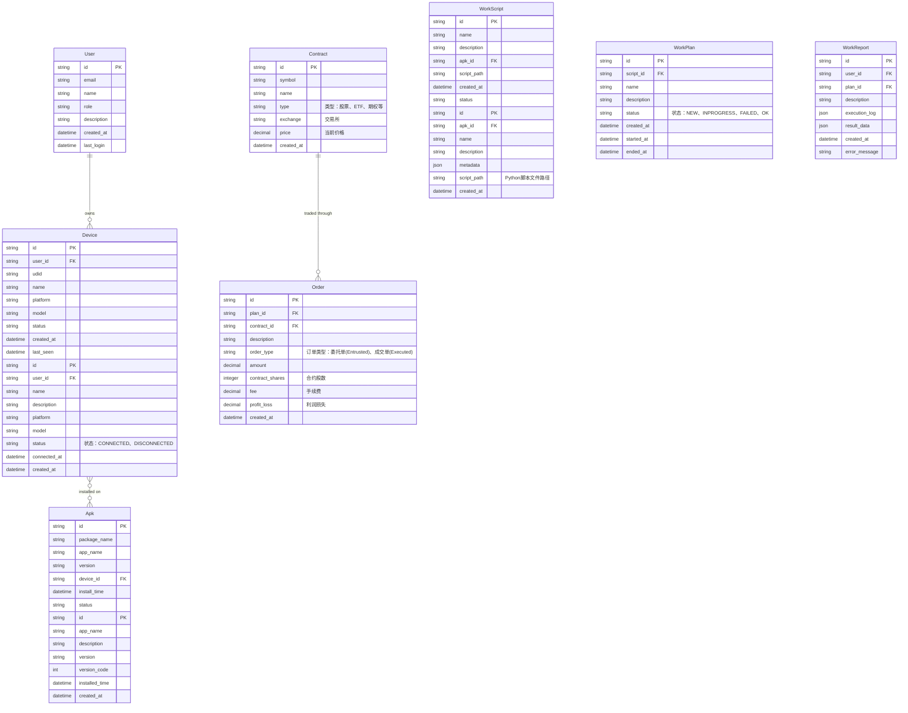

# 服务端设计文档 (Server-side Design Document)

## 1. 架构概述

Autodroid 服务端采用 FastAPI + Python 的微服务架构，提供以下核心功能：
- 设备管理和自动化控制
- 工作脚本调度和执行
- 实时监控和报告生成
- 前端 API 接口服务

## 2. 服务端驱动配置

### 2.1 FastAPI 服务器配置

#### 端口配置
```python
# 默认端口配置
FASTAPI_PORT = 8003
FASTAPI_HOST = "0.0.0.0"  # 允许所有网络接口访问
```

#### 启动配置
```python
# 使用 uvicorn 启动服务器
uvicorn api.main:app --host 0.0.0.0 --port 8003 --reload
```

### 2.2 前端 API 端点配置

#### 基础配置
```yaml
# frontend/config
server:
  url: http://localhost:8003
  api_base: /api
  use_https: false
  timeout: 10000
```

#### 动态配置支持
- 支持环境变量覆盖默认配置
- 支持配置文件热重载
- 支持多环境配置（开发/测试/生产）

### 2.3 mDNS 服务发现

#### 服务注册
```python
# mDNS 服务配置
SERVICE_TYPE = "_autodroid._tcp.local."
SERVICE_NAME = "Autodroid Server"
SERVICE_PORT = 8003
SERVICE_PROPERTIES = {
    'version': '1.0',
    'description': 'Autodroid Automation Server'
}
```

#### 自动发现机制
- 服务启动时自动注册 mDNS 服务
- 支持多网卡环境下的服务发布
- 提供服务健康检查机制

### 2.4 CORS 配置

```python
# CORS 中间件配置
app.add_middleware(
    CORSMiddleware,
    allow_origins=["http://localhost:5182", "http://127.0.0.1:5182"],
    allow_credentials=True,
    allow_methods=["*"],
    allow_headers=["*"],
)
```

## 3. API 接口设计

### 3.1 服务器信息接口

```python
@app.get("/api/server")
async def get_server_info():
    """获取服务器基本信息"""
    return {
        "name": "Autodroid Server",
        "hostname": socket.gethostname(),
        "ip_address": get_local_ip(),
        "platform": platform.platform(),
        "port": FASTAPI_PORT,
        "version": "1.0.0"
    }
```

### 3.2 设备管理接口

```python
@app.get("/api/devices")
async def get_devices():
    """获取已连接的设备列表"""
    return {"devices": device_manager.get_connected_devices()}

@app.post("/api/devices/{udid}/connect")
async def connect_device(udid: str):
    """连接指定设备"""
    return device_manager.connect_device(udid)
```

### 3.3 工作脚本接口

```python
@app.get("/api/workscripts")
async def get_workscripts():
    """获取可用工作脚本列表"""
    return {"workscripts": workscript_manager.get_workscripts()}

@app.post("/api/workscripts/{workscript_id}/execute")
async def execute_workscript(workscript_id: str, device_udid: str):
    """在指定设备上执行工作脚本"""
    return workscript_manager.execute_workscript(workscript_id, device_udid)
```

## 4. 网络配置

### 4.1 多网卡支持

```python
def get_local_ip():
    """获取本地 IP 地址"""
    try:
        # 获取所有网络接口
        interfaces = netifaces.interfaces()
        for interface in interfaces:
            addrs = netifaces.ifaddresses(interface)
            if netifaces.AF_INET in addrs:
                for addr_info in addrs[netifaces.AF_INET]:
                    ip = addr_info['addr']
                    if ip != '127.0.0.1' and not ip.startswith('169.254'):
                        return ip
    except:
        pass
    return "127.0.0.1"
```

### 4.2 端口管理

```python
class PortManager:
    """端口管理类"""
    
    def __init__(self):
        self.used_ports = set()
    
    def get_available_port(self, start_port=8003, max_port=9000):
        """获取可用端口"""
        for port in range(start_port, max_port + 1):
            if port not in self.used_ports and self.is_port_available(port):
                self.used_ports.add(port)
                return port
        raise RuntimeError("No available ports found")
    
    def is_port_available(self, port):
        """检查端口是否可用"""
        try:
            with socket.socket(socket.AF_INET, socket.SOCK_STREAM) as s:
                s.bind(('', port))
                return True
        except:
            return False
```

## 5. 数据模型设计

### 5.1 核心数据模型关系

根据需求分析，我们设计以下数据模型关系：



### 5.2 数据模型分析

#### 实体关系说明：

1. **User (用户)**
   - 一个用户可以拥有多个设备（一对多关系）
   - 核心属性：用户ID、邮箱、姓名、角色、创建时间、最后登录时间

2. **Device (设备)**
   - 每个设备属于一个用户（多对一关系）
   - 每个设备可以安装多个APK（多对多关系，通过Device-Apk关联表实现）
   - 核心属性：设备UDID、用户ID、设备名称、平台、型号、状态、连接时间

3. **Apk (应用程序)**
   - 每个APK被多个工作脚本测试（一对多关系）
   - 同一个APK可以安装在多个设备上（多对多关系，通过Device-Apk关联表实现）
   - 核心属性：包名（主键）、应用名称、版本、版本号、安装时间、是否系统应用

4. **WorkScript (工作脚本)**
   - 每个工作脚本测试一个APK（多对一关系）
   - 每个工作脚本使用多个工作脚本计划去测试APK（一对多关系）
   - 核心属性：工作脚本ID、包名（外键）、名称、描述、元数据、脚本文件路径

5. **WorkPlan (工作脚本计划)**
   - 每个工作脚本计划使用一个工作脚本去测试APK（多对一关系）
   - 每个工作脚本计划生成一个执行报告（一对一关系）
   - 核心属性：计划ID、工作脚本ID、名称、描述、状态、优先级、创建时间、计划时间、执行时间

#### 关键业务规则：

1. **设备所有权**：设备必须属于一个用户，用户删除时级联删除其设备
2. **APK安装关系**：同一个APK可以在不同设备上安装，形成多对多关系
3. **工作脚本关联**：每个APK被多个工作脚本测试，确保工作脚本只适用于特定应用
4. **工作脚本-工作脚本计划关系**：每个工作脚本使用多个工作脚本计划去测试APK，但每个工作脚本计划只能使用一个工作脚本
5. **执行报告生成**：每个工作脚本计划生成一个执行报告，记录执行状态、日志和结果数据
6. **订单关联**：每个工作脚本计划可以创建一个订单，支持业务结算和追踪

### 5.3 数据库表结构设计

```sql
-- 用户表
CREATE TABLE users (
    id TEXT PRIMARY KEY,
    email TEXT UNIQUE NOT NULL,
    name TEXT NOT NULL,
    description TEXT,
    role TEXT DEFAULT 'user',
    created_at TIMESTAMP DEFAULT CURRENT_TIMESTAMP,
    last_login TIMESTAMP
);

-- 设备表
CREATE TABLE devices (
    id TEXT PRIMARY KEY,
    user_id TEXT NOT NULL,
    name TEXT NOT NULL,
    description TEXT,
    platform TEXT NOT NULL,
    model TEXT,
    status TEXT DEFAULT 'disconnected',
    connected_at TIMESTAMP,
    created_at TIMESTAMP DEFAULT CURRENT_TIMESTAMP,
    FOREIGN KEY (user_id) REFERENCES users(id) ON DELETE CASCADE
);

-- APK表
CREATE TABLE apks (
    id TEXT PRIMARY KEY,
    app_name TEXT NOT NULL,
    description TEXT,
    version TEXT,
    version_code INTEGER,
    installed_time TIMESTAMP DEFAULT CURRENT_TIMESTAMP,
    is_system BOOLEAN DEFAULT FALSE,
    created_at TIMESTAMP DEFAULT CURRENT_TIMESTAMP
);

-- 设备-APK关联表（多对多关系）
CREATE TABLE device_apks (
    device_id TEXT,
    apk_id TEXT,
    installed_time TIMESTAMP DEFAULT CURRENT_TIMESTAMP,
    PRIMARY KEY (device_id, apk_id),
    FOREIGN KEY (device_id) REFERENCES devices(id) ON DELETE CASCADE,
    FOREIGN KEY (apk_id) REFERENCES apks(id) ON DELETE CASCADE
);

-- 工作脚本表
CREATE TABLE workscripts (
    id TEXT PRIMARY KEY,
    apk_id TEXT NOT NULL,
    name TEXT NOT NULL,
    description TEXT,
    metadata JSON,
    script_path TEXT NOT NULL,  -- Python脚本文件路径
    created_at TIMESTAMP DEFAULT CURRENT_TIMESTAMP,
    FOREIGN KEY (apk_id) REFERENCES apks(id) ON DELETE CASCADE
);

-- 工作脚本计划表
CREATE TABLE workplans (
    id TEXT PRIMARY KEY,
    script_id TEXT NOT NULL,
    name TEXT NOT NULL,
    description TEXT,
    status TEXT DEFAULT 'NEW' CHECK(status IN ('NEW', 'INPROGRESS', 'FAILED', 'OK')),  -- 计划状态
    created_at TIMESTAMP DEFAULT CURRENT_TIMESTAMP,
    started_at TIMESTAMP,
    ended_at TIMESTAMP,
    FOREIGN KEY (script_id) REFERENCES workscripts(id) ON DELETE CASCADE
);

-- 工作脚本计划报告表
CREATE TABLE workreports (
    id TEXT PRIMARY KEY,
    user_id TEXT NOT NULL,
    plan_id TEXT NOT NULL,
    description TEXT,
    status TEXT DEFAULT 'INPROGRESS' CHECK(status IN ('NEW', 'INPROGRESS', 'FAILED', 'OK')),  -- 报告状态
    execution_log JSON,
    result_data JSON,
    created_at TIMESTAMP DEFAULT CURRENT_TIMESTAMP,
    error_message TEXT,
    FOREIGN KEY (user_id) REFERENCES users(id) ON DELETE CASCADE,
    FOREIGN KEY (plan_id) REFERENCES workplans(id) ON DELETE CASCADE
);

-- 合约表（股票、ETF等）
CREATE TABLE contracts (
    id TEXT PRIMARY KEY,
    symbol TEXT NOT NULL,  -- 交易代码，如 AAPL、SPY
    name TEXT NOT NULL,  -- 合约名称，如 Apple Inc.
    type TEXT CHECK(type IN ('股票', 'ETF', '期权', '期货', '外汇')),  -- 合约类型
    exchange TEXT,  -- 交易所，如 NASDAQ、NYSE
    price DECIMAL(10,2) DEFAULT 0.00,  -- 当前价格
    created_at TIMESTAMP DEFAULT CURRENT_TIMESTAMP
);

-- 订单表
CREATE TABLE orders (
    id TEXT PRIMARY KEY,
    user_id TEXT NOT NULL,
    plan_id TEXT UNIQUE,
    contract_id TEXT,  -- 合约ID，外键指向contracts表
    description TEXT,
    order_type TEXT CHECK(order_type IN ('委托单', '成交单')) DEFAULT '委托单',  -- 订单类型：委托单(Entrusted)、成交单(Executed)
    amount DECIMAL(10,2) DEFAULT 0.00,
    contract_shares INTEGER DEFAULT 0,  -- 合约股数
    fee DECIMAL(10,2) DEFAULT 0.00,  -- 手续费
    profit_loss DECIMAL(10,2) DEFAULT 0.00,  -- 利润损失
    created_at TIMESTAMP DEFAULT CURRENT_TIMESTAMP,
    FOREIGN KEY (user_id) REFERENCES users(id) ON DELETE CASCADE,
    FOREIGN KEY (plan_id) REFERENCES workplans(id) ON DELETE SET NULL,
    FOREIGN KEY (contract_id) REFERENCES contracts(id) ON DELETE SET NULL
);
```

## 6. 安全性配置

### 6.1 API 认证

```python
# JWT Token 认证
@app.post("/api/auth/login")
async def login(username: str, password: str):
    """用户登录"""
    # 验证用户名密码
    user = authenticate_user(username, password)
    if not user:
        raise HTTPException(status_code=401, detail="Invalid credentials")
    
    # 生成 JWT Token
    access_token = create_access_token(data={"sub": user.username})
    return {"access_token": access_token, "token_type": "bearer"}
```

### 6.2 请求限流

```python
# 请求限流中间件
limiter = Limiter(key_func=get_remote_address)
app.state.limiter = limiter

@app.get("/api/devices")
@limiter.limit("10/minute")
async def get_devices(request: Request):
    """设备列表接口（限流）"""
    return {"devices": device_manager.get_connected_devices()}
```

## 6. 日志和监控

### 6.1 日志配置

```python
# 日志配置
logging.basicConfig(
    level=logging.INFO,
    format='%(asctime)s - %(name)s - %(levelname)s - %(message)s',
    handlers=[
        logging.FileHandler('autodroid.log'),
        logging.StreamHandler()
    ]
)
```

### 6.2 健康检查

```python
@app.get("/api/health")
async def health_check():
    """服务健康检查"""
    return {
        "status": "healthy",
        "timestamp": datetime.now().isoformat(),
        "version": "1.0.0"
    }
```

## 7. 部署配置

### 7.1 Docker 配置

```dockerfile
# Dockerfile
FROM python:3.11-slim

WORKDIR /app
COPY requirements.txt .
RUN pip install -r requirements.txt

COPY . .

EXPOSE 8003

CMD ["uvicorn", "api.main:app", "--host", "0.0.0.0", "--port", "8003"]
```

### 7.2 docker-compose 配置

```yaml
# docker-compose.yml
version: '3.8'
services:
  autodroid-server:
    build: .
    ports:
      - "8003:8003"
    environment:
      - FASTAPI_ENV=production
    volumes:
      - ./workscripts:/app/workscripts
      - ./reports:/app/reports
```

## 8. 配置管理

### 8.1 环境配置

```python
# config.py
import os
from pydantic import BaseSettings

class Settings(BaseSettings):
    """应用配置"""
    
    # 服务器配置
    host: str = "0.0.0.0"
    port: int = 8003
    
    # 数据库配置
    database_url: str = "sqlite:///./autodroid.db"
    
    # 安全配置
    secret_key: str = "your-secret-key-here"
    
    # 环境变量覆盖
    class Config:
        env_file = ".env"

settings = Settings()
```

## 9. 故障排除

### 9.1 常见问题

1. **端口冲突**：如果端口 8003 被占用，服务端会自动寻找可用端口
2. **网络连接**：确保防火墙允许端口 8003 的访问
3. **mDNS 发现**：确保网络支持多播 DNS

### 9.2 调试工具

```bash
# 检查端口占用
netstat -an | findstr 8003

# 测试 API 连接
curl http://localhost:8003/api/health

# 检查 mDNS 服务
avahi-browse -at
```

## 10. 模块架构规范设计

### 10.1 统一模块架构

基于对现有 auth、device、apk 三个模块的分析，制定以下统一架构规范：

#### 10.1.1 文件命名规范

每个模块应包含以下标准文件：
- `database.py` - 数据库操作层，使用 Peewee ORM
- `service.py` - 业务逻辑层，处理核心业务功能
- `models.py` - 数据模型层，包含 Pydantic 请求/响应模型

**重命名示例：**
- `apk_database.py` → `database.py`
- `device_manager.py` → `service.py`

#### 10.1.2 模块结构示例

```
core/
├── auth/
│   ├── database.py      # 数据库操作 (已存在)
│   ├── service.py       # 业务逻辑 (已存在)
│   └── models.py        # 数据模型 (已存在)
├── device/
│   ├── database.py      # 数据库操作 (已存在)
│   ├── service.py       # 业务逻辑 (重命名自 device_manager.py)
│   └── models.py        # 数据模型 (待创建)
└── apk/
    ├── database.py      # 数据库操作 (重命名自 apk_database.py)
    ├── service.py       # 业务逻辑 (待创建)
    └── models.py        # 数据模型 (待创建)
```

### 10.2 数据模型分层设计

#### 10.2.1 模型分层架构

```python
# 第一层：Peewee ORM 模型 (全局共享)
# database/models.py
class User(Model):
    id = CharField(primary_key=True)
    email = CharField(unique=True)
    name = CharField()
    description = TextField(null=True)
    role = CharField(default='user')
    created_at = DateTimeField(default=datetime.now)
    last_login = DateTimeField(null=True)

class Device(Model):
    id = CharField(primary_key=True)
    user = ForeignKeyField(User, backref='devices')
    name = CharField()
    description = TextField(null=True)
    platform = CharField()
    model = CharField(null=True)
    status = CharField(default='disconnected')
    connected_at = DateTimeField(null=True)

class Apk(Model):
    id = CharField(primary_key=True)
    app_name = CharField()
    description = TextField(null=True)
    version = CharField(null=True)
    version_code = IntegerField(null=True)
    installed_time = DateTimeField(default=datetime.now)
    is_system = BooleanField(default=False)

class WorkScript(Model):
    id = CharField(primary_key=True)
    apk = ForeignKeyField(Apk, field='id', backref='workscripts')
    name = CharField()
    description = TextField(null=True)
    metadata = JSONField(null=True)
    script_path = CharField()

class WorkPlan(Model):
    id = CharField(primary_key=True)
    script = ForeignKeyField(WorkScript, backref='workplans')
    name = CharField()
    description = TextField(null=True)
    status = CharField(default='NEW')  # NEW, INPROGRESS, FAILED, OK
    created_at = DateTimeField(default=datetime.now)
    started_at = DateTimeField(null=True)
    ended_at = DateTimeField(null=True)

class WorkReport(Model):
    id = CharField(primary_key=True)
    plan = ForeignKeyField(WorkPlan, backref='workreports')
    description = TextField(null=True)
    status = CharField(default='INPROGRESS')  # NEW, INPROGRESS, FAILED, OK
    execution_log = JSONField(null=True)
    result_data = JSONField(null=True)
    created_at = DateTimeField(default=datetime.now)
    error_message = TextField(null=True)

class Contract(Model):
    id = CharField(primary_key=True)
    symbol = CharField()  # 交易代码，如 AAPL、SPY
    name = CharField()  # 合约名称，如 Apple Inc.
    type = CharField()  # 股票、ETF、期权、期货、外汇
    exchange = CharField(null=True)  # 交易所，如 NASDAQ、NYSE
    price = DecimalField(default=0.00, max_digits=10, decimal_places=2)  # 当前价格
    created_at = DateTimeField(default=datetime.now)

class Order(Model):
    id = CharField(primary_key=True)
    user = ForeignKeyField(User, backref='orders')
    plan = ForeignKeyField(WorkPlan, backref='orders', null=True, unique=True)
    contract = ForeignKeyField(Contract, backref='orders', null=True)
    description = TextField(null=True)
    order_type = CharField(default='委托单')  # 委托单(Entrusted)、成交单(Executed)
    amount = DecimalField(default=0.00, max_digits=10, decimal_places=2)
    contract_shares = IntegerField(default=0)  # 合约股数
    fee = DecimalField(default=0.00, max_digits=10, decimal_places=2)  # 手续费
    profit_loss = DecimalField(default=0.00, max_digits=10, decimal_places=2)  # 利润损失
    created_at = DateTimeField(default=datetime.now)

# 第二层：模块专用 Pydantic 模型
# user/models.py
class UserCreateRequest(BaseModel):
    id: str
    name: str
    description: Optional[str] = None
    email: str
    role: str = "user"

class UserResponse(BaseModel):
    id: str
    name: str
    description: Optional[str]
    email: str
    role: str
    created_at: datetime

# apk/models.py
class ApkCreateRequest(BaseModel):
    id: str
    app_name: str
    description: Optional[str] = None
    version: Optional[str] = None
    version_code: Optional[int] = None
    is_system: bool = False

class ApkResponse(BaseModel):
    id: str
    app_name: str
    description: Optional[str]
    version: Optional[str]
    version_code: Optional[int]
    installed_time: datetime
    is_system: bool

# device/models.py
class DeviceCreateRequest(BaseModel):
    id: str
    user_id: str
    name: str
    description: Optional[str] = None
    platform: str
    model: Optional[str] = None

class DeviceResponse(BaseModel):
    id: str
    user_id: str
    name: str
    description: Optional[str]
    platform: str
    model: Optional[str]
    status: str
    connected_at: Optional[datetime]

# workreport/models.py
class WorkReportCreateRequest(BaseModel):
    user_id: str
    plan_id: str
    description: Optional[str] = None
    status: str = "INPROGRESS"
    execution_log: Optional[dict] = None
    result_data: Optional[dict] = None
    error_message: Optional[str] = None

class WorkReportResponse(BaseModel):
    id: str
    user_id: str
    plan_id: str
    description: Optional[str]
    status: str
    execution_log: Optional[dict]
    result_data: Optional[dict]
    created_at: datetime
    error_message: Optional[str]

# contract/models.py
class ContractCreateRequest(BaseModel):
    id: str
    symbol: str
    name: str
    type: str = "股票"
    exchange: Optional[str] = None
    price: float = 0.00

class ContractResponse(BaseModel):
    id: str
    symbol: str
    name: str
    type: str
    exchange: Optional[str]
    price: float
    created_at: datetime

# order/models.py
class OrderCreateRequest(BaseModel):
    user_id: str
    plan_id: str
    contract_id: Optional[str] = None
    description: Optional[str] = None
    order_type: str = "委托单"
    amount: float = 0.00
    contract_shares: int = 0
    fee: float = 0.00
    profit_loss: float = 0.00

class OrderResponse(BaseModel):
    id: str
    user_id: str
    plan_id: str
    contract_id: Optional[str]
    description: Optional[str]
    order_type: str
    amount: float
    contract_shares: int
    fee: float
    profit_loss: float
    created_at: datetime
```

#### 10.2.2 数据库操作层规范

每个模块的 `database.py` 应遵循以下规范：

```python
# apk/database.py 示例
class ApkDatabase:
    def __init__(self, db_path: str):
        self.db = SqliteDatabase(db_path)
        self.models = [Apk, DeviceApk]  # 只包含本模块相关的模型
    
    def register_apk_to_device(self, apk_data: dict, device_id: str) -> Apk:
        """使用 Peewee ORM 注册 APK 到设备"""
        with self.db.atomic():
            apk, created = Apk.get_or_create(
                id=apk_data['id'],
                defaults=apk_data
            )
            # 关联设备
            DeviceApk.get_or_create(
                device_id=device_id,
                apk_id=apk.id
            )
            return apk
    
    def get_apk(self, id: str) -> Optional[Apk]:
        """使用 Peewee 查询获取 APK"""
        try:
            return Apk.get(Apk.id == id)
        except Apk.DoesNotExist:
            return None
```

#### 10.2.3 业务逻辑层规范

每个模块的 `service.py` 应遵循以下规范：

```python
# apk/service.py 示例
class ApkService:
    def __init__(self, db: ApkDatabase):
        self.db = db
    
    def register_apk(self, apk_data: ApkCreateRequest, device_udid: str) -> ApkResponse:
        """注册 APK 业务逻辑"""
        # 1. 数据验证
        if not self._validate_apk_data(apk_data):
            raise ValueError("Invalid APK data")
        
        # 2. 调用数据库层
        apk = self.db.register_apk_to_device(apk_data.dict(), device_udid)
        
        # 3. 转换为响应模型
        return ApkResponse.from_orm(apk)
    
    def _validate_apk_data(self, apk_data: ApkCreateRequest) -> bool:
        """APK 数据验证"""
        # 实现验证逻辑
        return True
```

### 10.3 实施计划

#### 10.3.1 第一阶段：文件重命名和结构调整
- [x] 重命名 `apk_database.py` → `database.py`
- [x] 重命名 `device_manager.py` → `service.py`
- [x] 重命名 `Workflow` → `WorkScript`
- [x] 重命名 `WorkflowPlan` → `WorkPlan`
- [x] 重命名 `WorkflowPlanReport` → `WorkReport`
- [ ] 为 apk 模块创建 `service.py`
- [ ] 为 apk 模块创建 `models.py`
- [ ] 为 device 模块创建 `models.py`

#### 10.3.2 第二阶段：数据库重构
- [ ] 重构 apk 模块的 `database.py`，完全使用 Peewee ORM
- [ ] 重构 auth 模块，移除专用数据库管理器
- [ ] 统一所有模块的数据库实现方式

#### 10.3.3 第三阶段：集成测试
- [ ] 更新所有相关文件的导入语句
- [ ] 测试统一后的架构功能
- [ ] 验证各模块间的数据一致性

### 10.4 技术优势

1. **一致性**：所有模块采用相同的架构模式
2. **可维护性**：清晰的职责分离，便于代码维护
3. **可扩展性**：新增模块可快速套用现有模式
4. **测试友好**：各层可独立测试，提高测试覆盖率
5. **类型安全**：Pydantic 模型提供运行时类型检查

### 10.5 迁移注意事项

1. **向后兼容**：确保现有 API 接口不受影响
2. **数据迁移**：需要处理现有数据的迁移
3. **依赖更新**：更新所有相关模块的导入路径
4. **测试覆盖**：确保重构后的功能完整性

---

**文档版本**: 1.2  
**最后更新**: 2025-01-01  
**维护者**: Autodroid 开发团队

## 更新记录

### v1.2 (2025-01-01)
- 重命名 `Workflow` → `WorkScript`
- 重命名 `WorkflowPlan` → `WorkPlan`  
- 重命名 `WorkflowPlanReport` → `WorkReport`
- 修正实体关系：移除Device与WorkPlan、Apk与WorkPlan的直接关系
- 确立直接关系：User→Device, Device↔Apk, Apk→WorkScript, WorkScript→WorkPlan, WorkPlan→WorkReport, WorkPlan→Order
- 更新相关 API 端点和数据库表结构
- 更新实体关系图和文档描述
- Apk实体主键变更：使用package_name作为主键，移除apkid字段
- WorkPlan实体外键字段名变更：`workscript_id` → `script_id`
- Apk实体主键字段名变更：`package_name` → `apk_id` → `id`
- Device实体主键字段名变更：`udid` → `id`
- WorkScript实体字段变更：`steps`和`schedule` → `script_path`（Python脚本文件路径）
- WorkScript实体外键字段名变更：`apkid` → `apk_id`
- WorkPlan实体字段变更：删除`priority`字段，保留`created_at`字段，按创建时间顺序执行
- 统一状态字段值：status字段状态值规范化为NEW、INPROGRESS、FAILED、OK
- **重要关系变更**：Order实体从WorkReport关联改为WorkPlan关联，外键从`report_id`改为`plan_id`，移除WorkReport中的order字段
- **实体图更新**：移除WorkReport中的`order_id`字段，简化为只包含`created_at`字段（删除`started_at`、`completed_at`、`duration_seconds`字段）
- **数据库表更新**：删除workreports表中的`order_id`字段及对应外键约束，简化为只包含`created_at`字段（删除`started_at`、`completed_at`、`duration_seconds`字段）
- **业务规则更新**：订单关联从"成功的执行报告可以生成多个订单"改为"每个工作脚本计划可以创建一个订单"
- **Order模型简化**：移除`status`和`completed_at`字段，只保留核心订单信息（用户、计划、类型、金额、创建时间）