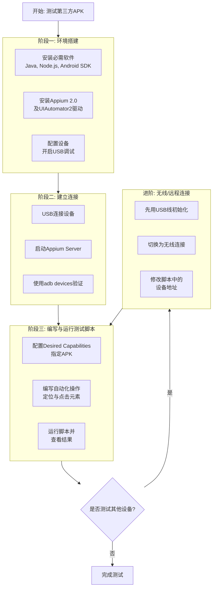
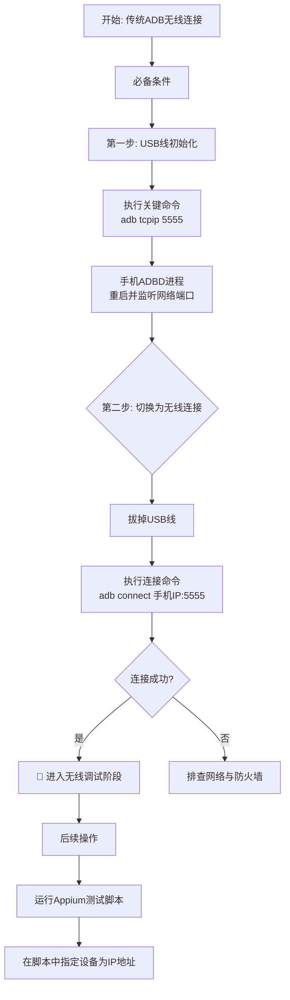

# Connectivity

## Q: adb don't need the device network ip to connect to device?
## A: Yes, adb can connect to the device even if it doesn't have a network IP address.对于ADB是否需要设备网络IP来连接，答案是：**不一定**。它完全取决于你使用的连接方式。

ADB有两种主要的连接模式：一种是利用电脑上的ADB服务器进行本地桥接，这种情况不需要知道设备IP；另一种是通过网络直接与设备通信，这种情况下必须知道设备IP。

### 🔌 两种连接方式对比
下面的表格清晰地展示了这两种模式的主要区别：

| 特性 | **本地ADB（无需设备IP）** | **网络ADB（需要设备IP）** |
| :--- | :--- | :--- |
| **核心原理** | 电脑上的ADB客户端连接本机ADB服务器（默认监听 `localhost:5037`），由服务器管理已连接的设备。 | 电脑通过TCP/IP网络直接与设备上的 `adbd` 守护进程通信。 |
| **是否需要设备IP** | **不需要**。客户端与服务器都在同一台电脑上，通过本地环回地址通信。 | **必须需要**。用于定位网络中的目标设备，通常是局域网IP（如 `192.168.1.100:5555`）。 |
| **传输方式** | 通过USB数据线进行物理连接。 | 通过Wi-Fi或以太网进行网络连接。 |
| **典型命令** | `adb devices` （列出本机ADB服务器管理的设备）<br>`adb shell` （若只有一个设备）<br>`adb -s <设备序列号> shell` （指定多设备中的某一个） | `adb connect <设备IP>:<端口>`<br>`adb disconnect <设备IP>:<端口>` |
| **设备准备** | 开启USB调试模式，并用数据线连接到电脑。 | 1. **首次设置通常需要USB线**：通过 `adb tcpip 5555` 命令开启设备的网络监听。<br>2. 断开USB后，使用 `adb connect <设备IP>` 进行无线连接。 |

> **请注意**：Android 11及以上版本系统内置了“无线调试”功能，可以在不通过USB线的情况下，直接在设备上生成配对码进行安全连接，这比传统的网络ADB方式更方便。

### 💡 常见问题与技巧
- **多设备如何选择**：当电脑通过USB和网络同时连接了多个设备时，使用 `adb devices` 会列出所有设备（如 `emulator-5554` 和 `192.168.1.100:5555`）。此时，你需要使用 `-s` 参数指定设备的**序列号**来执行命令（例如：`adb -s emulator-5554 shell`）。
- **特殊情况**：存在像 `dadb` 这样的第三方库，它绕过了ADB服务器，允许应用程序直接与设备通信，但其内部实现仍然需要知道设备的网络地址。

如果你能告诉我你具体想用ADB连接什么设备（比如是实体手机、虚拟机，还是电视盒子），或者遇到了什么连接问题，我可以提供更具体的建议。

## Q: then how to get "设备IP" in android code?
## A: 根据搜索结果，要获取Android设备的IP地址，主要有两种方式：通过网络接口枚举和通过Socket连接获取。为了帮你快速选择，以下是两种方法的对比：

| 特性 | **通过网络接口枚举** | **通过Socket连接获取** |
| :--- | :--- | :--- |
| **原理** | 枚举所有网络接口，过滤出有效IP地址。 | 通过尝试连接外部网络，获取系统为此连接选择的本地地址。 |
| **优点** | **速度快、无需网络权限**、可一次性获取所有IP（IPv4/IPv6）。 | 直接获取**当前活动网络**的IP，结果相对准确。 |
| **缺点** | 可能返回多个IP，需自行根据业务逻辑筛选。 | **依赖外部网络可达性**，连接尝试有延迟或失败风险。 |
| **适用场景** | 需要快速、稳定地获取IP（如用于本机信息展示）。 | 明确需要知道应用**当前出站流量**所使用的IP地址。 |

### 💻 核心代码实现
下面分别给出两种方法在Android原生开发中的核心实现。

#### 方法一：通过网络接口枚举（推荐）
这是最经典和可靠的方式。核心思路是遍历所有网络接口，并过滤掉回环地址、虚拟接口等无效地址。

```kotlin
import android.net.NetworkInterface

fun getLocalIpAddress(): String? {
    try {
        // 遍历所有网络接口
        for (networkInterface in NetworkInterface.getNetworkInterfaces()) {
            // 过滤条件：接口已启用、非回环、非虚拟接口
            if (!networkInterface.isUp || networkInterface.isLoopback || networkInterface.isVirtual) {
                continue
            }
            // 遍历该接口下的所有IP地址
            for (inetAddress in networkInterface.inetAddresses) {
                // 过滤条件：非回环地址、非链路本地地址（如169.254.x.x）
                if (!inetAddress.isLoopbackAddress && !inetAddress.isLinkLocalAddress) {
                    val hostAddress = inetAddress.hostAddress
                    // 通常我们更关心IPv4地址，但这里返回找到的第一个有效地址
                    return hostAddress
                }
            }
        }
    } catch (e: Exception) {
        e.printStackTrace()
    }
    return null
}
```
*这段代码直接返回找到的第一个非回环、非链路本地的IPv4或IPv6地址。如果你只需要IPv4，可以添加一个检查`inetAddress is Inet4Address`。*

#### 方法二：通过Socket连接获取
此方法通过尝试建立一个到外部服务器的连接（如Google DNS `8.8.8.8`），来获取系统为此连接分配的本地IP地址。

```kotlin
import java.net.*

fun getIpViaSocket(): String? {
    var socket: Socket? = null
    try {
        // 注意：此处连接到8.8.8.8:53，并未实际发送数据
        // 建议设置超时（如2000毫秒）以避免在网络异常时长时间阻塞
        socket = Socket()
        socket.connect(InetSocketAddress("8.8.8.8", 53), 2000)
        return socket.localAddress?.hostAddress
    } catch (e: Exception) {
        e.printStackTrace()
        return null
    } finally {
        socket?.close()
    }
}
```
*使用此方法时需注意：应用需要网络权限，且外部服务器地址必须可达。根据测试，使用IP地址（如`8.8.8.8`）比使用域名（如`baidu.com`）在异常情况下更快失败。*

### ⚠️ 关于ADB连接的重要说明
你需要特别注意，在Android设备上通过代码获取到的IP地址（通常是`192.168.x.x`这样的局域网地址），**可能无法直接用于无线ADB连接**。

主要原因在于，Android 11及更高版本系统内置的“无线调试”功能，为了安全起见，**每次都会生成一个随机的端口号**。你可以按照以下步骤连接：

1.  在设备上进入**开发者选项** -> **无线调试**，然后启动它。
2.  点击**使用配对码配对设备**，你会看到一个**IP地址和6位配对码**（例如 `192.168.1.100:37123` 和 `123456`）。
3.  在你的电脑上，使用命令 `adb pair 192.168.1.100:37123`，并在提示时输入配对码 `123456`。
4.  配对成功后，无线调试界面会显示一个用于**连接的IP地址和端口**（例如 `192.168.1.100:40123`）。
5.  最后使用 `adb connect 192.168.1.100:40123` 完成连接。

这个过程说明，**直接通过代码获取的设备Wi-Fi IP，可能并不等于ADB无线调试实际监听的IP和端口**。真正的连接信息需要从“无线调试”界面获取。

### 🎯 总结与建议
1.  **获取IP地址**：首选**通过网络接口枚举的方法一**。它速度快、不依赖外部网络，能稳定地获取到设备在局域网内的IP地址。
2.  **用于ADB连接**：需要**分清概念**。通过代码获取的Wi-Fi IP是用于网络通信的。而现代Android无线ADB连接，其**准确IP和端口信息必须从开发者选项的“无线调试”界面实时获取**，两者往往不同。
3.  **插件方案**：如果你的项目基于**uni-app**、**APICloud**等跨平台框架，可以使用现成的插件（如[hw-uts-socket](citation:2)、[hardwareInfo](citation:4)）来简化获取IP的过程。

如果你能告诉我你获取设备IP的具体用途（例如，是为了显示在App界面上，还是为了局域网内的服务发现），我可以提供更有针对性的建议。


## Q: 我需要测试第三方apk，需要appium和adb自动化输入点击按钮等操作apk来测试
## A: 根据你的需求，基于Appium和ADB对第三方APK进行自动化测试是一个高效的选择。我将这个完整流程整合为下方的路线图，它清晰地展示了从准备到执行的步骤，你可以将其视为一份行动指南。



### 🔧 阶段一：搭建测试环境
你需要先在电脑上安装以下核心软件，这是整个流程的基础。
1.  **Java SDK**：Appium运行所依赖。
2.  **Node.js与npm**：用于安装Appium。安装后可通过 `node -v` 和 `npm -v` 命令验证。
3.  **Android SDK**：主要提供ADB等工具。建议通过**Android Studio**安装，并配置`ANDROID_HOME`环境变量。
4.  **安装Appium 2.0**：在命令行中执行 `npm install -g appium@next` 进行安装。由于Appium 2.0架构变化，还需单独安装Android驱动：`appium driver install uiautomator2`。
5.  **准备测试设备**：在Android手机的**开发者选项**中，开启 **“USB调试”** 。

### 🔗 阶段二：建立设备连接
完成环境配置后，你需要让设备与测试服务器连接起来。
1.  **连接设备**：使用USB线连接手机和电脑。
2.  **启动服务**：在一个命令行窗口中启动Appium服务器。你可以简单地输入 `appium`，也可以指定端口 `appium -p 4723`。
3.  **验证连接**：打开另一个命令行窗口，输入 `adb devices`。如果看到设备序列号，后面显示 `device`，则表示连接成功。

### 📜 阶段三：编写并运行测试脚本
连接建立后，你就可以编写自动化脚本了。以下是使用Python语言和`uiautomator2`驱动的一个核心示例，展示了如何启动APK并执行点击操作。

```python
from appium import webdriver
from appium.webdriver.common.touch_action import TouchAction

# 1. 定义设备与APP的关键参数
desired_caps = {
    'platformName': 'Android',          # 测试平台
    'platformVersion': '10',            # 手机安卓系统版本
    'deviceName': 'your_device_id',     # 通过`adb devices`获取的设备ID
    'automationName': 'UiAutomator2',   # 自动化驱动
    'appPackage': 'com.example.targetapp',  # 待测APK的包名
    'appActivity': '.MainActivity',          # 启动时的主界面
    'noReset': True                     # 是否在测试前重置APP状态
}

# 2. 连接Appium服务器
driver = webdriver.Remote('http://localhost:4723/wd/hub', desired_caps)

# 3. 执行自动化操作（例如：点击一个按钮）
try:
    # 通过“资源ID”定位一个按钮（这是最推荐的方式）
    button = driver.find_element_by_id('com.example.targetapp:id/btn_submit')
    button.click()
    
    # 也可以通过“文本内容”定位
    # button = driver.find_element_by_android_uiautomator('new UiSelector().text("确定")')
    # button.click()
    
    # 还可以使用TouchAction执行更复杂的手势
    # action = TouchAction(driver)
    # action.tap(x=300, y=500).perform() # 点击屏幕特定坐标

finally:
    # 4. 测试结束后，退出并关闭会话
    driver.quit()
```

> 注：你需要将上方代码中的 `your_device_id`、`com.example.targetapp` 等参数替换成你实际测试环境和APK的信息。获取APK包名和主Activity的方法，通常可以通过 `aapt dump badging your_app.apk` 命令或使用Android Studio的APK分析工具实现。

### 🚀 进阶技巧：无线连接与AI辅助
当基础流程跑通后，你可以尝试以下进阶操作来提升效率：
*   **无线连接测试**：可以摆脱USB线的束缚。
    1.  先用USB线连接手机和电脑。
    2.  在命令行输入 `adb tcpip 5555` 重启ADB为TCP/IP模式。
    3.  断开USB线，确保手机和电脑在同一个Wi-Fi下，在命令行输入 `adb connect 手机IP地址:5555` 即可无线连接。
    4.  之后在测试脚本中，将 `deviceName` 的值改为手机的IP地址（如 `192.168.1.100:5555`）即可。
*   **AI辅助定位元素**：对于界面元素难以定位的情况，可以探索Appium的实验性插件 **`appium-llm-plugin`**。它允许你使用自然语言（如“点击登录按钮”）来查找和操作元素，能显著降低编写和维护定位器（如ID、XPath）的复杂度。

如果你在尝试过程中，卡在了某个具体步骤（例如获取APK的包名，或者某个按钮始终定位不到），可以随时提出，我会为你提供更详细的排查思路。

## Q: 进阶：无线、远程连接需要手机支持wifi调试模式？
## A: 是的，进行无线或远程Appium自动化测试，需要手机支持无线ADB连接。根据你的Android系统版本，主要有两种实现方式，它们的原理和步骤有所不同。

为了帮你快速了解，下表对比了这两种方式的核心区别：

| 特性/方式 | **传统 ADB TCP/IP 模式** | **Android 11+ 无线调试模式 (更推荐)** |
| :--- | :--- | :--- |
| **核心原理** | 通过USB线临时开启设备网络端口，随后切换到无线连接。 | 系统内置功能，通过配对码安全配对，完全无需USB线。 |
| **系统要求** | 几乎所有Android版本（需开启USB调试）。 | **通常要求Android 11及以上** (部分厂商在Android 10上提供)。 |
| **是否需要USB线** | **首次设置需要**，用于开启端口。 | **完全不需要**，全程无线。 |
| **安全性** | 开启端口后，同一网络内设备均可连接，有一定风险。 | 需要一次性配对码，更安全。 |
| **主要操作步骤** | 1. USB连接；<br>2. 执行 `adb tcpip <端口>`；<br>3. 拔线后 `adb connect <IP:端口>`。 | 1. 手机上开启“无线调试”，获取配对码和IP；<br>2. 电脑执行 `adb pair <IP:端口> <配对码>`；<br>3. 执行 `adb connect <IP:端口>`。 |

### 🔧 两种连接方式的具体操作
1.  **传统 ADB TCP/IP 模式 (通用方法)**
    这是最经典的方法，主要步骤与之前流程图中的“无线连接”环节一致。
    *   **先用USB连接**手机和电脑。
    *   在命令行执行 `adb tcpip 5555`，将ADB监听模式切换到网络端口（如5555）。
    *   **拔掉USB线**，在命令行执行 `adb connect 手机IP地址:5555`（如 `adb connect 192.168.1.100:5555`）。
    *   连接成功后，在Appium脚本的`Desired Capabilities`中，将`deviceName`的值设置为手机的IP地址和端口（如`"192.168.1.100:5555"`）即可开始无线自动化测试。

2.  **Android 11+ 无线调试模式 (现代方法)**
    这是系统原生支持的更安全的方法。
    *   在手机的**开发者选项**中，找到并启用 **“无线调试”**。
    *   进入“无线调试”设置页，选择 **“使用配对码配对设备”**，记录下显示的**IP地址、端口和6位配对码**。
    *   在电脑命令行执行 `adb pair IP地址:配对端口 配对码`（例如 `adb pair 192.168.1.100:37211 123456`）。
    *   配对成功后，界面上会显示用于连接的端口，执行 `adb connect IP地址:连接端口`（例如 `adb connect 192.168.1.100:42424`）即可。

### 💡 重要提示与建议
*   **统一网络**：无论哪种方式，确保**手机和电脑连接在同一个Wi-Fi网络（局域网）下**。
*   **首选无线调试**：如果你的手机系统是Android 11或以上，**强烈推荐使用系统自带的“无线调试”功能**，它更安全、方便，且摆脱了对USB线的依赖。
*   **防火墙问题**：如果连接失败，请检查电脑防火墙是否阻止了ADB或相关端口的通信。
*   **关于Root**：传统方法中，有资料提及需要Root权限，但通过系统开发者选项开启ADB网络调试通常不需要Root。系统自带的无线调试功能则完全不需要Root。

你可以先查看一下手机的Android版本和开发者选项，确认支持哪种方式。如果在连接过程中遇到具体问题，例如`adb connect`失败或者找不到“无线调试”选项，可以告诉我你的手机型号和系统版本，我能提供更具体的排查步骤。

## Q: 没有无线调试模式，就一直要连着usb才能调试？
## A: 不一定。**即使手机没有Android 11以上系统原生的“无线调试”模式，仍然可以通过传统的ADB TCP/IP方法实现无线连接。** 但是，这个方法**首次设置时通常需要USB线**来开启网络端口。

简单来说就是：**“有线搭桥，无线起飞”**。下图清晰地展示了传统ADB无线连接的完整流程，帮助你理解其工作原理和必经步骤：



### 核心方法与注意事项

要实现上图流程，你需要执行以下关键步骤，并注意其中可能遇到的问题：

1.  **确保基础条件**：手机已开启“USB调试”，并与电脑在**同一Wi-Fi网络**下。
2.  **用USB线“搭桥”**：用USB连接手机和电脑，然后在电脑命令行执行：
    ```
    adb tcpip 5555
    ```
    这个命令会重启手机的ADB守护进程，并让其开始监听网络端口（例如`5555`）。看到类似 *“restarting in TCP mode port: 5555”* 的提示即表示成功。
3.  **切换至无线**：此时**可以拔掉USB线**。在命令行中输入：
    ```
    adb connect 手机IP地址:5555
    ```
    连接成功后，使用 `adb devices` 应能看到一个以IP地址开头的设备。

### ⚠️ 重要提示
*   **连接稳定性**：无线连接受网络状况影响，可能不如USB稳定。如果测试中断，可能需要重复上述步骤重新连接。
*   **获取手机IP**：可以在手机“设置” > “关于手机” > “状态信息”中查看，或连接USB时用命令 `adb shell ip route` 或 `adb shell ifconfig wlan0` 查看。
*   **防火墙**：如果连接失败，请检查电脑防火墙是否阻止了ADB或相关端口。

### 🚀 进阶情况：完全无需USB的无线连接
对于一些已获取**Root权限**的设备，有办法做到**完全摆脱USB线**进行首次设置。原理是通过在手机上直接运行命令来开启网络调试。但这方法更复杂且有风险，一般用户不建议操作。

总结来说，核心区别在于：
*   **有“无线调试”模式**：全程无需USB，用配对码连接。
*   **没有“无线调试”模式**：首次需USB“搭桥”，之后可无线使用。

如果你的手机因为系统版本较旧（如Android 10或更早）而没有无线调试选项，那么上述传统方法就是你的主要选择。在尝试过程中，如果遇到连接问题，可以告诉我你的手机型号和系统版本，我会提供更具体的排查建议。