# AutoDroid App 分层架构设计

## 架构概述

本应用采用分层架构设计模式，遵循单一职责原则和依赖倒置原则，确保代码的可维护性、可测试性和可扩展性。数据持久化使用Room数据库，结合LiveData实现响应式UI更新。

## 分层架构

### 架构流程图

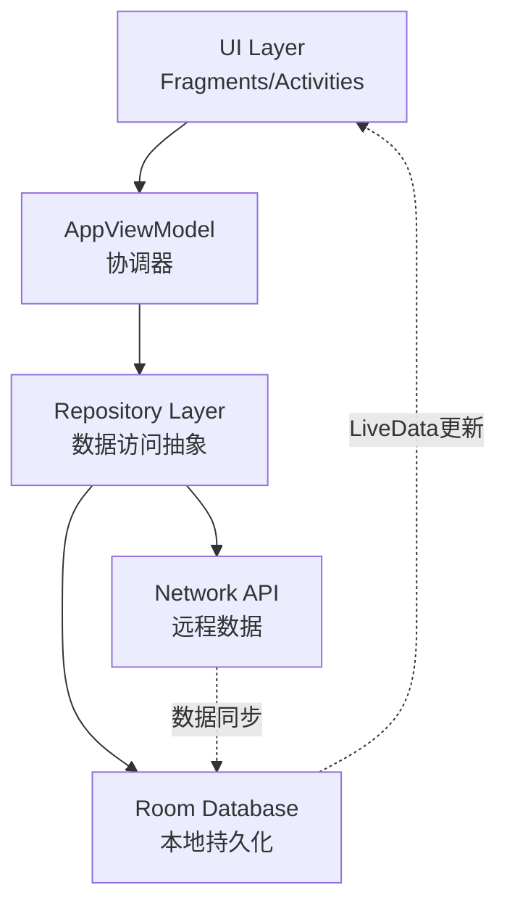

### 本地优先设计理念

采用"本地优先"（Local-First）设计，确保离线可用性和响应性：

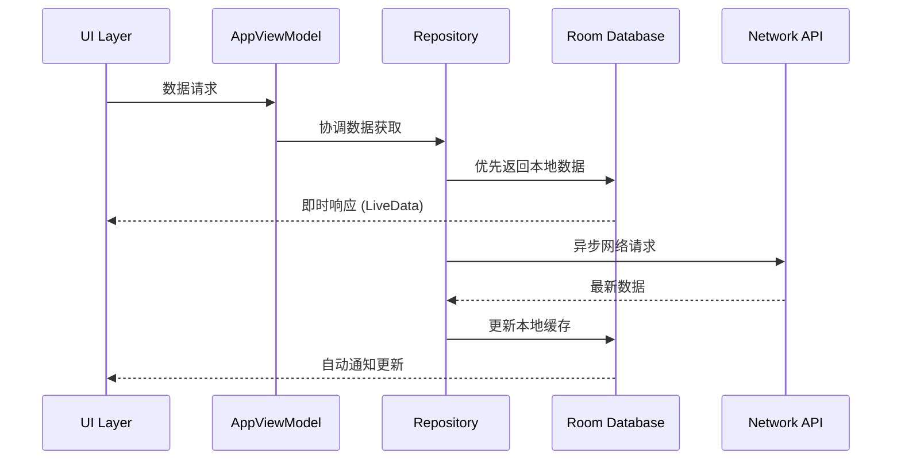

#### Repository层职责

根据"本地优先设计理念"，Repository层应该负责：

1. **异步调用API同步服务器数据到本地数据库**
   - Repository层负责所有网络操作和数据同步
   - 处理API响应并将数据转换为本地Entity对象
   - 管理网络错误和重试逻辑

2. **立即从本地数据库返回信息**
   - Repository层优先从本地数据库返回数据，确保UI响应性
   - 使用LiveData提供响应式数据流
   - 在后台异步同步最新数据，不影响UI体验

3. **提供数据订阅接口**
   - Repository层提供getXXX方法（如getDeviceByIdLiveData、getAllDevices等）返回LiveData
   - 其他模块（UI层、Manager层）通过这些getXXX方法订阅数据变化
   - 业务逻辑方法（如registerDevice、checkDeviceWithServer）返回单个Entity对象，不返回LiveData

#### 架构优势

这样的设计完全遵循了"本地优先设计理念"和"数据模型抽象原则"：

- **Repository层负责所有网络操作和数据同步**
- **Manager层只负责业务逻辑协调**
- **UI层始终只与Entity对象交互，不直接处理Response对象**

这种架构的优势是：

1. **职责分离清晰**：Repository负责数据操作，Manager负责业务协调
2. **易于维护**：网络API变更不会影响Manager和UI层
3. **一致性**：UI层始终使用统一的数据模型
4. **离线优先**：本地Entity对象可以独立于网络状态存在
5. **灵活的数据访问**：通过getXXX方法提供LiveData订阅，业务逻辑方法返回单个Entity，满足不同场景需求
6. **响应式更新**：数据变化自动通知所有订阅者，无需手动刷新UI

### 数据模型抽象原则

**核心原则**：服务端返回的Response对象应该对UI层完全屏蔽，UI层只与Entity对象交互。

#### 设计理念

1. **Response对象隔离**：所有网络API返回的Response对象（如`DeviceCreateResponse`、`DeviceResponse`等）应该限制在Repository层内部，不应传递到UI层。

2. **Entity对象统一**：UI层、ViewModel层和Manager层应该只使用Entity对象（如`DeviceEntity`、`ServerEntity`等）进行数据交互。

3. **数据转换封装**：Repository层负责将Response对象转换为对应的Entity对象，并处理本地数据库的同步更新。

#### 实现规范

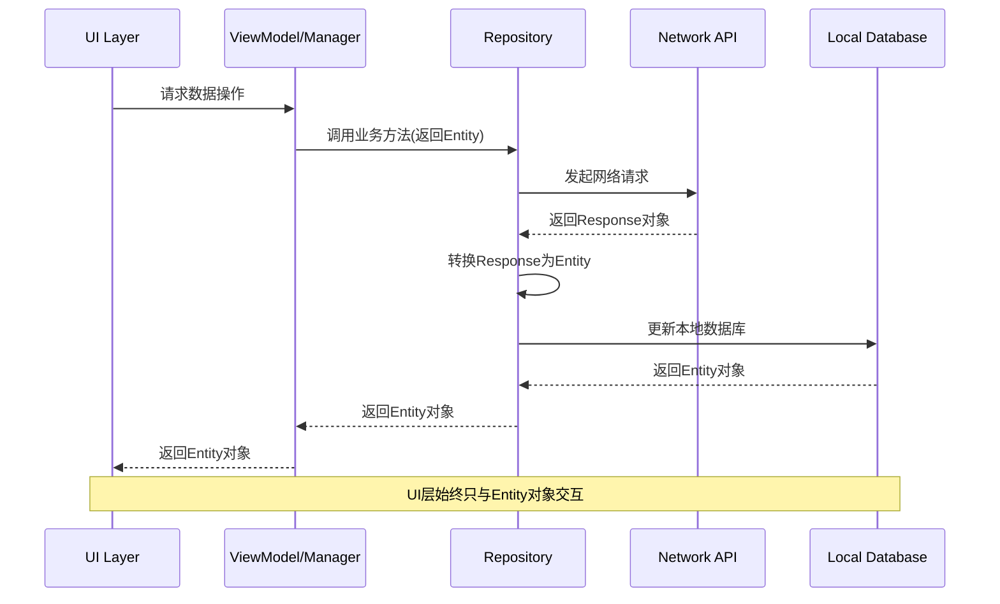

#### 代码示例

**❌ 错误示例 - Response对象传递到UI层**
```kotlin
// Manager/ViewModel层
suspend fun registerDevice(): DeviceCreateResponse {
    return deviceRepository.registerDevice(device)
}

// UI层
val response = deviceManager.registerDevice()
// UI层需要处理Response对象，违反了抽象原则
```

**✅ 正确示例 - Entity对象封装**
```kotlin
// Manager/ViewModel层
suspend fun registerDevice(): DeviceEntity {
    // 业务逻辑方法返回单个Entity对象
    return deviceRepository.registerDevice(device)
}

// UI层 - 执行业务操作
val deviceEntity = deviceManager.registerDevice()
// UI层只与Entity对象交互，保持架构清晰

// UI层 - 订阅数据变化
deviceRepository.getDeviceByIdLiveData(deviceId).observe(viewLifecycleOwner) { device ->
    // 当设备数据变化时自动更新UI
    updateUI(device)
}
```

#### 优势

1. **架构清晰**：UI层不需要了解网络API的具体实现细节
2. **易于维护**：网络API变更不会影响UI层代码
3. **类型安全**：Entity对象提供类型安全的数据访问
4. **一致性**：UI层始终使用统一的数据模型
5. **离线优先**：本地Entity对象可以独立于网络状态存在

## 各层职责

### 架构层次结构

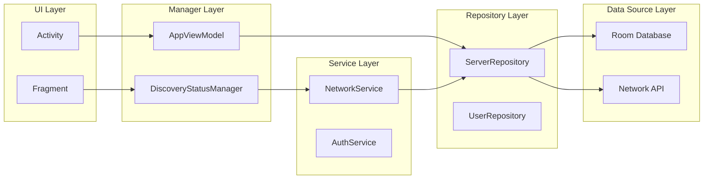

### 各层职责说明

| 层级 | 职责 | 关键组件 | 特点 |
|------|------|----------|------|
| **UI层** | 界面展示、用户交互 | Activity/Fragment | 观察LiveData，无业务逻辑 |
| **Manager层** | UI业务逻辑协调 | DiscoveryStatusManager | 管理UI状态，协调Service |
| **Service层** | 具体业务功能 | NetworkService | 执行业务操作，调用Repository |
| **Repository层** | 数据访问管理 | ServerRepository | 统一数据接口，缓存策略 |
| **Data Source层** | 数据存储获取 | Room数据库/网络API | 数据持久化，网络请求 |

## 设计原则

### 1. 单一职责原则 (SRP)

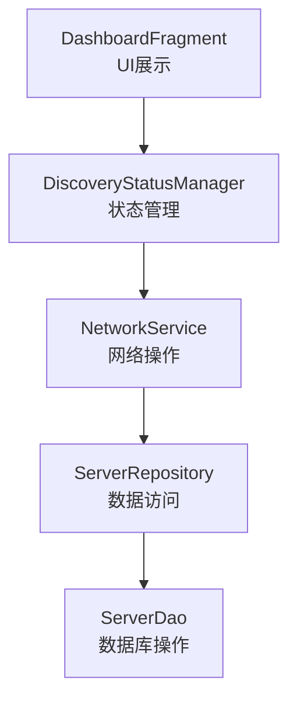

### 2. 依赖倒置原则 (DIP)

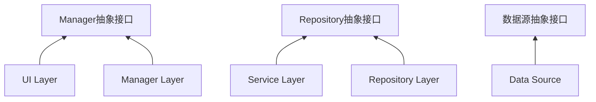

## 类型化设计原则

### 类型化设计规范

为了提升代码的可读性、可维护性和类型安全性，所有API、函数方法参数和返回值必须采用类型化类定义，禁止使用原始的字典和列表类型。

#### 核心原则

1. **禁止使用原始类型**：
   - ❌ 禁止使用 `Dict[str, Any]`、`List[Dict[str, Any]]` 等原始类型
   - ✅ 必须使用具体的Pydantic模型或dataclass定义

2. **分层类型定义**：
   - **数据库层**：使用Peewee ORM模型定义数据库表结构
   - **业务层**：使用Pydantic模型定义API请求/响应格式
   - **数据传输**：使用类型化的DTO（Data Transfer Object）

3. **类型一致性**：
   - 所有函数参数和返回值必须有明确的类型注解
   - 避免使用 `Any` 类型，除非绝对必要
   - 使用Python的类型提示系统（Type Hints）

#### 适用范围

**必须使用类型化模型的场景**：
- **数据库操作**：所有数据库查询方法的返回值必须使用类型化模型
- **API接口**：所有API的请求和响应参数必须使用类型化模型
- **服务层**：所有服务方法的参数和返回值必须使用类型化模型
- **数据传输**：模块间数据传输必须使用类型化DTO

#### 具体实施要求

**数据库操作层**：
- 所有数据库查询方法必须返回具体的Pydantic模型，而不是原始字典
- 数据库管理器类（如 `DatabaseManager`）的所有公共方法必须使用类型化返回值
- 禁止在数据库层使用 `Dict[str, Any]` 作为返回值类型

**API层**：
- 所有FastAPI端点必须使用Pydantic模型定义请求和响应
- 禁止在API层使用原始字典类型
- 所有API响应必须使用类型化模型包装

**服务层**：
- 所有业务逻辑方法必须使用类型化参数和返回值
- 服务层之间传递数据必须使用类型化DTO
- 禁止在服务层使用原始字典进行数据传递

#### 示例对比

**❌ 错误示例 - 使用原始字典类型**
```python
def get_user_operations(self, apk_id: str, limit: int = 100) -> List[Dict[str, Any]]:
    # 返回原始字典，难以维护和理解
    return [{'id': 1, 'action_type': 'click', ...}]

def get_screenshots_by_apk(self, apk_id: str, limit: int = 50) -> List[Dict[str, Any]]:
    # 违反类型化原则，使用原始字典
    return [{'screenshot_id': '123', 'file_path': '/path/to/image.png', ...}]
```

**✅ 正确示例 - 使用类型化模型**
```python
from pydantic import BaseModel
from typing import List

class UserOperation(BaseModel):
    id: str
    action_type: str
    timestamp: float
    # ... 其他字段

class ScreenshotInfo(BaseModel):
    id: str
    apk_id: str
    timestamp: float
    file_path: str
    # ... 其他字段

def get_user_operations(self, apk_id: str, limit: int = 100) -> List[UserOperation]:
    # 返回类型化对象，清晰明确
    return [UserOperation(id='1', action_type='click', ...)]

def get_screenshots_by_apk(self, apk_id: str, limit: int = 50) -> List[ScreenshotInfo]:
    # 遵循类型化原则，使用具体的模型类
    return [ScreenshotInfo(id='123', apk_id=apk_id, ...)]
```

#### 实施要求

1. **立即重构**：现有代码中所有使用原始字典类型的地方必须逐步重构为类型化模型
2. **新开发**：所有新开发的模块必须遵循类型化原则
3. **代码审查**：在代码审查中严格检查类型化规范的遵守情况
4. **文档更新**：更新相关文档以反映类型化设计原则
5. **模型统一**：所有类型化模型必须定义在共享的模型文件中（如 `core/database/models.py`），避免重复定义


## 数据持久化方案

### 数据库结构设计

引用服务端数据模型（参考 `/d:/git/autodroid/autodroid-trader-server/DESIGN.md#L174-175`），移动端本地缓存以下实体：

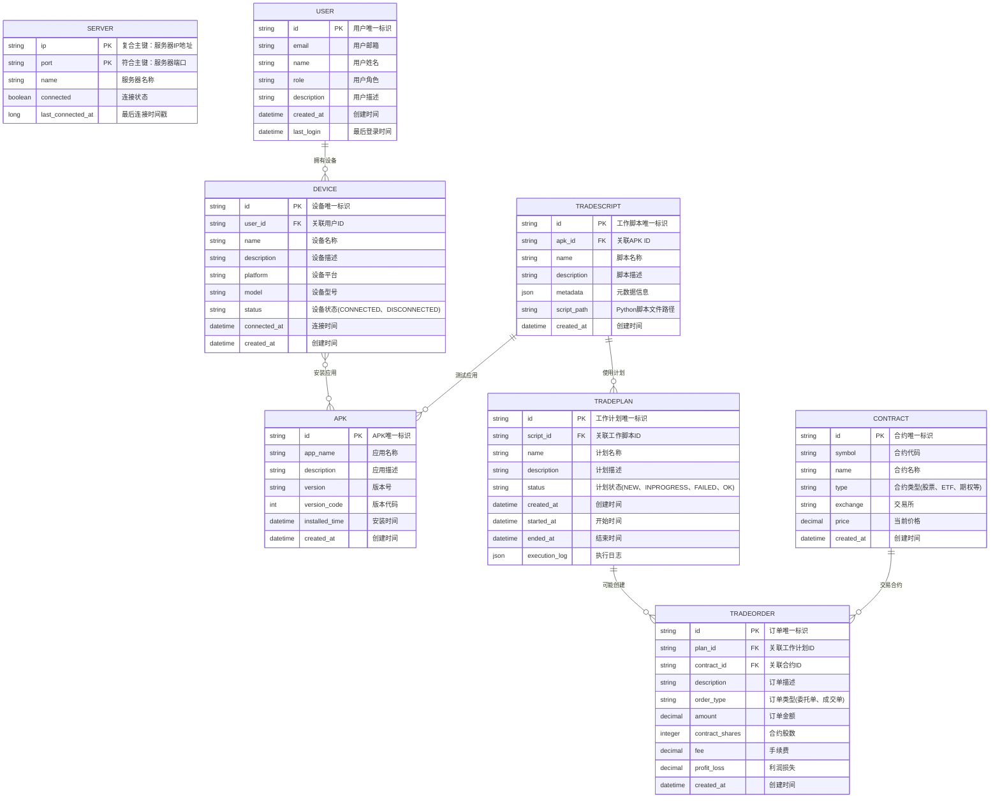

### 数据模型定义

引用服务端数据模型（参考 `/d:/git/autodroid/autodroid-trader-server/DESIGN.md#L174-175`），移动端本地缓存以下实体：

**ServerEntity 实体类结构：**

| 字段 | 类型 | 说明 |
|------|------|------|
| id | String | 主键，服务器唯一标识 |
| apiEndpoint | String | 服务器API端点 |
| name | String | 服务器名称 |
| host | String | 服务器主机地址 |
| connected | Boolean | 连接状态 |
| last_connected_at | Long | 最后连接时间戳 |

**UserEntity 实体类结构：**

| 字段 | 类型 | 说明 |
|------|------|------|
| id | String | 主键，用户唯一标识 |
| email | String | 用户邮箱 |
| name | String | 用户姓名 |
| role | String | 用户角色 |
| description | String | 用户描述 |
| created_at | DateTime | 创建时间 |
| last_login | DateTime | 最后登录时间 |

**DeviceEntity 实体类结构：**

| 字段 | 类型 | 说明 |
|------|------|------|
| id | String | 主键，设备唯一标识 |
| user_id | String | 外键，关联用户ID |
| name | String | 设备名称 |
| description | String | 设备描述 |
| platform | String | 设备平台 |
| model | String | 设备型号 |
| status | String | 设备状态（CONNECTED、DISCONNECTED） |
| connected_at | DateTime | 连接时间 |
| created_at | DateTime | 创建时间 |

**ApkEntity 实体类结构：**

| 字段 | 类型 | 说明 |
|------|------|------|
| id | String | 主键，APK唯一标识 |
| app_name | String | 应用名称 |
| description | String | 应用描述 |
| version | String | 版本号 |
| version_code | Int | 版本代码 |
| installed_time | DateTime | 安装时间 |
| created_at | DateTime | 创建时间 |

**WorkScriptEntity 实体类结构：**

| 字段 | 类型 | 说明 |
|------|------|------|
| id | String | 主键，工作脚本唯一标识 |
| apk_id | String | 外键，关联APK ID |
| name | String | 脚本名称 |
| description | String | 脚本描述 |
| metadata | JSON | 元数据信息 |
| script_path | String | Python脚本文件路径 |
| created_at | DateTime | 创建时间 |

**WorkPlanEntity 实体类结构：**

| 字段 | 类型 | 说明 |
|------|------|------|
| id | String | 主键，工作计划唯一标识 |
| script_id | String | 外键，关联工作脚本ID |
| name | String | 计划名称 |
| description | String | 计划描述 |
| status | String | 计划状态（NEW、INPROGRESS、FAILED、OK） |
| created_at | DateTime | 创建时间 |
| started_at | DateTime | 开始时间 |
| ended_at | DateTime | 结束时间 |

**WorkReportEntity 实体类结构：**

| 字段 | 类型 | 说明 |
|------|------|------|
| id | String | 主键，工作报告唯一标识 |
| user_id | String | 外键，关联用户ID |
| plan_id | String | 外键，关联工作计划ID |
| description | String | 报告描述 |
| execution_log | JSON | 执行日志 |
| result_data | JSON | 结果数据 |
| created_at | DateTime | 创建时间 |
| error_message | String | 错误信息 |

**ContractEntity 实体类结构：**

| 字段 | 类型 | 说明 |
|------|------|------|
| id | String | 主键，合约唯一标识 |
| symbol | String | 合约代码 |
| name | String | 合约名称 |
| type | String | 合约类型（股票、ETF、期权等） |
| exchange | String | 交易所 |
| price | Decimal | 当前价格 |
| created_at | DateTime | 创建时间 |

**OrderEntity 实体类结构：**

| 字段 | 类型 | 说明 |
|------|------|------|
| id | String | 主键，订单唯一标识 |
| plan_id | String | 外键，关联工作计划ID |
| contract_id | String | 外键，关联合约ID |
| description | String | 订单描述 |
| order_type | String | 订单类型（委托单、成交单） |
| amount | Decimal | 订单金额 |
| contract_shares | Int | 合约股数 |
| fee | Decimal | 手续费 |
| profit_loss | Decimal | 利润损失 |
| created_at | DateTime | 创建时间 |

### 数据访问操作

Repository层提供两种类型的数据访问方法：

1. **数据订阅方法（getXXX）**：返回LiveData，用于UI层观察数据变化
2. **业务逻辑方法（如registerDevice）**：返回单个Entity对象，用于执行特定操作

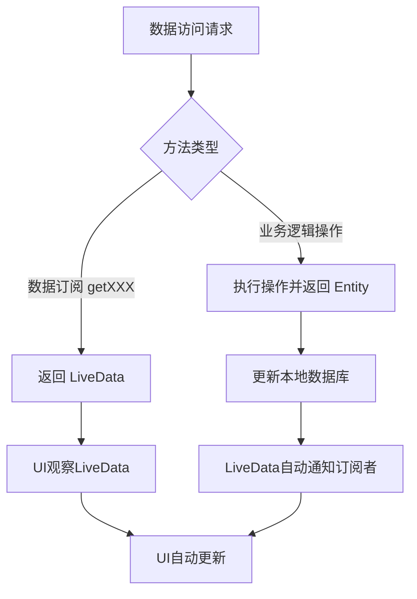

### 响应式数据流

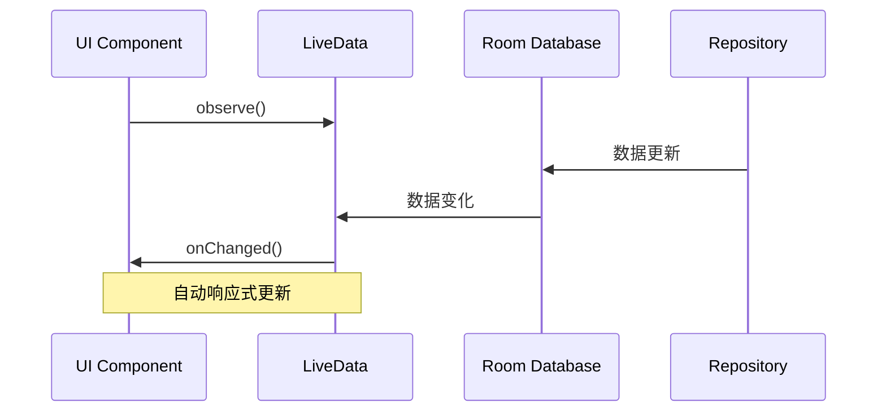

## 核心组件交互流程

### DashboardFragment 生命周期管理

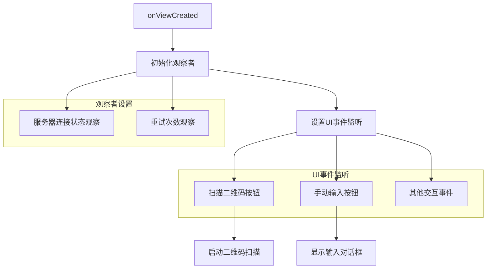


### 组件职责与交互关系

| 组件 | 主要职责 | 关键方法 | 依赖关系 |
|------|----------|----------|----------|
| **DashboardFragment** | UI展示与用户交互 | setupObservers(), setupUIListeners() | 依赖 AppViewModel |
| **AppViewModel** | 状态协调与管理 | - | 依赖 ServerRepository |
| **NetworkService** | 网络操作 | - | 依赖 ServerRepository |
| **ServerRepository** | 数据访问与缓存 | getAllServers(), saveDiscoveredServer() | 依赖 ServerDao |

### 数据流与状态变化

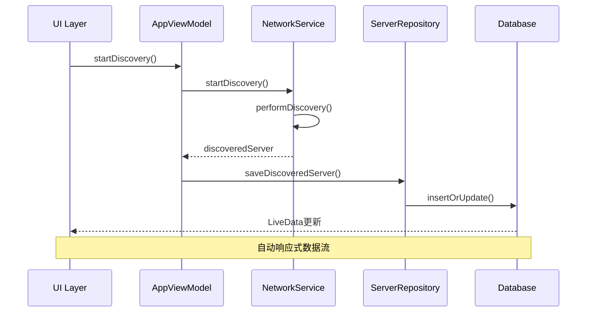

### 关键设计模式应用

#### 1. 观察者模式 (Observer Pattern)
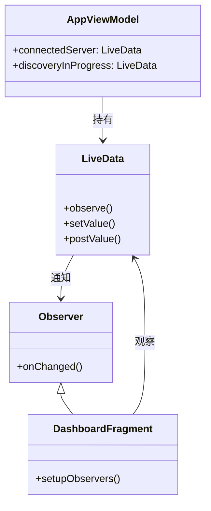

#### 2. 单例模式 (Singleton Pattern)
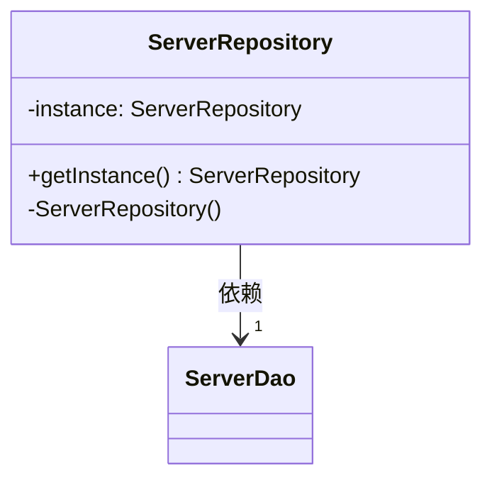

#### 3. 仓储模式 (Repository Pattern)
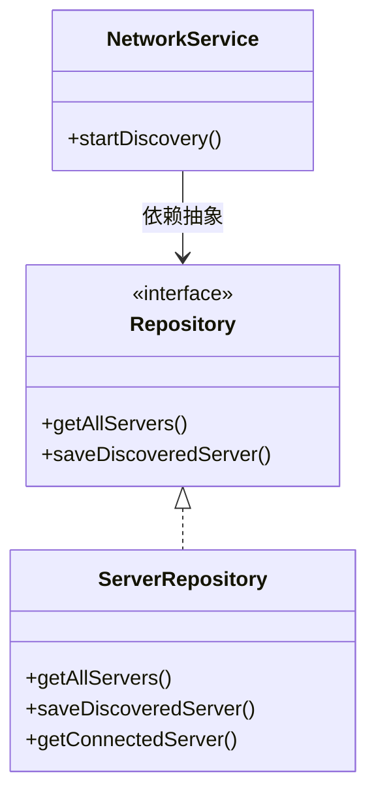
    
    // 数据操作方法
    suspend fun saveDiscoveredServer(discoveredServer: DiscoveredServer) {
        val serverEntity = discoveredServer.toEntity()
        serverDao.insertOrUpdate(serverEntity)
        // 数据库更新后，LiveData会自动通知所有观察者
    }
    
    suspend fun updateConnectionStatus(serverId: String, connected: Boolean) {
        // 先将所有服务器设为未连接
        serverDao.setAllServersDisconnected()
        // 再设置当前服务器为已连接
        serverDao.updateConnectionStatus(serverId, connected)
    }
    
    suspend fun deleteServer(serverId: String) {
        serverDao.deleteById(serverId)
    }
    
    companion object {
        @Volatile private var instance: ServerRepository? = null
        
        fun getInstance(): ServerRepository {
            return instance ?: synchronized(this) {
                instance ?: ServerRepository(
                    DatabaseProvider.serverDao
                ).also { instance = it }
            }
        }
    }
}

// 扩展函数，转换数据模型
fun DiscoveredServer.toEntity(): ServerEntity {
    return ServerEntity(
        id = this.id,
        name = this.name,
        host = this.host,
        port = this.port,
        connected = false, // 初始状态为未连接
        lastSeen = this.discoveredTime,
        serverInfo = Gson().toJson(this) // 将整个对象转为JSON存储
    )
}
```

### DatabaseProvider
```kotlin
object DatabaseProvider {
    private val database: AppDatabase by lazy {
        Room.databaseBuilder(
            AutoDroidApplication.instance,
            AppDatabase::class.java,
            "autodroid_database"
        ).build()
    }
    
    val serverDao: ServerDao by lazy { database.serverDao() }
}

@Database(entities = [ServerEntity::class], version = 1)
abstract class AppDatabase : RoomDatabase() {
    abstract fun serverDao(): ServerDao
}
```

## 数据流向

```
UI事件 → Manager → Service → Repository → Database/API
                ↑                      ↓
UI更新 ← LiveData/Flow ← Repository ← 数据变化
```

## 数据模型

### ServerEntity
```kotlin
@Entity(tableName = "servers")
data class ServerEntity(
    @PrimaryKey val id: String,
    val name: String,
    val host: String,
    val port: Int,
    val connected: Boolean = false,
    val lastSeen: Long = System.currentTimeMillis(),
    val serverInfo: String? = null // JSON格式的完整服务器信息
)
```

### DiscoveredServer
```kotlin
data class DiscoveredServer(
    val id: String,
    val name: String,
    val host: String,
    val port: Int,
    val discoveredTime: Long = System.currentTimeMillis(),
    val additionalInfo: Map<String, String> = emptyMap()
)
```

## DAO (Data Access Object)

### ServerDao
```kotlin
@Dao
interface ServerDao {
    @Query("SELECT * FROM servers TRADEORDER BY lastSeen DESC")
    fun getAllServers(): LiveData<List<ServerEntity>>
    
    @Query("SELECT * FROM servers WHERE connected = 1 LIMIT 1")
    fun getConnectedServer(): LiveData<ServerEntity?>
    
    @Query("SELECT * FROM servers WHERE id = :id")
    suspend fun getServerById(id: String): ServerEntity?
    
    @Insert(onConflict = OnConflictStrategy.REPLACE)
    suspend fun insert(server: ServerEntity)
    
    @Update
    suspend fun update(server: ServerEntity)
    
    @Query("UPDATE servers SET connected = 0")
    suspend fun setAllServersDisconnected()
    
    @Query("UPDATE servers SET connected = :connected WHERE id = :id")
    suspend fun updateConnectionStatus(id: String, connected: Boolean)
    
    @Query("DELETE FROM servers WHERE id = :id")
    suspend fun deleteById(id: String)
    
    @Query("DELETE FROM servers")
    suspend fun deleteAll()
    
    // 插入或更新，基于主键
    @Insert(onConflict = OnConflictStrategy.REPLACE)
    suspend fun insertOrUpdate(server: ServerEntity)
}
```

## 推荐的架构模式

基于实际开发经验和最佳实践，我们推荐以下简化的架构模式：

```
UI Layer (Fragments/Activities)
    ↓
AppViewModel (协调器)
    ↓
Repository Layer (数据访问抽象)
    ↓
Room Database (本地持久化)
    ↓
Network API (远程数据)
```

### 为什么Network API在Room Database之下？

这种架构设计体现了"本地优先"（Local-First）的设计理念，具有以下优势：

1. **离线优先体验**
   - 应用启动时首先从本地数据库加载数据，确保UI快速响应
   - 网络请求失败时，用户仍然可以看到本地缓存的数据
   - 提供无缝的用户体验，不受网络波动影响

2. **数据一致性**
   - Room Database作为单一数据源（Single Source of Truth）
   - 所有UI组件都观察同一个本地数据源，避免数据不一致
   - 网络数据首先保存到本地数据库，然后通过LiveData通知UI更新

3. **性能优化**
   - 本地数据库查询比网络请求快得多
   - 减少不必要的网络请求，节省用户流量
   - 支持数据预加载和缓存策略

4. **架构简化**
   - 移除了复杂的Manager层和Service层
   - AppViewModel直接协调Repository操作
   - Repository负责数据同步和缓存管理

5. **可测试性**
   - 可以轻松模拟Repository进行单元测试
   - 本地数据库操作更容易测试和验证
   - 网络层可以独立测试，不影响业务逻辑

## 架构优势总结

### 单一职责原则 (SRP) 的体现

1. **UI层 (Activity/Fragment)**
   - 只负责UI展示和用户交互
   - 不包含业务逻辑，只调用Manager层方法

2. **Manager层 (DiscoveryStatusManager)**
   - 专门管理服务器发现和连接状态
   - 协调Service层和Repository层，不直接操作数据库

3. **Service层 (NetworkService)**
   - 专注于网络操作
   - 不关心数据如何存储，只负责获取数据

4. **Repository层 (ServerRepository)**
   - 专门负责数据管理和持久化
   - 提供统一的数据访问接口，隐藏数据源细节

5. **DAO层 (ServerDao)**
   - 专注于数据库操作
   - 只负责SQL查询和执行，不包含业务逻辑

### 依赖倒置原则 (DIP) 的体现

1. **高层模块不依赖低层模块**
   - DiscoveryStatusManager依赖ServerRepository接口，而不是具体实现
   - UI层依赖DiscoveryStatusManager的公共接口，而不是内部实现

2. **抽象不依赖细节**
   - ServerRepository定义抽象接口，不依赖具体的数据库实现
   - 通过LiveData提供响应式数据流，UI层只需观察数据变化

3. **细节依赖抽象**
   - ServerDao实现ServerRepository定义的数据访问抽象
   - 具体的数据库操作实现Repository层定义的接口

### 实际应用效果

1. **数据持久化**
   - 服务器信息保存在SQLite数据库中，不再因Activity/Fragment重建而丢失
   - 登录后服务器状态得以保持，解决了"Server Info登录后丢失"的问题

2. **响应式更新**
   - 使用LiveData实现数据变化自动通知UI更新
   - 任何组件修改服务器状态，所有相关UI组件都会自动更新

3. **可测试性**
   - 每一层职责明确，便于单元测试
   - 可以轻松模拟各层依赖，进行隔离测试

4. **可维护性**
   - 修改网络逻辑不影响UI代码
   - 更换数据库实现不影响业务逻辑层

5. **可扩展性**
   - 添加新的数据源只需实现Repository接口
   - 支持多种UI组件观察同一数据源
```

## 服务器信息管理流程

### 服务器状态管理架构

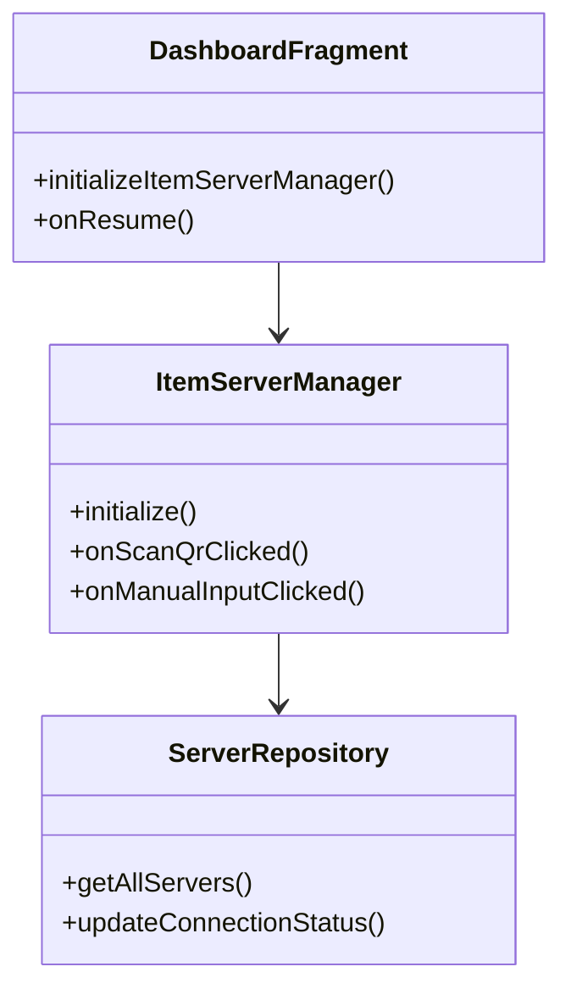

### 服务器状态管理流程

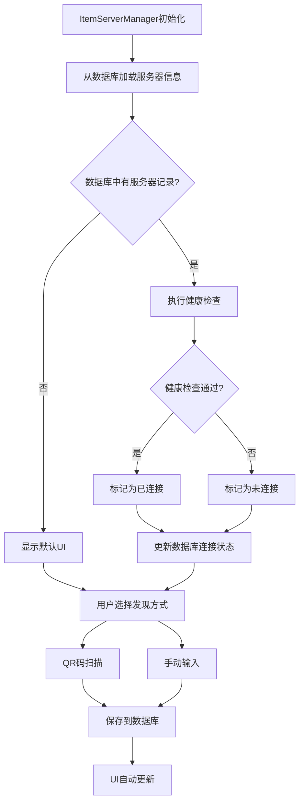

### 服务器发现方式处理

| 发现方式 | 触发条件 | 主要操作 | 状态管理 |
|----------|----------|----------|----------|
| **QR码扫描** | 点击SCAN QRCODE按钮 | 启动二维码扫描 | 扫描成功时保存服务器信息 |
| **手动输入** | 点击MANUAL INPUT按钮 | 显示输入对话框 | 用户输入后验证并保存 |

### 页面生命周期管理

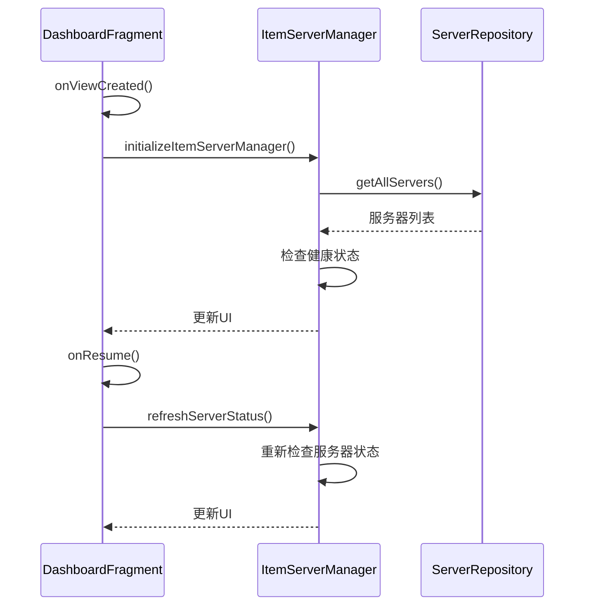

### 服务器信息管理流程图

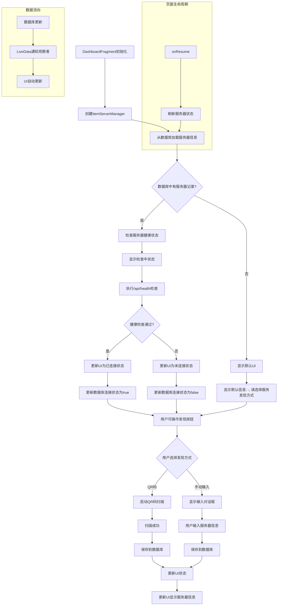

### 导航逻辑优化

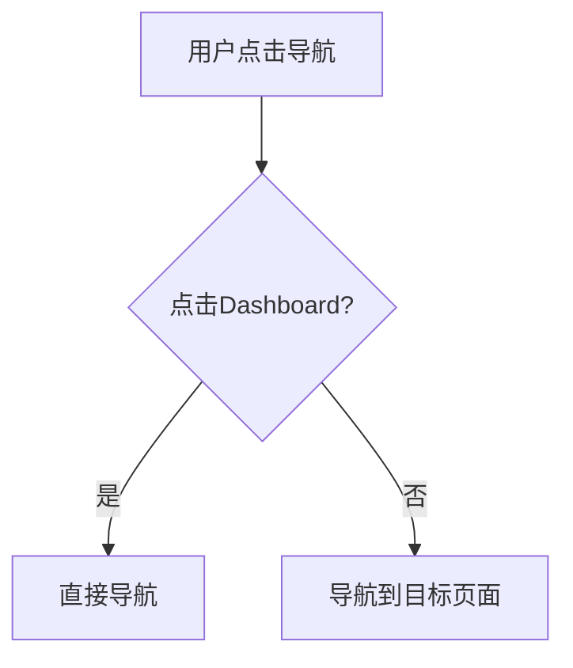

### 导航状态管理

| 状态条件 | 导航行为 | 数据来源 |
|----------|----------|----------|
| **任意状态** | 直接导航到目标页面 | 用户操作 |

## 手动输入功能设计

### 功能流程

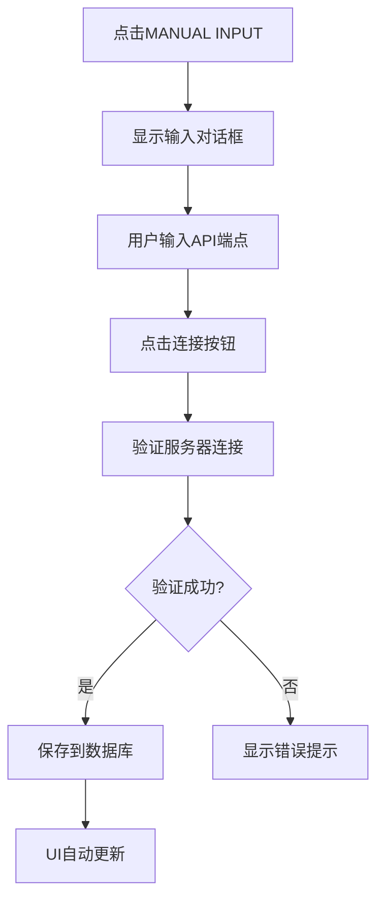

### 手动输入架构

```mermaid
classDiagram
    class ItemServerManager {
        +showManualInputDialog()
        +handleManualInputConnection()
        -validateAndConnectToServer()
        -saveServerToDatabase()
    }
    
    class ApiClient {
        +getServerInfo()
    }
    
    class ServerRepository {
        +insertServer()
    }
    
    ItemServerManager --> ApiClient
    ItemServerManager --> ServerRepository
```

### 数据流时序

```mermaid
sequenceDiagram
    participant U as 用户
    participant S as ItemServerManager
    participant A as ApiClient
    participant R as ServerRepository
    participant UI as UI组件
    
    U->>S: 点击MANUAL INPUT
    S->>S: 显示输入对话框
    U->>S: 输入API端点
    U->>S: 点击连接
    S->>A: 验证服务器连接
    A-->>S: 返回服务器信息
    S->>R: 保存服务器信息
    R->>UI: LiveData通知更新
    UI->>UI: 更新界面显示
```
            connected = true,
            lastSeen = System.currentTimeMillis(),
            serverInfo = Gson().toJson(serverInfo),
            discoveryMethod = discoveryMethod
        )
        
        serverRepository.insertOrUpdate(serverEntity)
    }
}

// AppViewModel中的订阅逻辑（已存在）
class AppViewModel : ViewModel() {
    val server: LiveData<Server?> get() = serverRepository?.getConnectedServer()?.map { entity ->
        if (entity != null) {
            // 转换数据库实体为UI模型
            Server(
                name = entity.name,
                host = entity.host,
                port = entity.port,
                connected = entity.connected,
                serverInfo = parseServerInfo(entity.serverInfo)
            )
        } else {
            null
        }
    }
}
```

### UI自动更新机制

```mermaid
flowchart TD
    A[数据库更新] --> B[LiveData通知]
    B --> C[AppViewModel观察]
    C --> D[DashboardFragment更新UI]
    D --> E[item_server.xml显示]
```

### 设计优势总结

| 优势类别 | 具体体现 | 技术实现 |
|----------|----------|----------|
| **简单直接** | 用户输入API端点即可连接 | 手动输入对话框 |
| **数据驱动** | 响应式UI更新 | Room数据库 + LiveData |
| **状态一致** | 所有组件统一数据源 | 单一数据源架构 |
| **离线支持** | 应用重启状态保持 | 数据库持久化 |
| **错误处理** | 清晰提示重试机制 | 错误回调处理 |

### 架构集成关系

```mermaid
graph TB
    A[手动输入功能] --> B[数据库层]
    A --> C[ViewModel层]
    A --> D[UI层]
    A --> E[网络层]
    
    B --> F[Room数据库]
    C --> G[AppViewModel]
    D --> H[item_server.xml]
    E --> I[ApiClient]
```

## 状态管理架构


### MainActivity导航逻辑

```mermaid
flowchart TD
    A[MainActivity创建] --> B[设置底部导航]
    B --> C[绑定NavController]
    C --> D[允许所有导航]
```

### 导航状态管理

| 导航项 | 连接状态 | 认证状态 | 导航行为 |
|--------|----------|----------|----------|
| **所有页面** | 任意 | 任意 | 直接导航 |

### 数据模型定义

```mermaid
classDiagram
    class DiscoveredServer {
        -name: String
        -host: String
        -port: int
        -discoveredTime: long
        +getName()
        +getHost()
        +getPort()
        +getDiscoveredTime()
    }
```
