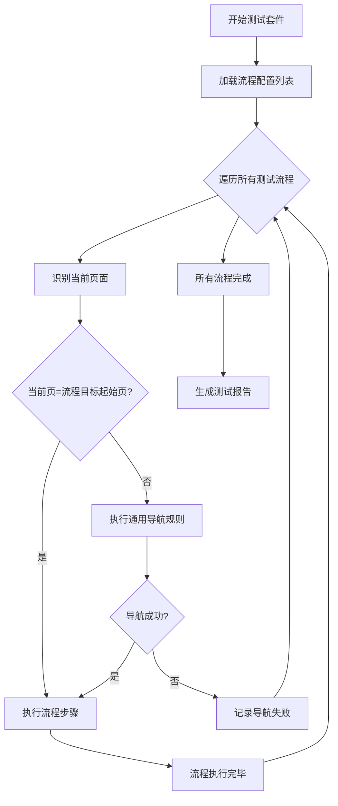
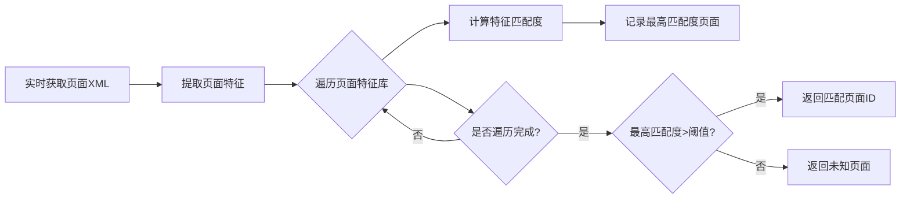
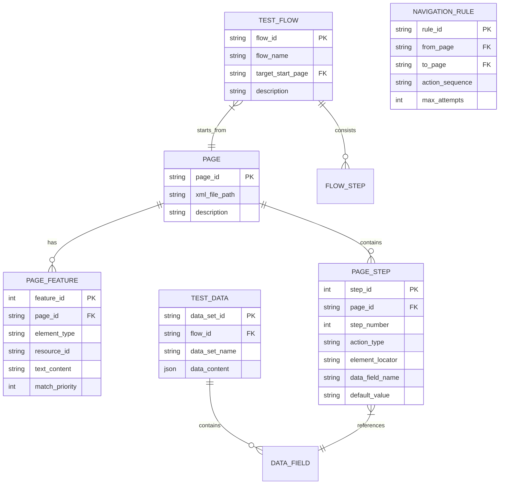
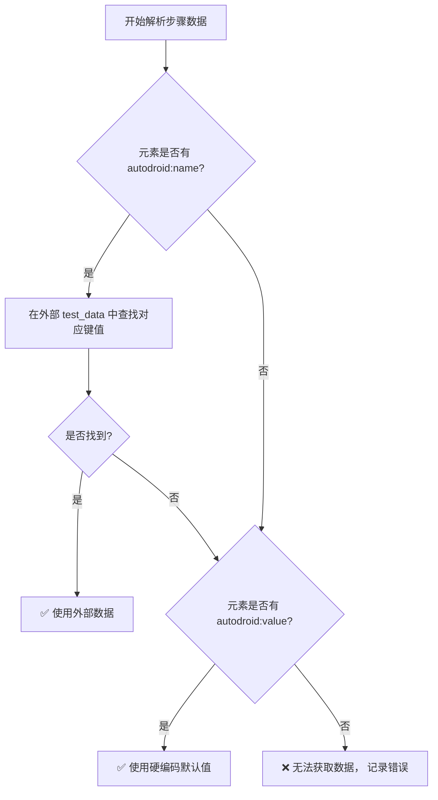

## Autodroid 智能自动化测试框架：完整解决方案文档

## 📖 文档概述

本文档旨在提供一个名为 **Autodroid** 的、基于 Appium 的、数据驱动的、可感知页面的自动化测试框架的完整解决方案。该框架的核心创新在于：**通过编辑包含自定义属性（`autodroid:*`）的离线XML"剧本"来描述操作，并由智能引擎解析执行，实现了业务逻辑（操作流）、定位逻辑（智能查找）与测试数据的彻底分离**，从而解决了传统脚本编写和维护成本高、复用性差、无法灵活适应多入口和动态数据的问题。

## 🎯 核心设计理念

1.  **所见即所得的可视化编辑**：测试工程师无需编写代码，通过分析应用界面获得XML，并在其中以添加"标签"（自定义属性）的方式"绘制"测试步骤。
2.  **数据驱动**：操作步骤中所需的数据（如输入文本、选择项）通过外部数据源（如JSON）动态注入，实现一套脚本运行多组数据。
3.  **状态感知与智能导航**：框架通过对比离线XML库与实时应用界面，自动识别当前所在页面，并执行对应步骤，无需硬编码页面跳转逻辑。
4.  **高复用与低耦合**：每个页面的操作定义独立，可被多个不同的业务流程复用；框架自动处理页面间的衔接，模拟真实用户操作。

## 📂 项目结构

```
autodroid_project/
│
├── config/
│   └── capabilities.json      # Appium连接设备的配置
│
├── data/                      # 外部测试数据
│   ├── users.json
│   └── products.json
│
├── apks/                     # **核心：页面定义库（离线XML）**
│   ├── welcome_page.xml
│   ├── login_page.xml
│   ├── home_page.xml
│   └── product_detail_page.xml
│
├── flows/                     # 业务流配置（定义做什么）
│   ├── flow_buy_product.json
│   └── flow_check_profile.json
│
├── navigation/                # **新增：通用导航指令库**
│   └── global_nav_actions.xml
│
├── lib/                       # 框架核心库
│   └── autodroid_core.py
│
├── orchestrator_config.json   # **新增：总调度器配置**
└── run_tradeflow.py            # 主执行脚本入口
```

## 🔧 核心组件与工作流程

### 3.1 智能页面匹配引擎 (`PageMatcher`)
这是框架的"眼睛"和"大脑"。
*   **输入**：实时从Appium获取的当前界面XML源码。
*   **处理**：将实时XML与`apks/`目录下的所有离线XML进行"指纹"比对。
*   **指纹算法**：提取离线XML中所有带有`autodroid:*`属性的元素，将其**稳定的原生属性**（如`resource-id`, `text`, `class`的组合）作为该页面的特征指纹。
*   **输出**：计算匹配度，返回匹配度最高的`page_id`。匹配成功意味着框架"知道"自己现在在哪一页。
*   **优势**：天然支持**多入口**（从不同页面都能进入`product_detail_page`），且对UI的非关键布局变化不敏感。

### 3.2 数据驱动执行器 (`DataDrivenExecutor`)
这是框架的"手"。
*   **输入**：当前页面的离线XML、外部注入的测试数据（`Dict`）、运行时上下文（`Context`）。
*   **处理**：
    1.  解析XML，按`autodroid:step`排序所有待操作元素。
    2.  对每个元素，生成**定位器优先级列表**（策略：`resource-id` > `accessibility-id` > `text` > `XPath`）。
    3.  根据`autodroid:action`决定操作，并根据`name`或`value`决定操作值。
        *   **取值逻辑**：`if name exists in test_data: use test_data[name] else: use value`。
    4.  在真实设备上执行操作。
*   **输出**：驱动设备完成所有步骤，并可能更新运行时上下文（如保存抓取的文本）。

### 3.3 工作流协调器 (`TradeflowCoordinator`)
这是框架的"指挥"。
*   **流程**：
    1.  根据配置或手动指定`start_page_id`。
    2.  调用`PageMatcher`确认当前页面。
    3.  加载对应离线XML，调用`DataDrivenExecutor`执行。
    4.  步骤执行完毕后，再次调用`PageMatcher`感知新页面。
    5.  循环步骤2-4，直到框架感知到的页面没有未执行的步骤，或达到预设终点。
*   **特点**：实现了**自我驱动的页面流**，完全由应用的实际跳转逻辑驱动，无需在脚本中硬编码"A页面之后是B页面"。

### 3.4 增强的智能调度器 (`EnhancedOrchestrator`)
这是框架的"总指挥"，用于管理多个测试流。
*   **功能**：协调多个独立的测试流程执行，提供智能导航能力。
*   **流程**：
    1.  读取`orchestrator_config.json`中的流程配置列表。
    2.  遍历每个业务流，识别当前页面。
    3.  如果当前页面不是目标起始页，则尝试通过通用导航规则导航到目标页面。
    4.  在目标页面执行相应的业务流程。
    5.  循环执行所有流程，直到完成。

## 🏷️ 核心：`autodroid:*` 自定义属性体系设计

### 4.1 设计理念
`autodroid:*` 属性体系是一种 **"声明式"的测试描述语言**。它允许测试设计人员在离线XML中，以标签（属性）的形式声明元素的**行为意图**、**数据需求**和**验证逻辑**，从而将测试逻辑从代码中完全分离。

### 4.2 属性分类与总览

所有 `autodroid:*` 属性可按其核心功能分为四大类：

| 类别 | 核心目的 | 关键属性 |
| :--- | :--- | :--- |
| **1. 页面与标识** | 定义页面身份，建立页面库 | `autodroid:page_id` |
| **2. 流程与步骤** | 编排操作顺序与流程控制 | `autodroid:step`, `autodroid:action`, `autodroid:wait_after` |
| **3. 数据与变量** | 实现数据驱动与状态传递 | `autodroid:name`, `autodroid:value`, `autodroid:save_to` |
| **4. 元素与定位** | 提供定位辅助与验证信息 | `autodroid:desc` (隐式：依赖 `resource-id`, `text` 等原生属性) |

### 4.3 详细属性定义表

下表是 `autodroid:*` 属性集的完整定义，这是框架的 **"语法手册"**。

| 属性名 | 作用域 | 值类型 | 是否必须 | 描述与用途 | 示例 |
| :--- | :--- | :--- | :--- | :--- | :--- |
| **`autodroid:page_id`** | XML根节点 | String | **是** | **页面唯一标识符**。框架据此在页面库中索引和匹配页面。 | `<hierarchy autodroid:page_id="login_page">` |
| **`autodroid:step`** | 可操作元素 | Integer | **是** (若元素需被操作) | **步骤序号**。定义同一页面内操作的**执行顺序**，框架按此顺序执行。 | `autodroid:step="1"` |
| **`autodroid:action`** | 可操作元素 | String | **是** (若元素需被操作) | **要执行的动作**。框架的"动词"，决定对元素的具体操作。详见【动作类型表】。 | `autodroid:action="click"` |
| **`autodroid:name`** | 需要数据的元素 | String | 否 | **数据字段键名**。为 `input`、`select` 等动作提供键，用于从外部测试数据 (`test_data`) 中动态查找并填充值。**与 `value` 互斥，优先级更高。** | `autodroid:name="username"` |
| **`autodroid:value`** | 需要数据的元素 | String | 否 | **硬编码默认值**。当未设置 `name`，或 `name` 在外部数据中未匹配时，将使用此值。实现了**灵活的后备机制**。 | `autodroid:value="test@example.com"` |
| **`autodroid:save_to`** | 可输出数据的元素 | String | 否 | **运行时变量存储键**。主要用于 `action="get_text"`，将抓取到的文本存入**运行时上下文** (`context`)，供后续步骤引用或最终断言。 | `autodroid:save_to="product_price"` |
| **`autodroid:wait_after`** | 任何步骤元素 | Float | 否 | **步骤后等待时间（秒）**。在当前步骤成功后，暂停指定时间，等待界面稳定或加载。 | `autodroid:wait_after="2.5"` |
| **`autodroid:desc`** | 任何元素 | String | 否 | **人工描述**。仅用于提高XML文件的可读性和可维护性，**不影响框架执行逻辑**。 | `autodroid:desc="点击登录按钮"` |

### 4.4 核心动作类型 (`autodroid:action`) 详解

| 动作值 | 适用元素 | 所需数据属性 | 行为描述 |
| :--- | :--- | :--- | :--- |
| **`click`** | `Button`, `TextView` 等 | 无 | 对元素执行点击操作。 |
| **`input`** | `EditText` 等输入框 | `name` 或 `value` | 1. 清除输入框；2. 输入由`name`或`value`决定的文本。 |
| **`select`** | `Spinner` 等下拉框 | `name` 或 `value` 或 `option` | 1. 点击展开下拉框；2. 选择与指定值匹配的选项。 |
| **`get_text`** | 任何有文本元素 | `save_to` (推荐) | 获取元素的 `text` 属性值，并存入 `context`。 |
| **`wait`** | 任意（或虚拟元素） | `value` (作为等待秒数) | 强制等待指定时间。常用于步骤间等待。 |
| **`swipe`** | `ScrollView` 等 | `value` (如 `up:0.5`) | 在元素内执行滑动操作。 |
| **`verify`** | 任意 | `value` (期望值) | 验证元素某属性（如text）与期望值一致，用于断言。 |

### 4.5 数据解析优先级逻辑

这是框架数据驱动能力的核心逻辑，当执行 `input` 或 `select` 动作时，按以下顺序决定使用的值：

```
graph TD
    A[开始解析步骤数据] --> B{元素是否有 autodroid:name?};
    B -->|是| C[在外部 test_data 中查找对应键值];
    C --> D{是否找到?};
    D -->|是| E[✅ 使用外部数据];
    D -->|否| F{元素是否有 autodroid:value?};
    B -->|否| F;
    F -->|是| G[✅ 使用硬编码默认值];
    F -->|否| H[❌ 无法获取数据， 记录错误];
```

**公式化表达**：
`最终值 = test_data.get(autodroid:name) or autodroid:value`

## 📝 完整配置与代码实现

### 5.1 页面XML定义示例 (`apks/login_page.xml`)

``xml
<?xml version="1.0" encoding="UTF-8"?>
<!-- 根节点必须声明 page_id -->
<hierarchy autodroid:page_id="login_page">
    
    <!-- 步骤1：输入用户名。使用'name'从外部数据获取值，无则用'value'备用 -->
    <android.widget.EditText
        index="0"
        text=""
        resource-id="com.tdx.androidCCZQ:id/username"
        class="android.widget.EditText"
        autodroid:step="1"
        autodroid:action="input"
        autodroid:name="username"
        autodroid:value="default_user"
        autodroid:desc="输入用户名" />
    
    <!-- 步骤2：输入密码。密码通常从外部数据读取，无备用值 -->
    <android.widget.EditText
        resource-id="com.tdx.androidCCZQ:id/password"
        autodroid:step="2"
        autodroid:action="input"
        autodroid:name="password"
        autodroid:desc="输入密码" />
    
    <!-- 步骤3：点击登录按钮。点击后应用将跳转至首页 -->
    <android.widget.Button
        resource-id="com.tdx.androidCCZQ:id/login_btn"
        text="登录"
        autodroid:step="3"
        autodroid:action="click"
        autodroid:wait_after="1.5"
        autodroid:desc="点击登录按钮" />
        
</hierarchy>
```

### 5.2 外部测试数据 (`data/user_login.json`)

``json
[
  {
    "case_name": "管理员登录",
    "data": {
      "username": "admin",
      "password": "Admin@123"
    }
  },
  {
    "case_name": "普通用户登录",
    "data": {
      "username": "test_user_001",
      "password": "Test123456"
    }
  }
]
```

### 5.3 业务流配置：以目标而非起点定义 (`flows/flow_buy_product.json`)

每个业务流定义其**目标起始页**和所需的**测试数据**。不再假设应用一定处于某个状态。

``json
{
  "flow_id": "flow_buy_product",
  "name": "购买特定商品流程",
  "target_start_page": "home_page", // 此流程希望从首页开始
  "required_data": { // 此流程需要的外部数据
    "product_name": "测试股票A",
    "amount": "100"
  },
  "description": "从首页搜索并购买一只股票"
}
```

### 5.4 通用导航指令库：应用内的"地铁图" (`navigation/global_nav_actions.xml`)

这个文件定义了如何在应用的**主要页面间进行导航**，而不依赖退出登录。它由一系列通用的、低风险的导航动作组成。

``xml
<hierarchy autodroid:page_id="global_nav_actions">
  <!-- 规则1: 如果当前在任意页面，点击物理返回键直到回到首页 -->
  <android.view.View
    autodroid:rule="current_page != 'home_page'"
    autodroid:action="press_key"
    autodroid:value="BACK"
    autodroid:max_retry="10" />
    
  <!-- 规则2: 如果在个人资料页，使用底部导航栏切换到首页 -->
  <android.widget.Button
    resource-id="com.tdx.androidCCZQ:id/tab_home"
    autodroid:rule="current_page == 'profile_page'"
    autodroid:action="click"
    autodroid:desc="点击底部导航栏'首页'" />
    
  <!-- 规则3: 如果在交易结果页，点击"返回首页"专用按钮 -->
  <android.widget.Button
    text="返回首页"
    autodroid:rule="current_page == 'trade_result_page'"
    autodroid:action="click" />
    
  <!-- 更多通用导航规则... -->
</hierarchy>
```

### 5.5 总调度器配置 (`orchestrator_config.json`)

这个文件将一切串联起来，定义了测试套件的执行顺序和策略。

```json
{
  "test_suite_name": "每日冒烟测试",
  "global_navigation_file": "navigation/global_nav_actions.xml",
  "flow_execution_order": [
    "flow_buy_product",
    "flow_check_profile"
  ],
  "flow_retry_policy": {
    "max_navigation_attempts": 3,
    "fail_test_on_navigation_failure": false
  }
}
```

### 5.6 框架核心库 (`lib/autodroid_core.py`)

```python
import xml.etree.ElementTree as ET
import time
import json
from appium import webdriver
from appium.webdriver.common.appiumby import AppiumBy
from selenium.webdriver.support.ui import WebDriverWait
from selenium.webdriver.support import expected_conditions as EC
from selenium.common.exceptions import NoSuchElementException, TimeoutException

class AutodroidCore:
    def __init__(self, driver, apks_dir='apks'):
        self.driver = driver
        self.apks_dir = apks_dir
        self.page_fingerprints = self._load_page_fingerprints()
        self.test_data = {}  # 由主脚本传入
        self.runtime_context = {}  # 存储运行时获取的数据
        self.wait = WebDriverWait(self.driver, 10)
        
    def _load_page_fingerprints(self):
        """加载所有页面XML，构建页面指纹库"""
        fingerprints = {}
        # ... (遍历apks_dir，解析XML，提取带autodroid属性的元素特征)
        return fingerprints
        
    def identify_current_page(self, live_xml_source):
        """识别当前页面：核心匹配算法"""
        best_match_id, best_score = None, 0
        live_root = ET.fromstring(live_xml_source.encode('utf-8'))
        live_features = self._extract_features(live_root)
        
        for page_id, offline_features in self.page_fingerprints.items():
            score = self._calculate_similarity(offline_features, live_features)
            if score > best_score:
                best_score, best_match_id = score, page_id
        return best_match_id if best_score > 0.6 else None  # 可调阈值
        
    def execute_page_flow(self, page_id):
        """执行指定页面的所有步骤"""
        xml_path = f"{self.apks_dir}/{page_id}.xml"
        tree = ET.parse(xml_path)
        root = tree.getroot()
        steps = self._collect_steps(root)
        
        for step_info in steps:
            self._execute_single_step(step_info)
            # 执行后等待
            wait_time = float(step_info['element'].get('autodroid:wait_after', 0))
            if wait_time > 0:
                time.sleep(wait_time)
                
    def _execute_single_step(self, step_info):
        """执行单个步骤：智能定位 + 数据驱动执行"""
        elem = step_info['element']
        action = step_info['action']
        
        # 1. 智能定位
        locators = self._generate_locators(elem)
        live_element = self._find_element(locators)
        if not live_element:
            print(f"定位失败: {elem.attrib}")
            return
            
        # 2. 数据解析：决定要使用的值
        field_name = elem.get('autodroid:name')
        hardcoded_value = elem.get('autodroid:value')
        target_value = self.test_data.get(field_name, hardcoded_value)
        
        # 3. 执行动作
        if action == 'input' and target_value:
            live_element.clear()
            live_element.send_keys(target_value)
            print(f"输入: [{target_value}]")
        elif action == 'select' and target_value:
            self._handle_dropdown(live_element, target_value)
        elif action == 'click':
            live_element.click()
            print("点击")
        elif action == 'get_text':
            captured = live_element.text
            save_key = elem.get('autodroid:save_to', field_name)
            if save_key:
                self.runtime_context[save_key] = captured
                print(f"保存文本 [{save_key}]: {captured}")
                
    def _generate_locators(self, offline_elem):
        """生成定位器优先级列表"""
        locators = []
        attrs = offline_elem.attrib
        
        if 'resource-id' in attrs:
            rid = attrs['resource-id'].split('/')[-1]
            locators.append((AppiumBy.ID, rid))
        if 'content-desc' in attrs:
            locators.append((AppiumBy.ACCESSIBILITY_ID, attrs['content-desc']))
        if 'text' in attrs:
            uia = f'new UiSelector().text("{attrs["text"]}")'
            locators.append((AppiumBy.ANDROID_UIAUTOMATOR, uia))
        # ... 可添加更多回退定位策略
        return locators
```

### 5.7 增强的智能调度器核心逻辑

以下伪代码展示了调度器如何工作：

```
class EnhancedOrchestrator:
    def run_test_suite(self, suite_config):
        """执行整个测试套件"""
        for flow_id in suite_config['flow_execution_order']:
            print(f"\n准备执行流程: {flow_id}")
            
            # 1. 加载流程定义
            flow = self.load_flow_definition(flow_id)
            target_page = flow['target_start_page']
            
            # 2. 识别当前页面
            current_page = self.page_matcher.identify(driver.page_source)
            print(f"当前页面: {current_page}, 目标起始页: {target_page}")
            
            # 3. 如果当前不在目标页，则尝试通用导航
            if current_page != target_page:
                success = self.apply_global_navigation(
                    from_page=current_page,
                    to_page=target_page,
                    nav_rules=suite_config['global_navigation_file']
                )
                if not success:
                    print(f"警告：无法从 {current_page} 导航到 {target_page}，跳过此流程。")
                    continue  # 跳过此流程，继续下一个
            
            # 4. 确认已在目标页，注入数据并执行该页面的业务步骤
            self.test_data = flow['required_data']
            self.execute_page_flow(target_page)  # 执行您在apks/下定义的具体操作
            
            print(f"流程 {flow_id} 执行完毕。")
        print("\n所有测试流程执行完成！")
    
    def apply_global_navigation(self, from_page, to_page, nav_rules):
        """应用通用导航规则，尝试从 from_page 跳转到 to_page"""
        # 加载导航规则XML
        # 查找适用于当前页面（from_page）的导航规则
        # 执行这些规则（如点击返回键、点击首页按钮）
        # 每次执行后，重新识别当前页面，检查是否到达 to_page 或出现预期中的中间页
        # 如果成功到达 to_page，返回 True；如果尝试多次后失败，返回 False
        pass
```

### 5.8 主执行脚本 (`run_tradeflow.py`)

```
#!/usr/bin/env python3
import json
from appium import webdriver
from lib.autodroid_core import AutodroidCore

def main():
    # 1. 加载外部测试数据
    with open('data/user_login.json', 'r') as f:
        test_cases = json.load(f)
        
    # 2. 加载设备配置
    with open('config/capabilities.json', 'r') as f:
        desired_caps = json.load(f)
    
    for case in test_cases:
        print(f"\n开始用例: {case['case_name']}")
        
        # 3. 启动Appium会话
        driver = webdriver.Remote('http://localhost:4723', desired_caps)
        time.sleep(3)  # 等待应用初始页面
        
        try:
            # 4. 初始化框架，并注入当前用例的测试数据
            autodroid = AutodroidCore(driver, apks_dir='apks')
            autodroid.test_data = case['data']
            
            # 5. 启动自我驱动的工作流（假设从登录页开始）
            current_page = autodroid.identify_current_page(driver.page_source)
            if not current_page:
                current_page = 'login_page'  # 或通过配置指定起始页
            
            while current_page:
                print(f"当前页面: {current_page}")
                autodroid.execute_page_flow(current_page)
                # 执行后，重新识别页面
                new_page = autodroid.identify_current_page(driver.page_source)
                if new_page == current_page:
                    print("流程在该页面结束。")
                    break
                current_page = new_page
                
            # 6. （可选）进行断言，利用 runtime_context
            # if autodroid.runtime_context.get('login_status') != 'success':
            #    raise AssertionError("登录失败")
                
        finally:
            driver.quit()

if __name__ == '__main__':
    main()
```

## ✨ 解决多流程导航问题

您指出的这个问题非常关键，它触及了**如何编排和管理一个包含多个独立业务流的完整测试套件**这一核心挑战。当我们不能（或不想）通过重新登录来重置应用状态时，就需要一个更智能的方案。

### 🎯 解决方案：动态工作流路由与轻量级状态导航

核心思路是改变对"测试流"的定义：**一个测试流不应被绑定在唯一的`start_page_id`，而应被定义为"从当前页面导航到目标页面并执行一系列操作的能力"。** 框架需要具备两个新能力：
1.  **动态路由**：根据当前页面，智能选择并执行对应的测试流。
2.  **状态导航**：提供一套轻量级指令，在不重置应用核心状态（如登录态）的前提下，在不同页面间跳转。

下面这个流程图清晰地展示了这个增强框架的整体工作逻辑：

```
flowchart TD
    A[测试套件开始] --> B{读取流程配置列表<br>及通用导航配置}
    
    B --> C[遍历每个业务流]
    
    C --> D{识别当前页面}
    
    D --> E{当前页面是否<br>业务流的目标起始页?}
    
    E -- 是 --> F[直接执行该业务流]
    
    E -- 否 --> G[启用"状态导航"<br>执行通用导航步骤<br>（如点击返回/首页）]
    
    G --> H{是否成功导航到<br>目标起始页?}
    
    H -- 是 --> F
    H -- 否 --> I[记录失败并尝试下一流程]
    
    F --> J[业务流执行完毕]
    
    J --> C
    
    C --> K[所有流程执行完毕<br>测试套件结束]
```

### ✨ 这个方案如何解决您的问题

1.  **任意起点执行**：`flow_check_profile` 流程现在被定义为"**在`profile_page`页面上执行一系列操作**"。无论上一个流程结束在 `pageX` 还是 `pageY`，调度器都会先尝试通过**通用导航**跳转到 `profile_page`，再执行操作。流程与固定的 `start_page_id` 解耦。
2.  **无需重新登录**：通用导航指令库 (`global_nav_actions.xml`) 利用的是**应用内已登录状态下的可访问路径**，如底部导航栏、返回键、应用内的"首页"按钮。这就像是一个知道如何在你家（已登录的应用）里从卧室走到客厅的助手，而不是把你踢出家门（退出登录）再重进。
3.  **高度模块化与可维护**：
    *   **业务流** (`flows/`)：只关心业务操作和数据。
    *   **页面对象** (`apks/`)：只定义在某个页面上能做什么。
    *   **导航逻辑** (`navigation/`)：单独维护页面间的跳转关系，清晰且复用性高。

### 🚀 实施步骤建议

1.  **识别关键枢纽页**：分析您的应用，找出像 `home_page` 这样能通往其他主要功能区的"枢纽页面"。通常主页就是最佳选择。
2.  **绘制导航地图**：规划并测试从各个可能的"终点页"（如 `pageX`, `pageY`）返回到"枢纽页"的**最少操作路径**。将这些路径转化为 `global_nav_actions.xml` 中的规则。
3.  **重构流程定义**：将您现有的测试流程配置，从基于固定起点的模式，改为基于 **`target_start_page`** 的模式。
4.  **使用调度器**：创建一个主运行脚本，读取 `orchestrator_config.json`，按顺序调用各个流程。

这个方案为您提供了一种在不破坏珍贵登录状态的前提下，灵活、可靠地串联复杂测试流程的系统方法。它让您的自动化测试套件更像一个智能的导航员，而不是一个只会按固定路线走的机器人。

## 🚀 使用步骤总结

1.  **环境搭建**：确保Python、Appium Server、被测APK、设备连接就绪。
2.  **分析页面**：使用Appium Inspector或`adb shell uiautomator dump`获取目标应用的各个页面XML，保存至`apks/`目录。
3.  **编辑"剧本"**：在每个页面的离线XML中，按照业务顺序，为需要操作的元素添加 `autodroid:*` 系列属性。
4.  **准备数据**：在`data/`目录下创建JSON文件，定义多组测试数据。
5.  **配置连接**：在`config/capabilities.json`中填写设备信息和应用信息。
6.  **执行测试**：运行`python run_tradeflow.py`，框架将自动加载数据、识别页面、执行步骤，并完成整个业务流程的测试。

## 💡 优势总结

- **极大降低脚本维护成本**：业务逻辑变化时，通常只需调整离线XML中的步骤或数据文件。
- **赋能非技术人员**：测试设计人员可通过编辑XML和JSON参与自动化测试创建。
- **极高的复用性**：页面模块化，支持任意组合和多入口场景。
- **灵活的数据管理**：轻松实现数据驱动测试、边界值测试。
- **智能稳定**：通过多属性定位和页面指纹匹配，有效对抗UI的轻微变动。

此框架将自动化测试从"编码"转变为"配置"和"设计"，是提升测试效率与覆盖度的强大工具。
这个方案为您提供了一种在不破坏珍贵登录状态的前提下，灵活、可靠地串联复杂测试流程的系统方法。它让您的自动化测试套件更像一个智能的导航员，而不是一个只会按固定路线走的机器人。

# Autodroid可视化自动化测试框架 - 需求与设计说明书

## 1. 需求说明书

### 1.1 项目背景与目标
当前自动化测试面临脚本编写技术门槛高、维护成本大、测试数据与业务逻辑耦合紧密、多业务流程串联困难等挑战。本框架旨在提供一种**可视化、数据驱动、可智能导航**的自动化测试解决方案，让测试设计人员通过编辑配置文件而非编写代码的方式，快速构建和维护稳定可靠的自动化测试用例。

### 1.2 业务需求
| 需求ID | 需求描述 | 优先级 |
|--------|----------|--------|
| BR-001 | 测试设计人员无需编码技能，通过编辑标记化文件即可创建测试流程 | 高 |
| BR-002 | 支持测试数据与操作逻辑完全分离，同一测试流程可运行多组数据 | 高 |
| BR-003 | 自动处理应用内页面跳转，无需硬编码页面流转关系 | 高 |
| BR-004 | 支持从不同入口进入同一页面，页面操作逻辑可复用 | 高 |
| BR-005 | 无需重新登录即可在不同测试流程间切换执行 | 高 |
| BR-006 | 提供完整的测试执行报告与日志记录 | 中 |

### 1.3 用户需求
**角色：测试设计人员**
- 通过分析应用界面，获取页面元素结构
- 在XML文件中标记需要操作的元素及其动作
- 在JSON文件中定义测试数据与业务流程
- 查看测试执行结果与问题定位

**角色：测试执行人员**
- 一键执行整个测试套件
- 查看实时执行进度与结果
- 获取详细的问题报告

### 1.4 功能需求
#### 1.4.1 离线剧本编辑功能
- 支持从运行中的应用中获取页面XML结构
- 提供标准的属性标记集（autodroid:*）用于描述操作
- 支持步骤排序、数据字段命名、结果保存等标记

#### 1.4.2 智能页面识别功能
- 实时捕获应用界面XML结构
- 与预定义的页面特征库进行匹配
- 准确识别当前所在页面

#### 1.4.3 数据驱动执行功能
- 支持外部JSON格式测试数据

- 支持数据字段的动态替换
- 提供默认值机制作为备选

#### 1.4.4 多流程调度功能
- 支持定义多个独立测试流程
- 提供流程间的智能导航能力
- 支持流程执行顺序配置

### 1.5 非功能需求
- **性能**：单个页面识别时间<3秒
- **可靠性**：页面识别准确率>95%
- **兼容性**：支持Android 8.0及以上系统
- **可维护性**：新增页面无需修改已有流程

## 2. 设计说明书

### 2.1 总体架构设计

```
┌─────────────────────────────────────────────────┐
│                展示层 (Presentation)            │
│  ┌──────────┐ ┌──────────┐ ┌──────────┐       │
│  │ 页面XML  │ │ 流程配置 │ │ 测试数据 │       │
│  │  文件    │ │  文件    │ │  文件    │       │
│  └──────────┘ └──────────┘ └──────────┘       │
└─────────────────────────────────────────────────┘
                         │
┌─────────────────────────────────────────────────┐
│                引擎层 (Engine)                  │
│                                                 │
│  ┌──────────┐    ┌──────────┐    ┌──────────┐  │
│  │ 页面匹配 │◄──►│ 步骤执行 │◄──►│ 流程调度 │  │
│  │  引擎    │    │  引擎    │    │  引擎    │  │
│  └──────────┘    └──────────┘    └──────────┘  │
│         │              │               │        │
│  ┌──────────┐    ┌──────────┐    ┌──────────┐  │
│  │ 页面特征库│    │ 运行时   │    │ 导航规则库│  │
│  │          │    │ 上下文   │    │          │  │
│  └──────────┘    └──────────┘    └──────────┘  │
└─────────────────────────────────────────────────┘
                         │
┌─────────────────────────────────────────────────┐
│                驱动层 (Driver)                  │
│                                                 │
│            ┌──────────────────┐                │
│            │   Appium驱动层   │                │
│            └──────────────────┘                │
│                         │                      │
│            ┌──────────────────┐                │
│            │    Android设备   │                │
│            └──────────────────┘                │
└─────────────────────────────────────────────────┘
```

### 2.2 核心工作流程图



### 2.3 智能页面匹配流程图



### 2.4 实体关系图 (ER Diagram)



### 2.5 核心组件设计

#### 2.5.1 页面匹配引擎
- **职责**：识别当前应用页面
- **核心算法**：基于页面特征指纹的相似度匹配
- **输入**：实时页面XML、页面特征库
- **输出**：匹配的页面ID或未知状态

#### 2.5.2 步骤执行引擎
- **职责**：执行具体操作指令
- **定位策略**：资源ID > 文本内容 > 内容描述 > XPath
- **数据注入**：支持外部数据动态替换
- **动作支持**：点击、输入、选择、等待、获取文本等

#### 2.5.3 流程调度引擎
- **职责**：协调多测试流程执行
- **导航管理**：应用通用导航规则
- **异常处理**：流程失败重试与恢复
- **状态保持**：维护测试执行上下文

### 2.6 关键数据结构

#### 2.6.1 页面特征定义
```json
{
  "page_id": "home_page",
  "features": [
    {
      "element_type": "TextView",
      "resource_id": "com.example:id/welcome_text",
      "text": "欢迎回来",
      "match_weight": 0.8
    }
  ]
}
```

#### 2.6.2 测试流程定义
```json
{
  "flow_id": "trade_flow_001",
  "name": "股票交易流程",
  "target_start_page": "home_page",
  "steps_reference": "apks/trade_flow.xml",
  "data_sets": ["data/trade_set_1.json"],
  "dependencies": []
}
```

#### 2.6.3 导航规则定义
```json
{
  "from_page": "trade_result_page",
  "to_page": "home_page",
  "actions": [
    {"type": "click", "target": "back_button"},
    {"type": "wait", "duration": 2},
    {"type": "verify_page", "expected": "home_page"}
  ]
}
```

### 2.7 接口设计

#### 2.7.1 页面匹配接口
```python
class PageMatcher:
    def identify_page(live_xml: str) -> Optional[str]
    def add_page_fingerprint(page_id: str, features: List[ElementFeature])
    def get_match_confidence(page_id: str) -> float
```

#### 2.7.2 步骤执行接口
```python
class StepExecutor:
    def execute_step(step_def: StepDefinition, test_data: Dict) -> ExecutionResult
    def locate_element(locators: List[Locator]) -> WebElement
    def inject_data(element: WebElement, data_value: str, action: str)
```

#### 2.7.3 流程调度接口
```python
class FlowOrchestrator:
    def run_test_suite(suite_config: SuiteConfig) -> TestReport
    def navigate_between_apks(from_page: str, to_page: str) -> bool
    def execute_flow(flow_id: str, data_set: Dict) -> FlowResult
```

### 2.8 部署与配置

#### 2.8.1 环境要求
- Python 3.8+
- Appium Server 2.0+
- Android SDK Platform-Tools
- 待测Android应用APK

#### 2.8.2 配置文件结构
```
config/
├── device_capabilities.json  # 设备连接配置
├── global_settings.json      # 全局框架设置
└── suite_schedules.json      # 测试套件调度配置
```

#### 2.8.3 执行模式
1. **开发模式**：单流程调试，详细日志输出
2. **集成模式**：全流程执行，生成测试报告
3. **监控模式**：实时页面识别与操作验证

---

**文档版本**：V1.0  
**最后更新**：2024年10月  
**适用框架版本**：Autodroid 1.0+

## 设计必须包括autodroid支持的自定义的属性吧，这么重要的这是核心啊，你在设计文档竟然不谈它？！

您指出的完全正确！`autodroid:*` 自定义属性体系是整个框架的 **“灵魂”与“语言”**，是测试设计人员与自动化引擎沟通的核心契约。以下是对设计说明书的补充，重点阐述这一核心设计。

---

## 2.9 核心：`autodroid:*` 自定义属性体系设计

### 2.9.1 设计理念
`autodroid:*` 属性体系是一种 **“声明式”的测试描述语言**。它允许测试设计人员在离线XML中，以标签（属性）的形式声明元素的**行为意图**、**数据需求**和**验证逻辑**，从而将测试逻辑从代码中完全分离。

### 2.9.2 属性分类与总览

所有 `autodroid:*` 属性可按其核心功能分为四大类：

| 类别 | 核心目的 | 关键属性 |
| :--- | :--- | :--- |
| **1. 页面与标识** | 定义页面身份，建立页面库 | `autodroid:page_id` |
| **2. 流程与步骤** | 编排操作顺序与流程控制 | `autodroid:step`, `autodroid:action`, `autodroid:wait_after` |
| **3. 数据与变量** | 实现数据驱动与状态传递 | `autodroid:name`, `autodroid:value`, `autodroid:save_to` |
| **4. 元素与定位** | 提供定位辅助与验证信息 | `autodroid:desc` (隐式：依赖 `resource-id`, `text` 等原生属性) |

### 2.9.3 详细属性定义表

下表是 `autodroid:*` 属性集的完整定义，这是框架的 **“语法手册”**。

| 属性名 | 作用域 | 值类型 | 是否必须 | 描述与用途 | 示例 |
| :--- | :--- | :--- | :--- | :--- | :--- |
| **`autodroid:page_id`** | XML根节点 | String | **是** | **页面唯一标识符**。框架据此在页面库中索引和匹配页面。 | `<hierarchy autodroid:page_id=”login_page”>` |
| **`autodroid:step`** | 可操作元素 | Integer | **是** (若元素需被操作) | **步骤序号**。定义同一页面内操作的**执行顺序**，框架按此顺序执行。 | `autodroid:step=”1”` |
| **`autodroid:action`** | 可操作元素 | String | **是** (若元素需被操作) | **要执行的动作**。框架的“动词”，决定对元素的具体操作。详见【动作类型表】。 | `autodroid:action=”click”` |
| **`autodroid:name`** | 需要数据的元素 | String | 否 | **数据字段键名**。为 `input`、`select` 等动作提供键，用于从外部测试数据 (`test_data`) 中动态查找并填充值。**与 `value` 互斥，优先级更高。** | `autodroid:name=”username”` |
| **`autodroid:value`** | 需要数据的元素 | String | 否 | **硬编码默认值**。当未设置 `name`，或 `name` 在外部数据中未匹配时，将使用此值。实现了**灵活的后备机制**。 | `autodroid:value=”test@example.com”` |
| **`autodroid:save_to`** | 可输出数据的元素 | String | 否 | **运行时变量存储键**。主要用于 `action=”get_text”`，将抓取到的文本存入**运行时上下文** (`context`)，供后续步骤引用或最终断言。 | `autodroid:save_to=”product_price”` |
| **`autodroid:wait_after`** | 任何步骤元素 | Float | 否 | **步骤后等待时间（秒）**。在当前步骤成功后，暂停指定时间，等待界面稳定或加载。 | `autodroid:wait_after=”2.5”` |
| **`autodroid:desc`** | 任何元素 | String | 否 | **人工描述**。仅用于提高XML文件的可读性和可维护性，**不影响框架执行逻辑**。 | `autodroid:desc=”点击登录按钮”` |

### 2.9.4 核心动作类型 (`autodroid:action`) 详解

| 动作值 | 适用元素 | 所需数据属性 | 行为描述 |
| :--- | :--- | :--- | :--- |
| **`click`** | `Button`, `TextView` 等 | 无 | 对元素执行点击操作。 |
| **`input`** | `EditText` 等输入框 | `name` 或 `value` | 1. 清除输入框；2. 输入由`name`或`value`决定的文本。 |
| **`select`** | `Spinner` 等下拉框 | `name` 或 `value` 或 `option` | 1. 点击展开下拉框；2. 选择与指定值匹配的选项。 |
| **`get_text`** | 任何有文本元素 | `save_to` (推荐) | 获取元素的 `text` 属性值，并存入 `context`。 |
| **`wait`** | 任意（或虚拟元素） | `value` (作为等待秒数) | 强制等待指定时间。常用于步骤间等待。 |
| **`swipe`** | `ScrollView` 等 | `value` (如 `up:0.5`) | 在元素内执行滑动操作。 |
| **`verify`** | 任意 | `value` (期望值) | 验证元素某属性（如text）与期望值一致，用于断言。 |

### 2.9.5 数据解析优先级逻辑

这是框架数据驱动能力的核心逻辑，当执行 `input` 或 `select` 动作时，按以下顺序决定使用的值：



**公式化表达**：
`最终值 = test_data.get(autodroid:name) or autodroid:value`

### 2.9.6 与核心引擎的交互关系

```mermaid
graph TD
    subgraph “页面匹配引擎”
        A1[实时XML] --> A2[提取带 autodroid:page_id 的根节点];
        A2 --> A3[匹配页面库];
    end

    subgraph “步骤执行引擎”
        B1[加载当前页XML] --> B2[按 autodroid:step 排序];
        B2 --> B3[解析每个元素的 autodroid:action];
        B3 --> B4{执行动作};
        B4 --> B5[根据 name/value 逻辑获取数据];
        B5 --> B6[调用Appium执行];
    end

    subgraph “流程调度引擎”
        C1[流程配置] --> C2[根据 target_start_page 导航];
        C2 --> C3[维护全局 context];
    end

    A3 -->|提供当前页面ID| B1;
    B6 -->|可能触发页面跳转| A1;
    C3 -->|为 name 提供数据| B5;
    B6 -->|将 save_to 数据存入| C3;
```

### 2.9.7 一个完整的XML示例 (集成所有属性)

```xml
<?xml version="1.0" encoding="UTF-8"?>
<hierarchy autodroid:page_id="login_page">
    <!-- 步骤1：输入用户名 - 使用动态数据 -->
    <android.widget.EditText
        resource-id="com.example:id/username"
        autodroid:step="1"
        autodroid:action="input"
        autodroid:name="username"       <!-- 从外部数据读取 -->
        autodroid:value="default_user"  <!-- 后备默认值 -->
        autodroid:desc="输入用户名" />
    
    <!-- 步骤2：输入密码 - 仅用动态数据，无默认值 -->
    <android.widget.EditText
        resource-id="com.example:id/password"
        autodroid:step="2"
        autodroid:action="input"
        autodroid:name="password"
        autodroid:desc="输入密码" />
    
    <!-- 步骤3：点击登录 -->
    <android.widget.Button
        resource-id="com.example:id/login_btn"
        autodroid:step="3"
        autodroid:action="click"
        autodroid:wait_after="1.5"      <!-- 点击后等待跳转 -->
        autodroid:desc="点击登录按钮" />
    
    <!-- 步骤4：验证登录成功 - 获取欢迎文本并保存 -->
    <android.widget.TextView
        resource-id="com.example:id/welcome_msg"
        autodroid:step="4"
        autodroid:action="get_text"
        autodroid:save_to="welcome_message" <!-- 存入上下文 -->
        autodroid:desc="获取欢迎信息用于验证" />
</hierarchy>
```

### 2.9.8 设计优势总结

1.  **语义清晰**：属性名直白（如 `action`, `step`），非技术人员易于理解。
2.  **分离彻底**：`name`/`value` 分离了数据与操作，`page_id` 分离了页面与流程。
3.  **灵活性强**：`value` 作为 `name` 的后备，兼顾了数据驱动和快速调试的需求。
4.  **可扩展性好**：新的动作（如 `swipe`, `long_press`）只需在引擎中添加处理器，属性体系本身无需大改。
5.  **与工具链天然整合**：基于XML的属性标记，使得未来开发可视化编辑器（拖拽生成属性）成为可能。

这套属性体系是连接 **“用户意图”** 与 **“自动化执行”** 的坚固桥梁，是实现“可视化编辑”和“数据驱动”两大目标的基石。