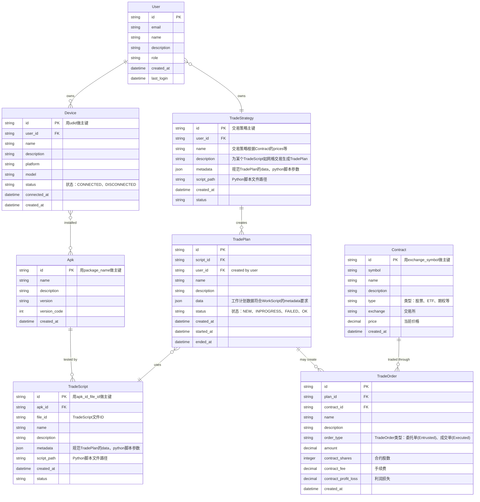

# 服务端设计文档 (Server-side Design Document)

## 1. 架构概述

Autodroid 服务端采用 FastAPI + Python 的微服务架构，提供以下核心功能：
- 设备管理和自动化控制
- TradeScript调度和执行
- 实时监控和报告生成
- 前端 API 接口服务

## 2. 服务端驱动配置

### 2.1 FastAPI 服务器配置

#### 端口配置
```python
# 默认端口配置
FASTAPI_PORT = 8003
FASTAPI_HOST = "0.0.0.0"  # 允许所有网络接口访问
```

#### 启动配置
```python
# 使用 uvicorn 启动服务器
uvicorn api.main:app --host 0.0.0.0 --port 8003 --reload
```

### 2.2 前端 API 端点配置

#### 基础配置
```yaml
# frontend/config
server:
  url: http://localhost:8003
  api_base: /api
  use_https: false
  timeout: 10000
```

#### 动态配置支持
- 支持环境变量覆盖默认配置
- 支持配置文件热重载
- 支持多环境配置（开发/测试/生产）

### 2.3 mDNS 服务发现

#### 服务注册
```python
# mDNS 服务配置
SERVICE_TYPE = "_autodroid._tcp.local."
SERVICE_NAME = "Autodroid Server"
SERVICE_PORT = 8003
SERVICE_PROPERTIES = {
    'version': '1.0',
    'description': 'Autodroid Automation Server'
}
```

#### 自动发现机制
- 服务启动时自动注册 mDNS 服务
- 支持多网卡环境下的服务发布
- 提供服务健康检查机制

### 2.4 CORS 配置

```python
# CORS 中间件配置
app.add_middleware(
    CORSMiddleware,
    allow_origins=["http://localhost:5182", "http://127.0.0.1:5182"],
    allow_credentials=True,
    allow_methods=["*"],
    allow_headers=["*"],
)
```

## 3. API 接口设计

### 3.1 服务器信息接口

```python
@app.get("/api/server")
async def get_server_info():
    """获取服务器基本信息"""
    return {
        "name": "Autodroid Server",
        "hostname": socket.gethostname(),
        "ip_address": get_local_ip(),
        "platform": platform.platform(),
        "port": FASTAPI_PORT,
        "version": "1.0.0"
    }
```

### 3.2 设备管理接口

```python
@app.get("/api/devices")
async def get_devices():
    """获取已连接的设备列表"""
    return {"devices": device_manager.get_connected_devices()}

@app.post("/api/devices/{udid}/connect")
async def connect_device(udid: str):
    """连接指定设备"""
    return device_manager.connect_device(udid)
```

### 3.3 TradeScript接口

```python
@app.get("/api/tradescripts")
async def get_tradescripts():
    """获取可用TradeScript列表"""
    return {"tradescripts": tradescript_manager.get_tradescripts()}

@app.post("/api/tradescripts/{tradescript_id}/execute")
async def execute_tradescript(tradescript_id: str, device_udid: str):
    """在指定设备上执行TradeScript"""
    return tradescript_manager.execute_tradescript(tradescript_id, device_udid)
```

## 4. 网络配置

### 4.1 多网卡支持

```python
def get_local_ip():
    """获取本地 IP 地址"""
    try:
        # 获取所有网络接口
        interfaces = netifaces.interfaces()
        for interface in interfaces:
            addrs = netifaces.ifaddresses(interface)
            if netifaces.AF_INET in addrs:
                for addr_info in addrs[netifaces.AF_INET]:
                    ip = addr_info['addr']
                    if ip != '127.0.0.1' and not ip.startswith('169.254'):
                        return ip
    except:
        pass
    return "127.0.0.1"
```

### 4.2 端口管理

```python
class PortManager:
    """端口管理类"""
    
    def __init__(self):
        self.used_ports = set()
    
    def get_available_port(self, start_port=8003, max_port=9000):
        """获取可用端口"""
        for port in range(start_port, max_port + 1):
            if port not in self.used_ports and self.is_port_available(port):
                self.used_ports.add(port)
                return port
        raise RuntimeError("No available ports found")
    
    def is_port_available(self, port):
        """检查端口是否可用"""
        try:
            with socket.socket(socket.AF_INET, socket.SOCK_STREAM) as s:
                s.bind(('', port))
                return True
        except:
            return False
```

## 5. 数据模型设计

### 5.1 核心数据模型关系

根据需求分析，我们设计以下数据模型关系：



### 5.2 数据模型分析

#### 实体关系说明：

1. **User (用户)**
   - 一个用户可以拥有多个设备（一对多关系）
   - 核心属性：用户ID、邮箱、姓名、角色、创建时间、最后登录时间

2. **Device (设备)**
   - 每个设备属于一个用户（多对一关系）
   - 每个设备可以安装多个APK（多对多关系，通过Device-Apk关联表实现）
   - 核心属性：设备UDID（主键）、用户ID、设备名称、平台、型号、状态、连接时间

3. **Apk (应用程序)**
   - 每个APK被多个TradeScript测试（一对多关系）
   - 同一个APK可以安装在多个设备上（多对多关系，通过Device-Apk关联表实现）
   - 核心属性：包名（主键）、应用名称、描述、版本、版本号、创建时间

4. **TradeScript (TradeScript)**
   - 每个TradeScript测试一个APK（多对一关系）
   - 每个TradeScript使用多个TradePlan去测试APK（一对多关系）
   - 核心属性：TradeScriptID、APK ID（外键）、名称、描述、元数据、脚本文件路径、状态

5. **TradePlan (TradePlan)**
   - 每个TradePlan使用一个TradeScript去测试APK（多对一关系）
   - 每个TradePlan生成一个执行报告（一对一关系）
   - 每个TradePlan可以创建一个TradeOrder（一对多关系）
   - 核心属性：计划ID、TradeScriptID、名称、描述、状态、创建时间、开始时间、结束时间

#### 关键业务规则：

1. **设备所有权**：设备必须属于一个用户，用户删除时级联删除其设备
2. **APK安装关系**：同一个APK可以在不同设备上安装，形成多对多关系
3. **TradeScript关联**：每个APK被多个TradeScript测试，确保TradeScript只适用于特定应用
4. **TradeScript-TradePlan关系**：每个TradeScript使用多个TradePlan去测试APK，但每个TradePlan只能使用一个TradeScript
5. **执行日志**：每个TradePlan生成执行日志记录在TradePlan的execution_log字段，记录执行状态、日志和结果数据
6. **TradeOrder关联**：每个TradePlan可以创建一个TradeOrder，支持业务结算和追踪
7. **TradeStrategy关联**：TradeStrategy独立运行根据价格等监控生成TradePlan，每个TradePlan可以关联一个TradeStrategy

## 6. 安全性配置

### 6.1 API 认证

```python
# JWT Token 认证
@app.post("/api/auth/login")
async def login(username: str, password: str):
    """用户登录"""
    # 验证用户名密码
    user = authenticate_user(username, password)
    if not user:
        raise HTTPException(status_code=401, detail="Invalid credentials")
    
    # 生成 JWT Token
    access_token = create_access_token(data={"sub": user.username})
    return {"access_token": access_token, "token_type": "bearer"}
```

### 6.2 请求限流

```python
# 请求限流中间件
limiter = Limiter(key_func=get_remote_address)
app.state.limiter = limiter

@app.get("/api/devices")
@limiter.limit("10/minute")
async def get_devices(request: Request):
    """设备列表接口（限流）"""
    return {"devices": device_manager.get_connected_devices()}
```

## 7. 日志和监控

### 7.1 日志配置

```python
# 日志配置
logging.basicConfig(
    level=logging.INFO,
    format='%(asctime)s - %(name)s - %(levelname)s - %(message)s',
    handlers=[
        logging.FileHandler('autodroid.log'),
        logging.StreamHandler()
    ]
)
```

### 7.2 健康检查

```python
@app.get("/api/health")
async def health_check():
    """服务健康检查"""
    return {
        "status": "healthy",
        "timestamp": datetime.now().isoformat(),
        "version": "1.0.0"
    }
```


## 8. 类型化设计原则

### 类型化设计规范

为了提升代码的可读性、可维护性和类型安全性，所有API、函数方法参数和返回值必须采用类型化类定义，禁止使用原始的字典和列表类型。

#### 核心原则

1. **禁止使用原始类型**：
   - ❌ 禁止使用 `Dict[str, Any]`、`List[Dict[str, Any]]` 等原始类型
   - ✅ 必须使用具体的Pydantic模型或dataclass定义

2. **分层类型定义**：
   - **数据库层**：使用Peewee ORM模型定义数据库表结构
   - **业务层**：使用Pydantic模型定义API请求/响应格式
   - **数据传输**：使用类型化的DTO（Data Transfer Object）

3. **类型一致性**：
   - 所有函数参数和返回值必须有明确的类型注解
   - 避免使用 `Any` 类型，除非绝对必要
   - 使用Python的类型提示系统（Type Hints）

#### 适用范围

**必须使用类型化模型的场景**：
- **数据库操作**：所有数据库查询方法的返回值必须使用类型化模型
- **API接口**：所有API的请求和响应参数必须使用类型化模型
- **服务层**：所有服务方法的参数和返回值必须使用类型化模型
- **数据传输**：模块间数据传输必须使用类型化DTO

#### 具体实施要求

**数据库操作层**：
- 所有数据库查询方法必须返回具体的Pydantic模型，而不是原始字典
- 数据库管理器类（如 `DatabaseManager`）的所有公共方法必须使用类型化返回值
- 禁止在数据库层使用 `Dict[str, Any]` 作为返回值类型

**API层**：
- 所有FastAPI端点必须使用Pydantic模型定义请求和响应
- 禁止在API层使用原始字典类型
- 所有API响应必须使用类型化模型包装

**服务层**：
- 所有业务逻辑方法必须使用类型化参数和返回值
- 服务层之间传递数据必须使用类型化DTO
- 禁止在服务层使用原始字典进行数据传递

#### 示例对比

**❌ 错误示例 - 使用原始字典类型**
```python
def get_user_operations(self, apk_id: str, limit: int = 100) -> List[Dict[str, Any]]:
    # 返回原始字典，难以维护和理解
    return [{'id': 1, 'action_type': 'click', ...}]

def get_screenshots_by_apk(self, apk_id: str, limit: int = 50) -> List[Dict[str, Any]]:
    # 违反类型化原则，使用原始字典
    return [{'screenshot_id': '123', 'file_path': '/path/to/image.png', ...}]
```

**✅ 正确示例 - 使用类型化模型**
```python
from pydantic import BaseModel
from typing import List

class UserOperation(BaseModel):
    id: str
    action_type: str
    timestamp: float
    # ... 其他字段

class ScreenshotInfo(BaseModel):
    id: str
    apk_id: str
    timestamp: float
    file_path: str
    # ... 其他字段

def get_user_operations(self, apk_id: str, limit: int = 100) -> List[UserOperation]:
    # 返回类型化对象，清晰明确
    return [UserOperation(id='1', action_type='click', ...)]

def get_screenshots_by_apk(self, apk_id: str, limit: int = 50) -> List[ScreenshotInfo]:
    # 遵循类型化原则，使用具体的模型类
    return [ScreenshotInfo(id='123', apk_id=apk_id, ...)]
```

#### 实施要求

1. **立即重构**：现有代码中所有使用原始字典类型的地方必须逐步重构为类型化模型
2. **新开发**：所有新开发的模块必须遵循类型化原则
3. **代码审查**：在代码审查中严格检查类型化规范的遵守情况
4. **文档更新**：更新相关文档以反映类型化设计原则
5. **模型统一**：所有类型化模型必须定义在共享的模型文件中（如 `core/database/models.py`），避免重复定义

## 10. 故障排除

### 10.1 常见问题

1. **端口冲突**：如果端口 8003 被占用，服务端会自动寻找可用端口
2. **网络连接**：确保防火墙允许端口 8003 的访问
3. **mDNS 发现**：确保网络支持多播 DNS

### 9.2 调试工具

```bash
# 检查端口占用
netstat -an | findstr 8003

# 测试 API 连接
curl http://localhost:8003/api/health

# 检查 mDNS 服务
avahi-browse -at
```

## 10. 模块架构规范设计

### 10.1 统一模块架构

基于对现有 auth、device、apk 三个模块的分析，制定以下统一架构规范：

#### 10.1.1 文件命名规范

每个模块应包含以下标准文件：
- `database.py` - 数据库操作层，使用 Peewee ORM
- `service.py` - 业务逻辑层，处理核心业务功能
- `models.py` - 数据模型层，包含 Pydantic 请求/响应模型

**重命名示例：**
- `apk_database.py` → `database.py`
- `device_manager.py` → `service.py`

#### 10.1.2 模块结构示例

```
core/
├── auth/
│   ├── database.py      # 数据库操作 (已存在)
│   ├── service.py       # 业务逻辑 (已存在)
│   └── models.py        # 数据模型 (已存在)
├── device/
│   ├── database.py      # 数据库操作 (已存在)
│   ├── service.py       # 业务逻辑 (重命名自 device_manager.py)
│   └── models.py        # 数据模型 (待创建)
└── apk/
    ├── database.py      # 数据库操作 (重命名自 apk_database.py)
    ├── service.py       # 业务逻辑 (待创建)
    └── models.py        # 数据模型 (待创建)
```

### 10.2 数据模型分层设计

#### 10.2.1 模型分层架构

```python
# 第一层：Peewee ORM 模型 (全局共享)
# database/models.py
class User(Model):
    id = CharField(primary_key=True)
    email = CharField(unique=True)
    name = CharField()
    description = TextField(null=True)
    role = CharField(default='user')
    created_at = DateTimeField(default=datetime.now)
    last_login = DateTimeField(null=True)

class Device(Model):
    id = CharField(primary_key=True)
    user = ForeignKeyField(User, backref='devices')
    name = CharField()
    description = TextField(null=True)
    platform = CharField()
    model = CharField(null=True)
    status = CharField(default='disconnected')
    connected_at = DateTimeField(null=True)

class Apk(Model):
    id = CharField(primary_key=True)
    name = CharField()
    description = TextField(null=True)
    version = CharField(null=True)
    version_code = IntegerField(null=True)
    created_at = DateTimeField(default=datetime.now)

class TradeScript(Model):
    id = CharField(primary_key=True)
    apk = ForeignKeyField(Apk, field='id', backref='tradescripts')
    name = CharField()
    description = TextField(null=True)
    metadata = JSONField(null=True)
    script_path = CharField()
    status = CharField(default='NEW')  # NEW, INPROGRESS, FAILED, OK

class TradePlan(Model):
    id = CharField(primary_key=True)
    script = ForeignKeyField(TradeScript, backref='tradeplans')
    user = ForeignKeyField(User, backref='tradeplans', null=True)
    name = CharField()
    description = TextField(null=True)
    data = JSONField(null=True)  # 工作计划数据符合WorkScript的metadata要求
    status = CharField(default='NEW')  # NEW, INPROGRESS, FAILED, OK
    created_at = DateTimeField(default=datetime.now)
    started_at = DateTimeField(null=True)
    ended_at = DateTimeField(null=True)

class Contract(Model):
    id = CharField(primary_key=True)
    symbol = CharField()  # 交易代码，如 AAPL、SPY
    name = CharField()  # 合约名称，如 Apple Inc.
    description = TextField(null=True)
    type = CharField()  # 股票、ETF、期权、期货、外汇
    exchange = CharField()  # 交易所，如 NASDAQ、NYSE - 必填字段
    price = DecimalField(default=0.00, max_digits=10, decimal_places=2)  # 当前价格
    created_at = DateTimeField(default=datetime.now)

class TradeOrder(Model):
    id = CharField(primary_key=True)
    plan = ForeignKeyField(TradePlan, backref='orders')
    contract = ForeignKeyField(Contract, backref='orders', null=True)
    name = CharField()
    description = TextField(null=True)
    order_type = CharField(default='委托单')  # 委托单(Entrusted)、成交单(Executed)
    amount = DecimalField(default=0.00, max_digits=10, decimal_places=2)
    contract_shares = IntegerField(default=0)  # 合约股数
    contract_fee = DecimalField(default=0.00, max_digits=10, decimal_places=2)  # 手续费
    contract_profit_loss = DecimalField(default=0.00, max_digits=10, decimal_places=2)  # 利润损失
    created_at = DateTimeField(default=datetime.now)

# 第二层：模块专用 Pydantic 模型
# user/models.py
class UserCreateRequest(BaseModel):
    id: str
    name: str
    description: Optional[str] = None
    email: str
    role: str = "user"

class UserResponse(BaseModel):
    id: str
    name: str
    description: Optional[str]
    email: str
    role: str
    created_at: datetime

# device/models.py
class DeviceCreateRequest(BaseModel):
    id: str
    user_id: str
    name: str
    description: Optional[str] = None
    platform: str
    model: Optional[str] = None

class DeviceResponse(BaseModel):
    id: str
    user_id: str
    name: str
    description: Optional[str]
    platform: str
    model: Optional[str]
    status: str
    connected_at: Optional[datetime]


# tradeplan/models.py
class TradePlanCreateRequest(BaseModel):
    script_id: str
    user_id: Optional[str] = None
    name: str
    description: Optional[str] = None
    data: Optional[dict] = None

class TradePlanResponse(BaseModel):
    id: str
    script_id: str
    user_id: Optional[str]
    name: str
    description: Optional[str]
    data: Optional[dict]
    status: str
    created_at: datetime
    started_at: Optional[datetime]
    ended_at: Optional[datetime]

```

#### 10.2.2 数据库操作层规范

每个模块的 `database.py` 应遵循以下规范：

```python
# apk/database.py 示例
class ApkDatabase:
    def __init__(self, db_path: str):
        self.db = SqliteDatabase(db_path)
        self.models = [Apk, DeviceApk]  # 只包含本模块相关的模型
    
    def register_apk_to_device(self, apk_data: dict, device_id: str) -> Apk:
        """使用 Peewee ORM 注册 APK 到设备"""
        with self.db.atomic():
            apk, created = Apk.get_or_create(
                id=apk_data['id'],
                defaults=apk_data
            )
            # 关联设备
            DeviceApk.get_or_create(
                device_id=device_id,
                apk_id=apk.id
            )
            return apk
    
    def get_apk(self, id: str) -> Optional[Apk]:
        """使用 Peewee 查询获取 APK"""
        try:
            return Apk.get(Apk.id == id)
        except Apk.DoesNotExist:
            return None
```

#### 10.2.3 业务逻辑层规范

每个模块的 `service.py` 应遵循以下规范：

```python
# apk/service.py 示例
class ApkService:
    def __init__(self, db: ApkDatabase):
        self.db = db
    
    def register_apk(self, apk_data: ApkCreateRequest, device_udid: str) -> ApkResponse:
        """注册 APK 业务逻辑"""
        # 1. 数据验证
        if not self._validate_apk_data(apk_data):
            raise ValueError("Invalid APK data")
        
        # 2. 调用数据库层
        apk = self.db.register_apk_to_device(apk_data.dict(), device_udid)
        
        # 3. 转换为响应模型
        return ApkResponse.from_orm(apk)
    
    def _validate_apk_data(self, apk_data: ApkCreateRequest) -> bool:
        """APK 数据验证"""
        # 实现验证逻辑
        return True
```

### 10.3 实施计划

#### 10.3.1 第一阶段：文件重命名和结构调整
- [ ] 为 apk 模块创建 `service.py`
- [ ] 为 apk 模块创建 `models.py`
- [ ] 为 device 模块创建 `models.py`

#### 10.3.2 第二阶段：数据库重构
- [ ] 重构 apk 模块的 `database.py`，完全使用 Peewee ORM
- [ ] 重构 auth 模块，移除专用数据库管理器
- [ ] 统一所有模块的数据库实现方式

#### 10.3.3 第三阶段：集成测试
- [ ] 更新所有相关文件的导入语句
- [ ] 测试统一后的架构功能
- [ ] 验证各模块间的数据一致性

### 10.4 技术优势

1. **一致性**：所有模块采用相同的架构模式
2. **可维护性**：清晰的职责分离，便于代码维护
3. **可扩展性**：新增模块可快速套用现有模式
4. **测试友好**：各层可独立测试，提高测试覆盖率
5. **类型安全**：Pydantic 模型提供运行时类型检查

### 10.5 迁移注意事项

1. **向后兼容**：确保现有 API 接口不受影响
2. **数据迁移**：需要处理现有数据的迁移
3. **依赖更新**：更新所有相关模块的导入路径
4. **测试覆盖**：确保重构后的功能完整性

---

**文档版本**: 1.3  
**最后更新**: 2025-01-02  
**维护者**: Autodroid 开发团队
