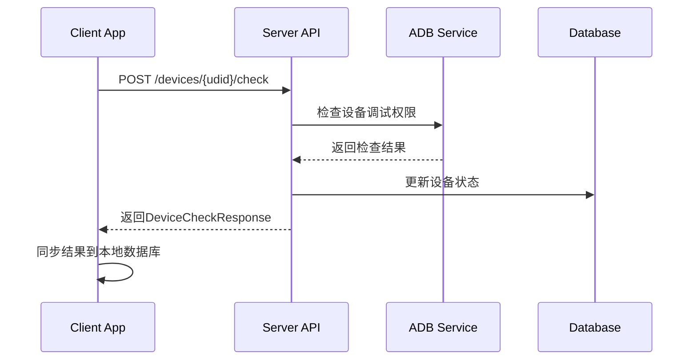
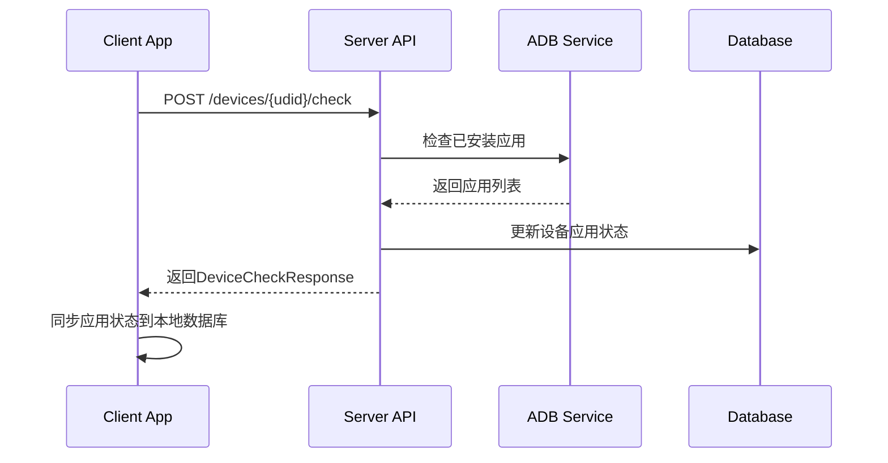

# Autodroid Trader Server 功能特性

## 服务器管理

- 提供服务器信息查询接口
- 提供服务器二维码接口，用于客户端扫描连接服务器，二维码使用ServerInfoResponse信息生成


## 设备管理

- 支持多个设备同时连接
- 提供设备状态监控接口
- 支持设备重启和关闭
- 支持设备注册、信息查询

### 检测设备

- 客户端通过调用`/devices/{udid}/check`接口请求服务器检查设备状态

#### 检测设备有否开通自动化测试权限
- 提供API供客户端驱动检查设备是否开通了自动化测试权限
- 服务器通过ADB等方式检测设备的调试权限状态，包括USB调试和WiFi调试
- 检查结果通过`DeviceCheckResponse`返回给客户端，包含检查状态、消息和权限信息
- 客户端收到响应后，将结果同步到本地数据库，更新设备状态信息
- Device支持的自动化测试权限包括是否开通USB调试权限或者是否安装WIFI调试权限等
- Device信息包括设备UDID、设备名称、Android版本、电池电量、是否在线、连接类型、是否支持USB调试、是否支持WIFI调试等

#### 设备状态检测流程


#### 检测设备有否安装了支持的应用
- 服务器自动检测注册的设备有否安装系统配置好的应用并更新到数据库的Device信息表中
- 客户端通过调用`/devices/{udid}/check`接口请求服务器检查设备应用安装状态
- 服务器通过ADB等方式检测设备上已安装的支持应用列表
- 检查结果通过`DeviceCheckResponse`的`installed_apps`字段返回给客户端
- 客户端收到响应后，将应用安装状态同步到本地数据库
- 客户端再次查询设备信息时，会包含应用安装状态，并说明服务支持在该设备上自动化测试某个应用
- 首先服务端配置支持的应用列表，配置项包括应用包名、应用名称等
- Device表中添加一个json字段apps，当然apps仅限于服务端支持的应用,参见supported_apps配置项；device.apps字段格式如下：
```json
[
    {
        "app_package": "com.autodroid.trader",
        "name": "自动交计花",
        "app_activity": ".MainActivity",
        "installed": true
    },
    {
        "app_package": "com.tdx.androidCCZQ",
        "name": "明佣宝",
        "app_activity": "com.tdx.Android.TdxAndroidActivity",
        "installed": false
    }
]
```

#### 应用安装状态检测流程


